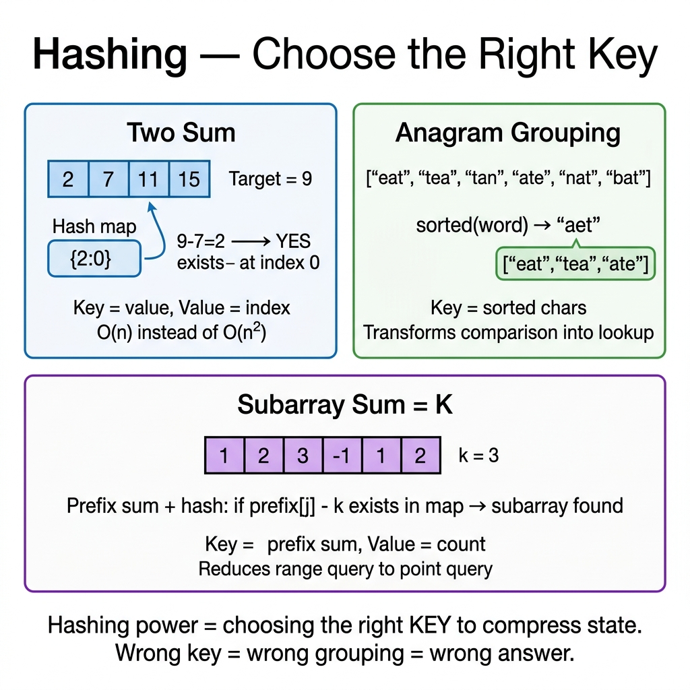

<!-- tags: dsa, algorithms, hashing -->
# #️⃣ Hashing / Hash Table

> Hashing is the pattern you use when you want to reduce "have I seen this before?" from O(n) to near O(1). However, its true power lies not in the dictionary syntax, but in choosing the right key to compress the problem state.

📅 Created: 2026-03-20 · 🔄 Updated: 2026-04-10 · ⏱️ 20 min read

| Aspect | Detail |
| ------ | ------ |
| **Complexity** | Insert / lookup average O(1), worst-case O(n) |
| **Use case** | Membership, frequency count, grouping, prefix-state lookup |
| **Recognition** | Need to ask "have I seen this complement / state / signature?" |

---

## 1. DEFINE

<!-- [Beginner layer] -->
You encounter `Two Sum` on an unsorted array. A brute force check of all pairs is correct, but there is a shorter question. At the current `num`, you only need to know **if you have seen `target - num` before**. If yes, the problem ends. If not, you save `num` for the future.

<!-- [Experienced layer] -->
`Hashing` maps keys to buckets to support average O(1) lookup, insert, and delete. In DSA, the most important thing is not the `map` or `unordered_map` structure, but **choosing the key representation**:
- The key is the actual value (`Two Sum`).
- The key is a normalized signature (`Group Anagrams`).
- The key is a prefix state (`Subarray Sum Equals K`).
- The key is a frequency count for bucketing (`Top K Frequent`).

Core insight: **A hash table usually does not solve the problem directly; it keeps the exact "piece of the past" that the current step needs.**

| Variant | Key stored in hash | Question answered | Anchor problem |
| ------- | ------------------ | -------------------- | ------- |
| **Membership** | value / complement | "have I seen X?" | LC 1 |
| **Grouping** | normalized signature | "are these objects in the same group?" | LC 49 |
| **Frequency** | value -> count | "how many times did it appear?" | LC 347 |
| **Prefix-state** | prefix sum / state | "have I reached state Y before?" | LC 560 |

| Approach | Time | Space | When to choose |
| -------- | ---- | ----- | -------- |
| Brute force | O(n²) or O(n³) | O(1) | Only to get intuition |
| Sorting + scan | O(n log n) | O(1) or O(n) | When order helps more than key lookup |
| Hashing | Average O(n) | O(n) | When the past needs frequent random access |

### 1.1 Quick Recognition

- The problem has keywords like `duplicate`, `anagram`, `frequency`, `group by`, `seen before`.
- Every loop you ask "what matches the current state from the past?".
- Sorting destroys the original index or makes state preservation harder.

### 1.2 Invariants & Failure Modes

<!-- [Expert layer] -->
- The key must correctly represent the problem's equivalence class. If the key is wrong, the hash is fast but the logic is completely wrong.
- With prefix-sum hashing, think "how many past states create a solution with the current state", not just "is the current state equal to target".
- Worst-case O(n) exists under heavy collision, but average O(1) is acceptable in interviews and standard runtimes.

---

## 2. VISUAL

This static card answers the most important question: **which piece of the past should the hash table keep so the current scan avoids restarting?**



The two traces below translate that question into two common forms: looking up a complement and looking up a prefix state.

### Level 1 — Simple
This trace answers: **how does Two Sum use hashing to look up the past?**

```text
nums = [2, 7, 11, 15], target = 9

Step 1: num=2  complement=7
        seen = {}
        7 not found → save 2

Step 2: num=7  complement=2
        seen = {2: 0}
        2 found ✅ answer = (0, 1)
```
*Image: The hash table does not store all pairs. It only stores values that the future might need for complement lookup.*

### Level 2 — Detailed
This trace answers: **why does `prefix sum + hash` count subarrays summing to `k`?**

```text
nums = [1, 2, 3], k = 3

prefix = 0, freq = {0: 1}

i=0, num=1:
  prefix = 1
  need prefix-k = -2  → not found
  freq = {0:1, 1:1}

i=1, num=2:
  prefix = 3
  need prefix-k = 0   → found 1 time
  => subarray [1,2]
  freq = {0:1, 1:1, 3:1}

i=2, num=3:
  prefix = 6
  need prefix-k = 3   → found 1 time
  => subarray [3]
```
*Image: The hash table stores the frequency of past prefix sums. Whenever `prefix-k` is found, that many subarrays end at the current index summing to `k`.*

## 3. CODE

Once the trace locks the invariant, code expresses that reasoning instead of adding magic. We start from a clean baseline and scale up when necessary.

### Problem 1: Two Sum [LC #1]
> *(The most basic hashing problem: the current state looks for its complement in the past.)*
>
> **Goal**: Find two indices that sum to `target` in an unsorted array — O(n) time, O(n) space
> **Approach**: Hash map `value -> index`. Look up complement first, then insert current value.
> **Example**: `[2, 7, 11, 15], target=9` → `(0, 1)`

```go
// hashing.go — Hashing: Two Sum with complement lookup
func TwoSum(nums []int, target int) [2]int {
    seen := make(map[int]int)
    for i, num := range nums {
        complement := target - num
        if j, ok := seen[complement]; ok {
            return [2]int{j, i}
        }
        seen[num] = i // insert after lookup to avoid using the current element twice
    }
    return [2]int{-1, -1}
}
```
```typescript
// hashing.ts — Hashing: Two Sum with complement lookup
function twoSum(nums: number[], target: number): [number, number] {
    const seen = new Map<number, number>();

    for (let i = 0; i < nums.length; i++) {
        const complement = target - nums[i];
        if (seen.has(complement)) {
            return [seen.get(complement)!, i];
        }
        seen.set(nums[i], i);
    }

    return [-1, -1];
}
```
```java
// HashingBasic.java — Hashing: Two Sum with complement lookup
import java.util.HashMap;
import java.util.Map;

final class HashingBasic {
    private HashingBasic() {}

    static int[] twoSum(int[] nums, int target) {
        Map<Integer, Integer> seen = new HashMap<>();

        for (int i = 0; i < nums.length; i++) {
            int complement = target - nums[i];
            if (seen.containsKey(complement)) {
                return new int[] {seen.get(complement), i};
            }
            seen.put(nums[i], i);
        }

        return new int[] {-1, -1};
    }
}
```
```rust
// hashing.rs — Hashing: Two Sum with complement lookup
use std::collections::HashMap;

fn two_sum(nums: &[i32], target: i32) -> (i32, i32) {
    let mut seen = HashMap::new();

    for (i, &num) in nums.iter().enumerate() {
        let complement = target - num;
        if let Some(&j) = seen.get(&complement) {
            return (j as i32, i as i32);
        }
        seen.insert(num, i);
    }

    (-1, -1)
}
```
```cpp
// hashing.cpp — Hashing: Two Sum with complement lookup
std::pair<int, int> twoSum(const std::vector<int>& nums, int target) {
    std::unordered_map<int, int> seen;

    for (int i = 0; i < static_cast<int>(nums.size()); ++i) {
        int complement = target - nums[i];
        if (seen.count(complement)) {
            return {seen[complement], i};
        }
        seen[nums[i]] = i;
    }

    return {-1, -1};
}
```
```python
# hashing.py — Hashing: Two Sum with complement lookup
def two_sum(nums: list[int], target: int) -> tuple[int, int]:
    seen: dict[int, int] = {}

    for i, num in enumerate(nums):
        complement = target - num
        if complement in seen:
            return (seen[complement], i)
        seen[num] = i

    return (-1, -1)
```

> **Why?** The `lookup first, insert later` order is easy to miss but crucial. If you insert the current value before checking the complement, many variants will accidentally reuse the current index or break the "past" reasoning.

> **Conclusion**: The basic hashing problem always asks "which past do I need to look up?". If you cannot answer that clearly, writing a map is just a syntax reflex.

---

### Problem 2: Group Anagrams [LC #49]
> *(From here, hashing shifts from "lookup value" to "lookup signature".)*
>
> **Goal**: Group strings that are anagrams together — O(n * k log k) if sorting each string
> **Approach**: Normalize each string into a key that is identical across anagrams.
> **Example**: `["eat","tea","tan","ate","nat","bat"]` → `["eat","tea","ate"]`, `["tan","nat"]`, `["bat"]`

```go
// group_anagrams.go — Hashing: Group by normalized signature
import "sort"

func GroupAnagrams(strs []string) [][]string {
    groups := make(map[string][]string)

    for _, s := range strs {
        chars := []byte(s)
        sort.Slice(chars, func(i, j int) bool { return chars[i] < chars[j] })
        key := string(chars) // all anagrams have the same sorted signature
        groups[key] = append(groups[key], s)
    }

    result := make([][]string, 0, len(groups))
    for _, group := range groups {
        result = append(result, group)
    }
    return result
}
```
```typescript
// group-anagrams.ts — Hashing: Group by normalized signature
function groupAnagrams(strs: string[]): string[][] {
    const groups = new Map<string, string[]>();

    for (const s of strs) {
        const key = [...s].sort().join("");
        if (!groups.has(key)) {
            groups.set(key, []);
        }
        groups.get(key)!.push(s);
    }

    return [...groups.values()];
}
```
```java
// HashingIntermediate.java — Hashing: Group by normalized signature
import java.util.ArrayList;
import java.util.Arrays;
import java.util.HashMap;
import java.util.List;
import java.util.Map;

final class HashingIntermediate {
    private HashingIntermediate() {}

    static List<List<String>> groupAnagrams(String[] strs) {
        Map<String, List<String>> groups = new HashMap<>();

        for (String s : strs) {
            char[] chars = s.toCharArray();
            Arrays.sort(chars);
            String key = new String(chars);
            groups.computeIfAbsent(key, ignored -> new ArrayList<>()).add(s);
        }

        return new ArrayList<>(groups.values());
    }
}
```
```rust
// group_anagrams.rs — Hashing: Group by normalized signature
use std::collections::HashMap;

fn group_anagrams(strs: &[String]) -> Vec<Vec<String>> {
    let mut groups: HashMap<String, Vec<String>> = HashMap::new();

    for s in strs {
        let mut chars: Vec<char> = s.chars().collect();
        chars.sort_unstable();
        let key: String = chars.into_iter().collect();
        groups.entry(key).or_default().push(s.clone());
    }

    groups.into_values().collect()
}
```
```cpp
// group_anagrams.cpp — Hashing: Group by normalized signature
std::vector<std::vector<std::string>> groupAnagrams(const std::vector<std::string>& strs) {
    std::unordered_map<std::string, std::vector<std::string>> groups;

    for (const auto& s : strs) {
        std::string key = s;
        std::sort(key.begin(), key.end());
        groups[key].push_back(s);
    }

    std::vector<std::vector<std::string>> result;
    for (auto& [_, group] : groups) {
        result.push_back(group);
    }
    return result;
}
```
```python
# group_anagrams.py — Hashing: Group by normalized signature
def group_anagrams(strs: list[str]) -> list[list[str]]:
    groups: dict[str, list[str]] = {}

    for s in strs:
        key = "".join(sorted(s))
        groups.setdefault(key, []).append(s)

    return list(groups.values())
```

> **Why?** Hashing is most powerful when you choose a key representing "logical equivalence" instead of just "identical data". For anagrams, the sorted string is the simplest signature. It differs from the original string but shares the same equivalence class.

> **Conclusion**: The intermediate step lies in key selection. A good hash table cannot save a bad key representation.

---

### Problem 3: Top K Frequent Elements [LC #347]
> *(This problem combines two phases: hash to count, then use another structure to get top-k.)*
>
> **Goal**: Return the `k` most frequent elements — average O(n) with bucket sort
> **Approach**: Hash map counts frequency, then bucket by frequency instead of sorting all `(value, count)` pairs.
> **Example**: `[1,1,1,2,2,3], k=2` → `[1,2]`

```go
// top_k_frequent.go — Hashing: Frequency count + bucket sort
func TopKFrequent(nums []int, k int) []int {
    freq := make(map[int]int)
    for _, num := range nums {
        freq[num]++
    }

    buckets := make([][]int, len(nums)+1)
    for num, count := range freq {
        buckets[count] = append(buckets[count], num)
    }

    result := make([]int, 0, k)
    for count := len(buckets) - 1; count >= 0 && len(result) < k; count-- {
        result = append(result, buckets[count]...)
    }

    return result[:k]
}
```
```typescript
// top-k-frequent.ts — Hashing: Frequency count + bucket sort
function topKFrequent(nums: number[], k: number): number[] {
    const freq = new Map<number, number>();
    for (const num of nums) {
        freq.set(num, (freq.get(num) ?? 0) + 1);
    }

    const buckets: number[][] = Array.from({ length: nums.length + 1 }, () => []);
    for (const [num, count] of freq) {
        buckets[count].push(num);
    }

    const result: number[] = [];
    for (let count = buckets.length - 1; count >= 0 && result.length < k; count--) {
        result.push(...buckets[count]);
    }

    return result.slice(0, k);
}
```
```java
// HashingAdvanced.java — Hashing: Frequency count + bucket sort
import java.util.ArrayList;
import java.util.HashMap;
import java.util.List;
import java.util.Map;

final class HashingAdvanced {
    private HashingAdvanced() {}

    static int[] topKFrequent(int[] nums, int k) {
        Map<Integer, Integer> freq = new HashMap<>();
        for (int num : nums) {
            freq.put(num, freq.getOrDefault(num, 0) + 1);
        }

        List<List<Integer>> buckets = new ArrayList<>();
        for (int i = 0; i <= nums.length; i++) {
            buckets.add(new ArrayList<>());
        }
        for (Map.Entry<Integer, Integer> entry : freq.entrySet()) {
            buckets.get(entry.getValue()).add(entry.getKey());
        }

        int[] result = new int[k];
        int index = 0;
        for (int count = buckets.size() - 1; count >= 0 && index < k; count--) {
            for (int num : buckets.get(count)) {
                result[index++] = num;
                if (index == k) {
                    break;
                }
            }
        }

        return result;
    }
}
```
```rust
// top_k_frequent.rs — Hashing: Frequency count + bucket sort
fn top_k_frequent(nums: &[i32], k: usize) -> Vec<i32> {
    let mut freq = HashMap::new();
    for &num in nums {
        *freq.entry(num).or_insert(0usize) += 1;
    }

    let mut buckets = vec![Vec::new(); nums.len() + 1];
    for (num, count) in freq {
        buckets[count].push(num);
    }

    let mut result = Vec::new();
    for count in (0..buckets.len()).rev() {
        result.extend(&buckets[count]);
        if result.len() >= k {
            break;
        }
    }
    result.truncate(k);
    result
}
```
```cpp
// top_k_frequent.cpp — Hashing: Frequency count + bucket sort
std::vector<int> topKFrequent(const std::vector<int>& nums, int k) {
    std::unordered_map<int, int> freq;
    for (int num : nums) {
        ++freq[num];
    }

    std::vector<std::vector<int>> buckets(nums.size() + 1);
    for (const auto& [num, count] : freq) {
        buckets[count].push_back(num);
    }

    std::vector<int> result;
    for (int count = static_cast<int>(buckets.size()) - 1; count >= 0 && static_cast<int>(result.size()) < k; --count) {
        result.insert(result.end(), buckets[count].begin(), buckets[count].end());
    }
    result.resize(k);
    return result;
}
```
```python
# top_k_frequent.py — Hashing: Frequency count + bucket sort
def top_k_frequent(nums: list[int], k: int) -> list[int]:
    freq: dict[int, int] = {}
    for num in nums:
        freq[num] = freq.get(num, 0) + 1

    buckets: list[list[int]] = [[] for _ in range(len(nums) + 1)]
    for num, count in freq.items():
        buckets[count].append(num)

    result: list[int] = []
    for count in range(len(buckets) - 1, -1, -1):
        result.extend(buckets[count])
        if len(result) >= k:
            break

    return result[:k]
```

> **Why?** Hashing only solves the first half: counting frequency. The second half is picking the top-k. If you sort the entire map, you still have a good solution. But bucket sort exploits the fact that frequencies only lie in `[1..n]`, giving us a finite "answer space" to traverse downwards.

> **Conclusion**: The advanced part is purposefully combining hashing with a second structure, instead of forcing the hash table to do everything.

---

### Problem 4: Subarray Sum Equals K [LC #560]
> *(This transforms hashing from "lookup value" to "lookup prefix state".)*
>
> **Goal**: Count subarrays summing to `k` — O(n) time, O(n) space
> **Approach**: Prefix sum + hash map `prefix -> count`. At each position, look up `prefix-k`.
> **Example**: `[1, 1, 1], k=2` → `2`

```go
// subarray_sum_k.go — Hashing: Prefix state lookup
func SubarraySum(nums []int, k int) int {
    prefix := 0
    count := 0
    freq := map[int]int{0: 1} // prefix=0 exists before traversing any element

    for _, num := range nums {
        prefix += num
        count += freq[prefix-k] // every old prefix = prefix-k makes a valid subarray
        freq[prefix]++
    }

    return count
}
```
```typescript
// subarray-sum-k.ts — Hashing: Prefix state lookup
function subarraySum(nums: number[], k: number): number {
    let prefix = 0;
    let count = 0;
    const freq = new Map<number, number>([[0, 1]]);

    for (const num of nums) {
        prefix += num;
        count += freq.get(prefix - k) ?? 0;
        freq.set(prefix, (freq.get(prefix) ?? 0) + 1);
    }

    return count;
}
```
```java
// HashingExpert.java — Hashing: Prefix state lookup
final class HashingExpert {
    private HashingExpert() {}

    static int subarraySum(int[] nums, int k) {
        Map<Integer, Integer> freq = new HashMap<>();
        freq.put(0, 1);

        int prefix = 0;
        int count = 0;
        for (int num : nums) {
            prefix += num;
            count += freq.getOrDefault(prefix - k, 0);
            freq.put(prefix, freq.getOrDefault(prefix, 0) + 1);
        }

        return count;
    }
}
```
```rust
// subarray_sum_k.rs — Hashing: Prefix state lookup
fn subarray_sum(nums: &[i32], k: i32) -> i32 {
    let mut prefix = 0;
    let mut count = 0;
    let mut freq = HashMap::from([(0, 1)]);

    for &num in nums {
        prefix += num;
        count += freq.get(&(prefix - k)).copied().unwrap_or(0);
        *freq.entry(prefix).or_insert(0) += 1;
    }

    count
}
```
```cpp
// subarray_sum_k.cpp — Hashing: Prefix state lookup
int subarraySum(const std::vector<int>& nums, int k) {
    std::unordered_map<int, int> freq;
    freq[0] = 1;

    int prefix = 0;
    int count = 0;
    for (int num : nums) {
        prefix += num;
        count += freq[prefix - k];
        ++freq[prefix];
    }

    return count;
}
```
```python
# subarray_sum_k.py — Hashing: Prefix state lookup
def subarray_sum(nums: list[int], k: int) -> int:
    prefix = 0
    count = 0
    freq: dict[int, int] = {0: 1}

    for num in nums:
        prefix += num
        count += freq.get(prefix - k, 0)
        freq[prefix] = freq.get(prefix, 0) + 1

    return count
```

> **Why?** If a subarray `(i..j)` sums to `k`, then `prefix[j] - prefix[i-1] = k`, or `prefix[i-1] = prefix[j] - k`. Thus at position `j`, we do not rescan all `i`. We just need to know how many times `prefix[j]-k` appeared before. The hash map stores historical counts, not just a single value.

> **Conclusion**: The expert insight is the cognitive shift: from looking up raw data to looking up abstract states. This is where hashing strongly combines with prefix sums, DP, and graphs.

---

## 4. PITFALLS

The tricky part of DSA rarely lies in the algorithm name. It lies in representation, boundary, and the promise you thought you kept but actually dropped midway.

| # | Severity | Error | Impact | Fix |
|---|----------|-----|---------|-----|
| 1 | 🔴 Fatal | Choosing a key that fails to represent the correct equivalence class | Hash is fast but logic is totally wrong | Write out before coding: "which two objects are considered the same group?" |
| 2 | 🔴 Fatal | In `Two Sum`, inserting current value before looking up its complement | You might use the same element twice | Always look up first, insert later |
| 3 | 🟡 Common | In `Subarray Sum`, forgetting to seed `freq[0] = 1` | You miss subarrays starting from index 0 | Treat the empty prefix as a valid state before iterating |
| 4 | 🟡 Common | With grouping, using an expensive or unstable key | TLE or incorrect grouping | Choose a short, deterministic signature reflecting the problem |
| 5 | 🔵 Minor | Treating O(1) as absolute and ignoring worst-case or memory overhead | Misjudging tradeoffs compared to sorting | Remember it is average-case O(1) with an O(n) space tradeoff |

---

## 5. REF

| Resource | Type | Link | Note |
| -------- | ---- | ---- | ------- |
| LeetCode 1 | Problem | https://leetcode.com/problems/two-sum/ | Complement lookup |
| LeetCode 49 | Problem | https://leetcode.com/problems/group-anagrams/ | Signature hashing |
| LeetCode 347 | Problem | https://leetcode.com/problems/top-k-frequent-elements/ | Frequency + bucket |
| LeetCode 560 | Problem | https://leetcode.com/problems/subarray-sum-equals-k/ | Prefix-state hashing |

---

## 6. RECOMMEND

When a pattern stands firm, the next step is knowing its adjacent problem families and when to switch primitives.

| Expansion | When to use | Reason | File/Link |
| ------- | ------- | ----- | --------- |
| Prefix Sum | Need to understand cumulative states deeper | `Subarray Sum Equals K` directly relies on prefix-state | [./05-prefix-sum.md](./05-prefix-sum.md) |
| Two Pointers | Data is sorted or order can be exploited | Many problems can be hashed, but two pointers saves memory | [./01-two-pointers.md](./01-two-pointers.md) |
| Linked Lists: LRU | Combine hash with another structure for end-to-end O(1) | Hash + doubly linked list is a classic interview pattern | [../linked-lists/04-lru-cache.md](../linked-lists/04-lru-cache.md) |

---

## 7. QUICK REF

| Problem signal | Hash key to consider |
| --------------- | --------------------- |
| `find complement` | `target - x` |
| `group similar strings` | normalized signature |
| `count occurrences` | value -> frequency |
| `prefix / subarray / cumulative state` | prefix-state -> count |

---

**Links**: [← Fast & Slow](./02-fast-slow.md) · [→ Monotonic Stack](./04-monotonic-stack.md) · [↗ Prefix Sum](./05-prefix-sum.md)

---

Returning to the opening question: why is choosing the key more important than the hash function? Because the key determines the state you are compressing. Two Sum key = value, anagram key = sorted chars, subarray sum key = prefix sum. Wrong key means wrong grouping.