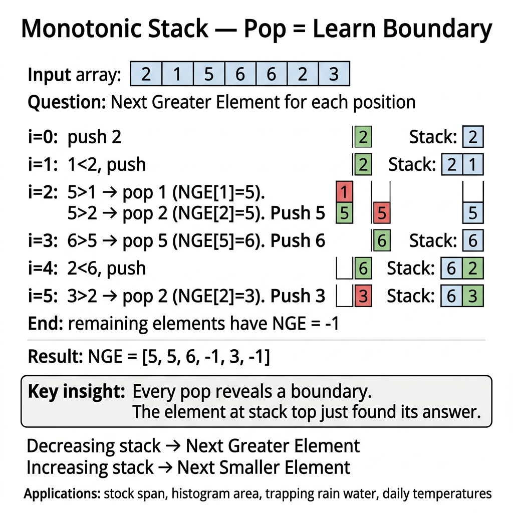

<!-- tags: dsa, algorithms, monotonic-stack -->
# 📚 Monotonic Stack

> Monotonic stack is for problems where you want to know "who is the next greater/smaller element" or "where are the valid left and right boundaries" without rescanning O(n²). If you pop an element without learning its boundary, you do not truly understand this pattern.

📅 Created: 2026-03-23 · 🔄 Updated: 2026-04-10 · ⏱️ 20 min read

| Aspect | Detail |
| ------ | ------ |
| **Complexity** | O(n) amortized |
| **Use case** | Next greater/smaller, spans, histogram area, trapped water |
| **Recognition** | Each element needs to be pushed and popped at most once |

---

## 1. DEFINE

<!-- [Beginner layer] -->
You solve `Next Greater Element`. For each number, you look right to find the first larger number. Brute force is straightforward: scan forward from each position until you hit a larger element. The pain is repeating the same scan for many elements, even though some clearly "lost" to the current element and hold no further value.

<!-- [Experienced layer] -->
`Monotonic Stack` maintains a monotonic order by value or index-value relation. When a new element breaks this order, we pop a series of elements. At the exact moment of popping, we resolve the answer or boundary for them.

Core insight: **Popping is not just to clear space; popping is when we lock the answer for the extracted element**.

| Variant | Stack invariant | What we learn upon pop | Anchor problem |
| ------- | --------------- | ----------------------- | ------- |
| **Increasing stack** | Values increase from bottom to top | Next smaller / previous smaller boundary | Histogram |
| **Decreasing stack** | Values decrease from bottom to top | Next greater / previous greater boundary | LC 496, LC 739 |
| **Index stack** | Stores index instead of value | Can calculate width/span | Histogram, water trapping |

| Approach | Time | Space | When to choose |
| -------- | ---- | ----- | -------- |
| Brute force scan | O(n²) | O(1) | Only to check intuition |
| Normal stack | O(n) but lacks invariant | O(n) | When only LIFO is needed |
| Monotonic stack | O(n) amortized | O(n) | When boundary or next relation is needed |

### 1.1 Quick Recognition

- The problem has keywords like `next greater`, `next smaller`, `span`, `first warmer day`.
- You need to know the nearest left/right boundary satisfying a condition.
- An element never becomes useful again under the same invariant after "losing" to a new element.

### 1.2 Invariants & Failure Modes

<!-- [Expert layer] -->
- Decreasing stack for NGE: the top element is always the nearest unresolved candidate, larger than or equal to everything above it previously.
- Histogram: the stack stores the **index** of columns with increasing heights. When hitting a shorter column, we know the popped column is bounded by `stack.top` on the left and `i` on the right.
- Most dangerous failure mode: storing `value` when the problem actually requires `index`. Code runs but cannot calculate width/span correctly.

---

## 2. VISUAL

This static card answers the exact question making monotonic stack different from normal stack: **why does "pop" mean learning a boundary, not just clearing space?**



The two traces below connect that intuition with two common payoffs: next greater element and histogram width.

### Level 1 — Simple
This trace answers: **why can the current element solve answers for many old elements in a single `while pop` loop?**

```text
nums = [2, 1, 5, 3]
Goal = Next Greater Element

stack stores indices of a decreasing stack by value

i=0, nums[0]=2  -> push [0]
i=1, nums[1]=1  -> 1 does not break decreasing order -> push [0,1]
i=2, nums[2]=5  -> 5 > nums[1] => answer[1] = 5, pop 1
                    5 > nums[0] => answer[0] = 5, pop 0
                    push [2]
i=3, nums[3]=3  -> 3 < 5 -> push [2,3]
end             -> answer[2] = -1, answer[3] = -1
```
*Image: A sufficiently large new element can "liberate" many unresolved elements at once. That is why total pops remain O(n).*

### Level 2 — Detailed
This trace answers: **how does a histogram use a monotonic stack to calculate width?**

```text
heights = [2, 1, 5, 6, 2]

stack (increasing by height, stores indices)

i=0 h=2 -> push [0]
i=1 h=1 -> 1 < 2 => pop 0
           left boundary = none
           right boundary = 1
           width = 1
           area = 2 * 1
           push [1]

i=2 h=5 -> push [1,2]
i=3 h=6 -> push [1,2,3]
i=4 h=2 -> 2 < 6 => pop 3, width = 4 - 2 - 1 = 1, area = 6
           2 < 5 => pop 2, width = 4 - 1 - 1 = 2, area = 10
           push [1,4]
```
*Image: When a column is popped, the new stack top becomes its nearest left boundary. The current index is its nearest right boundary.*

## 3. CODE

Once the trace locks the invariant, code expresses that reasoning instead of adding magic. We start from a clean baseline and scale up when necessary.

### Problem 1: Next Greater Element [LC #496]
> *(The most basic form of monotonic stack. If you are not used to "current element solves answers for old elements", start here.)*
>
> **Goal**: For each element, find the first larger element to its right — O(n) time, O(n) space
> **Approach**: Decreasing stack by value. When seeing a larger number, pop all smaller elements and assign answers.
> **Example**: `[2, 1, 5, 3]` → `[5, 5, -1, -1]`

```go
// monotonic_stack.go — Monotonic Stack: Next Greater Element
func NextGreaterElement(nums []int) []int {
    result := make([]int, len(nums))
    for i := range result {
        result[i] = -1
    }

    stack := make([]int, 0, len(nums)) // stores indices
    for i, num := range nums {
        for len(stack) > 0 && nums[stack[len(stack)-1]] < num {
            top := stack[len(stack)-1]
            stack = stack[:len(stack)-1]
            result[top] = num
        }
        stack = append(stack, i)
    }
    return result
}
```
```typescript
// monotonic-stack.ts — Monotonic Stack: Next Greater Element
function nextGreaterElement(nums: number[]): number[] {
    const result = Array(nums.length).fill(-1);
    const stack: number[] = [];

    nums.forEach((num, index) => {
        while (stack.length && nums[stack[stack.length - 1]] < num) {
            result[stack.pop()!] = num;
        }
        stack.push(index);
    });

    return result;
}
```
```java
// MonotonicStackBasic.java — Monotonic Stack: Next Greater Element
import java.util.ArrayDeque;
import java.util.Arrays;
import java.util.Deque;

final class MonotonicStackBasic {
    private MonotonicStackBasic() {}

    static int[] nextGreaterElement(int[] nums) {
        int[] result = new int[nums.length];
        Arrays.fill(result, -1);
        Deque<Integer> stack = new ArrayDeque<>();

        for (int i = 0; i < nums.length; i++) {
            while (!stack.isEmpty() && nums[stack.peek()] < nums[i]) {
                result[stack.pop()] = nums[i];
            }
            stack.push(i);
        }

        return result;
    }
}
```
```rust
// monotonic_stack.rs — Monotonic Stack: Next Greater Element
fn next_greater_element(nums: &[i32]) -> Vec<i32> {
    let mut result = vec![-1; nums.len()];
    let mut stack: Vec<usize> = Vec::new();

    for i in 0..nums.len() {
        while stack.last().is_some_and(|&idx| nums[idx] < nums[i]) {
            let top = stack.pop().unwrap();
            result[top] = nums[i];
        }
        stack.push(i);
    }

    result
}
```
```cpp
// monotonic_stack.cpp — Monotonic Stack: Next Greater Element
std::vector<int> nextGreaterElement(const std::vector<int>& nums) {
    std::vector<int> result(nums.size(), -1);
    std::vector<int> stack;

    for (int i = 0; i < static_cast<int>(nums.size()); ++i) {
        while (!stack.empty() && nums[stack.back()] < nums[i]) {
            result[stack.back()] = nums[i];
            stack.pop_back();
        }
        stack.push_back(i);
    }

    return result;
}
```
```python
# monotonic_stack.py — Monotonic Stack: Next Greater Element
def next_greater_element(nums: list[int]) -> list[int]:
    result = [-1] * len(nums)
    stack: list[int] = []

    for i, num in enumerate(nums):
        while stack and nums[stack[-1]] < num:
            result[stack.pop()] = num
        stack.append(i)

    return result
```

> **Why?** Monotonic stack is powerful because `pop` is not just clearing space. It is the moment the popped element's answer is locked. In NGE, when `nums[i]` is greater than the stack top, it is the first greater element to the right because all intermediate elements failed the decreasing invariant.

> **Conclusion**: This basic problem teaches one reflex: when you pop an index from a monotonic stack, you must know its answer is determined by the current element.

---

### Problem 2: Daily Temperatures [LC #739]
> *(Still next greater, but the answer is distance instead of value.)*
>
> **Goal**: For each day, return how many days to wait for a warmer temperature — O(n) time, O(n) space
> **Approach**: Decreasing stack by temperature. When popping, calculate `i - poppedIndex`.
> **Example**: `[73, 74, 75, 71, 69, 72, 76, 73]` → `[1,1,4,2,1,1,0,0]`

```go
// daily_temperatures.go — Monotonic Stack: resolve wait distance
func DailyTemperatures(temps []int) []int {
    result := make([]int, len(temps))
    stack := make([]int, 0, len(temps))

    for i, temp := range temps {
        for len(stack) > 0 && temps[stack[len(stack)-1]] < temp {
            top := stack[len(stack)-1]
            stack = stack[:len(stack)-1]
            result[top] = i - top
        }
        stack = append(stack, i)
    }

    return result
}
```
```typescript
// daily-temperatures.ts — Monotonic Stack: resolve wait distance
function dailyTemperatures(temps: number[]): number[] {
    const result = Array(temps.length).fill(0);
    const stack: number[] = [];

    temps.forEach((temp, index) => {
        while (stack.length && temps[stack[stack.length - 1]] < temp) {
            const top = stack.pop()!;
            result[top] = index - top;
        }
        stack.push(index);
    });

    return result;
}
```
```java
// MonotonicStackIntermediate.java — Monotonic Stack: Daily Temperatures
final class MonotonicStackIntermediate {
    private MonotonicStackIntermediate() {}

    static int[] dailyTemperatures(int[] temps) {
        int[] result = new int[temps.length];
        Deque<Integer> stack = new ArrayDeque<>();

        for (int i = 0; i < temps.length; i++) {
            while (!stack.isEmpty() && temps[stack.peek()] < temps[i]) {
                int top = stack.pop();
                result[top] = i - top;
            }
            stack.push(i);
        }

        return result;
    }
}
```
```rust
// daily_temperatures.rs — Monotonic Stack: resolve wait distance
fn daily_temperatures(temps: &[i32]) -> Vec<i32> {
    let mut result = vec![0; temps.len()];
    let mut stack: Vec<usize> = Vec::new();

    for i in 0..temps.len() {
        while stack.last().is_some_and(|&idx| temps[idx] < temps[i]) {
            let top = stack.pop().unwrap();
            result[top] = (i - top) as i32;
        }
        stack.push(i);
    }

    result
}
```
```cpp
// daily_temperatures.cpp — Monotonic Stack: resolve wait distance
std::vector<int> dailyTemperatures(const std::vector<int>& temps) {
    std::vector<int> result(temps.size(), 0);
    std::vector<int> stack;

    for (int i = 0; i < static_cast<int>(temps.size()); ++i) {
        while (!stack.empty() && temps[stack.back()] < temps[i]) {
            int top = stack.back();
            stack.pop_back();
            result[top] = i - top;
        }
        stack.push_back(i);
    }

    return result;
}
```
```python
# daily_temperatures.py — Monotonic Stack: resolve wait distance
def daily_temperatures(temps: list[int]) -> list[int]:
    result = [0] * len(temps)
    stack: list[int] = []

    for i, temp in enumerate(temps):
        while stack and temps[stack[-1]] < temp:
            top = stack.pop()
            result[top] = i - top
        stack.append(i)

    return result
```

> **Why?** Compared to basic NGE, the only difference is the answer payload. The stack still stores unresolved indices. The current element is still the first greater element to the right. The answer is simply `distance` instead of `value`.

> **Conclusion**: The intermediate step is moving from "knowing which element" to "knowing what distance relationship", while the stack invariant remains the same.

---

### Problem 3: Largest Rectangle in Histogram [LC #84]
> *(This is where monotonic stack becomes a boundary-finding tool, not just simple next greater/smaller.)*
>
> **Goal**: Find the largest rectangle area in a histogram — O(n) time, O(n) space
> **Approach**: Increasing stack by height. When popping a column, calculate area using the remaining left boundary in stack and `i` as the right boundary.
> **Example**: `[2,1,5,6,2,3]` → `10`

```go
// histogram.go — Monotonic Stack: Largest Rectangle in Histogram
func LargestRectangle(heights []int) int {
    stack := make([]int, 0, len(heights))
    best := 0

    for i := 0; i <= len(heights); i++ {
        currentHeight := 0
        if i < len(heights) {
            currentHeight = heights[i]
        }

        for len(stack) > 0 && heights[stack[len(stack)-1]] > currentHeight {
            top := stack[len(stack)-1]
            stack = stack[:len(stack)-1]

            width := i
            if len(stack) > 0 {
                width = i - stack[len(stack)-1] - 1
            }
            area := heights[top] * width
            if area > best {
                best = area
            }
        }

        stack = append(stack, i)
    }

    return best
}
```
```typescript
// histogram.ts — Monotonic Stack: Largest Rectangle in Histogram
function largestRectangle(heights: number[]): number {
    const stack: number[] = [];
    let best = 0;

    for (let i = 0; i <= heights.length; i++) {
        const currentHeight = i < heights.length ? heights[i] : 0;
        while (stack.length && heights[stack[stack.length - 1]] > currentHeight) {
            const top = stack.pop()!;
            const width = stack.length ? i - stack[stack.length - 1] - 1 : i;
            best = Math.max(best, heights[top] * width);
        }
        stack.push(i);
    }

    return best;
}
```
```java
// MonotonicStackAdvanced.java — Monotonic Stack: Largest Rectangle in Histogram
final class MonotonicStackAdvanced {
    private MonotonicStackAdvanced() {}

    static int largestRectangle(int[] heights) {
        Deque<Integer> stack = new ArrayDeque<>();
        int best = 0;

        for (int i = 0; i <= heights.length; i++) {
            int currentHeight = i < heights.length ? heights[i] : 0;
            while (!stack.isEmpty() && heights[stack.peek()] > currentHeight) {
                int top = stack.pop();
                int width = stack.isEmpty() ? i : i - stack.peek() - 1;
                best = Math.max(best, heights[top] * width);
            }
            stack.push(i);
        }

        return best;
    }
}
```
```rust
// histogram.rs — Monotonic Stack: Largest Rectangle in Histogram
fn largest_rectangle(heights: &[i32]) -> i32 {
    let mut stack: Vec<usize> = Vec::new();
    let mut best = 0;

    for i in 0..=heights.len() {
        let current_height = if i < heights.len() { heights[i] } else { 0 };
        while stack.last().is_some_and(|&idx| heights[idx] > current_height) {
            let top = stack.pop().unwrap();
            let width = if let Some(&left) = stack.last() {
                i - left - 1
            } else {
                i
            };
            best = best.max(heights[top] * width as i32);
        }
        stack.push(i);
    }

    best
}
```
```cpp
// histogram.cpp — Monotonic Stack: Largest Rectangle in Histogram
int largestRectangle(const std::vector<int>& heights) {
    std::vector<int> stack;
    int best = 0;

    for (int i = 0; i <= static_cast<int>(heights.size()); ++i) {
        int currentHeight = i < static_cast<int>(heights.size()) ? heights[i] : 0;
        while (!stack.empty() && heights[stack.back()] > currentHeight) {
            int top = stack.back();
            stack.pop_back();
            int width = stack.empty() ? i : i - stack.back() - 1;
            best = std::max(best, heights[top] * width);
        }
        stack.push_back(i);
    }

    return best;
}
```
```python
# histogram.py — Monotonic Stack: Largest Rectangle in Histogram
def largest_rectangle(heights: list[int]) -> int:
    stack: list[int] = []
    best = 0

    for i in range(len(heights) + 1):
        current_height = heights[i] if i < len(heights) else 0
        while stack and heights[stack[-1]] > current_height:
            top = stack.pop()
            width = i if not stack else i - stack[-1] - 1
            best = max(best, heights[top] * width)
        stack.append(i)

    return best
```

> **Why?** When a `top` column is popped, it means `currentHeight` is the first shorter column to its right. After popping, the new stack top is the nearest shorter column to its left. These two boundaries are all we need to calculate the rectangle where `top` is the minimum height.

> **Conclusion**: The advanced concept is that the stack encodes boundaries, no longer just simple next greater elements.

---

### Problem 4: Trapping Rain Water [LC #42]
> *(This is easy to confuse with two pointers, but monotonic stack gives a very "geometric" view: each pop reveals a basin bottom.)*
>
> **Goal**: Calculate the total trapped water between columns — O(n) time, O(n) space
> **Approach**: Decreasing stack. When encountering a column taller than the current bottom, pop the bottom and calculate water using the remaining left boundary in the stack.
> **Example**: `[0,1,0,2,1,0,1,3,2,1,2,1]` → `6`

```go
// trap_water.go — Monotonic Stack: Trapping Rain Water
func TrapRainWater(height []int) int {
    stack := make([]int, 0, len(height))
    water := 0

    for i, h := range height {
        for len(stack) > 0 && height[stack[len(stack)-1]] < h {
            bottom := stack[len(stack)-1]
            stack = stack[:len(stack)-1]
            if len(stack) == 0 {
                break
            }

            left := stack[len(stack)-1]
            width := i - left - 1
            boundedHeight := min(height[left], h) - height[bottom]
            water += width * boundedHeight
        }
        stack = append(stack, i)
    }

    return water
}
```
```typescript
// trap-water.ts — Monotonic Stack: Trapping Rain Water
function trapRainWater(height: number[]): number {
    const stack: number[] = [];
    let water = 0;

    height.forEach((h, i) => {
        while (stack.length && height[stack[stack.length - 1]] < h) {
            const bottom = stack.pop()!;
            if (!stack.length) {
                break;
            }
            const left = stack[stack.length - 1];
            const width = i - left - 1;
            const boundedHeight = Math.min(height[left], h) - height[bottom];
            water += width * boundedHeight;
        }
        stack.push(i);
    });

    return water;
}
```
```java
// MonotonicStackExpert.java — Monotonic Stack: Trapping Rain Water
final class MonotonicStackExpert {
    private MonotonicStackExpert() {}

    static int trapRainWater(int[] height) {
        Deque<Integer> stack = new ArrayDeque<>();
        int water = 0;

        for (int i = 0; i < height.length; i++) {
            while (!stack.isEmpty() && height[stack.peek()] < height[i]) {
                int bottom = stack.pop();
                if (stack.isEmpty()) {
                    break;
                }
                int left = stack.peek();
                int width = i - left - 1;
                int boundedHeight = Math.min(height[left], height[i]) - height[bottom];
                water += width * boundedHeight;
            }
            stack.push(i);
        }

        return water;
    }
}
```
```rust
// trap_water.rs — Monotonic Stack: Trapping Rain Water
fn trap_rain_water(height: &[i32]) -> i32 {
    let mut stack: Vec<usize> = Vec::new();
    let mut water = 0;

    for (i, &h) in height.iter().enumerate() {
        while stack.last().is_some_and(|&idx| height[idx] < h) {
            let bottom = stack.pop().unwrap();
            if let Some(&left) = stack.last() {
                let width = (i - left - 1) as i32;
                let bounded_height = height[left].min(h) - height[bottom];
                water += width * bounded_height;
            } else {
                break;
            }
        }
        stack.push(i);
    }

    water
}
```
```cpp
// trap_water.cpp — Monotonic Stack: Trapping Rain Water
int trapRainWater(const std::vector<int>& height) {
    std::vector<int> stack;
    int water = 0;

    for (int i = 0; i < static_cast<int>(height.size()); ++i) {
        while (!stack.empty() && height[stack.back()] < height[i]) {
            int bottom = stack.back();
            stack.pop_back();
            if (stack.empty()) {
                break;
            }
            int left = stack.back();
            int width = i - left - 1;
            int boundedHeight = std::min(height[left], height[i]) - height[bottom];
            water += width * boundedHeight;
        }
        stack.push_back(i);
    }

    return water;
}
```
```python
# trap_water.py — Monotonic Stack: Trapping Rain Water
def trap_rain_water(height: list[int]) -> int:
    stack: list[int] = []
    water = 0

    for i, h in enumerate(height):
        while stack and height[stack[-1]] < h:
            bottom = stack.pop()
            if not stack:
                break
            left = stack[-1]
            width = i - left - 1
            bounded_height = min(height[left], h) - height[bottom]
            water += width * bounded_height
        stack.append(i)

    return water
```

> **Why?** When popping a `bottom`, we know the current column is the first right wall taller than it, and the new stack top is the nearest left wall. The trapped water is not based on the global maximum peak, but on the closest pair of walls clamping the exposed bottom.

> **Conclusion**: This is expert because the reasoning shifts to "terrain structure". If you memorize the `width * boundedHeight` formula without visualizing the bottom, left wall, and right wall, you will easily mess up signs or boundaries.

---

## 4. PITFALLS

The tricky part of DSA rarely lies in the algorithm name. It lies in representation, boundary, and the promise you thought you kept but actually dropped midway.

| # | Severity | Error | Impact | Fix |
|---|----------|-----|---------|-----|
| 1 | 🔴 Fatal | Storing value instead of index in width/span problems | Cannot calculate boundaries correctly | With monotonic stacks in DSA, default to an `index stack` |
| 2 | 🟡 Common | Confusing increasing stack with decreasing stack | NGE/NSE or histogram logic is completely reversed | Write the invariant clearly in comments before coding |
| 3 | 🟡 Common | Forgetting sentinel or drain step in histogram | Losing unresolved columns at the end of the array | Run an extra step with `height = 0` or drain the stack after the loop |
| 4 | 🟡 Common | Handling duplicates inconsistently with `<` or `<=` | Boundaries shift by 1, failing equal-height cases | Pick a strict or non-strict rule from the start and stick to it |
| 5 | 🔵 Minor | Memorizing "push/pop once" without knowing what to calculate upon pop | Knowing complexity but failing the problem | Ask yourself on every pop: what answer was just resolved? |

---

## 5. REF

| Resource | Type | Link | Note |
| -------- | ---- | ---- | ------- |
| LeetCode 496 | Problem | https://leetcode.com/problems/next-greater-element-i/ | Basic NGE |
| LeetCode 739 | Problem | https://leetcode.com/problems/daily-temperatures/ | Span/wait distance |
| LeetCode 84 | Problem | https://leetcode.com/problems/largest-rectangle-in-histogram/ | Boundary reasoning |
| LeetCode 42 | Problem | https://leetcode.com/problems/trapping-rain-water/ | Basin reasoning |

---

## 6. RECOMMEND

When a pattern stands firm, the next step is knowing its adjacent problem families and when to switch primitives.

| Expansion | When to use | Reason | File/Link |
| ------- | ------- | ----- | --------- |
| Core Stack Patterns | Want to return to the general stack family | Monotonic stack is just one branch of the stack family | [./stacks/01-core-stack-patterns.md](./stacks/01-core-stack-patterns.md) |
| Two Pointers | Problem mentions boundaries but needs no stack | Helps differentiate when to use structure vs two-end invariant | [./01-two-pointers.md](./01-two-pointers.md) |
| Sliding Window | Need dynamic max/min window | Deque is a more suitable generalization than stack | [../string-algorithms/02-sliding-window.md](../string-algorithms/02-sliding-window.md) |

---

## 7. QUICK REF

| Problem signal | Sub-pattern | Short template |
| --------------- | ----------- | ------------- |
| `next greater/smaller` | monotonic by value | `while stack && a[stack.top] < a[i] { pop }` |
| `days until warmer` | NGE + distance | `answer[idx] = i - idx` |
| `largest rectangle` | increasing stack + sentinel | pop => compute width |
| `trapped water` | decreasing terrain stack | pop bottom => compute basin |

---

**Links**: [← Hashing](./03-hashing.md) · [→ Prefix Sum](./05-prefix-sum.md) · [↘ Core Stack Patterns](./stacks/01-core-stack-patterns.md)

---

Returning to the opening question: why does each pop learn a boundary? Because the element at the stack top just found its next greater or smaller element. Total pops ≤ n implies amortized O(n). Histogram area, trapping rain water, daily temperatures all use this pattern.