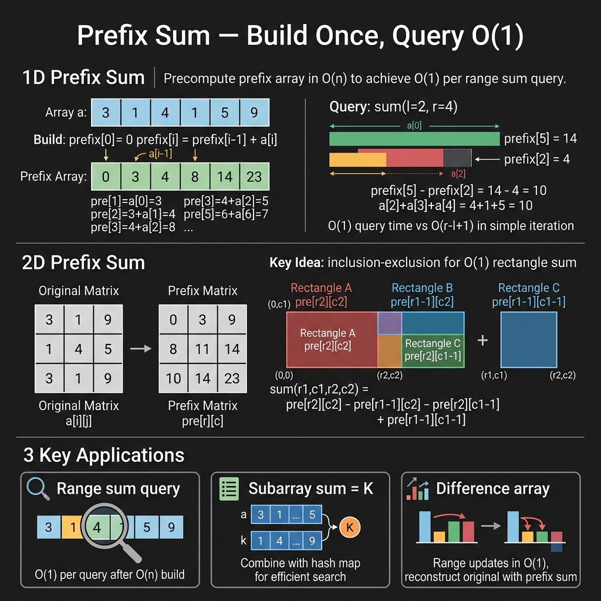

<!-- tags: dsa, algorithms, prefix-sum -->
# ➕ Prefix Sum

> Prefix sum applies when you face repeated range queries of the same type. If you manually add from `l` to `r` each time, you repay the same computation debt repeatedly.

📅 Created: 2026-03-23 · 🔄 Updated: 2026-04-10 · ⏱️ 20 min read

| Aspect | Detail |
| ------ | ------ |
| **Complexity** | Build O(n), query O(1) |
| **Use case** | Range sum, subarray counting, range updates, 2D rectangle sum |
| **Recognition** | Need to ask multiple queries on cumulative information |

---

## 1. DEFINE

Prefix sum clicks when you realize you are paying the same computation debt too many times. It does not ask how to add a range faster. It asks if you can encode the past once to avoid future costs.

<!-- [Beginner layer] -->
You have an array of 100,000 elements and 50,000 queries asking for the sum from `l` to `r`. If you loop from `l` to `r` per query, you repeat a massive addition because you avoid the upfront build cost.

<!-- [Experienced layer] -->
Prefix sum precomputes cumulative sums to reduce range-sum queries from O(n) to O(1). Instead of storing answers for all ranges, we store the sum from the start to each position:

`prefix[i] = a[0] + a[1] + ... + a[i-1]`

Then:

`sum(l, r) = prefix[r+1] - prefix[l]`

Core insight: **Prefix sum is not just a cumulative array; it encodes the past up to index i to answer queries via state differences**.

| Variant | When to use | Core idea | Anchor problem |
| ------- | -------- | ------- | ------- |
| **1D Prefix Sum** | Range sum on static array | Query = difference of 2 prefix states | LC 303 |
| **Prefix + Hash** | Count subarrays by state | Lookup old state via hash | LC 560 |
| **Difference Array** | Many range updates, one final query | Update O(1), rebuild O(n) | Range addition |
| **2D Prefix Sum** | Rectangle sum on matrix | 2D inclusion-exclusion | LC 304 |

| Approach | Time | Space | When to choose |
| -------- | ---- | ----- | -------- |
| Naive | O(n) / query | O(1) | When query count is too small to precompute |
| Prefix sum | O(n) build, O(1) query | O(n) | When array is static and range queries repeat |
| Difference array | O(1) / update, O(n) final rebuild | O(n) | When range updates outnumber online queries |
| Fenwick / Segment tree | O(log n) query/update | O(n) | When data is dynamic with mixed queries and updates |

### 1.1 Quick Recognition

- The problem asks for many `sum(l, r)` queries.
- You see the same prefix segment used repeatedly.
- You can express the query as `state(r) - state(before l)`.

### 1.2 Invariants & Failure Modes

<!-- [Expert layer] -->
- `prefix[0] = 0` is the most crucial sentinel. Removing it breaks edge cases from index `0`.
- Difference array is the inverse of prefix sum. It stores boundary deltas instead of cumulative sums.
- For 2D prefix sum, inclusion-exclusion must add the intersection exactly once. A wrong sign breaks everything.

---

## 2. VISUAL

The static card below answers the core question: **Why does a range query become the difference of two pre-built states?**



The two traces below connect that card to the most confused variants: range query and difference array.

### Level 1 — Simple
This trace answers: **Why does `sum(l, r)` only need the difference of two prefix states?**

```text
nums   = [3, 1, 4, 1, 5]
prefix = [0, 3, 4, 8, 9, 14]
index    0  1  2  3  4  5

sum(2, 4)
= nums[2] + nums[3] + nums[4]
= 4 + 1 + 5
= prefix[5] - prefix[2]
= 14 - 4
= 10
```
*Image: Prefix at `r+1` contains the entire past up to `r`. Subtracting prefix at `l` removes the segment outside the target range.*

### Level 2 — Detailed
This trace answers: **What is a difference array and why does range update take O(1)?**

```text
base = [2, 2, 2, 2, 2]
diff = [2, 0, 0, 0, 0, 0]

RangeAdd(1, 3, +5)
diff[1] += 5
diff[4] -= 5

diff = [2, 5, 0, 0, -5, 0]

Rebuild by prefix:
res[0] = 2
res[1] = 2 + 5 = 7
res[2] = 7 + 0 = 7
res[3] = 7 + 0 = 7
res[4] = 7 - 5 = 2

final = [2, 7, 7, 7, 2]
```
*Image: Difference array does not update every element in the range. It only places two state-change markers at the boundaries.*

## 3. PLAYGROUND

The static image above reveals the formula `prefix[r+1] - prefix[l]`. The playground shows why each prefix state represents the past. Step through the build to see the cumulative array as a flowing state rather than a dry formula.

Change `nums`, `left`, and `right` to see the final query as a difference of two pre-built states. Once this connection becomes visually clear, the code below feels much more natural.

::: algorithm-playground
src: ./playgrounds/05-prefix-sum.playground.yml
:::

## 4. CODE

Once the trace locks the invariant, code expresses that reasoning instead of adding magic. We start from a clean baseline and scale up when necessary.

### Problem 1: Range Sum Query - Immutable [LC #303]
> *(The most basic form: build once, query multiple times.)*
>
> **Goal**: Answer `sum(l, r)` on a static array in O(1) per query
> **Approach**: Build a 1-indexed prefix array with `prefix[0] = 0`
> **Example**: `nums=[3,1,4,1,5]`, `sum(2,4)=10`

```go
// prefix_sum.go — Prefix Sum: Immutable range sum
type PrefixSum struct {
    prefix []int
}

func NewPrefixSum(nums []int) *PrefixSum {
    prefix := make([]int, len(nums)+1)
    for i, num := range nums {
        prefix[i+1] = prefix[i] + num
    }
    return &PrefixSum{prefix: prefix}
}

func (ps *PrefixSum) Sum(left, right int) int {
    return ps.prefix[right+1] - ps.prefix[left]
}
```
```typescript
// prefix_sum.ts — Prefix Sum: Immutable range sum
class PrefixSum {
    private prefix: number[];

    constructor(nums: number[]) {
        this.prefix = [0];
        for (const num of nums) {
            this.prefix.push(this.prefix[this.prefix.length - 1] + num);
        }
    }

    sum(left: number, right: number): number {
        return this.prefix[right + 1] - this.prefix[left];
    }
}
```
```java
// PrefixSumBasic.java — Prefix Sum: Immutable range sum
final class PrefixSumBasic {
    private final int[] prefix;

    PrefixSumBasic(int[] nums) {
        this.prefix = new int[nums.length + 1];
        for (int i = 0; i < nums.length; i++) {
            prefix[i + 1] = prefix[i] + nums[i];
        }
    }

    int sum(int left, int right) {
        return prefix[right + 1] - prefix[left];
    }
}
```
```rust
// prefix_sum.rs — Prefix Sum: Immutable range sum
struct PrefixSum {
    prefix: Vec<i32>,
}

impl PrefixSum {
    fn new(nums: &[i32]) -> Self {
        let mut prefix = vec![0];
        for &num in nums {
            let next = prefix.last().copied().unwrap() + num;
            prefix.push(next);
        }
        Self { prefix }
    }

    fn sum(&self, left: usize, right: usize) -> i32 {
        self.prefix[right + 1] - self.prefix[left]
    }
}
```
```cpp
// prefix_sum.cpp — Prefix Sum: Immutable range sum
class PrefixSum {
    std::vector<int> prefix;

public:
    explicit PrefixSum(const std::vector<int>& nums) : prefix(1, 0) {
        for (int num : nums) {
            prefix.push_back(prefix.back() + num);
        }
    }

    int sum(int left, int right) const {
        return prefix[right + 1] - prefix[left];
    }
};
```
```python
# prefix_sum.py — Prefix Sum: Immutable range sum
class PrefixSum:
    def __init__(self, nums: list[int]) -> None:
        self.prefix = [0]
        for num in nums:
            self.prefix.append(self.prefix[-1] + num)

    def sum(self, left: int, right: int) -> int:
        return self.prefix[right + 1] - self.prefix[left]
```

> **Why?** `prefix[0] = 0` is a mandatory sentinel, not a style choice. It allows all queries, including those starting at index `0`, to share the formula `prefix[r+1] - prefix[l]` without special cases.

> **Conclusion**: The basic case gives you the root formula for the entire prefix sum family. All complex variants are transformations of the query equals state difference concept.

---

### Problem 2: Subarray Sum Equals K [LC #560]
> *(This is where prefix sum joins hashing to count, not just query.)*
>
> **Goal**: Count subarrays summing to `k` — O(n) time, O(n) space
> **Approach**: Prefix sum + hash map `prefix -> frequency`
> **Example**: `[1, 1, 1], k=2` → `2`

```go
// subarray_sum_k.go — Prefix Sum: Count subarrays via prefix-state frequencies
func SubarraySumK(nums []int, k int) int {
    prefix := 0
    count := 0
    freq := map[int]int{0: 1}

    for _, num := range nums {
        prefix += num
        count += freq[prefix-k]
        freq[prefix]++
    }

    return count
}
```
```typescript
// subarray_sum_k.ts — Prefix Sum: Count subarrays via prefix-state frequencies
function subarraySumK(nums: number[], k: number): number {
    let prefix = 0;
    let count = 0;
    const freq = new Map<number, number>([[0, 1]]);

    for (const num of nums) {
        prefix += num;
        count += freq.get(prefix - k) ?? 0;
        freq.set(prefix, (freq.get(prefix) ?? 0) + 1);
    }

    return count;
}
```
```java
// PrefixSumIntermediate.java — Prefix Sum: Count subarrays via prefix-state frequencies
import java.util.HashMap;
import java.util.Map;

final class PrefixSumIntermediate {
    private PrefixSumIntermediate() {}

    static int subarraySumK(int[] nums, int k) {
        int prefix = 0;
        int count = 0;
        Map<Integer, Integer> freq = new HashMap<>();
        freq.put(0, 1);

        for (int num : nums) {
            prefix += num;
            count += freq.getOrDefault(prefix - k, 0);
            freq.put(prefix, freq.getOrDefault(prefix, 0) + 1);
        }

        return count;
    }
}
```
```rust
// subarray_sum_k.rs — Prefix Sum: Count subarrays via prefix-state frequencies
use std::collections::HashMap;

fn subarray_sum_k(nums: &[i32], k: i32) -> i32 {
    let mut prefix = 0;
    let mut count = 0;
    let mut freq = HashMap::from([(0, 1)]);

    for &num in nums {
        prefix += num;
        count += freq.get(&(prefix - k)).copied().unwrap_or(0);
        *freq.entry(prefix).or_insert(0) += 1;
    }

    count
}
```
```cpp
// subarray_sum_k.cpp — Prefix Sum: Count subarrays via prefix-state frequencies
int subarraySumK(const std::vector<int>& nums, int k) {
    int prefix = 0;
    int count = 0;
    std::unordered_map<int, int> freq{{0, 1}};

    for (int num : nums) {
        prefix += num;
        count += freq[prefix - k];
        ++freq[prefix];
    }

    return count;
}
```
```python
# subarray_sum_k.py — Prefix Sum: Count subarrays via prefix-state frequencies
def subarray_sum_k(nums: list[int], k: int) -> int:
    prefix = 0
    count = 0
    freq: dict[int, int] = {0: 1}

    for num in nums:
        prefix += num
        count += freq.get(prefix - k, 0)
        freq[prefix] = freq.get(prefix, 0) + 1

    return count
```

> **Why?** If a subarray `(i..j)` sums to `k`, then `prefix[i-1] = prefix[j] - k`. At position `j`, you only need to know how many old prefixes equal `prefix-k`. The hash map must store state frequencies, not just unique states.

> **Conclusion**: The intermediate step combines cumulative state and state lookup. Prefix sum alone is insufficient. You must pair it with hashing to achieve O(n) counting.

---

### Problem 3: Range Addition / Difference Array
> *(This looks in the opposite direction: many updates on an array, then one final result query.)*
>
> **Goal**: Support multiple range updates `[l, r] += val` in O(1) each, then build the final array in O(n)
> **Approach**: Difference array is the discrete derivative of prefix sum
> **Example**: base `[2,2,2,2,2]`, add `[1,3] += 5` → `[2,7,7,7,2]`

```go
// difference_array.go — Prefix Sum: Range updates via difference array
type DifferenceArray struct {
    diff []int
    n    int
}

func NewDifferenceArray(nums []int) *DifferenceArray {
    diff := make([]int, len(nums)+1)
    diff[0] = nums[0]
    for i := 1; i < len(nums); i++ {
        diff[i] = nums[i] - nums[i-1]
    }
    return &DifferenceArray{diff: diff, n: len(nums)}
}

func (da *DifferenceArray) RangeAdd(left, right, val int) {
    da.diff[left] += val
    if right+1 <= da.n {
        da.diff[right+1] -= val
    }
}

func (da *DifferenceArray) Build() []int {
    result := make([]int, da.n)
    result[0] = da.diff[0]
    for i := 1; i < da.n; i++ {
        result[i] = result[i-1] + da.diff[i]
    }
    return result
}
```
```typescript
// difference_array.ts — Prefix Sum: Range updates via difference array
class DifferenceArray {
    private diff: number[];
    private readonly n: number;

    constructor(nums: number[]) {
        this.n = nums.length;
        this.diff = Array(this.n + 1).fill(0);
        this.diff[0] = nums[0];
        for (let i = 1; i < nums.length; i++) {
            this.diff[i] = nums[i] - nums[i - 1];
        }
    }

    rangeAdd(left: number, right: number, val: number): void {
        this.diff[left] += val;
        if (right + 1 <= this.n) {
            this.diff[right + 1] -= val;
        }
    }

    build(): number[] {
        const result = Array(this.n).fill(0);
        result[0] = this.diff[0];
        for (let i = 1; i < this.n; i++) {
            result[i] = result[i - 1] + this.diff[i];
        }
        return result;
    }
}
```
```java
// PrefixSumAdvanced.java — Prefix Sum: Range updates via difference array
final class PrefixSumAdvanced {
    private final int[] diff;
    private final int n;

    PrefixSumAdvanced(int[] nums) {
        this.n = nums.length;
        this.diff = new int[n + 1];
        diff[0] = nums[0];
        for (int i = 1; i < n; i++) {
            diff[i] = nums[i] - nums[i - 1];
        }
    }

    void rangeAdd(int left, int right, int val) {
        diff[left] += val;
        if (right + 1 <= n) {
            diff[right + 1] -= val;
        }
    }

    int[] build() {
        int[] result = new int[n];
        result[0] = diff[0];
        for (int i = 1; i < n; i++) {
            result[i] = result[i - 1] + diff[i];
        }
        return result;
    }
}
```
```rust
// difference_array.rs — Prefix Sum: Range updates via difference array
struct DifferenceArray {
    diff: Vec<i32>,
    n: usize,
}

impl DifferenceArray {
    fn new(nums: &[i32]) -> Self {
        let mut diff = vec![0; nums.len() + 1];
        diff[0] = nums[0];
        for i in 1..nums.len() {
            diff[i] = nums[i] - nums[i - 1];
        }
        Self { diff, n: nums.len() }
    }

    fn range_add(&mut self, left: usize, right: usize, val: i32) {
        self.diff[left] += val;
        if right + 1 <= self.n {
            self.diff[right + 1] -= val;
        }
    }

    fn build(&self) -> Vec<i32> {
        let mut result = vec![self.diff[0]];
        for i in 1..self.n {
            result.push(result[i - 1] + self.diff[i]);
        }
        result
    }
}
```
```cpp
// difference_array.cpp — Prefix Sum: Range updates via difference array
class DifferenceArray {
    std::vector<int> diff;
    int n;

public:
    explicit DifferenceArray(const std::vector<int>& nums) : diff(nums.size() + 1, 0), n(static_cast<int>(nums.size())) {
        diff[0] = nums[0];
        for (int i = 1; i < n; ++i) {
            diff[i] = nums[i] - nums[i - 1];
        }
    }

    void rangeAdd(int left, int right, int val) {
        diff[left] += val;
        if (right + 1 <= n) {
            diff[right + 1] -= val;
        }
    }

    std::vector<int> build() const {
        std::vector<int> result(1, diff[0]);
        for (int i = 1; i < n; ++i) {
            result.push_back(result.back() + diff[i]);
        }
        return result;
    }
};
```
```python
# difference_array.py — Prefix Sum: Range updates via difference array
class DifferenceArray:
    def __init__(self, nums: list[int]) -> None:
        self.n = len(nums)
        self.diff = [0] * (self.n + 1)
        self.diff[0] = nums[0]
        for i in range(1, self.n):
            self.diff[i] = nums[i] - nums[i - 1]

    def range_add(self, left: int, right: int, val: int) -> None:
        self.diff[left] += val
        if right + 1 <= self.n:
            self.diff[right + 1] -= val

    def build(self) -> list[int]:
        result = [self.diff[0]]
        for i in range(1, self.n):
            result.append(result[-1] + self.diff[i])
        return result
```

> **Why?** A difference array stores change magnitudes instead of current values. A range update only increments the start and decrements after the end. The prefix sum of this array naturally propagates the effect across the segment.

> **Conclusion**: This is advanced because it reverses your thinking. Prefix sum answers queries via state differences. Difference array records updates via state deltas.

---

### Problem 4: Range Sum Query 2D - Immutable [LC #304]
> *(This is where prefix sum expands to 2D planes, requiring precise inclusion-exclusion signs.)*
>
> **Goal**: Query rectangle sum in a matrix in O(1) after O(mn) build
> **Approach**: 2D prefix sum with row 0 and column 0 sentinels
> **Example**: matrix `[[1,2,3],[4,5,6],[7,8,9]]`, `sumRegion(0,1,1,2)=16`

```go
// prefix_sum_2d.go — Prefix Sum: Rectangle sum in matrix
type PrefixSum2D struct {
    prefix [][]int
}

func NewPrefixSum2D(matrix [][]int) *PrefixSum2D {
    rows, cols := len(matrix), len(matrix[0])
    prefix := make([][]int, rows+1)
    for r := range prefix {
        prefix[r] = make([]int, cols+1)
    }

    for r := 1; r <= rows; r++ {
        for c := 1; c <= cols; c++ {
            prefix[r][c] = matrix[r-1][c-1] +
                prefix[r-1][c] +
                prefix[r][c-1] -
                prefix[r-1][c-1]
        }
    }

    return &PrefixSum2D{prefix: prefix}
}

func (p *PrefixSum2D) SumRegion(r1, c1, r2, c2 int) int {
    return p.prefix[r2+1][c2+1] -
        p.prefix[r1][c2+1] -
        p.prefix[r2+1][c1] +
        p.prefix[r1][c1]
}
```
```typescript
// prefix_sum_2d.ts — Prefix Sum: Rectangle sum in matrix
class PrefixSum2D {
    private prefix: number[][];

    constructor(matrix: number[][]) {
        const rows = matrix.length;
        const cols = matrix[0].length;
        this.prefix = Array.from({ length: rows + 1 }, () => Array(cols + 1).fill(0));

        for (let r = 1; r <= rows; r++) {
            for (let c = 1; c <= cols; c++) {
                this.prefix[r][c] =
                    matrix[r - 1][c - 1] +
                    this.prefix[r - 1][c] +
                    this.prefix[r][c - 1] -
                    this.prefix[r - 1][c - 1];
            }
        }
    }

    sumRegion(r1: number, c1: number, r2: number, c2: number): number {
        return this.prefix[r2 + 1][c2 + 1] - this.prefix[r1][c2 + 1] - this.prefix[r2 + 1][c1] + this.prefix[r1][c1];
    }
}
```
```java
// PrefixSumExpert.java — Prefix Sum: Rectangle sum in matrix
final class PrefixSumExpert {
    private final int[][] prefix;

    PrefixSumExpert(int[][] matrix) {
        int rows = matrix.length;
        int cols = matrix[0].length;
        this.prefix = new int[rows + 1][cols + 1];

        for (int r = 1; r <= rows; r++) {
            for (int c = 1; c <= cols; c++) {
                prefix[r][c] = matrix[r - 1][c - 1]
                    + prefix[r - 1][c]
                    + prefix[r][c - 1]
                    - prefix[r - 1][c - 1];
            }
        }
    }

    int sumRegion(int r1, int c1, int r2, int c2) {
        return prefix[r2 + 1][c2 + 1]
            - prefix[r1][c2 + 1]
            - prefix[r2 + 1][c1]
            + prefix[r1][c1];
    }
}
```
```rust
// prefix_sum_2d.rs — Prefix Sum: Rectangle sum in matrix
struct PrefixSum2D {
    prefix: Vec<Vec<i32>>,
}

impl PrefixSum2D {
    fn new(matrix: &[Vec<i32>]) -> Self {
        let rows = matrix.len();
        let cols = matrix[0].len();
        let mut prefix = vec![vec![0; cols + 1]; rows + 1];

        for r in 1..=rows {
            for c in 1..=cols {
                prefix[r][c] = matrix[r - 1][c - 1]
                    + prefix[r - 1][c]
                    + prefix[r][c - 1]
                    - prefix[r - 1][c - 1];
            }
        }

        Self { prefix }
    }

    fn sum_region(&self, r1: usize, c1: usize, r2: usize, c2: usize) -> i32 {
        self.prefix[r2 + 1][c2 + 1]
            - self.prefix[r1][c2 + 1]
            - self.prefix[r2 + 1][c1]
            + self.prefix[r1][c1]
    }
}
```
```cpp
// prefix_sum_2d.cpp — Prefix Sum: Rectangle sum in matrix
class PrefixSum2D {
    std::vector<std::vector<int>> prefix;

public:
    explicit PrefixSum2D(const std::vector<std::vector<int>>& matrix)
        : prefix(matrix.size() + 1, std::vector<int>(matrix[0].size() + 1, 0)) {
        for (int r = 1; r <= static_cast<int>(matrix.size()); ++r) {
            for (int c = 1; c <= static_cast<int>(matrix[0].size()); ++c) {
                prefix[r][c] = matrix[r - 1][c - 1]
                    + prefix[r - 1][c]
                    + prefix[r][c - 1]
                    - prefix[r - 1][c - 1];
            }
        }
    }

    int sumRegion(int r1, int c1, int r2, int c2) const {
        return prefix[r2 + 1][c2 + 1]
            - prefix[r1][c2 + 1]
            - prefix[r2 + 1][c1]
            + prefix[r1][c1];
    }
};
```
```python
# prefix_sum_2d.py — Prefix Sum: Rectangle sum in matrix
class PrefixSum2D:
    def __init__(self, matrix: list[list[int]]) -> None:
        rows, cols = len(matrix), len(matrix[0])
        self.prefix = [[0] * (cols + 1) for _ in range(rows + 1)]
        for r in range(1, rows + 1):
            for c in range(1, cols + 1):
                self.prefix[r][c] = (
                    matrix[r - 1][c - 1]
                    + self.prefix[r - 1][c]
                    + self.prefix[r][c - 1]
                    - self.prefix[r - 1][c - 1]
                )

    def sum_region(self, r1: int, c1: int, r2: int, c2: int) -> int:
        return (
            self.prefix[r2 + 1][c2 + 1]
            - self.prefix[r1][c2 + 1]
            - self.prefix[r2 + 1][c1]
            + self.prefix[r1][c1]
        )
```

> **Why?** `prefix[r2+1][c2+1]` contains the target rectangle and two excess regions above and left. We subtract both excess regions. Since the top-left corner is subtracted twice, we add it back once via inclusion-exclusion.

> **Conclusion**: This is expert because all bugs stem from signs, not the core idea. Draw the four regions on paper before coding to ensure correctness.

---

## 5. PITFALLS

The tricky part of DSA rarely lies in the algorithm name. It lies in representation, boundary, and the promise you thought you kept but actually dropped midway.

| # | Severity | Error | Impact | Fix |
|---|----------|-----|---------|-----|
| 1 | 🔴 Fatal | Forgetting sentinel `prefix[0] = 0` or 0-th row/col in 2D | Constant off-by-one errors, especially querying from array start | Always use 1-indexed prefix arrays for implementation |
| 2 | 🔴 Fatal | Wrong sign in 2D prefix sum formula | Rectangle query yields entirely incorrect results | Use correct inclusion-exclusion: `+ top + left - overlap` for build, reverse signs for query |
| 3 | 🟡 Common | Using prefix sum for frequently updated data | Each update forces an O(n) or O(mn) rebuild | Switch to Fenwick Tree or Segment Tree |
| 4 | 🟡 Common | Forgetting `right+1` guard in difference array | Out-of-bounds crash or sentinel destruction | Only subtract at `right+1` if it stays within bounds |
| 5 | 🔵 Minor | Confusing prefix sum with sliding window on negative numbers | Choosing the wrong pattern yields incorrect reasoning | Use prefix sum and hash for exact sums with negative numbers |

---

## 6. REF

| Resource | Type | Link | Note |
| -------- | ---- | ---- | ------- |
| LeetCode 303 | Problem | https://leetcode.com/problems/range-sum-query-immutable/ | 1D prefix sum |
| LeetCode 560 | Problem | https://leetcode.com/problems/subarray-sum-equals-k/ | Prefix + hash |
| LeetCode 304 | Problem | https://leetcode.com/problems/range-sum-query-2d-immutable/ | 2D prefix sum |
| CP-Algorithms | Reference | https://cp-algorithms.com/algebra/prefix-sums.html | General prefix sum |

---

## 7. RECOMMEND

When a pattern stands firm, the next step is knowing its adjacent problem families and when to switch primitives.

| Expansion | When to use | Reason | File/Link |
| ------- | ------- | ----- | --------- |
| Hashing | Need to lookup old prefix-states | `Subarray Sum Equals K` relies on prefix and hash | [./03-hashing.md](./03-hashing.md) |
| Binary Search on Answer | Monotonic answer space instead of cumulative state | Also a precompute-check pattern but targets a different goal | [./06-binary-search-on-answer.md](./06-binary-search-on-answer.md) |
| Segment / Fenwick Tree | Dynamic data with interleaved updates and queries | Pure prefix sum cannot handle frequent updates efficiently | `docs/plans/06-dsa-bytebytego-expansion.md` |

---

## 8. QUICK REF

| Problem signal | Sub-pattern | Short template |
| --------------- | ----------- | ------------- |
| repeated `sum(l, r)` | 1D prefix | `prefix[r+1] - prefix[l]` |
| `count subarray ... = k` | prefix + hash | `count += freq[prefix-k]` |
| repeated `range add [l, r]` | difference array | `diff[l]+=x; diff[r+1]-=x` |
| `rectangle sum` | 2D prefix | inclusion-exclusion |

---

**Links**: [← Monotonic Stack](./04-monotonic-stack.md) · [→ Binary Search on Answer](./06-binary-search-on-answer.md) · [↗ Hashing](./03-hashing.md)

---

Returning to the opening question: Why does prefix sum reduce O(n) queries to O(1)? Because `sum(l,r) = prefix[r+1] - prefix[l]`. We precompute once and answer via subtraction. 2D relies on inclusion-exclusion. Difference array reverses operations for range updates.