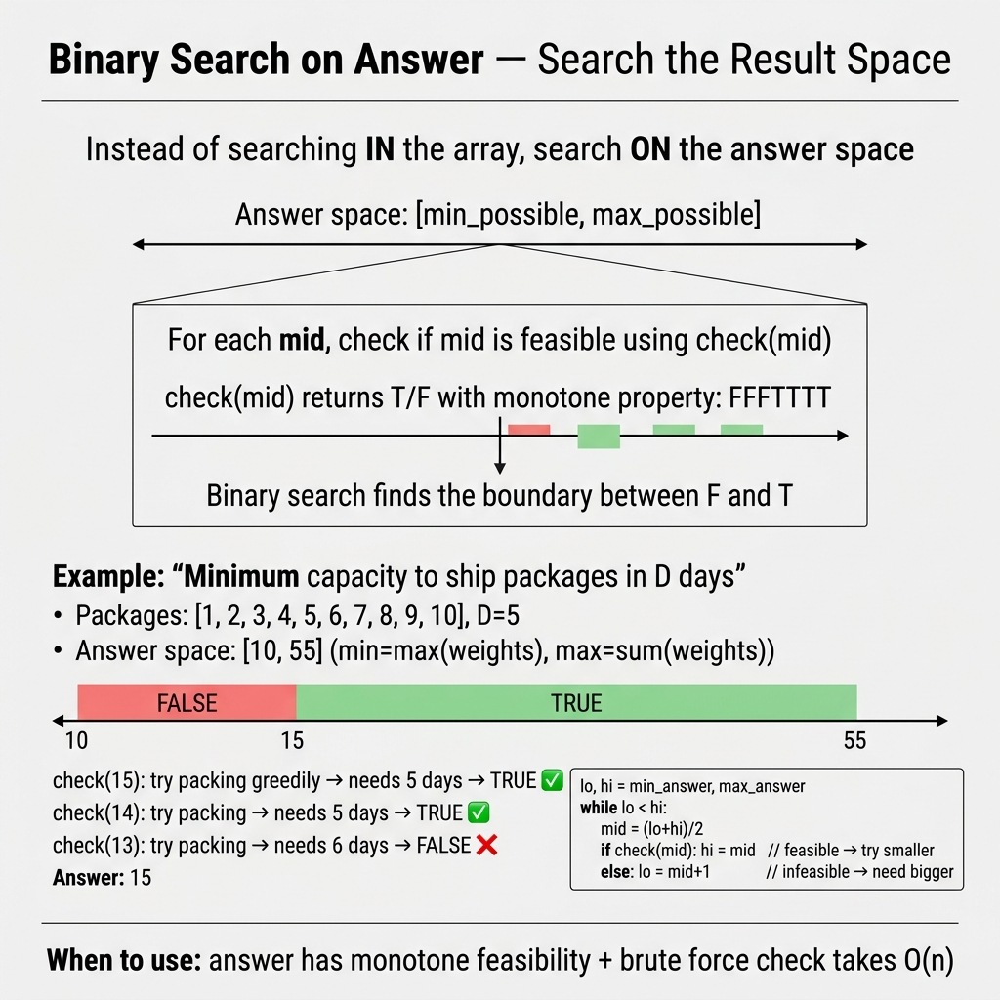

<!-- tags: dsa, algorithms, binary-search -->
# 🔍 Binary Search on Answer

> This pattern appears when the answer is not in the array, but its value domain is monotonic. If `check(mid)` flips from `false` to `true` exactly once, you have a valid reason to binary search the answer space.

📅 Created: 2026-03-23 · 🔄 Updated: 2026-04-10 · ⏱️ 20 min read

| Aspect | Detail |
| ------ | ------ |
| **Complexity** | O(cost(check) * log(answer_range)) |
| **Use case** | Minimize maximum, maximize minimum, kth by value range |
| **Recognition** | Has a `check(x)` function monotonic over the answer space |

---

## 1. DEFINE

<!-- [Beginner layer] -->
You encounter capacity problems. Testing every answer sequentially wastes time. The right question is: If the current capacity suffices, does a larger capacity also suffice? If yes, the problem reveals a clean `false` to `true` boundary.

<!-- [Experienced layer] -->
Binary search on answer explores the answer domain, not the input array. We need:
- Search range `[lo, hi]`
- Feasibility function `check(mid)`
- Monotonicity: Once `check(mid)` becomes true, the remaining side must share that trait based on minimize or maximize goals.

Core insight: **We do not search for an object; we search for the feasibility boundary**.

| Variant | Goal | Monotonic boundary | Update rule |
| ------- | -------- | ------------------ | ----------- |
| **Minimize** | Find smallest valid value | `false ... false true ... true` | if `check(mid)` is true => `hi = mid` |
| **Maximize** | Find largest valid value | `true ... true false ... false` | if `check(mid)` is true => `lo = mid` |
| **Value-range counting** | Find kth via elements `<= mid` | count increases monotonically with `mid` | compare `count(mid)` with `k` |

| Approach | Time | Space | When to choose |
| -------- | ---- | ----- | -------- |
| Brute force answer scan | O(range * cost(check)) | O(1) | Range is very small |
| Binary search on answer | O(log range * cost(check)) | O(1) | Range is large, check is monotonic |

### 1.1 Quick Recognition

- Keywords include `minimum capacity`, `minimum maximum`, `maximum minimum`, `smallest x such that`.
- You can write a `check(x)` returning `true` or `false`.
- `check(x)` flips state exactly once when `x` increases or decreases.

### 1.2 Invariants & Failure Modes

<!-- [Expert layer] -->
- `check(mid)` must be strictly monotonic. If results fluctuate, binary search on answer fails completely.
- Maximize goals often require `upper mid = lo + (hi-lo+1)/2` to prevent infinite loops when `lo+1 == hi`.
- The `[lo, hi]` range must cover the true answer space. Choosing a tight `hi` causes logical failures.

---

## 2. VISUAL

The static card below answers the central question: **Are you searching for an object, or searching the feasibility boundary across the answer space?**



The two traces below clarify the most confused shapes: first true for minimize and last true for maximize.

### Level 1 — Simple
This trace answers: **How does binary search find the `false` to `true` boundary?**

```text
Problem: minimum capacity to ship packages

answer space: [3 .. 15]

capacity:  3  4  5  6  7  8  9  10 ... 15
check:     F  F  F  T  T  T  T   T ... T
                     ^
                 first true = answer

lo=3 hi=15
mid=9  -> true  -> hi=9
mid=6  -> true  -> hi=6
mid=4  -> false -> lo=5
mid=5  -> false -> lo=6
stop: lo=hi=6
```
*Image: We do not search directly for the correct capacity. We search for the first point where `check(capacity)` becomes true.*

### Level 2 — Detailed
This trace answers: **How does maximize minimum differ from minimize maximum?**

```text
Maximize minimum distance

distance: 1  2  3  4  5  6
check:    T  T  T  T  F  F
                 ^
              last true = answer

Need upper mid:
lo=1 hi=6
mid=4 -> true  -> lo=4
mid=5 -> false -> hi=4
stop: lo=hi=4
```
*Image: For maximize problems, we seek the last true value. We must bias `mid` upwards to prevent looping between adjacent values.*

## 3. CODE

Once the trace locks the invariant, code expresses that reasoning instead of adding magic. We start from a clean baseline and scale up when necessary.

### Problem 1: Minimize Template
> *(The basic skeleton you must memorize before tackling real problems.)*
>
> **Goal**: Find the smallest value in `[lo, hi]` where `check(mid)` is true
> **Approach**: Search the `false` to `true` boundary
> **Example**: If `check(x)` turns true at `x = 6`, return `6`

```go
// bs_answer.go — Binary Search on Answer: Minimize template
func MinimizeTemplate(lo, hi int, check func(int) bool) int {
    for lo < hi {
        mid := lo + (hi-lo)/2
        if check(mid) {
            hi = mid
        } else {
            lo = mid + 1
        }
    }
    return lo
}
```
```typescript
// bs_answer.ts — Binary Search on Answer: Minimize template
function minimizeTemplate(lo: number, hi: number, check: (mid: number) => boolean): number {
    while (lo < hi) {
        const mid = lo + Math.floor((hi - lo) / 2);
        if (check(mid)) {
            hi = mid;
        } else {
            lo = mid + 1;
        }
    }
    return lo;
}
```
```java
// BinarySearchOnAnswerBasic.java — Binary Search on Answer: Minimize template
final class BinarySearchOnAnswerBasic {
    private BinarySearchOnAnswerBasic() {}

    static int minimizeTemplate(int lo, int hi, java.util.function.IntPredicate check) {
        while (lo < hi) {
            int mid = lo + (hi - lo) / 2;
            if (check.test(mid)) {
                hi = mid;
            } else {
                lo = mid + 1;
            }
        }
        return lo;
    }
}
```
```rust
// bs_answer.rs — Binary Search on Answer: Minimize template
fn minimize_template(mut lo: i32, mut hi: i32, check: impl Fn(i32) -> bool) -> i32 {
    while lo < hi {
        let mid = lo + (hi - lo) / 2;
        if check(mid) {
            hi = mid;
        } else {
            lo = mid + 1;
        }
    }
    lo
}
```
```cpp
// bs_answer.cpp — Binary Search on Answer: Minimize template
int minimizeTemplate(int lo, int hi, const std::function<bool(int)>& check) {
    while (lo < hi) {
        int mid = lo + (hi - lo) / 2;
        if (check(mid)) {
            hi = mid;
        } else {
            lo = mid + 1;
        }
    }
    return lo;
}
```
```python
# bs_answer.py — Binary Search on Answer: Minimize template
def minimize_template(lo: int, hi: int, check) -> int:
    while lo < hi:
        mid = lo + (hi - lo) // 2
        if check(mid):
            hi = mid
        else:
            lo = mid + 1
    return lo
```

> **Why?** This loop works when finding the first true value on a monotonic domain. When `check(mid)` is true, `mid` remains a candidate boundary. Using `hi = mid - 1` risks discarding the correct answer.

> **Conclusion**: The basic case locks two things: boundary type and update rule. The difficulty always lies in writing the check function, not the loop.

---

### Problem 2: Capacity to Ship Packages Within D Days [LC #1011]
> *(A classic minimize problem: larger capacity makes shipping easier.)*
>
> **Goal**: Find minimum capacity to ship all packages in `days` — O(n log range)
> **Approach**: `check(capacity)` greedily simulates shipping to test feasibility
> **Example**: weights `[1,2,3,4,5,6,7,8,9,10]`, days `5` → `15`

```go
// ship_packages.go — Binary Search on Answer: Minimize capacity
func ShipWithinDays(weights []int, days int) int {
    lo, hi := 0, 0
    for _, w := range weights {
        if w > lo {
            lo = w
        }
        hi += w
    }

    canShip := func(capacity int) bool {
        usedDays := 1
        load := 0
        for _, w := range weights {
            if load+w > capacity {
                usedDays++
                load = w
                if usedDays > days {
                    return false
                }
            } else {
                load += w
            }
        }
        return true
    }

    for lo < hi {
        mid := lo + (hi-lo)/2
        if canShip(mid) {
            hi = mid
        } else {
            lo = mid + 1
        }
    }

    return lo
}
```
```typescript
// ship_packages.ts — Binary Search on Answer: Minimize capacity
function shipWithinDays(weights: number[], days: number): number {
    let lo = Math.max(...weights);
    let hi = weights.reduce((sum, w) => sum + w, 0);

    const canShip = (capacity: number): boolean => {
        let usedDays = 1;
        let load = 0;
        for (const w of weights) {
            if (load + w > capacity) {
                usedDays++;
                load = w;
                if (usedDays > days) return false;
            } else {
                load += w;
            }
        }
        return true;
    };

    while (lo < hi) {
        const mid = lo + Math.floor((hi - lo) / 2);
        if (canShip(mid)) {
            hi = mid;
        } else {
            lo = mid + 1;
        }
    }

    return lo;
}
```
```java
// BinarySearchOnAnswerIntermediate.java — Binary Search on Answer: Minimize capacity
final class BinarySearchOnAnswerIntermediate {
    private BinarySearchOnAnswerIntermediate() {}

    static int shipWithinDays(int[] weights, int days) {
        int lo = 0;
        int hi = 0;
        for (int w : weights) {
            lo = Math.max(lo, w);
            hi += w;
        }

        while (lo < hi) {
            int mid = lo + (hi - lo) / 2;
            if (canShip(weights, days, mid)) {
                hi = mid;
            } else {
                lo = mid + 1;
            }
        }

        return lo;
    }

    private static boolean canShip(int[] weights, int days, int capacity) {
        int usedDays = 1;
        int load = 0;
        for (int w : weights) {
            if (load + w > capacity) {
                usedDays++;
                load = w;
                if (usedDays > days) {
                    return false;
                }
            } else {
                load += w;
            }
        }
        return true;
    }
}
```
```rust
// ship_packages.rs — Binary Search on Answer: Minimize capacity
fn ship_within_days(weights: &[i32], days: i32) -> i32 {
    let mut lo = *weights.iter().max().unwrap();
    let mut hi: i32 = weights.iter().sum();

    while lo < hi {
        let mid = lo + (hi - lo) / 2;
        if can_ship(weights, days, mid) {
            hi = mid;
        } else {
            lo = mid + 1;
        }
    }

    lo
}

fn can_ship(weights: &[i32], days: i32, capacity: i32) -> bool {
    let mut used_days = 1;
    let mut load = 0;

    for &w in weights {
        if load + w > capacity {
            used_days += 1;
            load = w;
            if used_days > days {
                return false;
            }
        } else {
            load += w;
        }
    }

    true
}
```
```cpp
// ship_packages.cpp — Binary Search on Answer: Minimize capacity
int shipWithinDays(const std::vector<int>& weights, int days) {
    int lo = *std::max_element(weights.begin(), weights.end());
    int hi = std::accumulate(weights.begin(), weights.end(), 0);

    auto canShip = [&](int capacity) {
        int usedDays = 1;
        int load = 0;
        for (int w : weights) {
            if (load + w > capacity) {
                ++usedDays;
                load = w;
                if (usedDays > days) return false;
            } else {
                load += w;
            }
        }
        return true;
    };

    while (lo < hi) {
        int mid = lo + (hi - lo) / 2;
        if (canShip(mid)) {
            hi = mid;
        } else {
            lo = mid + 1;
        }
    }

    return lo;
}
```
```python
# ship_packages.py — Binary Search on Answer: Minimize capacity
def ship_within_days(weights: list[int], days: int) -> int:
    lo = max(weights)
    hi = sum(weights)

    def can_ship(capacity: int) -> bool:
        used_days = 1
        load = 0
        for w in weights:
            if load + w > capacity:
                used_days += 1
                load = w
                if used_days > days:
                    return False
            else:
                load += w
        return True

    while lo < hi:
        mid = lo + (hi - lo) // 2
        if can_ship(mid):
            hi = mid
        else:
            lo = mid + 1

    return lo
```

> **Why?** Larger capacities make the problem easier. This fulfills the strict monotonic requirement. The greedy check works because we maximize daily loads. Saving space for tomorrow provides zero benefit here.

> **Conclusion**: The intermediate challenge translates natural language into a search range and a check function. Once modeled correctly, the binary search becomes mechanical.

---

### Problem 3: Aggressive Cows / Maximize Minimum Distance
> *(A classic maximize problem. You search for the last true value, not the first.)*
>
> **Goal**: Place `k` cows so the minimum distance between any two is maximized
> **Approach**: Sort positions; `check(dist)` greedily places `k` cows with minimum separation `dist`
> **Example**: positions `[1,2,4,8,9]`, `k=3` → `3`

```go
// maximize_min_distance.go — Binary Search on Answer: Maximize minimum distance
import "sort"

func MaximizeMinDistance(positions []int, k int) int {
    sort.Ints(positions)
    lo, hi := 1, positions[len(positions)-1]-positions[0]

    canPlace := func(dist int) bool {
        count := 1
        last := positions[0]
        for _, pos := range positions[1:] {
            if pos-last >= dist {
                count++
                last = pos
                if count >= k {
                    return true
                }
            }
        }
        return false
    }

    for lo < hi {
        mid := lo + (hi-lo+1)/2
        if canPlace(mid) {
            lo = mid
        } else {
            hi = mid - 1
        }
    }

    return lo
}
```
```typescript
// maximize_min_distance.ts — Binary Search on Answer: Maximize minimum distance
function maximizeMinDistance(positions: number[], k: number): number {
    positions.sort((a, b) => a - b);
    let lo = 1;
    let hi = positions[positions.length - 1] - positions[0];

    const canPlace = (dist: number): boolean => {
        let count = 1;
        let last = positions[0];
        for (let i = 1; i < positions.length; i++) {
            if (positions[i] - last >= dist) {
                count++;
                last = positions[i];
                if (count >= k) return true;
            }
        }
        return false;
    };

    while (lo < hi) {
        const mid = lo + Math.floor((hi - lo + 1) / 2);
        if (canPlace(mid)) {
            lo = mid;
        } else {
            hi = mid - 1;
        }
    }

    return lo;
}
```
```java
// BinarySearchOnAnswerAdvanced.java — Binary Search on Answer: Maximize minimum distance
import java.util.Arrays;

final class BinarySearchOnAnswerAdvanced {
    private BinarySearchOnAnswerAdvanced() {}

    static int maximizeMinDistance(int[] positions, int k) {
        Arrays.sort(positions);
        int lo = 1;
        int hi = positions[positions.length - 1] - positions[0];

        while (lo < hi) {
            int mid = lo + (hi - lo + 1) / 2;
            if (canPlace(positions, k, mid)) {
                lo = mid;
            } else {
                hi = mid - 1;
            }
        }

        return lo;
    }

    private static boolean canPlace(int[] positions, int k, int dist) {
        int count = 1;
        int last = positions[0];
        for (int i = 1; i < positions.length; i++) {
            if (positions[i] - last >= dist) {
                count++;
                last = positions[i];
                if (count >= k) {
                    return true;
                }
            }
        }
        return false;
    }
}
```
```rust
// maximize_min_distance.rs — Binary Search on Answer: Maximize minimum distance
fn maximize_min_distance(positions: &mut [i32], k: i32) -> i32 {
    positions.sort_unstable();
    let mut lo = 1;
    let mut hi = positions[positions.len() - 1] - positions[0];

    while lo < hi {
        let mid = lo + (hi - lo + 1) / 2;
        if can_place(positions, k, mid) {
            lo = mid;
        } else {
            hi = mid - 1;
        }
    }

    lo
}

fn can_place(positions: &[i32], k: i32, dist: i32) -> bool {
    let mut count = 1;
    let mut last = positions[0];
    for &pos in positions.iter().skip(1) {
        if pos - last >= dist {
            count += 1;
            last = pos;
            if count >= k {
                return true;
            }
        }
    }
    false
}
```
```cpp
// maximize_min_distance.cpp — Binary Search on Answer: Maximize minimum distance
int maximizeMinDistance(std::vector<int> positions, int k) {
    std::sort(positions.begin(), positions.end());
    int lo = 1;
    int hi = positions.back() - positions.front();

    auto canPlace = [&](int dist) {
        int count = 1;
        int last = positions[0];
        for (size_t i = 1; i < positions.size(); ++i) {
            if (positions[i] - last >= dist) {
                ++count;
                last = positions[i];
                if (count >= k) return true;
            }
        }
        return false;
    };

    while (lo < hi) {
        int mid = lo + (hi - lo + 1) / 2;
        if (canPlace(mid)) {
            lo = mid;
        } else {
            hi = mid - 1;
        }
    }

    return lo;
}
```
```python
# maximize_min_distance.py — Binary Search on Answer: Maximize minimum distance
def maximize_min_distance(positions: list[int], k: int) -> int:
    positions.sort()
    lo = 1
    hi = positions[-1] - positions[0]

    def can_place(dist: int) -> bool:
        count = 1
        last = positions[0]
        for pos in positions[1:]:
            if pos - last >= dist:
                count += 1
                last = pos
                if count >= k:
                    return True
        return False

    while lo < hi:
        mid = lo + (hi - lo + 1) // 2
        if can_place(mid):
            lo = mid
        else:
            hi = mid - 1

    return lo
```

> **Why?** Maximize problems seek the last true value. Using standard mid calculation causes infinite loops when `lo+1 == hi` and `check(lo)` remains true. An upper mid forces the midpoint rightwards, ensuring the search space shrinks.

> **Conclusion**: This is advanced because most bugs stem from boundary updates, not feasibility logic.

---

### Problem 4: Kth Smallest Element in a Sorted Matrix [LC #378]
> *(An expert problem because `check(mid)` relies on value space counting rather than simple greedy checks.)*
>
> **Goal**: Find the `k`th smallest element in a matrix sorted by rows and columns
> **Approach**: Binary search the value domain `[matrix[0][0], matrix[n-1][n-1]]`; `check(mid)` verifies if count `<= mid` is at least `k`
> **Example**: `[[1,5,9],[10,11,13],[12,13,15]], k=8` → `13`

```go
// kth_smallest_matrix.go — Binary Search on Answer: Value-space search in sorted matrix
func KthSmallest(matrix [][]int, k int) int {
    n := len(matrix)
    lo, hi := matrix[0][0], matrix[n-1][n-1]

    countLessEqual := func(mid int) int {
        count := 0
        row, col := n-1, 0
        for row >= 0 && col < n {
            if matrix[row][col] <= mid {
                count += row + 1
                col++
            } else {
                row--
            }
        }
        return count
    }

    for lo < hi {
        mid := lo + (hi-lo)/2
        if countLessEqual(mid) >= k {
            hi = mid
        } else {
            lo = mid + 1
        }
    }

    return lo
}
```
```typescript
// kth_smallest_matrix.ts — Binary Search on Answer: Value-space search in sorted matrix
function kthSmallest(matrix: number[][], k: number): number {
    const n = matrix.length;
    let lo = matrix[0][0];
    let hi = matrix[n - 1][n - 1];

    const countLessEqual = (mid: number): number => {
        let count = 0;
        let row = n - 1;
        let col = 0;
        while (row >= 0 && col < n) {
            if (matrix[row][col] <= mid) {
                count += row + 1;
                col++;
            } else {
                row--;
            }
        }
        return count;
    };

    while (lo < hi) {
        const mid = lo + Math.floor((hi - lo) / 2);
        if (countLessEqual(mid) >= k) {
            hi = mid;
        } else {
            lo = mid + 1;
        }
    }

    return lo;
}
```
```java
// BinarySearchOnAnswerExpert.java — Binary Search on Answer: Value-space search in sorted matrix
final class BinarySearchOnAnswerExpert {
    private BinarySearchOnAnswerExpert() {}

    static int kthSmallest(int[][] matrix, int k) {
        int n = matrix.length;
        int lo = matrix[0][0];
        int hi = matrix[n - 1][n - 1];

        while (lo < hi) {
            int mid = lo + (hi - lo) / 2;
            if (countLessEqual(matrix, mid) >= k) {
                hi = mid;
            } else {
                lo = mid + 1;
            }
        }

        return lo;
    }

    private static int countLessEqual(int[][] matrix, int mid) {
        int n = matrix.length;
        int count = 0;
        int row = n - 1;
        int col = 0;
        while (row >= 0 && col < n) {
            if (matrix[row][col] <= mid) {
                count += row + 1;
                col++;
            } else {
                row--;
            }
        }
        return count;
    }
}
```
```rust
// kth_smallest_matrix.rs — Binary Search on Answer: Value-space search in sorted matrix
fn kth_smallest(matrix: &[Vec<i32>], k: i32) -> i32 {
    let n = matrix.len();
    let mut lo = matrix[0][0];
    let mut hi = matrix[n - 1][n - 1];

    while lo < hi {
        let mid = lo + (hi - lo) / 2;
        if count_less_equal(matrix, mid) >= k {
            hi = mid;
        } else {
            lo = mid + 1;
        }
    }

    lo
}

fn count_less_equal(matrix: &[Vec<i32>], mid: i32) -> i32 {
    let n = matrix.len();
    let mut count = 0;
    let mut row = n as i32 - 1;
    let mut col = 0usize;

    while row >= 0 && col < n {
        if matrix[row as usize][col] <= mid {
            count += row + 1;
            col += 1;
        } else {
            row -= 1;
        }
    }

    count
}
```
```cpp
// kth_smallest_matrix.cpp — Binary Search on Answer: Value-space search in sorted matrix
int kthSmallest(const std::vector<std::vector<int>>& matrix, int k) {
    int n = static_cast<int>(matrix.size());
    int lo = matrix[0][0];
    int hi = matrix[n - 1][n - 1];

    auto countLessEqual = [&](int mid) {
        int count = 0;
        int row = n - 1;
        int col = 0;
        while (row >= 0 && col < n) {
            if (matrix[row][col] <= mid) {
                count += row + 1;
                ++col;
            } else {
                --row;
            }
        }
        return count;
    };

    while (lo < hi) {
        int mid = lo + (hi - lo) / 2;
        if (countLessEqual(mid) >= k) {
            hi = mid;
        } else {
            lo = mid + 1;
        }
    }

    return lo;
}
```
```python
# kth_smallest_matrix.py — Binary Search on Answer: Value-space search in sorted matrix
def kth_smallest(matrix: list[list[int]], k: int) -> int:
    n = len(matrix)
    lo = matrix[0][0]
    hi = matrix[-1][-1]

    def count_less_equal(mid: int) -> int:
        count = 0
        row = n - 1
        col = 0
        while row >= 0 and col < n:
            if matrix[row][col] <= mid:
                count += row + 1
                col += 1
            else:
                row -= 1
        return count

    while lo < hi:
        mid = lo + (hi - lo) // 2
        if count_less_equal(mid) >= k:
            hi = mid
        else:
            lo = mid + 1

    return lo
```

> **Why?** The count strictly increases with `mid`, enabling binary search over the value space without flattening the matrix. Counting from the bottom-left drops entire rows or columns, keeping `check(mid)` at O(n) instead of O(n²).

> **Conclusion**: This is expert because you must binary search the answer space while keeping the check function fast enough to maintain overall efficiency.

---

## 4. PITFALLS

The tricky part of DSA rarely lies in the algorithm name. It lies in representation, boundary, and the promise you thought you kept but actually dropped midway.

| # | Severity | Error | Impact | Fix |
|---|----------|-----|---------|-----|
| 1 | 🔴 Fatal | Using binary search when `check(mid)` lacks monotonicity | Silent convergence to incorrect answers | Outline the `false` to `true` transition before coding |
| 2 | 🔴 Fatal | Using standard mid calculation for maximize problems | Infinite loops between adjacent values | Use upper mid for maximize scenarios |
| 3 | 🟡 Common | Search bounds do not cover the true answer space | Missing the correct answer | Assign the absolute minimum and maximum possible boundaries |
| 4 | 🟡 Common | Correct but excessively slow `check(mid)` function | Theoretical binary search correctness fails with TLE | Optimize the check function first |
| 5 | 🔵 Minor | Forgetting if the target is first or last true | Mixing maximize boundaries yields off-by-one errors | Explicitly comment the search target direction |

---

## 5. REF

| Resource | Type | Link | Note |
| -------- | ---- | ---- | ------- |
| LeetCode 1011 | Problem | https://leetcode.com/problems/capacity-to-ship-packages-within-d-days/ | Minimize capacity |
| LeetCode 875 | Problem | https://leetcode.com/problems/koko-eating-bananas/ | Minimize speed |
| LeetCode 410 | Problem | https://leetcode.com/problems/split-array-largest-sum/ | Minimize largest partition sum |
| LeetCode 378 | Problem | https://leetcode.com/problems/kth-smallest-element-in-a-sorted-matrix/ | Value-space counting |
| CP-Algorithms | Reference | https://cp-algorithms.com/num_methods/binary_search.html | General binary search |

---

## 6. RECOMMEND

When a pattern stands firm, the next step is knowing its adjacent problem families and when to switch primitives.

| Expansion | When to use | Reason | File/Link |
| ------- | ------- | ----- | --------- |
| Searching: Binary Search | Mastering baseline array searches | Binary search on answer builds atop basic array searches | [../searching/02-binary-search.md](../searching/02-binary-search.md) |
| Prefix Sum | `check(mid)` depends on cumulative states | Combining answer search with precomputed array data | [./05-prefix-sum.md](./05-prefix-sum.md) |
| Greedy | `check(mid)` tests greedy feasibility | Understanding why greedy choices validate boundaries | [../greedy/README.md](../greedy/README.md) |

---

## 7. QUICK REF

| Problem signal | Sub-pattern | Short template |
| --------------- | ----------- | ------------- |
| `minimum X such that ...` | first true | `if check(mid) hi=mid else lo=mid+1` |
| `maximum X such that ...` | last true | `upper mid`, `if check(mid) lo=mid else hi=mid-1` |
| `kth by value range` | count <= mid | compare count with k |
| `allocation/partition` | greedy feasibility | check if simulation succeeds |

---

**Links**: [← Prefix Sum](./05-prefix-sum.md) · [↗ Searching: Binary Search](../searching/02-binary-search.md)

---

Returning to the opening question: Why search the answer space instead of the input? Because the answer space offers monotone feasibility. If capacity X suffices, X+1 also suffices. This pattern transforms optimization into sequential decision problems.