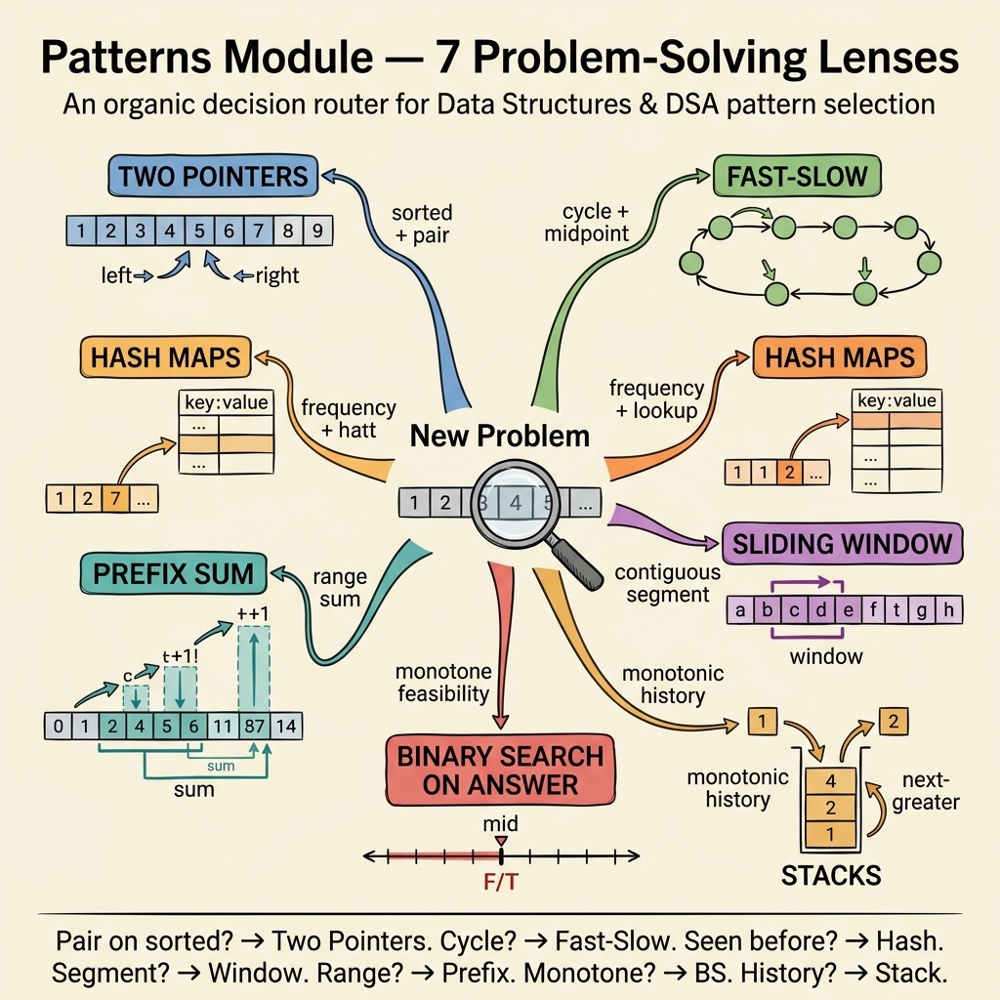

<!-- tags: dsa, algorithms, patterns, overview -->
# DSA Patterns — Problem Recognition First

> This is where you train your first 30-second reflex before a new problem. If you recognize the correct signal, the rest is implementation. If you choose the wrong family, you might code hard but still get lost.

📅 Created: 2026-04-04 · 🔄 Updated: 2026-04-10 · ⏱️ 8 min read

| Aspect | Detail |
| ------ | ------ |
| **Role** | Pattern recognition hub for array/string/list problems |
| **Core question** | How does this problem let you eliminate search space, group state, or keep history structure? |
| **Best use** | Use this before jumping into specific problems in other modules |

---

## 1. DEFINE

DSA Patterns — Problem Recognition First exists for the most frustrating moment in an interview. You have not written any wrong code yet, but you do not know which family to try first. If you choose the wrong lens in the first 30 seconds, the rest of the problem often becomes a well-decorated brute force loop.

The hardest part of an interview is not typing code. It is looking at a messy input and deciding: "is this window, prefix, stack, or binary search on answer?". This hub reduces that exact hesitation.
Each pattern in the `patterns/` directory is a lens. Two Pointers look at symmetry and monotonicity. Sliding Window looks at an expanding or shrinking segment. Hash Maps & Sets look at states to remember. Monotonic Stack looks at unresolved history. Prefix Sum looks at compressing past information into cumulative sums.
You do not need to memorize every problem immediately. You need to know which pattern deserves the first try, and which pattern to abandon early because the invariant does not hold.

### Pattern families
| Pattern | Strongest signal | Invariant | Link |
| --- | --- | --- | --- |
| Two Pointers | sorted, pair, palindrome, in-place compaction | each step eliminates a region without rechecking | [two-pointers/README.md](./two-pointers/README.md) |
| Fast & Slow | cycle, midpoint, distance offset | relative distance between two pointers carries meaning | [fast-slow/README.md](./fast-slow/README.md) |
| Hash Maps & Sets | frequency, uniqueness, complement lookup | remember state by key to avoid rescanning | [hash-maps-sets/README.md](./hash-maps-sets/README.md) |
| Sliding Window | contiguous substring/subarray | window always maintains the current constraint | [sliding-window/README.md](./sliding-window/README.md) |
| Prefix Sums | range sum, subarray count | past is compressed into cumulative state | [prefix-sums/README.md](./prefix-sums/README.md) |
| Binary Search | boundary, feasible answer, monotone predicate | predicate changes phase exactly once | [binary-search/README.md](./binary-search/README.md) |
| Stacks | next greater, matching, monotonic history | processing order depends on unresolved elements | [stacks/README.md](./stacks/README.md) |

## 2. VISUAL

This map is the first scan layer of the `patterns` lane. It does not prove the solution. It only helps you pick the first candidate pattern worth trying.



Read the image this way:
- A pattern is a lens to view the problem, not a label after solving it.
- A problem can emit multiple signals at once, but usually only one main pattern holds the core invariant.
- If unsure, prioritize the pattern that explains why it eliminates search space or keeps state.

```text

Array / string / list problem
  |
  +-- contiguous segment to expand/shrink? -> Sliding Window
  +-- sorted + can drop one end?           -> Two Pointers
  +-- lookup by key/frequency?             -> Hash Maps & Sets
  +-- range / cumulative history?          -> Prefix Sums
  +-- monotone answer space?               -> Binary Search
  +-- "close" elements in order?           -> Stacks
  +-- offset / cycle / midpoint?           -> Fast & Slow
```
*Image: A problem can emit multiple signals at once. This hub helps you pick the first candidate pattern to try, rather than proving the final answer immediately.*

## 3. CODE

There is no code in this README because the goal is not syntax memorization. The reading order below acts as an implementation plan for pattern recognition.

| Step | Read what | Must answer | If not answered |
| --- | --- | --- | --- |
| 1 | Choose a family from the table above | Which problem signal pulled you to that family? | Reread `DEFINE` of the family README |
| 2 | Open the anchor problem of the family | What is the core invariant? | Trace `VISUAL` step by step again |
| 3 | Compare with a neighbor family | Why is the neighbor family less suitable? | Open `RECOMMEND` to see adjacent concepts |
| 4 | Rewrite basic solution | Do you still depend on the template? | Return to the anchor problem, wait before trying hard variants |

## 4. PITFALLS

The tricky part of DSA rarely lies in the algorithm name. It lies in representation, boundary, and the promise you thought you kept but actually dropped midway.

| Pitfall | Sign | Why it fails | How to fix | Severity |
| ------- | -------- | ---------- | -------- | -------- |
| Pick pattern by "familiar feeling" | Defaulting to binary search just because you see "sorted" | Sorted can lead to two pointers or greedy, not just search | Force yourself to state the invariant in one sentence before picking | high |
| Cramming multiple patterns at once | Code uses window, hash, and prefix without a clear invariant keeper | The algorithm loses its main axis and becomes hard to debug | Decide the main pattern. Sub-patterns only serve the main pattern. | high |
| Remembering pattern names but forgetting signals | Knowing what a "monotonic stack" is but failing to recognize the need for it | Learning names without learning symptoms | Review the signal table instead of just looking at sample problems | medium |
| Ignoring adjacent patterns | Stopping after solving 1 problem | Failing to build a distinct neural network | Read at least one problem in `RECOMMEND` for each pattern | medium |

## 5. REF

- CP-Algorithms index: https://cp-algorithms.com/
- VisuAlgo: https://visualgo.net/en
- Open Data Structures: https://opendatastructures.org/

## 6. RECOMMEND

After this hub, do not read randomly. Choose a family closest to your current weakness and finish that lane.

- If you often confuse sorted/pair/palindrome problems: go to [two-pointers/README.md](./two-pointers/README.md).
- If you often do not know when to use map or set: go to [hash-maps-sets/README.md](./hash-maps-sets/README.md).
- If the problem has a contiguous segment but you still brute force: go to [sliding-window/README.md](./sliding-window/README.md).

## 7. QUICK REF

- The best pattern is the pattern with an invariant you can explain.
- Problem signals are more important than sample problem names.
- Comparing with adjacent patterns is the fastest way to retain memory.