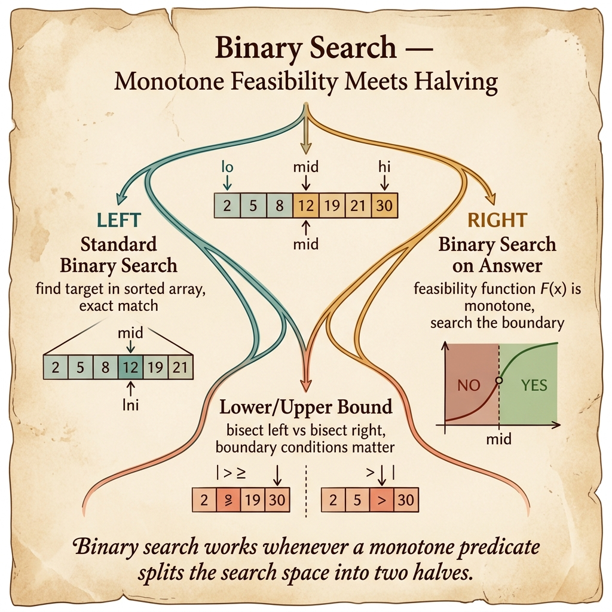

<!-- tags: dsa, algorithms, patterns, binary-search, overview -->
# Binary Search Pattern

> The binary search pattern does not just find a number in a sorted array. In its stronger form, it hunts a boundary where a predicate flips from false to true or true to false.

📅 Created: 2026-04-04 · 🔄 Updated: 2026-04-10 · ⏱️ 6 min read

| Aspect | Detail |
| ------ | ------ |
| **Recognition** | sorted order, lower/upper bound, monotone predicate, answer space |
| **Core invariant** | the remaining range always contains the boundary or valid answer |
| **Primary article** | [../06-binary-search-on-answer.md](../06-binary-search-on-answer.md) |

---

## 1. DEFINE

You just saw a problem with sorted order or a monotone predicate and want to write a midpoint immediately. This router exists to block that exact reflex. Binary search is only valid when you know the boundary you hunt. You must also know why discarding half the range remains safe.

When you say "binary search", the midpoint is not the critical part. A phase-change structure must exist to make discarding half the range legal. Without that phase change, every bisection is just a random guess disguised as math.

This pattern has two faces: searching on sorted data and searching on an answer space. The second face is often harder to recognize. However, it elevates binary search into a true pattern rather than a textbook exercise.

### Main lanes
| Lane | Question | Invariant | Link |
| --- | --- | --- | --- |
| Sorted boundary | first/last occurrence, lower/upper bound | current range still contains the boundary | [../../searching/02-binary-search.md](../../searching/02-binary-search.md) |
| Binary search on answer | smallest/largest answer satisfying condition | predicate flips phase exactly once | [../06-binary-search-on-answer.md](../06-binary-search-on-answer.md) |
| Range expansion | unknown upper bound but monotone zone exists | expand boundary before bisecting | [../../searching/05-exponential-search.md](../../searching/05-exponential-search.md) |

## 2. VISUAL

The router card below brings both faces of binary search to the same intuition. It searches the boundary of a valid range, whether that range is in index space or answer space.



The text map below keeps the same intuition in a compact form for quick scanning.

```text

Search space
  |
  +-- already sorted? -> boundary lies in index space
  |
  +-- answer unknown but monotone predicate?
        -> boundary lies in answer space
```
*Figure: Whether bisecting on index or answer, binary search always hunts a phase-change boundary.*

## 3. CODE

You should read the basic search lane first. Then move to answer-space search to see how the pattern generalizes.

| Order | Open file | Learning goal | Mastery signal |
| --- | --- | --- | --- |
| 1 | [../../searching/02-binary-search.md](../../searching/02-binary-search.md) | Lock boundary search on sorted data | You no longer confuse exact match with first/last occurrence |
| 2 | [../06-binary-search-on-answer.md](../06-binary-search-on-answer.md) | Generalize to answer space | You can write the predicate and prove monotonicity |
| 3 | [../../searching/05-exponential-search.md](../../searching/05-exponential-search.md) | Expand when upper bound is unknown | You see the boundary as part of the pattern |

## 4. PITFALLS

The slippery part of DSA rarely lies in the algorithm name. It hides in the representation, boundaries, and broken promises you thought you kept.

| Pitfall | Signal | Why it fails | How to fix | Severity |
| ------- | -------- | ---------- | -------- | -------- |
| Bisecting without monotonicity | Code looks like binary search but fails silently | Discarding half the range has no basis | Prove phase change or sorted order first | high |
| Confusing predicate search with exact search | Writing the same template for every problem | Updating `lo/hi` differs by target boundary | State if the answer is first true, last true, or exact | high |
| Ignoring answer space | Optimal problem still brute forces value range | Missing the strongest structure of the prompt | Ask if a guessed answer can be checked in O(f(n)) | medium |
| Wrong loop from midpoint bias | Infinite loop on small ranges | Boundary update and midpoint rule clash | Choose an invariant and write a template matching it | medium |

## 5. REF

- CP-Algorithms overview: https://cp-algorithms.com/
- CP-Algorithms on binary search: https://cp-algorithms.com/num_methods/binary_search.html
- VisuAlgo reference: https://visualgo.net/en

## 6. RECOMMEND

When binary search relies on a complex check function, it often stands on the shoulders of another pattern.

- If predicate feasibility relies on a local greedy check, see [../../greedy/README.md](../../greedy/README.md).
- If sorted order helps eliminate pairs directly, return to [../two-pointers/README.md](../two-pointers/README.md).
- If the problem just seeks a boundary on sorted data, see [../../searching/README.md](../../searching/README.md) to keep the basic lane clean.

## 7. QUICK REF

- Binary search hunts boundaries, not midpoints.
- A monotone predicate is the passport for answer-space search.
- A template is only correct when its invariant holds.