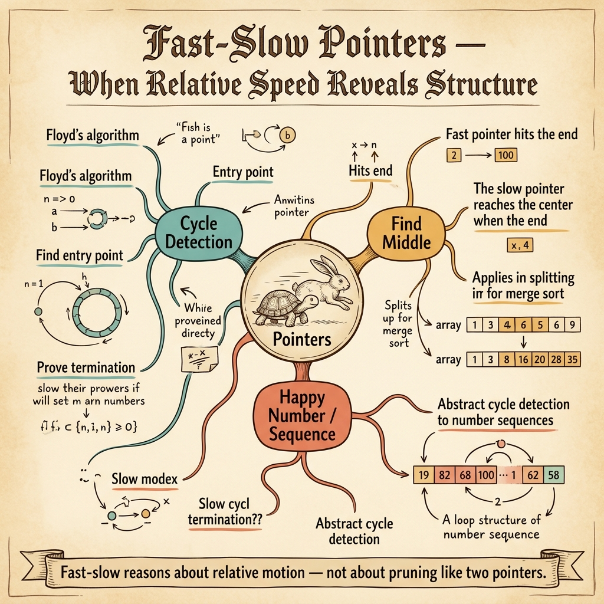

<!-- tags: dsa, algorithms, patterns, fast-slow, overview -->
# Fast & Slow Pattern

> Fast & slow does not eliminate search space like two pointers. It uses speed difference or distance to turn questions about cycles, midpoints, or kth-from-end into a manageable relative relationship.

📅 Created: 2026-04-04 · 🔄 Updated: 2026-04-10 · ⏱️ 6 min read

| Aspect | Detail |
| ------ | ------ |
| **Recognition** | cycle detection, midpoint, offset from end |
| **Core invariant** | distance or speed between two pointers carries necessary information |
| **Primary article** | [../02-fast-slow.md](../02-fast-slow.md) |

---

## 1. DEFINE

You just encountered a linked structure problem with two pointers. This router separates three different ideas that often blur together: detecting cycles, maintaining fixed gaps, and using speed differences to find midpoints.

When data lacks random access but the problem asks about relative positions, fast & slow is a very clean pattern. You do not need absolute indices. You only need to maintain the correct movement rhythm between two pointers.

Cycle detection, finding midpoints, removing nth from end, and palindrome linked lists all share this intuition. The difference lies in whether you want the pointers to meet, stay a fixed distance apart, or split the list.

### Common variants
| Variant | Question | Invariant | Link |
| --- | --- | --- | --- |
| Cycle detection | Does a cycle exist? | fast and slow will meet if a cycle exists | [../02-fast-slow.md](../02-fast-slow.md) |
| Midpoint split | Where is the middle? | when fast reaches the end, slow is at the middle | [../../linked-lists/05-palindrome.md](../../linked-lists/05-palindrome.md) |
| Fixed gap | Where is the kth node from the end? | fast stays k steps ahead, slow follows | [../../linked-lists/02-remove-kth-last.md](../../linked-lists/02-remove-kth-last.md) |

## 2. VISUAL

The router card below shows that fast & slow is a family about the **relative relationship between two pointers**, not about search space reduction like two pointers.



The text diagram below keeps the same intuition minimal for quick comparison with the linked-list lane.

```text

Linked structure / pointer walk
  |
  +-- need to detect cycle? -> fast 2 steps, slow 1 step
  +-- need to find midpoint?   -> when fast ends, slow is middle
  +-- need fixed offset? -> fast goes k steps ahead, then both move
```
*Figure: Fast & slow governs relative pointer relationships, not search space optimization.*

## 3. CODE

The best way to read this pattern is by comparing the anchor article with two specific linked list problems where it is reused in different contexts.

| Order | Open file | Why | Mastery signal |
| --- | --- | --- | --- |
| 1 | [../02-fast-slow.md](../02-fast-slow.md) | Anchor for cycle and midpoint | You see why speed difference creates information |
| 2 | [../../linked-lists/02-remove-kth-last.md](../../linked-lists/02-remove-kth-last.md) | Turn speed difference into fixed distance | You no longer need absolute indices |
| 3 | [../../linked-lists/05-palindrome.md](../../linked-lists/05-palindrome.md) | Use midpoint as bridge to reverse/compare | You see how this pattern coordinates with rewiring |

## 4. PITFALLS

The slippery part of DSA rarely lies in the algorithm name. It hides in the representation, boundaries, and broken promises you thought you kept.

| Pitfall | Signal | Why it fails | How to fix | Severity |
| ------- | -------- | ---------- | -------- | -------- |
| Equating fast/slow with two pointers | Using the same logic just because two pointers exist | This pattern does not reduce search space by order | Distinguish relative position problems from sorted pair problems | high |
| Off-by-one in gap setup | Remove nth from end deletes the wrong node | The initial gap is the entire proof | State exactly how far ahead fast starts and where slow begins | high |
| Ignoring dummy node in linked list | Head case requires special handling | Boundary logic interferes with distance logic | Add a dummy node to unify cases | medium |
| Trusting cycle detection without meeting logic | Memorizing formulas without knowing why | Missing modular distance intuition on cycles | Hand-trace 2-3 cycles to lock the intuition | medium |

## 5. REF

- Open Data Structures: https://opendatastructures.org/
- VisuAlgo reference: https://visualgo.net/en
- CP-Algorithms overview: https://cp-algorithms.com/

## 6. RECOMMEND

When a problem requires remembering more history than just the distance between two pointers, fast & slow is no longer the right family.

- If the problem is general linked list rewiring, return to [../../linked-lists/README.md](../../linked-lists/README.md).
- If the problem needs contiguous segments on arrays/strings, see [../sliding-window/README.md](../sliding-window/README.md).
- If sorted order is the main resource, switch to [../two-pointers/README.md](../two-pointers/README.md).

## 7. QUICK REF

- Fast & slow solves relative position problems, not pair sum problems.
- One wrong step in gap setup breaks the whole invariant.
- Cycle, midpoint, and kth-from-end are three lanes you should remember together.