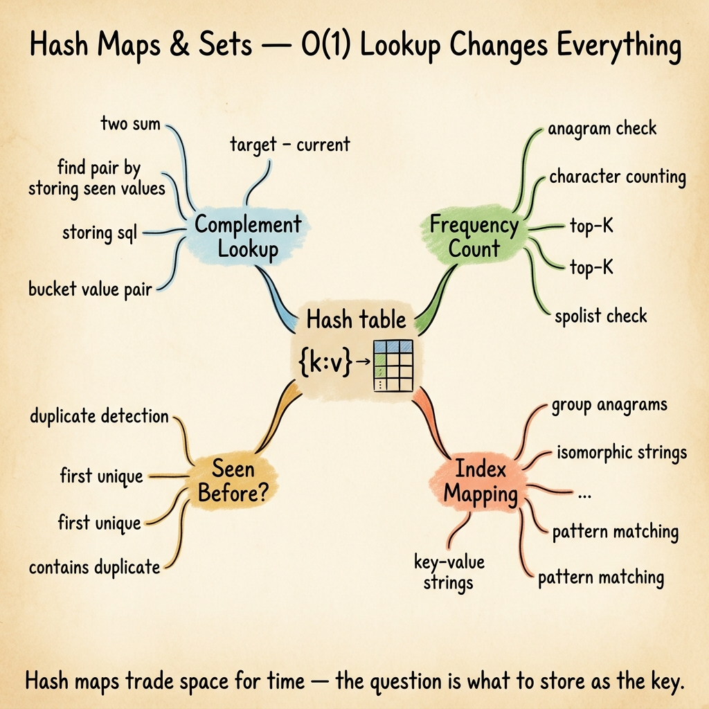

<!-- tags: dsa, algorithms, patterns, hash, overview -->
# Hash Maps & Sets Pattern

> Hash maps and sets do not magically make algorithms smarter. They just buy you the ability to remember exact past states so you do not rescan history.

📅 Created: 2026-04-04 · 🔄 Updated: 2026-04-10 · ⏱️ 6 min read

| Aspect | Detail |
| ------ | ------ |
| **Recognition** | frequency, uniqueness, complement lookup, visited state |
| **Core invariant** | the key you store must be the exact minimal information needed |
| **Primary article** | [../03-hashing.md](../03-hashing.md) |

---

## 1. DEFINE

You just saw `duplicate`, `frequency`, `anagram`, or `seen before`. You know you will probably use a hash map. This router helps with the harder step: identifying the **minimal state to remember as the key**, rather than throwing everything into a map.

Many array/string/list problems fall back to brute force because you forget the past. Hash maps and sets cure this exact disease. They store the minimal facts so the current scan never looks back or restarts.

Frequency counting, complement lookup, seen-before detection, and signature grouping all belong here. The most critical difference is choosing the key. If you choose the wrong key, the map fills up but the problem remains poorly modeled.

### Common lanes
| Lane | When to use | Key to keep | Link |
| --- | --- | --- | --- |
| Frequency | Count occurrences | value -> count | [../03-hashing.md](../03-hashing.md) |
| Complement lookup | Two Sum / pair by target | needed complement or seen value | [../03-hashing.md](../03-hashing.md) |
| Visited / de-dup | unique items / cycle on explicit states | encountered state | [../../graph/01-bfs.md](../../graph/01-bfs.md) |
| Grouping | anagram / signature-based bucketing | normalized signature -> list | [../../string-algorithms/README.md](../../string-algorithms/README.md) |

## 2. VISUAL

The router card below helps you separate "what to remember" from "what structure to use".



The text map below keeps the same state selection logic for quick scanning.

```text

Streaming input / one-pass scan
  |
  +-- need to know what was seen?      -> Set / visited map
  +-- need to know how many?  -> Frequency map
  +-- need to match complement? -> Value -> index/count map
  +-- need to group by signature?      -> Signature -> bucket map
```
*Figure: The hashing pattern is really about state design. The data structure merely implements that state.*

## 3. CODE

Read this pattern by asking: "what minimal fact must I remember so this current pass avoids rescanning history?".

| Order | Open file | Learning goal | Mastery signal |
| --- | --- | --- | --- |
| 1 | [../03-hashing.md](../03-hashing.md) | Anchor for key/value state | You choose a key without over-storing data |
| 2 | [../../string-algorithms/01-sliding-window.md](../../string-algorithms/01-sliding-window.md) | Hashing as auxiliary state for windows | Map serves the window instead of stealing focus |
| 3 | [../../graph/01-bfs.md](../../graph/01-bfs.md) | Visited set in traversal | You see hashing as a guard state, not a complete solution |

## 4. PITFALLS

The slippery part of DSA rarely lies in the algorithm name. It hides in the representation, boundaries, and broken promises you thought you kept.

| Pitfall | Signal | Why it fails | How to fix | Severity |
| ------- | -------- | ---------- | -------- | -------- |
| Wrong abstraction for key | Map grows huge but cannot answer the prompt | Stored state misses the minimal needed fact | Write down explicitly: what does the key represent? | high |
| Storing redundant data | Map holds full objects when counts or booleans suffice | Memory balloons while the invariant stays vague | Compress state down to the exact semantic need | medium |
| Confusing main pattern with helper | Calling a window problem "a hashing pattern" | Hash maps often just assist | Identify which structure holds the main solution invariant | medium |
| Forgetting collisions in custom signatures | Grouping fails with custom representation | Signature is not canonical | Normalize the key before using it as an identifier | high |

## 5. REF

- Open Data Structures: https://opendatastructures.org/
- CP-Algorithms overview: https://cp-algorithms.com/
- VisuAlgo reference: https://visualgo.net/en

## 6. RECOMMEND

When a map needs to accumulate or compress history vertically instead of tracking discrete seen states, another family fits better.

- If you need cumulative history instead of discrete seen states, go to [../prefix-sums/README.md](../prefix-sums/README.md).
- If the map only assists a contiguous segment, see [../sliding-window/README.md](../sliding-window/README.md).
- If the problem demands exact string matching instead of simple state recall, move to [../../important-algorithms/02-kmp.md](../../important-algorithms/02-kmp.md).

## 7. QUICK REF

- Hashing means remembering exactly what you need, not everything.
- Key design dictates the success or failure of the pattern.
- Hash maps often play a supporting role for other patterns.