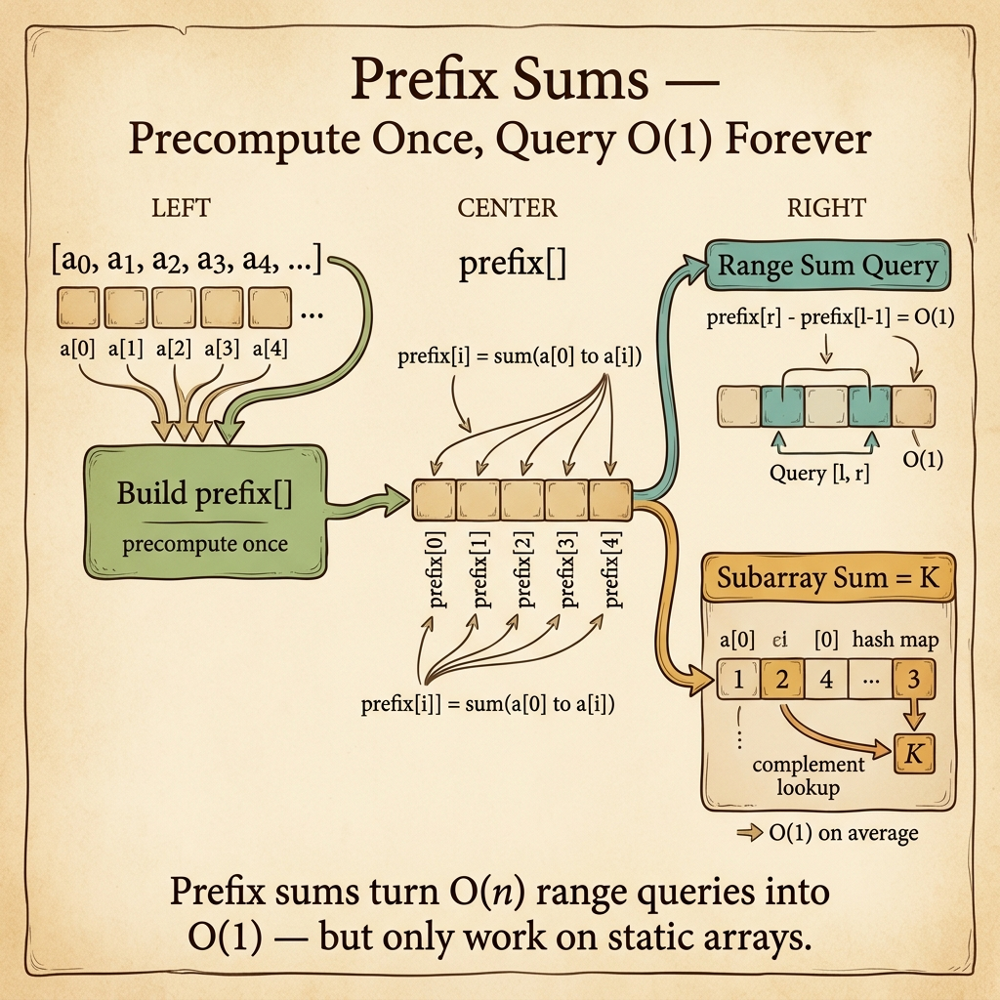

<!-- tags: dsa, algorithms, patterns, prefix-sums, overview -->
# Prefix Sums Pattern

> Prefix sums let you carry the past forward as a compact value. Instead of recalculating segments from scratch, you turn history into a cumulative state for instant queries.

📅 Created: 2026-04-04 · 🔄 Updated: 2026-04-10 · ⏱️ 6 min read

| Aspect | Detail |
| ------ | ------ |
| **Recognition** | range sum, subarray count, cumulative score |
| **Core invariant** | the prefix at index i must answer questions about any segment ending at i |
| **Primary article** | [../05-prefix-sum.md](../05-prefix-sum.md) |

---

## 1. DEFINE

You just found a range sum or subarray count problem and are debating between brute force, windows, or hash maps. This router clarifies when history must become a **cumulative state**, instead of dragging an active segment forward like a sliding window.

When a prompt asks for segment sums, valid subarray counts, or differences between two points, prefix sums should be your first candidate. It does not solve every accumulation problem. However, it offers a powerful vocabulary to compress history into an instantly comparable value.

This pattern shines when paired with hash maps. Instead of just knowing the sum up to i, you count how many times an earlier prefix appeared. From there, many O(n²) subarray count problems drop to O(n).

### Common variants
| Variant | Question | Invariant | Link |
| --- | --- | --- | --- |
| Range sum | What is the sum of segment [l..r]? | sum(l..r) = prefix[r] - prefix[l-1] | [../05-prefix-sum.md](../05-prefix-sum.md) |
| Subarray count | How many segments hit the target? | current prefix minus old prefix equals target | [../05-prefix-sum.md](../05-prefix-sum.md) |
| Score balance | When does the prefix difference hit 0 / min / max? | prefix becomes the representative balance state | [../../greedy/02-kadane.md](../../greedy/02-kadane.md) |

## 2. VISUAL

The router card below emphasizes that prefix sums are not just subtraction formulas. They transform history into a **reusable cumulative state**.



The text map below keeps the same intuition minimal so you can quickly distinguish it from windows and hashing.

```text

Scan left to right
  |
  +-- keep total up to i     -> prefix[i]
  +-- ask sum for [l..r]     -> prefix[r] - prefix[l-1]
  +-- ask count by target    -> count past prefixes that yield the target difference
```
*Figure: Prefix sums turn long histories into cumulative states ready for instant subtraction or lookup.*

## 3. CODE

Read the anchor article and then inspect adjacent hash/greedy problems to see that prefix sums rarely work alone.

| Order | Open file | Learning goal | Bridge to |
| --- | --- | --- | --- |
| 1 | [../05-prefix-sum.md](../05-prefix-sum.md) | Anchor for cumulative state | When you can write both range-sum and count-based variants yourself |
| 2 | [../hash-maps-sets/README.md](../hash-maps-sets/README.md) | Map as a prefix occurrence counter | How prefix sums and hash maps coordinate |
| 3 | [../../greedy/02-kadane.md](../../greedy/02-kadane.md) | Compare cumulative state with greedy best-so-far | When accumulation problems do not require full prefix arrays |

## 4. PITFALLS

The slippery part of DSA rarely lies in the algorithm name. It hides in the representation, boundaries, and broken promises you thought you kept.

| Pitfall | Signal | Why it fails | How to fix | Severity |
| ------- | -------- | ---------- | -------- | -------- |
| Missing base prefix = 0 | Subarray counts miss cases starting at index 0 | The original historical baseline vanishes | Initialize the prefix or lookup correctly for empty segments | high |
| Storing prefixes without a query | You have a prefix array but the solution stays O(n²) | Prefix sums only shine when queries reduce to boundary differences | Write the exact query formula before coding | high |
| Confusing prefix array with rolling sum | Optimizing the wrong direction or wasting memory | Two state types serve two different queries | Choose a full prefix array or running total based on query needs | medium |
| Ignoring the hash-map extension | Still counting subarrays with nested loops | A lone prefix sum cannot answer count queries efficiently | Combine prefixes with a frequency map for counting | medium |

## 5. REF

- CP-Algorithms overview: https://cp-algorithms.com/
- Open Data Structures: https://opendatastructures.org/
- VisuAlgo reference: https://visualgo.net/en

## 6. RECOMMEND

When the cumulative state must expand and contract around a live segment, prefix sums yield to a more dynamic pattern.

- If the problem demands a contiguous window with shifting constraints, switch to [../sliding-window/README.md](../sliding-window/README.md).
- If the problem just recalls seen states without cumulative history, see [../hash-maps-sets/README.md](../hash-maps-sets/README.md).
- If prefixes start acting as DP states, bridge to [../../dynamic-programming/README.md](../../dynamic-programming/README.md).

## 7. QUICK REF

- Prefix sums dominate when questions reduce to differences between boundaries.
- Initializing a zero prefix is part of correctness.
- Hash maps are usually the best companions for prefix sums in counting problems.