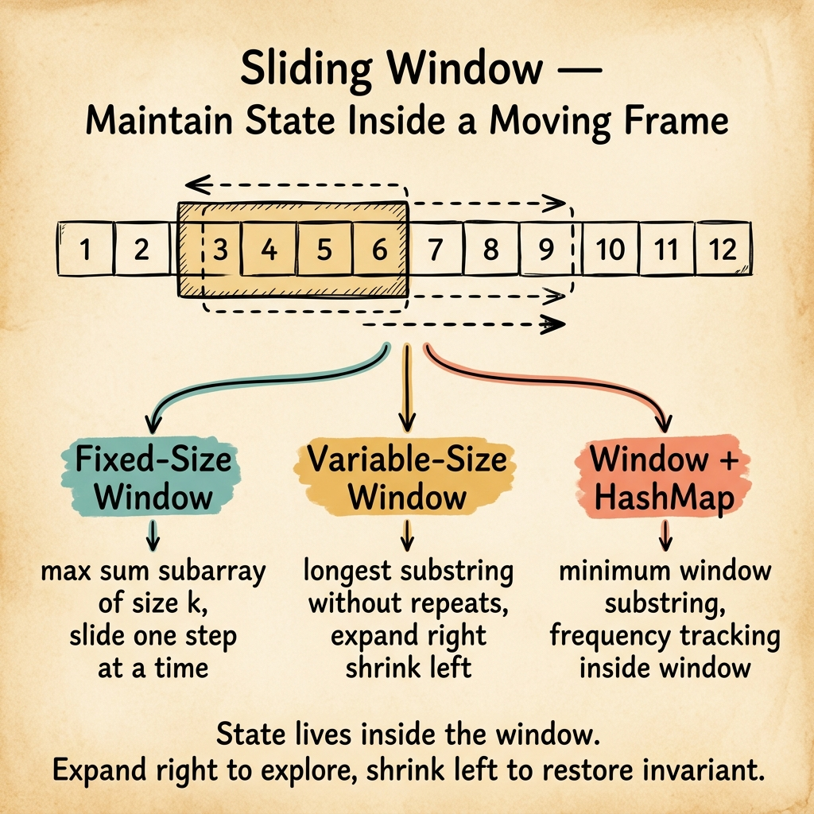

<!-- tags: dsa, algorithms, patterns, sliding-window, overview -->
# Sliding Window Pattern

> Sliding windows fit problems where the answer lives in an expanding and contracting contiguous segment. If you restart from scratch for every new segment, the algorithm stays at O(n²) unnecessarily.

📅 Created: 2026-04-04 · 🔄 Updated: 2026-04-10 · ⏱️ 6 min read

| Aspect | Detail |
| ------ | ------ |
| **Recognition** | substring/subarray contiguous, longest/shortest window, at most/at least k |
| **Core invariant** | the current window always accurately reflects the tracked constraint |
| **Primary article** | [../../string-algorithms/01-sliding-window.md](../../string-algorithms/01-sliding-window.md) |

---

## 1. DEFINE

You just saw a substring or subarray problem and know the answer must be a contiguous segment. This router helps you decide when to maintain a **live expanding window**, instead of compressing history with prefix sums or remembering states with hash maps.

When a prompt emphasizes a substring, a subarray, or a contiguous sequence, sliding windows almost always deserve the first try. Its power comes from never completely forgetting the old segment when the new one just shifts slightly.

This pattern has two main rhythms. The window expands if the constraint remains simple, or it expands and then shrinks when the constraint breaks. The crucial rule is that the window state must update synchronously with every left or right shift.

### Common shapes
| Shape | When to use | Invariant | Link |
| --- | --- | --- | --- |
| Fixed-size window | average/max over a segment of length k | size always equals k | [../../string-algorithms/01-sliding-window.md](../../string-algorithms/01-sliding-window.md) |
| Variable-size window | longest/shortest with a dynamic constraint | window stays valid or is actively shrinking to become valid | [../../string-algorithms/01-sliding-window.md](../../string-algorithms/01-sliding-window.md) |
| Window + map | distinct chars / frequency bound | key-based state synchronizes with left/right boundaries | [../hash-maps-sets/README.md](../hash-maps-sets/README.md) |

## 2. VISUAL

The router card below illustrates the "expand then shrink" rhythm that serves as the heart of variable sliding windows.



The text map below keeps the same control loop accessible for quick scanning.

```text

right expands the window
  |
  +-- update state with the new element
  +-- if constraint still holds -> try updating the answer
  +-- if constraint breaks      -> increment left until the window becomes valid again
```
*Figure: A sliding window does not just move two pointers randomly; it is a disciplined loop keeping the current segment meaningful.*

## 3. CODE

You should read this pattern alongside the string anchor article. Contiguous segments provide the environment where sliding windows shine the brightest.

| Order | Open file | Learning goal | Ask yourself |
| --- | --- | --- | --- |
| 1 | [../../string-algorithms/01-sliding-window.md](../../string-algorithms/01-sliding-window.md) | Anchor for fixed + variable windows | Which state maintains the window constraint? |
| 2 | [../hash-maps-sets/README.md](../hash-maps-sets/README.md) | Map as auxiliary memory for the window | Which state belongs to the window and which to the helper structure? |
| 3 | [../prefix-sums/README.md](../prefix-sums/README.md) | Compare contiguous dynamic with cumulative static | When should you use a window versus a prefix sum? |

## 4. PITFALLS

The slippery part of DSA rarely lies in the algorithm name. It hides in the representation, boundaries, and broken promises you thought you kept.

| Pitfall | Signal | Why it fails | How to fix | Severity |
| ------- | -------- | ---------- | -------- | -------- |
| Using sliding window for non-contiguous targets | Left/right boundaries shift but the logic fails fundamentally | This pattern requires a contiguous segment to survive | Ask if the output truly represents a continuous sequence | high |
| Desynced state updates | Negative frequencies or mismatched counts appear | The window state no longer represents the current segment | Bind every pointer shift to exactly one state update | high |
| Confusing fixed and variable shapes | Trying to shrink the window in a fixed-size problem | The two shapes run on different loop rhythms | Determine upfront whether the size is fixed or variable | medium |
| Confusing window with prefix sum | Forcing a window for offline range queries | Dynamic windows and static prefixes resolve different tensions | Choose based on query type: online dynamic or cumulative difference | medium |

## 5. REF

- Open Data Structures: https://opendatastructures.org/
- CP-Algorithms overview: https://cp-algorithms.com/
- VisuAlgo reference: https://visualgo.net/en

## 6. RECOMMEND

When the segment is no longer contiguous or when sorted order allows eliminating search spaces, sliding windows should yield to other patterns.

- If the array is sorted and you can discard one end per step, go to [../two-pointers/README.md](../two-pointers/README.md).
- If the problem just needs cumulative history without a live segment, see [../prefix-sums/README.md](../prefix-sums/README.md).
- If the window state starts looking more like frequency memory than segment control, review [../hash-maps-sets/README.md](../hash-maps-sets/README.md).

## 7. QUICK REF

- Sliding windows handle contiguous segments.
- State must track every single left or right shift.
- Fixed-size and variable-size represent two distinct control rhythms.