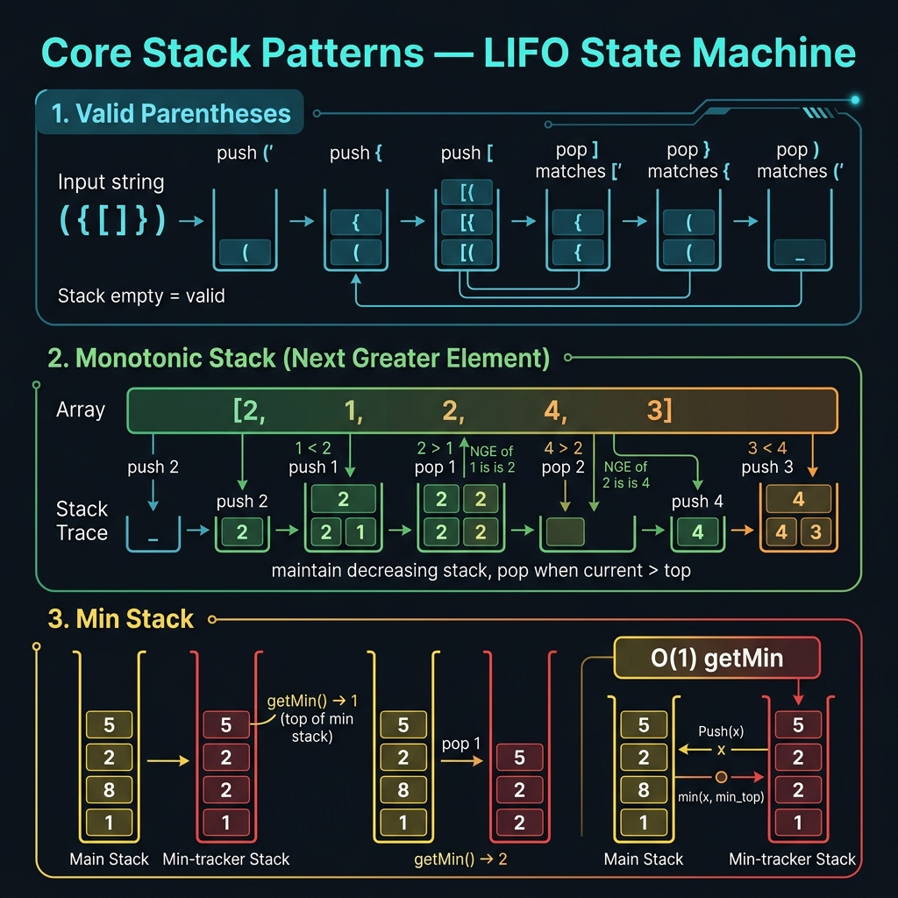

<!-- tags: dsa, algorithms, stack -->
# 📚 Core Stack Patterns

> This is the hub for three stack patterns that repeat endlessly in interviews: matching, augmented stacks, and data structure emulation. If you only learn monotonic stacks and ignore the broader family, you might falsely assume every stack problem involves the next greater element.

📅 Created: 2026-03-31 · 🔄 Updated: 2026-04-02 · ⏱️ 18 min read

| Aspect | Detail |
| ------ | ------ |
| **Complexity** | Usually O(n) time · O(n) stack space |
| **Use case** | Parentheses validation, min stack, queue via stacks, stack-based parsing |
| **Recognition** | Involves "unclosed / unprocessed / return later" parts in LIFO order |

---

## 1. DEFINE

<!-- [Beginner layer] -->
You read the expression `"([{}])"` and want to know if it is valid. The hard part is not counting opening and closing brackets. The challenge is that a closing bracket must exactly match **the most recent unclosed opening bracket**. That is the natural LIFO intuition of a stack.

<!-- [Experienced layer] -->
`Stack patterns` in DSA generally fall into three groups:
- **matching / parsing**: the new element must match the most recently unprocessed element.
- **augmented stack**: the main stack carries extra state, like the current minimum.
- **data structure emulation**: combining two stacks to create a queue or alternate behavior.

Core insight: **a stack fits perfectly when the "thing you must return to process" is always the last thing inserted**.

| Variant | Question answered | Main invariant | Sample problem |
| ------- | --------------- | --------------- | ------- |
| **Delimiter matching** | Are open/close pairs nested correctly? | The stack top is the most recent unclosed opening token | LC 20 |
| **Min stack** | Get the current min in O(1) time | The auxiliary stack stores the minimum at each depth | LC 155 |
| **Queue via stacks** | How to build FIFO from LIFO? | `in` handles pushes, `out` serves pops and peeks | LC 232 |
| **Boundary stack** | What is the nearest unresolved element? | The top represents the nearest boundary needing reprocessing | Monotonic stack family |

| Approach | Time | Space | When to choose |
| -------- | ---- | ----- | -------- |
| Brute force / string replace | O(n²) or unstable | O(1) | Only for toy examples |
| Stack | O(n) | O(n) | Matching / parsing / rollback logic |
| Deque | O(n) | O(n) | Both ends needed instead of just LIFO |

### 1.1 Quick Recognition

- The prompt uses keywords like `valid parentheses`, `undo`, `nested`, or `closest unmatched`.
- You want to get `min/max/current state` in O(1) while still pushing/popping like a stack.
- You want to simulate a queue using stacks or vice versa.

### 1.2 Invariants & Failure Modes

<!-- [Expert layer] -->
- For matching: the stack must store **unclosed contexts**, not just count tokens.
- For min stacks: the auxiliary stack must synchronize exactly with the main stack's lifecycle.
- For queue via stacks: each element transfers from `in` to `out` exactly once, yielding amortized O(1).

---

## 2. VISUAL

DSA only truly clicks when you see state moving across specific inputs. The trace below turns definitions into verifiable update sequences and recognition signals.



### Level 1 — Simple
This trace answers: **why is valid parentheses a LIFO problem?**

```text
s = "([])"

read '(' -> push '('
stack = ['(']

read '[' -> push '['
stack = ['(', '[']

read ']' -> top must be '[' -> pop
stack = ['(']

read ')' -> top must be '(' -> pop
stack = []
```
*Figure: The current closing token must always match the most recent unclosed opening token, not just any previous opening token.*

### Level 2 — Detailed
This trace answers: **how does a queue via two stacks remain amortized O(1)?**

```text
push 1,2,3 into in-stack
in  = [1,2,3]   (top = 3)
out = []

pop():
out is empty -> move everything from in to out
in  = []
out = [3,2,1]   (top = 1)

pop() -> gets 1
pop() -> gets 2

Every element:
  is pushed to 'in' exactly once
  is moved to 'out' exactly once
  is popped from 'out' exactly once
=> amortized O(1)
```
*Figure: A two-stack queue is not free lunch. It concentrates the reversal cost exactly when `out` depletes, keeping the average operation cost at O(1).*

---

## 3. CODE

Once a trace locks the invariant, code simply expresses that reasoning without adding magic layers. We move from the cleanest baseline to stronger variants only when necessary.

### Problem 1: Valid Parentheses [LC #20]
> *(The most basic stack form: checking which tokens need closing later.)*
>
> **Goal**: Validate if a bracket string is correct — O(n) time, O(n) space
> **Approach**: Push opening tokens; on a closing token, the top must match
> **Example**: `"([])"` → `true`, `"([)]"` → `false`

```go
// stack_core.go — Stack: Valid Parentheses
func IsValidParentheses(s string) bool {
    pairs := map[rune]rune{
        ')': '(',
        ']': '[',
        '}': '{',
    }

    stack := make([]rune, 0, len(s))
    for _, ch := range s {
        switch ch {
        case '(', '[', '{':
            stack = append(stack, ch)
        default:
            if len(stack) == 0 || stack[len(stack)-1] != pairs[ch] {
                return false
            }
            stack = stack[:len(stack)-1]
        }
    }

    return len(stack) == 0
}
```
```typescript
// stack_core.ts — Stack: Valid Parentheses
function isValidParentheses(s: string): boolean {
    const pairs = new Map<string, string>([
        [")", "("],
        ["]", "["],
        ["}", "{"],
    ]);
    const stack: string[] = [];

    for (const ch of s) {
        if (ch === "(" || ch === "[" || ch === "{") {
            stack.push(ch);
            continue;
        }
        if (!stack.length || stack.pop() !== pairs.get(ch)) {
            return false;
        }
    }

    return stack.length === 0;
}
```
```java
// StackCoreBasic.java — Stack: Valid Parentheses
import java.util.ArrayDeque;
import java.util.Deque;

final class StackCoreBasic {
    private StackCoreBasic() {}

    static boolean isValidParentheses(String s) {
        Deque<Character> stack = new ArrayDeque<>();

        for (char ch : s.toCharArray()) {
            if (ch == '(' || ch == '[' || ch == '{') {
                stack.push(ch);
                continue;
            }
            if (stack.isEmpty()) {
                return false;
            }
            char top = stack.pop();
            if ((ch == ')' && top != '(') ||
                (ch == ']' && top != '[') ||
                (ch == '}' && top != '{')) {
                return false;
            }
        }

        return stack.isEmpty();
    }
}
```
```rust
// stack_core.rs — Stack: Valid Parentheses
fn is_valid_parentheses(s: &str) -> bool {
    let mut stack = Vec::new();

    for ch in s.chars() {
        match ch {
            '(' | '[' | '{' => stack.push(ch),
            ')' => if stack.pop() != Some('(') { return false; },
            ']' => if stack.pop() != Some('[') { return false; },
            '}' => if stack.pop() != Some('{') { return false; },
            _ => {}
        }
    }

    stack.is_empty()
}
```
```cpp
// stack_core.cpp — Stack: Valid Parentheses
bool isValidParentheses(const std::string& s) {
    std::vector<char> stack;

    for (char ch : s) {
        if (ch == '(' || ch == '[' || ch == '{') {
            stack.push_back(ch);
            continue;
        }
        if (stack.empty()) {
            return false;
        }
        char top = stack.back();
        stack.pop_back();
        if ((ch == ')' && top != '(') ||
            (ch == ']' && top != '[') ||
            (ch == '}' && top != '{')) {
            return false;
        }
    }

    return stack.empty();
}
```
```python
# stack_core.py — Stack: Valid Parentheses
def is_valid_parentheses(s: str) -> bool:
    pairs = {")": "(", "]": "[", "}": "{"}
    stack: list[str] = []

    for ch in s:
        if ch in "([{":
            stack.append(ch)
            continue
        if not stack or stack.pop() != pairs[ch]:
            return False

    return not stack
```

> **Why?** You cannot solve this correctly just by counting opening and closing brackets. You must remember the **most recent unclosed opening bracket** to check nesting order, which is purely LIFO semantics. The string `([)]` has balanced counts but the wrong closing order.

> **Conclusion**: The basic stack case says "whatever opens last must close first". If a problem lacks these LIFO semantics, a stack might not be the correct structure.

---

### Problem 2: Min Stack [LC #155]
> *(From here, the stack does not just store data; it carries parallel state.)*
>
> **Goal**: Support `push`, `pop`, `top`, and `getMin` all in O(1) time
> **Approach**: Main stack holds data, auxiliary stack holds the minimum at each depth
> **Example**: `push 3, push 1, push 2, getMin() -> 1`

```go
// min_stack.go — Stack: Min Stack with auxiliary mins stack
type MinStack struct {
    data []int
    mins []int
}

func (s *MinStack) Push(value int) {
    s.data = append(s.data, value)
    if len(s.mins) == 0 || value <= s.mins[len(s.mins)-1] {
        s.mins = append(s.mins, value)
    }
}

func (s *MinStack) Pop() {
    top := s.data[len(s.data)-1]
    s.data = s.data[:len(s.data)-1]
    if top == s.mins[len(s.mins)-1] {
        s.mins = s.mins[:len(s.mins)-1]
    }
}

func (s *MinStack) Top() int {
    return s.data[len(s.data)-1]
}

func (s *MinStack) GetMin() int {
    return s.mins[len(s.mins)-1]
}
```
```typescript
// min_stack.ts — Stack: Min Stack with auxiliary mins stack
class MinStack {
    private data: number[] = [];
    private mins: number[] = [];

    push(value: number): void {
        this.data.push(value);
        if (!this.mins.length || value <= this.mins[this.mins.length - 1]) {
            this.mins.push(value);
        }
    }

    pop(): void {
        const top = this.data.pop()!;
        if (top === this.mins[this.mins.length - 1]) {
            this.mins.pop();
        }
    }

    top(): number {
        return this.data[this.data.length - 1];
    }

    getMin(): number {
        return this.mins[this.mins.length - 1];
    }
}
```
```java
// StackCoreIntermediate.java — Stack: Min Stack with auxiliary mins stack
final class StackCoreIntermediate {
    private StackCoreIntermediate() {}

    static final class MinStack {
        private final Deque<Integer> data = new ArrayDeque<>();
        private final Deque<Integer> mins = new ArrayDeque<>();

        void push(int value) {
            data.push(value);
            if (mins.isEmpty() || value <= mins.peek()) {
                mins.push(value);
            }
        }

        void pop() {
            int top = data.pop();
            if (top == mins.peek()) {
                mins.pop();
            }
        }

        int top() {
            return data.peek();
        }

        int getMin() {
            return mins.peek();
        }
    }
}
```
```rust
// min_stack.rs — Stack: Min Stack with auxiliary mins stack
struct MinStack {
    data: Vec<i32>,
    mins: Vec<i32>,
}

impl MinStack {
    fn new() -> Self {
        Self { data: vec![], mins: vec![] }
    }

    fn push(&mut self, value: i32) {
        self.data.push(value);
        if self.mins.last().map_or(true, |&m| value <= m) {
            self.mins.push(value);
        }
    }

    fn pop(&mut self) {
        let top = self.data.pop().unwrap();
        if self.mins.last() == Some(&top) {
            self.mins.pop();
        }
    }

    fn top(&self) -> i32 {
        *self.data.last().unwrap()
    }

    fn get_min(&self) -> i32 {
        *self.mins.last().unwrap()
    }
}
```
```cpp
// min_stack.cpp — Stack: Min Stack with auxiliary mins stack
class MinStack {
    std::vector<int> data;
    std::vector<int> mins;

public:
    void push(int value) {
        data.push_back(value);
        if (mins.empty() || value <= mins.back()) {
            mins.push_back(value);
        }
    }

    void pop() {
        int top = data.back();
        data.pop_back();
        if (top == mins.back()) {
            mins.pop_back();
        }
    }

    int top() const { return data.back(); }
    int getMin() const { return mins.back(); }
};
```
```python
# min_stack.py — Stack: Min Stack with auxiliary mins stack
class MinStack:
    def __init__(self) -> None:
        self.data: list[int] = []
        self.mins: list[int] = []

    def push(self, value: int) -> None:
        self.data.append(value)
        if not self.mins or value <= self.mins[-1]:
            self.mins.append(value)

    def pop(self) -> None:
        top = self.data.pop()
        if top == self.mins[-1]:
            self.mins.pop()

    def top(self) -> int:
        return self.data[-1]

    def get_min(self) -> int:
        return self.mins[-1]
```

> **Why?** An O(1) `getMin()` operation is not magic. It comes from saving the minimum corresponding to each exact stack depth. When popping the current element, if it is also the current minimum, we must rollback the min state to stay synchronized with the data state.

> **Conclusion**: Intermediate because this "augment data structure with auxiliary state" pattern is widespread and extends beyond simple stacks.

---

### Problem 3: Implement Queue using Stacks [LC #232]
> *(This checks if you truly understand amortized cost.)*
>
> **Goal**: Support queue operations using two stacks with amortized O(1) for `push`, `pop`, and `peek`
> **Approach**: `in` handles pushes; when `out` empties, move everything from `in` to `out`
> **Example**: `push 1,2,3`, then `pop()` returns `1`

```go
// queue_via_stacks.go — Stack: Queue implemented with two stacks
type MyQueue struct {
    in  []int
    out []int
}

func (q *MyQueue) Push(x int) {
    q.in = append(q.in, x)
}

func (q *MyQueue) move() {
    if len(q.out) == 0 {
        for len(q.in) > 0 {
            top := q.in[len(q.in)-1]
            q.in = q.in[:len(q.in)-1]
            q.out = append(q.out, top)
        }
    }
}

func (q *MyQueue) Pop() int {
    q.move()
    top := q.out[len(q.out)-1]
    q.out = q.out[:len(q.out)-1]
    return top
}

func (q *MyQueue) Peek() int {
    q.move()
    return q.out[len(q.out)-1]
}
```
```typescript
// queue_via_stacks.ts — Stack: Queue implemented with two stacks
class MyQueue {
    private input: number[] = [];
    private output: number[] = [];

    push(x: number): void {
        this.input.push(x);
    }

    private move(): void {
        if (this.output.length === 0) {
            while (this.input.length) {
                this.output.push(this.input.pop()!);
            }
        }
    }

    pop(): number {
        this.move();
        return this.output.pop()!;
    }

    peek(): number {
        this.move();
        return this.output[this.output.length - 1];
    }
}
```
```java
// StackCoreAdvanced.java — Stack: Queue implemented with two stacks
final class StackCoreAdvanced {
    private StackCoreAdvanced() {}

    static final class MyQueue {
        private final Deque<Integer> input = new ArrayDeque<>();
        private final Deque<Integer> output = new ArrayDeque<>();

        void push(int x) {
            input.push(x);
        }

        private void move() {
            if (output.isEmpty()) {
                while (!input.isEmpty()) {
                    output.push(input.pop());
                }
            }
        }

        int pop() {
            move();
            return output.pop();
        }

        int peek() {
            move();
            return output.peek();
        }
    }
}
```
```rust
// queue_via_stacks.rs — Stack: Queue implemented with two stacks
struct MyQueue {
    input: Vec<i32>,
    output: Vec<i32>,
}

impl MyQueue {
    fn new() -> Self {
        Self { input: vec![], output: vec![] }
    }

    fn push(&mut self, x: i32) {
        self.input.push(x);
    }

    fn move_items(&mut self) {
        if self.output.is_empty() {
            while let Some(value) = self.input.pop() {
                self.output.push(value);
            }
        }
    }

    fn pop(&mut self) -> i32 {
        self.move_items();
        self.output.pop().unwrap()
    }

    fn peek(&mut self) -> i32 {
        self.move_items();
        *self.output.last().unwrap()
    }
}
```
```cpp
// queue_via_stacks.cpp — Stack: Queue implemented with two stacks
class MyQueue {
    std::vector<int> input;
    std::vector<int> output;

    void move() {
        if (output.empty()) {
            while (!input.empty()) {
                output.push_back(input.back());
                input.pop_back();
            }
        }
    }

public:
    void push(int x) { input.push_back(x); }
    int pop() { move(); int top = output.back(); output.pop_back(); return top; }
    int peek() { move(); return output.back(); }
};
```
```python
# queue_via_stacks.py — Stack: Queue implemented with two stacks
class MyQueue:
    def __init__(self) -> None:
        self.input: list[int] = []
        self.output: list[int] = []

    def push(self, x: int) -> None:
        self.input.append(x)

    def _move(self) -> None:
        if not self.output:
            while self.input:
                self.output.append(self.input.pop())

    def pop(self) -> int:
        self._move()
        return self.output.pop()

    def peek(self) -> int:
        self._move()
        return self.output[-1]
```

> **Why?** Each element gets reversed exactly once when traveling from `input` to `output`. Therefore, even though some `pop()` operations are expensive when transferring the batch, the average cost per element remains amortized O(1).

> **Conclusion**: Advanced because it evaluates your grasp of amortized analysis, not just raw implementation skills.

---

### Problem 4: Largest Rectangle in Histogram [LC #84]
> *(This expert problem bridges `core stack patterns` into the `monotonic stack` branch, proving this family handles profound boundary reasoning.)*
>
> **Goal**: Find the largest area in a histogram — O(n) time, O(n) space
> **Approach**: Maintain an increasing stack of indices; popping determines the left and right boundaries for each column
> **Example**: `[2,1,5,6,2,3]` → `10`

```go
// histogram_stack.go — Stack: Histogram area via increasing stack
func LargestRectangleArea(heights []int) int {
    stack := []int{}
    best := 0

    for i := 0; i <= len(heights); i++ {
        current := 0
        if i < len(heights) {
            current = heights[i]
        }

        for len(stack) > 0 && heights[stack[len(stack)-1]] > current {
            top := stack[len(stack)-1]
            stack = stack[:len(stack)-1]
            width := i
            if len(stack) > 0 {
                width = i - stack[len(stack)-1] - 1
            }
            area := heights[top] * width
            if area > best {
                best = area
            }
        }

        stack = append(stack, i)
    }

    return best
}
```
```typescript
// histogram_stack.ts — Stack: Histogram area via increasing stack
function largestRectangleArea(heights: number[]): number {
    const stack: number[] = [];
    let best = 0;

    for (let i = 0; i <= heights.length; i++) {
        const current = i < heights.length ? heights[i] : 0;
        while (stack.length && heights[stack[stack.length - 1]] > current) {
            const top = stack.pop()!;
            const width = stack.length ? i - stack[stack.length - 1] - 1 : i;
            best = Math.max(best, heights[top] * width);
        }
        stack.push(i);
    }

    return best;
}
```
```java
// StackCoreExpert.java — Stack: Histogram area via increasing stack
final class StackCoreExpert {
    private StackCoreExpert() {}

    static int largestRectangleArea(int[] heights) {
        Deque<Integer> stack = new ArrayDeque<>();
        int best = 0;

        for (int i = 0; i <= heights.length; i++) {
            int current = i < heights.length ? heights[i] : 0;
            while (!stack.isEmpty() && heights[stack.peek()] > current) {
                int top = stack.pop();
                int width = stack.isEmpty() ? i : i - stack.peek() - 1;
                best = Math.max(best, heights[top] * width);
            }
            stack.push(i);
        }

        return best;
    }
}
```
```rust
// histogram_stack.rs — Stack: Histogram area via increasing stack
fn largest_rectangle_area(heights: &[i32]) -> i32 {
    let mut stack: Vec<usize> = Vec::new();
    let mut best = 0;

    for i in 0..=heights.len() {
        let current = if i < heights.len() { heights[i] } else { 0 };
        while stack.last().is_some_and(|&idx| heights[idx] > current) {
            let top = stack.pop().unwrap();
            let width = if let Some(&left) = stack.last() {
                i - left - 1
            } else {
                i
            };
            best = best.max(heights[top] * width as i32);
        }
        stack.push(i);
    }

    best
}
```
```cpp
// histogram_stack.cpp — Stack: Histogram area via increasing stack
int largestRectangleArea(const std::vector<int>& heights) {
    std::vector<int> stack;
    int best = 0;

    for (int i = 0; i <= static_cast<int>(heights.size()); ++i) {
        int current = i < static_cast<int>(heights.size()) ? heights[i] : 0;
        while (!stack.empty() && heights[stack.back()] > current) {
            int top = stack.back();
            stack.pop_back();
            int width = stack.empty() ? i : i - stack.back() - 1;
            best = std::max(best, heights[top] * width);
        }
        stack.push_back(i);
    }

    return best;
}
```
```python
# histogram_stack.py — Stack: Histogram area via increasing stack
def largest_rectangle_area(heights: list[int]) -> int:
    stack: list[int] = []
    best = 0

    for i in range(len(heights) + 1):
        current = heights[i] if i < len(heights) else 0
        while stack and heights[stack[-1]] > current:
            top = stack.pop()
            width = i if not stack else i - stack[-1] - 1
            best = max(best, heights[top] * width)
        stack.append(i)

    return best
```

> **Why?** The popped column is the first one where we fully know the left and right boundaries where it remains the lowest column of the rectangle. That makes this stack pattern vastly more powerful than a simple `push/pop` loop.

> **Conclusion**: Included here to remind you that the stack family extends far beyond parsing. It can encode complex boundaries and geometries if the invariant is strong enough.

---

## 4. PITFALLS

The slippery part of DSA rarely lies in the algorithm name. It hides in the representation, boundaries, and broken promises you thought you kept.

| # | Severity | Defect | Consequence | Fix |
|---|----------|-----|---------|-----|
| 1 | 🔴 Fatal | Counting opening/closing brackets instead of saving order | Strings like `"([)]"` get falsely validated | Matching problems require LIFO semantics, not just basic counters |
| 2 | 🟡 Common | Forgetting to sync the auxiliary stack on pops | `getMin()` returns incorrect values after a few operations | Pop from the auxiliary stack only when the min element is removed |
| 3 | 🟡 Common | Dumping elements on every pop even if `out` is not empty | Real-world complexity becomes far worse than necessary | Move elements only when `out` is completely empty |
| 4 | 🟡 Common | Using a stack when a deque is actually required | Sliding window max/min logic fails or is messy | Check if the problem requires dropping old elements from the front |
| 5 | 🔵 Minor | Treating stack knowledge as disconnected snippets | You fail to map variants back to the pattern | Ask yourself: what pending element does this stack track for later? |

---

## 5. REF

| Resource | Type | Link | Notes |
| -------- | ---- | ---- | ------- |
| LeetCode 20 | Problem | https://leetcode.com/problems/valid-parentheses/ | Matching |
| LeetCode 155 | Problem | https://leetcode.com/problems/min-stack/ | Augmented stack |
| LeetCode 232 | Problem | https://leetcode.com/problems/implement-queue-using-stacks/ | Emulation |
| LeetCode 84 | Problem | https://leetcode.com/problems/largest-rectangle-in-histogram/ | Boundary reasoning |

---

## 6. RECOMMEND

When a pattern stands firm, the next step is knowing how it connects to adjacent problem families and when to swap primitives.

| Bridge | When to use | Reason | Link |
| ------- | ------- | ----- | --------- |
| Monotonic Stack | Dealing with next greater, histograms, or water trapping | Core stack patterns open the door; monotonic stack is the advanced track | [../04-monotonic-stack.md](../04-monotonic-stack.md) |
| Prefix Sum | Needing cumulative states instead of unresolved states | Clarifies when to stack versus when to precompute values | [../05-prefix-sum.md](../05-prefix-sum.md) |
| Queue / Deque | Needing operations at both ends instead of just LIFO | Prevents forcing stacks onto deque problems | [../../string-algorithms/02-sliding-window.md](../../string-algorithms/02-sliding-window.md) |

---

## 7. QUICK REF

| Prompt signal | Sub-pattern | Short template |
| --------------- | ----------- | ------------- |
| `nested / matching / valid brackets` | delimiter matching | opening push, closing must match top |
| `getMin in O(1)` | augmented stack | main stack + mins stack |
| `queue with stacks` | data structure emulation | `in` for push, `out` for pop |
| `boundary / unresolved nearest` | monotonic / index stack | stack stores indices |

---

**Links**: [↑ Patterns README](../README.md) · [→ Monotonic Stack](../04-monotonic-stack.md)