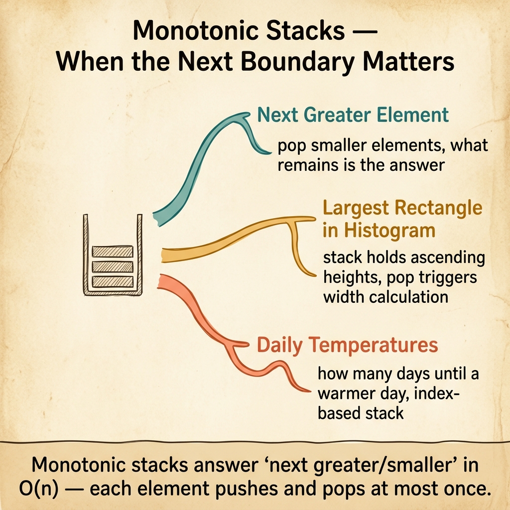

<!-- tags: dsa, algorithms, patterns, stacks, overview -->
# Stacks Pattern

> The stack pattern appears when a problem demands retaining "unclosed" elements in chronological or priority order. If you discard that order, you will rescan the past at great cost.

📅 Created: 2026-04-04 · 🔄 Updated: 2026-04-10 · ⏱️ 6 min read

| Aspect | Detail |
| ------ | ------ |
| **Recognition** | matching pairs, next greater element, monotonic history, nested structure |
| **Core invariant** | the stack holds the exact set of pending elements in correct order |
| **Primary article** | [01-core-stack-patterns.md](./01-core-stack-patterns.md) |

---

## 1. DEFINE

You just encountered a bracket parsing, next greater element, or unclosed history problem and instantly thought of `push/pop`. This router focuses you on the core question: **what part of the unfinished history does the stack top represent?**

A stack is not just a textbook LIFO structure. In DSA patterns, it records unfinished history: unclosed brackets, elements waiting for a next greater value, or a sequence maintaining monotonicity for future answers.

Order separates the stack pattern from hashing or prefix sums. Not all past elements hold equal value. The element at the top of the stack is always the one prioritized for processing next.

### Common lanes
| Lane | When to use | Invariant | Link |
| --- | --- | --- | --- |
| Matching / nesting | brackets, expressions, nested structures | stack top is the most recent unclosed opening element | [01-core-stack-patterns.md](./01-core-stack-patterns.md) |
| Monotonic stack | next greater/smaller, histograms, temperatures | stack maintains a monotonically increasing or decreasing sequence | [../../patterns/04-monotonic-stack.md](../../patterns/04-monotonic-stack.md) |
| Undo / path history | state traversal or deep parsing | stack top represents the nearest rollback step | [../../important-algorithms/05-backtracking.md](../../important-algorithms/05-backtracking.md) |

## 2. VISUAL

The router card below frames the stack as a prioritized memory store, not just a `push/pop` API.



The text diagram below keeps the same intuition in a highly compact markdown format.

```text

Event stream / elements flowing through
  |
  +-- new item arrives
  +-- if it resolves the top -> pop until the invariant stabilizes
  +-- if it does not resolve -> push the current item
  +-- top always remains the nearest or strongest pending item
```
*Figure: The stack pattern acts as ordered memory, where the top element is the next contradiction requiring resolution.*

## 3. CODE

Read the anchor article first to lock the "unclosed history" intuition. Then bridge into monotonic stacks or backtracking as needed.

| Order | Open file | Learning goal | Bridge |
| --- | --- | --- | --- |
| 1 | [01-core-stack-patterns.md](./01-core-stack-patterns.md) | Anchor for push/pop invariant | When should an element leave the stack? |
| 2 | [../../patterns/04-monotonic-stack.md](../../patterns/04-monotonic-stack.md) | Stack as a history filter enforcing monotonic order | Why do successive pops remain amortized O(n)? |
| 3 | [../../important-algorithms/05-backtracking.md](../../important-algorithms/05-backtracking.md) | Call stack/history in a search tree | When do explicit stacks and recursion stacks share meaning? |

## 4. PITFALLS

The slippery part of DSA rarely lies in the algorithm name. It hides in the representation, boundaries, and broken promises you thought you kept.

| Pitfall | Signal | Why it fails | How to fix | Severity |
| ------- | -------- | ---------- | -------- | -------- |
| Using stacks without knowing what top represents | Pushing and popping randomly based on feelings | The stack top carries no clear semantics | Write one sentence: what is the top element waiting for? | high |
| Confusing stacks with queues | Processing order is wrong for parsing or traversal | LIFO and FIFO produce completely different behaviors | Check if the problem demands recent history or time layers | high |
| Fearing multiple pops | Avoiding monotonic stacks fearing O(n²) time | Every element enters and leaves the stack a finite number of times | Understand the amortized analysis of push/pop loops | medium |
| Disconnecting stacks from nested structures | Still brute-forcing bracket problems | Stacks exist to handle nested open/close logic | Practice viewing parsing problems as matching history | medium |

## 5. REF

- Open Data Structures: https://opendatastructures.org/
- CP-Algorithms overview: https://cp-algorithms.com/
- VisuAlgo reference: https://visualgo.net/en

## 6. RECOMMEND

When history requires more than order, such as aggregations or key lookups, a stack will no longer suffice.

- If the past requires a cumulative aggregate, see [../prefix-sums/README.md](../prefix-sums/README.md).
- If the problem prioritizes remembering by key or frequency over order, head to [../hash-maps-sets/README.md](../hash-maps-sets/README.md).
- If the nested structure lives on a complex tree or expression, bridge to [../../tree-algorithms/README.md](../../tree-algorithms/README.md).

## 7. QUICK REF

- Stacks preserve unclosed history using LIFO logic.
- The top of the stack must carry a clear, specific meaning.
- A monotonic stack is the base pattern plus an order invariant.