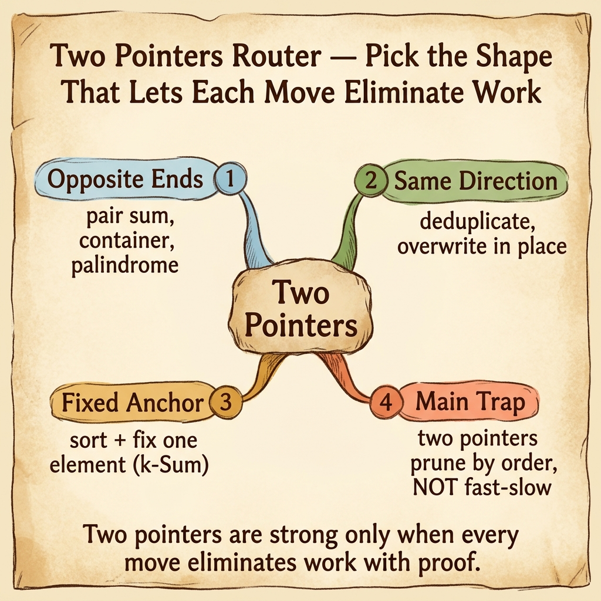

<!-- tags: dsa, algorithms, patterns, two-pointers, overview -->
# Two Pointers Pattern

> Two pointers are only powerful when each pointer shift eliminates a search space or preserves a correct prefix/suffix. Without that promise, you are simply running two index variables in parallel.

📅 Created: 2026-04-04 · 🔄 Updated: 2026-04-10 · ⏱️ 6 min read

| Aspect | Detail |
| ------ | ------ |
| **Recognition** | sorted order, pair/triplet, palindrome, in-place compaction |
| **Core invariant** | every step discards useless regions or maintains normalized zones |
| **Primary article** | [../01-two-pointers.md](../01-two-pointers.md) |

---

## 1. DEFINE

You just found a problem with two indices scanning an array and want to label it "two pointers". This router blocks that exact ambiguity. Opposite ends, same-direction compaction, and fixed-anchors all share the family, but each shape holds a different invariant.

When arrays feature order, or when the ends carry distinct meaning, two pointers replace O(n²) brute force with an O(n) sweep. The critical insight is proving that moving a pointer never drops a valid solution.

This pattern has three familiar shapes: opposite ends on sorted inputs, same-direction for in-place compaction, and anchor plus pointers for expansions like 3Sum. Using the right shape exposes the invariant. Using the wrong shape leaves code running without proof.

### Two pointers lanes
| Shape | When to use | Invariant | Bridge to |
| --- | --- | --- | --- |
| Opposite ends | sorted pair / maximize area | sum or metric changes monotonically from both ends | [../01-two-pointers.md](../01-two-pointers.md) |
| Same direction | deduplicate / overwrite in place | prefix `0..slow` is always correct | [../../sorting/03-insertion-sort.md](../../sorting/03-insertion-sort.md) |
| Fixed anchor + 2 pointers | 3Sum / triangle count | anchor is fixed, the remaining suffix resolves via opposite ends | [../../math-geometry/05-triangle-numbers.md](../../math-geometry/05-triangle-numbers.md) |

## 2. VISUAL

The router card below helps separate the three two-pointer shapes before you commit to a code skeleton.



The text diagram below keeps the same decision tree for quick scanning.

```text

Sequential structure
  |
  +-- sorted + target or metric? -> left .. right
  |
  +-- need to compress or overwrite in place? -> slow .. fast
  |
  +-- k-sum or counting with anchor? -> i fixed, then left .. right on suffix
```
*Figure: Two pointers is not a single template. It is a family of invariants based on relative pointer positions.*

## 3. CODE

Start from the anchor problem and compare adjacent siblings to see the pattern change shape while keeping its spirit.

| Order | Open file | Learning goal | Question to lock |
| --- | --- | --- | --- |
| 1 | [../01-two-pointers.md](../01-two-pointers.md) | Full anchor for the pattern | Why is every pointer shift completely safe? |
| 2 | [../../searching/02-binary-search.md](../../searching/02-binary-search.md) | Compare with binary search on sorted data | When does sorted order lead to search versus pointers? |
| 3 | [../../math-geometry/05-triangle-numbers.md](../../math-geometry/05-triangle-numbers.md) | Counting via sorted + two pointers | How does this pattern count valid regions effectively? |

## 4. PITFALLS

The slippery part of DSA rarely lies in the algorithm name. It hides in the representation, boundaries, and broken promises you thought you kept.

| Pitfall | Signal | Why it fails | How to fix | Severity |
| ------- | -------- | ---------- | -------- | -------- |
| Applying pointers without monotonicity | Shifting left/right without explaining safety | The discarded space might still contain valid answers | Prove order or monotonic constraints before writing code | high |
| Confusing opposite ends with fast/slow | Treating all two-pointer logic as identical | The two patterns use vastly different positional relationships | Separate sorted array problems from cycle/offset problems | medium |
| Forgetting duplicate handling during counts | 3Sum or triangle counts yield duplicated or missing results | Anchor and suffix need explicit skip rules | Write explicit duplicate handling rules for every shape | medium |
| Reducing the pattern to index tricks | Code runs but the invariant remains unreadable | No bridge exists from DEFINE to CODE | Always state the invariant in one sentence before implementing | high |

## 5. REF

- Open Data Structures: https://opendatastructures.org/
- CP-Algorithms overview: https://cp-algorithms.com/
- VisuAlgo reference: https://visualgo.net/en

## 6. RECOMMEND

When two pointers fail because the problem demands more history, it is time to switch families.

- If the exact distance between two pointers drives the logic, switch to [../fast-slow/README.md](../fast-slow/README.md).
- If the problem demands a dynamically stretching contiguous segment, see [../sliding-window/README.md](../sliding-window/README.md).
- If sorted order is meant for boundary hunting instead of pair elimination, bridge to [../binary-search/README.md](../binary-search/README.md).

## 7. QUICK REF

- Two pointers succeed by eliminating space, not merely by holding two variables.
- Sorted order provides a strong signal but does not guarantee success alone.
- Three common shapes exist: opposite ends, slow-fast same direction, and fixed anchor.