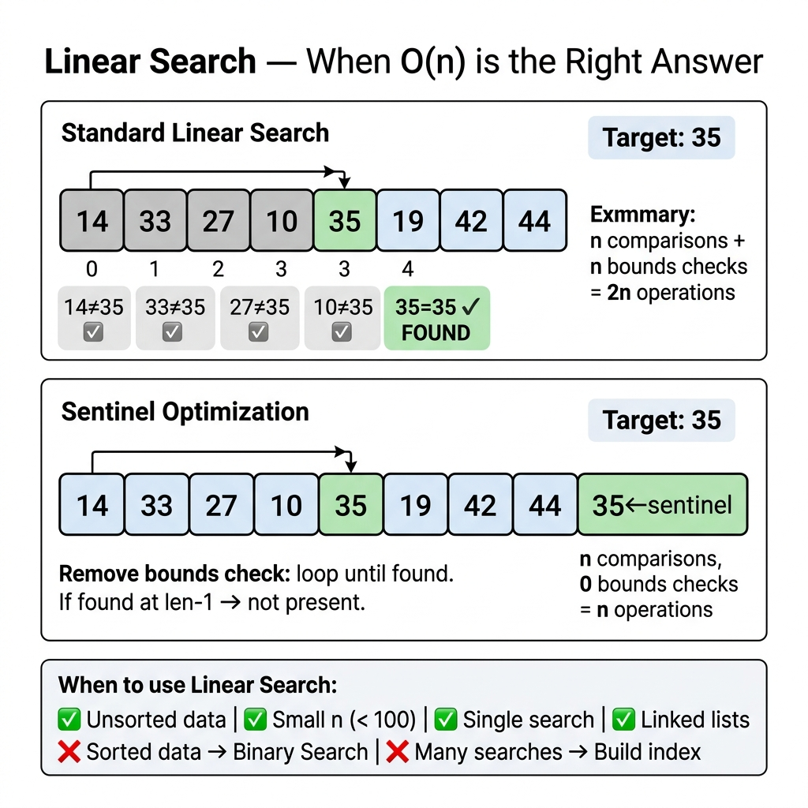

<!-- tags: dsa, algorithms, searching -->
# 📃 Linear Search

> This represents the simplest search algorithm. It shows when a slow but correct method remains the right choice. Linear search provides the best baseline for unsorted data or small inputs.

📅 Created: 2026-03-20 · 🔄 Updated: 2026-04-10 · ⏱️ 14 min read

| Aspect | Detail |
| ------ | ------ |
| **Complexity** | O(n) time · O(1) space |
| **Use case** | Unsorted data, small n, single scan |
| **Recognition** | No structure to exploit beyond sequential scanning |

---

## 1. DEFINE

<!-- [Beginner layer] -->

<!-- [Beginner layer] -->
You have an unsorted array and need to find `7`. Smarter variants like binary search demand additional structure that this problem lacks. Scanning from start to finish is the only safe approach here.

<!-- [Experienced layer] -->
`Linear Search` sequentially scans elements until it finds the target or exhausts the data. It requires no sorting or random access. It runs perfectly on structures that only support sequential reads.

Core insight: **sequential scanning forms the practical lower bound when you lack order, indexes, or hashes**.

| Variant | When to use | Core Idea | Example |
| ------- | -------- | ------- | ------- |
| **Basic scan** | Unsorted array, one-off lookup | Scan each element | Intro search |
| **Sentinel search** | Reduce loop condition checks | Place sentinel at the end | Low-level optimization |
| **Find all matches** | Need all valid positions | Do not stop after first match | Filtering / search-all |

| Approach | Time | Space | When to pick |
| -------- | ---- | ----- | -------- |
| Linear search | O(n) | O(1) | Unsorted or very small data |
| Binary search | O(log n) | O(1) | Sorted data with random access |
| Hash lookup | O(1) average | O(n) | Accept extra memory for speed |

### 1.1 Quick Recognition

- Unsorted data
- Only sequential access available
- Single query makes building an index wasteful

### 1.2 Invariants & Failure Modes

<!-- [Expert layer] -->
- Reaching index `i` guarantees all positions `< i` lack the target.
- Linear search feels more natural than binary search on linked lists because random access is expensive.
- Premature optimization through sorting often creates a higher cost than a simple scan.

---

## 2. VISUAL

This image answers the core question: **when does O(n) represent the correct answer for your data model instead of a failure?**



These static traces turn the scanning intuition into a clean invariant. They prevent you from optimizing too early in the wrong place.


### Level 1 — Simple
This trace answers: **what does linear search eliminate at each step?**

```text
nums = [4, 2, 7, 1, 9, 3], target = 7

i=0 -> nums[0]=4 != 7  => discard index 0
i=1 -> nums[1]=2 != 7  => discard index 1
i=2 -> nums[2]=7 == 7  => found
```
*Figure: The region guaranteed to exclude the target grows by one element from left to right after each check.*

### Level 2 — Detailed
This trace answers: **where does sentinel search save a comparison?**

```text
normal loop:
  while i < n and arr[i] != target
  => 2 conditions per iteration

sentinel loop:
  arr[n-1] = target
  while arr[i] != target
  => only 1 condition per iteration

finally:
  if i == n-1, distinguish real target from fake sentinel
```
*Figure: Sentinel search changes the loop structure to reduce inner branches without changing big-O complexity.*

## 3. CODE

The trace shows the flow. We implement the clean baseline before moving to the memorable variant.


### Problem 1: Basic Linear Search
> *(The most basic form. This acts as the correct baseline when data lacks structure.)*
>
> **Goal**: Return the first index of `target` or `-1`
> **Approach**: Scan sequentially from left to right
> **Example**: `[4,2,7,1], target=7` → `2`

```go
// linear_search.go — Searching: Basic linear scan
func LinearSearch(nums []int, target int) int {
    for i, num := range nums {
        if num == target {
            return i
        }
    }
    return -1
}
```
```typescript
// linear_search.ts — Searching: Basic linear scan
function linearSearch(nums: number[], target: number): number {
    for (let i = 0; i < nums.length; i++) {
        if (nums[i] === target) {
            return i;
        }
    }
    return -1;
}
```
```java
// LinearSearchBasic.java — Searching: Basic linear scan
final class LinearSearchBasic {
    private LinearSearchBasic() {}

    static int linearSearch(int[] nums, int target) {
        for (int i = 0; i < nums.length; i++) {
            if (nums[i] == target) {
                return i;
            }
        }
        return -1;
    }
}
```
```rust
// linear_search.rs — Searching: Basic linear scan
fn linear_search(nums: &[i32], target: i32) -> isize {
    for (i, &num) in nums.iter().enumerate() {
        if num == target {
            return i as isize;
        }
    }
    -1
}
```
```cpp
// linear_search.cpp — Searching: Basic linear scan
int linearSearch(const std::vector<int>& nums, int target) {
    for (int i = 0; i < static_cast<int>(nums.size()); ++i) {
        if (nums[i] == target) {
            return i;
        }
    }
    return -1;
}
```
```python
# linear_search.py — Searching: Basic linear scan
def linear_search(nums: list[int], target: int) -> int:
    for i, num in enumerate(nums):
        if num == target:
            return i
    return -1
```

> **Why?** Linear search matters because it provides the right baseline for unstructured data. Sequential scanning forms the most practical lower bound when data lacks order, indexes, or hashes.

> **Conclusion**: Basic linear search holds no magic. Its true value lies in assuming nothing extra about the data.

---

### Problem 2: Sentinel Linear Search
> *(Classic low-level variant: keeps complexity intact but reduces loop comparisons.)*
>
> **Goal**: Find `target` using fewer conditions inside the inner loop
> **Approach**: Overwrite the last element with target as a temporary sentinel
> **Example**: `[4,2,7,1], target=7` → `2`

```go
// sentinel_search.go — Searching: Sentinel linear search
func LinearSearchSentinel(nums []int, target int) int {
    n := len(nums)
    if n == 0 {
        return -1
    }

    last := nums[n-1]
    nums[n-1] = target

    i := 0
    for nums[i] != target {
        i++
    }

    nums[n-1] = last
    if i < n-1 || last == target {
        return i
    }
    return -1
}
```
```typescript
// sentinel_search.ts — Searching: Sentinel linear search
function linearSearchSentinel(nums: number[], target: number): number {
    if (nums.length === 0) return -1;

    const last = nums[nums.length - 1];
    nums[nums.length - 1] = target;

    let i = 0;
    while (nums[i] !== target) {
        i++;
    }

    nums[nums.length - 1] = last;
    return i < nums.length - 1 || last === target ? i : -1;
}
```
```java
// LinearSearchIntermediate.java — Searching: Sentinel linear search
final class LinearSearchIntermediate {
    private LinearSearchIntermediate() {}

    static int linearSearchSentinel(int[] nums, int target) {
        if (nums.length == 0) {
            return -1;
        }

        int last = nums[nums.length - 1];
        nums[nums.length - 1] = target;

        int i = 0;
        while (nums[i] != target) {
            i++;
        }

        nums[nums.length - 1] = last;
        return (i < nums.length - 1 || last == target) ? i : -1;
    }
}
```
```rust
// sentinel_search.rs — Searching: Sentinel linear search
fn linear_search_sentinel(nums: &mut [i32], target: i32) -> isize {
    if nums.is_empty() {
        return -1;
    }

    let n = nums.len();
    let last = nums[n - 1];
    nums[n - 1] = target;

    let mut i = 0;
    while nums[i] != target {
        i += 1;
    }

    nums[n - 1] = last;
    if i < n - 1 || last == target {
        i as isize
    } else {
        -1
    }
}
```
```cpp
// sentinel_search.cpp — Searching: Sentinel linear search
int linearSearchSentinel(std::vector<int>& nums, int target) {
    if (nums.empty()) return -1;

    int last = nums.back();
    nums.back() = target;

    int i = 0;
    while (nums[i] != target) {
        ++i;
    }

    nums.back() = last;
    return (i < static_cast<int>(nums.size()) - 1 || last == target) ? i : -1;
}
```
```python
# sentinel_search.py — Searching: Sentinel linear search
def linear_search_sentinel(nums: list[int], target: int) -> int:
    if not nums:
        return -1

    last = nums[-1]
    nums[-1] = target

    i = 0
    while nums[i] != target:
        i += 1

    nums[-1] = last
    return i if i < len(nums) - 1 or last == target else -1
```

> **Why?** Sentinel search changes the loop from bound and target checking to pure target checking. It offers low-level optimization and branch reduction rather than shifting from O(n) to O(log n).

> **Conclusion**: This intermediate variant forces you to distinguish constant-time optimization from genuine complexity improvements.

---

### Problem 3: Find All Occurrences
> *(A simple yet practical variant: does not stop at the first match.)*
>
> **Goal**: Return all indices containing `target`
> **Approach**: Scan everything and collect matching indices
> **Example**: `[2,7,2,1,2], target=2` → `[0,2,4]`

```go
// linear_search_all.go — Searching: Collect all matching indices
func LinearSearchAll(nums []int, target int) []int {
    result := make([]int, 0)
    for i, num := range nums {
        if num == target {
            result = append(result, i)
        }
    }
    return result
}
```
```typescript
// linear_search_all.ts — Searching: Collect all matching indices
function linearSearchAll(nums: number[], target: number): number[] {
    const result: number[] = [];
    nums.forEach((num, index) => {
        if (num === target) {
            result.push(index);
        }
    });
    return result;
}
```
```java
// LinearSearchAdvanced.java — Searching: Collect all matching indices
import java.util.ArrayList;
import java.util.List;

final class LinearSearchAdvanced {
    private LinearSearchAdvanced() {}

    static List<Integer> linearSearchAll(int[] nums, int target) {
        List<Integer> result = new ArrayList<>();
        for (int i = 0; i < nums.length; i++) {
            if (nums[i] == target) {
                result.add(i);
            }
        }
        return result;
    }
}
```
```rust
// linear_search_all.rs — Searching: Collect all matching indices
fn linear_search_all(nums: &[i32], target: i32) -> Vec<usize> {
    let mut result = Vec::new();
    for (i, &num) in nums.iter().enumerate() {
        if num == target {
            result.push(i);
        }
    }
    result
}
```
```cpp
// linear_search_all.cpp — Searching: Collect all matching indices
std::vector<int> linearSearchAll(const std::vector<int>& nums, int target) {
    std::vector<int> result;
    for (int i = 0; i < static_cast<int>(nums.size()); ++i) {
        if (nums[i] == target) {
            result.push_back(i);
        }
    }
    return result;
}
```
```python
# linear_search_all.py — Searching: Collect all matching indices
def linear_search_all(nums: list[int], target: int) -> list[int]:
    return [i for i, num in enumerate(nums) if num == target]
```

> **Why?** Stopping early fails when you need every occurrence. This obvious shift alters the invariant. You ask whether to include the match instead of asking if you finished.

> **Conclusion**: This is advanced because the output goal shifts from a single answer to full enumeration.

---

## 4. PITFALLS

When search fails, the bug usually hides in boundaries, stop conditions, and structural assumptions rather than the main idea.


| # | Severity | Defect | Consequence | Fix |
|---|----------|-----|---------|-----|
| 1 | 🔴 Fatal | Blindly using binary search on unsorted data | Returns wrong results while appearing smarter | Ensure order exists before picking binary search |
| 2 | 🟡 Common | Forgetting to restore the last element in sentinel search | Corrupts input data | Restore `last` before returning |
| 3 | 🟡 Common | Stopping at the first match when seeking all occurrences | Truncates output | Define the output contract clearly before coding |
| 4 | 🔵 Minor | Sorting data just for a single search | Increases total cost to O(n log n) | Linear search works better for one-off lookups |

---

## 5. REF

| Resource | Type | Link | Note |
| -------- | ---- | ---- | ------- |
| Linear search | Reference | https://en.wikipedia.org/wiki/Linear_search | General description |
| Sentinel linear search | Reference | https://en.wikipedia.org/wiki/Sentinel_value | Sentinel concept |

---

## 6. RECOMMEND

When you master this lane, learn when to pivot to neighboring patterns instead of forcing the same template.


| Expansion | When to use | Reason | File/Link |
| ------- | ------- | ----- | --------- |
| Binary Search | Sorted data with random access | Exploit order for the same search | [./02-binary-search.md](./02-binary-search.md) |
| Linked Lists | Sequential access only | Linear search remains the natural pattern | [../linked-lists/README.md](../linked-lists/README.md) |

---

## 7. QUICK REF

| Problem Signal | Sub-pattern | Short Template |
| --------------- | ----------- | ------------- |
| `unsorted array` | basic scan | `for i, x := range a { if x == target { ... } }` |
| `optimize inner loop` | sentinel | place target at end then restore |
| `find all matches` | collect all | do not return early |

---

Linear search forms the baseline. You compare every other search algorithm against it. It remains optimal for one-off searches on unsorted data. Sorting and binary searching only make sense for multiple lookups.

**Links**: [↑ Searching README](./README.md) · [→ Binary Search](./02-binary-search.md)
