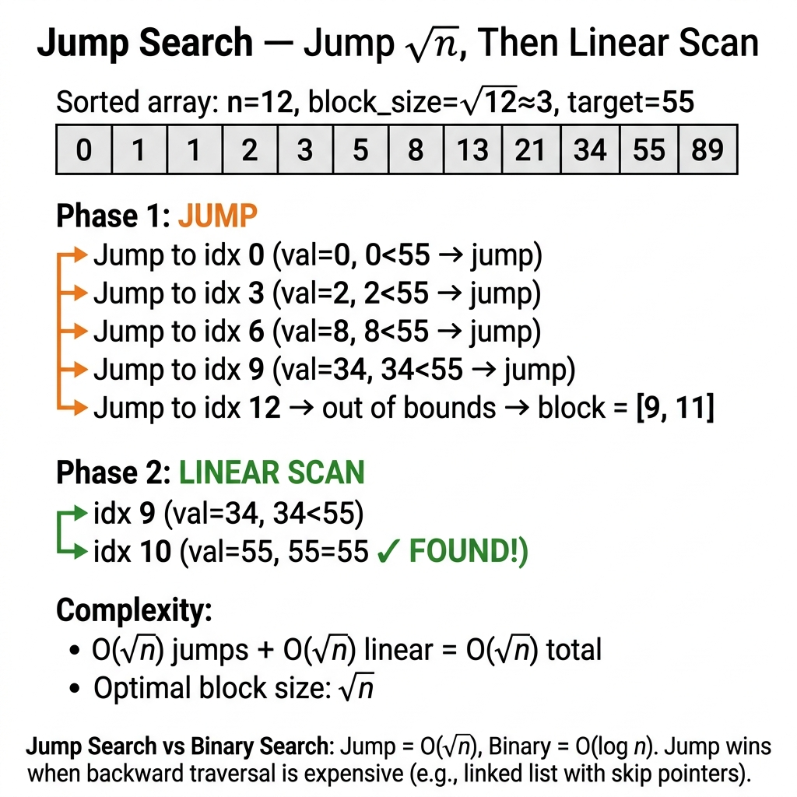

<!-- tags: dsa, algorithms, searching -->
# 🦘 Jump Search

> Jump search demonstrates the trade-off between jumping far and scanning locally. It rarely beats binary search on standard arrays. It provides a great lesson on balancing block size and linear scans.

📅 Created: 2026-03-20 · 🔄 Updated: 2026-04-10 · ⏱️ 13 min read

| Aspect | Detail |
| ------ | ------ |
| **Complexity** | O(√n) time · O(1) space |
| **Use case** | Sorted data, sequential-friendly access |
| **Recognition** | Desire fewer random probes while beating linear scans |

---

## 1. DEFINE

🦘 Jump Search becomes valuable when viewed as a cost-balancing problem. It does not chase better asymptotic limits than binary search. It buys a different trade-off. You jump far enough to avoid scanning but not so far that the final block becomes a burden.

<!-- [Beginner layer] -->
You have a sorted array but avoid binary search midpoints. You prefer navigating by blocks. You jump a few steps repeatedly until you find the right block, then scan it linearly.

<!-- [Experienced layer] -->
`Jump Search` splits the task into two phases:
- jump forward by block size `step`
- scan linearly within the target block

A tiny step forces too many jumps. A massive step makes the final block scan too expensive. The optimal balance occurs at `step ≈ √n`.

Core insight: **jump search optimizes the total cost of jumping plus the final block scan**.

| Variant | When to use | Core Idea |
| ------- | -------- | ------- |
| Standard jump | Sorted array | Jump by block then scan it |
| Generic jump | Comparator-based type | Identical logic with better abstraction |

| Approach | Time | Space | When to pick |
| -------- | ---- | ----- | -------- |
| Linear search | O(n) | O(1) | Unsorted data |
| Jump search | O(√n) | O(1) | Sorted data with cheap sequential probes |
| Binary search | O(log n) | O(1) | Sorted data with cheap random access |

### 1.1 Quick Recognition

- Sorted data
- Sequential scanning inside a block remains acceptable
- Need fewer random jumps than binary search

### 1.2 Invariants & Failure Modes

<!-- [Expert layer] -->
- A valid target must sit inside the `(prev, step]` block after the jump phase.
- The `step = √n` formula minimizes the total `n/step + step` cost.
- A common failure mode assumes jump search beats binary search on standard arrays. It mainly offers educational value or suits special access models.

---

## 2. VISUAL

This image answers the core question: **what does the jump phase buy before the final linear scan starts?**



The static traces link the block intuition directly to the underlying cost model.


### Level 1 — Simple
```text
nums   = [0,1,1,2,3,5,8,13,21,34,55,89]
target = 55
step   = 3

jump to 3  -> nums[3]=2  < 55
jump to 6  -> nums[6]=8  < 55
jump to 9  -> nums[9]=34 < 55
jump to 11 -> nums[11]=89 >= 55

linear scan in [9..11]:
  34 -> no
  55 -> found
```
*Figure: The jump phase isolates the candidate block, leaving the exact discovery to the final linear scan.*

### Level 2 — Detailed
```text
Cost model:
  jumps ≈ n / step
  final scan ≈ step

Total ≈ n/step + step

Minimize this:
  step = √n
```
*Figure: The √n formula balances two opposing costs rather than serving as a rote trick.*

## 3. CODE

The trace shows the flow. We implement the clean baseline before moving to the memorable variants.


### Problem 1: Standard Jump Search
> **Goal**: Find target in a sorted array using a jump phase and a linear phase
> **Approach**: Pick `step = floor(sqrt(n))`
> **Example**: `[0,1,1,2,3,5,8,13,21,34,55], target=55` → `10`

```go
// jump_search.go — Searching: Standard jump search
import "math"

func JumpSearch(nums []int, target int) int {
    n := len(nums)
    if n == 0 {
        return -1
    }

    step := int(math.Sqrt(float64(n)))
    prev := 0
    bound := step

    for bound < n && nums[bound] < target {
        prev = bound
        bound += step
    }

    for i := prev; i < n && i <= bound; i++ {
        if nums[i] == target {
            return i
        }
        if nums[i] > target {
            break
        }
    }

    return -1
}
```
```typescript
// jump_search.ts — Searching: Standard jump search
function jumpSearch(nums: number[], target: number): number {
    if (nums.length === 0) return -1;

    const step = Math.floor(Math.sqrt(nums.length));
    let prev = 0;
    let bound = step;

    while (bound < nums.length && nums[bound] < target) {
        prev = bound;
        bound += step;
    }

    for (let i = prev; i < nums.length && i <= bound; i++) {
        if (nums[i] === target) return i;
        if (nums[i] > target) break;
    }

    return -1;
}
```
```java
// JumpSearchBasic.java — Searching: Standard jump search
final class JumpSearchBasic {
    private JumpSearchBasic() {}

    static int jumpSearch(int[] nums, int target) {
        if (nums.length == 0) return -1;

        int step = (int) Math.sqrt(nums.length);
        int prev = 0;
        int bound = step;

        while (bound < nums.length && nums[bound] < target) {
            prev = bound;
            bound += step;
        }

        for (int i = prev; i < nums.length && i <= bound; i++) {
            if (nums[i] == target) return i;
            if (nums[i] > target) break;
        }

        return -1;
    }
}
```
```rust
// jump_search.rs — Searching: Standard jump search
fn jump_search(nums: &[i32], target: i32) -> isize {
    if nums.is_empty() {
        return -1;
    }

    let step = (nums.len() as f64).sqrt() as usize;
    let mut prev = 0usize;
    let mut bound = step;

    while bound < nums.len() && nums[bound] < target {
        prev = bound;
        bound += step;
    }

    for i in prev..nums.len().min(bound + 1) {
        if nums[i] == target {
            return i as isize;
        }
        if nums[i] > target {
            break;
        }
    }

    -1
}
```
```cpp
// jump_search.cpp — Searching: Standard jump search
int jumpSearch(const std::vector<int>& nums, int target) {
    if (nums.empty()) return -1;

    int step = static_cast<int>(std::sqrt(nums.size()));
    int prev = 0;
    int bound = step;

    while (bound < static_cast<int>(nums.size()) && nums[bound] < target) {
        prev = bound;
        bound += step;
    }

    for (int i = prev; i < static_cast<int>(nums.size()) && i <= bound; ++i) {
        if (nums[i] == target) return i;
        if (nums[i] > target) break;
    }

    return -1;
}
```
```python
# jump_search.py — Searching: Standard jump search
import math

def jump_search(nums: list[int], target: int) -> int:
    if not nums:
        return -1

    step = int(math.sqrt(len(nums)))
    prev = 0
    bound = step

    while bound < len(nums) and nums[bound] < target:
        prev = bound
        bound += step

    for i in range(prev, min(len(nums), bound + 1)):
        if nums[i] == target:
            return i
        if nums[i] > target:
            break

    return -1
```

> **Why?** Jump search provides an elegant optimization problem balancing block jumps against linear scans. Selecting `step ≈ √n` perfectly aligns these opposing costs.

> **Conclusion**: Basic jump search holds educational value for its clear cost model, even if it lacks raw practical dominance.

---

### Problem 2: Generic Jump Search
> **Goal**: Apply jump search logic to generic, comparator-based data
> **Approach**: Maintain the 2-phase search while abstracting the comparison logic
> **Example**: Search objects by `key`

```go
// jump_search_generic.go — Searching: Generic jump search
import "golang.org/x/exp/constraints"

func JumpSearchGeneric[T constraints.Ordered](nums []T, target T) int {
    n := len(nums)
    if n == 0 {
        return -1
    }

    step := int(math.Sqrt(float64(n)))
    prev := 0
    bound := step

    for bound < n && nums[bound] < target {
        prev = bound
        bound += step
    }

    for i := prev; i < n && i <= bound; i++ {
        if nums[i] == target {
            return i
        }
        if nums[i] > target {
            break
        }
    }

    return -1
}
```
```typescript
// jump_search_generic.ts — Searching: Generic jump search
function jumpSearchGeneric<T>(nums: T[], target: T, cmp: (a: T, b: T) => number): number {
    if (nums.length === 0) return -1;

    const step = Math.floor(Math.sqrt(nums.length));
    let prev = 0;
    let bound = step;

    while (bound < nums.length && cmp(nums[bound], target) < 0) {
        prev = bound;
        bound += step;
    }

    for (let i = prev; i < nums.length && i <= bound; i++) {
        const order = cmp(nums[i], target);
        if (order === 0) return i;
        if (order > 0) break;
    }

    return -1;
}
```
```java
// JumpSearchIntermediate.java — Searching: Generic jump search
import java.util.Comparator;

final class JumpSearchIntermediate {
    private JumpSearchIntermediate() {}

    static <T> int jumpSearchGeneric(T[] nums, T target, Comparator<T> cmp) {
        if (nums.length == 0) return -1;

        int step = (int) Math.sqrt(nums.length);
        int prev = 0;
        int bound = step;

        while (bound < nums.length && cmp.compare(nums[bound], target) < 0) {
            prev = bound;
            bound += step;
        }

        for (int i = prev; i < nums.length && i <= bound; i++) {
            int order = cmp.compare(nums[i], target);
            if (order == 0) return i;
            if (order > 0) break;
        }

        return -1;
    }
}
```
```rust
// jump_search_generic.rs — Searching: Generic jump search
fn jump_search_generic<T: PartialOrd>(nums: &[T], target: &T) -> isize {
    if nums.is_empty() {
        return -1;
    }

    let step = (nums.len() as f64).sqrt() as usize;
    let mut prev = 0usize;
    let mut bound = step;

    while bound < nums.len() && nums[bound] < *target {
        prev = bound;
        bound += step;
    }

    for i in prev..nums.len().min(bound + 1) {
        if nums[i] == *target {
            return i as isize;
        }
        if nums[i] > *target {
            break;
        }
    }

    -1
}
```
```cpp
// jump_search_generic.cpp — Searching: Generic jump search
template <typename T, typename Compare>
int jumpSearchGeneric(const std::vector<T>& nums, const T& target, Compare cmp) {
    if (nums.empty()) return -1;

    int step = static_cast<int>(std::sqrt(nums.size()));
    int prev = 0;
    int bound = step;

    while (bound < static_cast<int>(nums.size()) && cmp(nums[bound], target) < 0) {
        prev = bound;
        bound += step;
    }

    for (int i = prev; i < static_cast<int>(nums.size()) && i <= bound; ++i) {
        int order = cmp(nums[i], target);
        if (order == 0) return i;
        if (order > 0) break;
    }

    return -1;
}
```
```python
# jump_search_generic.py — Searching: Generic jump search
def jump_search_generic(nums, target, key=lambda x: x):
    if not nums:
        return -1

    step = int(len(nums) ** 0.5)
    prev = 0
    bound = step

    while bound < len(nums) and key(nums[bound]) < key(target):
        prev = bound
        bound += step

    for i in range(prev, min(len(nums), bound + 1)):
        if key(nums[i]) == key(target):
            return i
        if key(nums[i]) > key(target):
            break

    return -1
```

> **Why?** This generic version proves jump search does not depend on integers. It relies strictly on monotone comparisons. This abstraction disconnects the core pattern from specific data structures.

> **Conclusion**: This intermediate step transforms running code into an invariant-preserving abstraction applicable across many types.

---

### Problem 3: First Occurrence in Sorted Duplicates
> **Goal**: Find the first occurrence of a target within a sorted array containing duplicates
> **Approach**: Use jump phase to find the first candidate block, then scan it linearly
> **Example**: `[1,2,2,2,3,4,5]`, target `2` → `1`

```go
// jump_search_first.go — Searching: first occurrence with jump search block narrowing
import "math"

func JumpSearchFirst(nums []int, target int) int {
	if len(nums) == 0 {
		return -1
	}

	step := int(math.Sqrt(float64(len(nums))))
	if step == 0 {
		step = 1
	}

	prev, bound := 0, step
	for prev < len(nums) {
		end := bound - 1
		if end >= len(nums) {
			end = len(nums) - 1
		}
		if nums[end] >= target {
			break
		}
		prev = bound
		bound += step
	}

	for i := prev; i < len(nums) && i < bound; i++ {
		if nums[i] == target {
			return i
		}
		if nums[i] > target {
			break
		}
	}

	return -1
}
```
```typescript
// jump_search_first.ts — Searching: first occurrence with jump search block narrowing
function jumpSearchFirst(nums: number[], target: number): number {
  if (nums.length === 0) return -1;

  const step = Math.max(1, Math.floor(Math.sqrt(nums.length)));
  let prev = 0;
  let bound = step;

  while (prev < nums.length) {
    const end = Math.min(bound - 1, nums.length - 1);
    if (nums[end] >= target) break;
    prev = bound;
    bound += step;
  }

  for (let i = prev; i < nums.length && i < bound; i++) {
    if (nums[i] === target) return i;
    if (nums[i] > target) break;
  }
  return -1;
}
```
```java
// JumpSearchAdvanced.java — Searching: first occurrence with jump search block narrowing
final class JumpSearchAdvanced {
    private JumpSearchAdvanced() {}

    static int jumpSearchFirst(int[] nums, int target) {
        if (nums.length == 0) return -1;

        int step = Math.max(1, (int) Math.sqrt(nums.length));
        int prev = 0;
        int bound = step;

        while (prev < nums.length) {
            int end = Math.min(bound - 1, nums.length - 1);
            if (nums[end] >= target) break;
            prev = bound;
            bound += step;
        }

        for (int i = prev; i < nums.length && i < bound; i++) {
            if (nums[i] == target) return i;
            if (nums[i] > target) break;
        }
        return -1;
    }
}
```
```rust
// jump_search_first.rs — Searching: first occurrence with jump search block narrowing
fn jump_search_first(nums: &[i32], target: i32) -> isize {
    if nums.is_empty() {
        return -1;
    }

    let step = ((nums.len() as f64).sqrt() as usize).max(1);
    let (mut prev, mut bound) = (0usize, step);

    while prev < nums.len() {
        let end = (bound.saturating_sub(1)).min(nums.len() - 1);
        if nums[end] >= target {
            break;
        }
        prev = bound;
        bound += step;
    }

    for i in prev..nums.len().min(bound) {
        if nums[i] == target {
            return i as isize;
        }
        if nums[i] > target {
            break;
        }
    }

    -1
}
```
```cpp
// jump_search_first.cpp — Searching: first occurrence with jump search block narrowing
int jumpSearchFirst(const std::vector<int>& nums, int target) {
    if (nums.empty()) return -1;

    int step = std::max(1, static_cast<int>(std::sqrt(nums.size())));
    int prev = 0;
    int bound = step;

    while (prev < static_cast<int>(nums.size())) {
        int end = std::min(bound - 1, static_cast<int>(nums.size()) - 1);
        if (nums[end] >= target) break;
        prev = bound;
        bound += step;
    }

    for (int i = prev; i < static_cast<int>(nums.size()) && i < bound; ++i) {
        if (nums[i] == target) return i;
        if (nums[i] > target) break;
    }
    return -1;
}
```
```python
# jump_search_first.py — Searching: first occurrence with jump search block narrowing
def jump_search_first(nums: list[int], target: int) -> int:
    if not nums:
        return -1

    step = max(1, int(len(nums) ** 0.5))
    prev, bound = 0, step

    while prev < len(nums):
        end = min(bound - 1, len(nums) - 1)
        if nums[end] >= target:
            break
        prev = bound
        bound += step

    for i in range(prev, min(len(nums), bound)):
        if nums[i] == target:
            return i
        if nums[i] > target:
            break
    return -1
```

> **Why?** The jump phase must halt at the **first block potentially holding the target**. The previous block ends with a value strictly less than the target, ensuring no earlier occurrences exist.

> **Conclusion**: This advanced boundary reasoning enables finding the first occurrence instead of merely verifying target existence.

---

## 4. PITFALLS

When search fails, the bug usually hides in boundaries, stop conditions, and structural assumptions rather than the main idea.


| # | Severity | Defect | Consequence | Fix |
|---|----------|-----|---------|-----|
| 1 | 🔴 Fatal | Using jump search on unsorted data | Selects wrong blocks immediately | Jump search strictly demands sorted order |
| 2 | 🟡 Common | Scanning past elements strictly larger than target | Loses the sorted property advantage | Break early during the linear scan phase |
| 3 | 🟡 Common | Treating jump search as a superior binary search on arrays | Selects a sub-optimal algorithm | Binary search usually wins on random-access arrays |
| 4 | 🔵 Minor | Picking arbitrary block sizes without analyzing costs | Yields inferior performance | Default to `sqrt(n)` without a specific access model |

---

## 5. REF

| Resource | Type | Link | Note |
| -------- | ---- | ---- | ------- |
| Jump search | Reference | https://en.wikipedia.org/wiki/Jump_search | Core idea and complexity |

---

## 6. RECOMMEND

When you master this lane, learn when to pivot to neighboring patterns instead of forcing the same template.


| Expansion | When to use | Reason | File/Link |
| ------- | ------- | ----- | --------- |
| Binary Search | Random access remains cheap | Direct comparison against jump search | [./02-binary-search.md](./02-binary-search.md) |
| Exponential Search | Unknown bounding range | Shares 2-phase range-finding and local searching | [./05-exponential-search.md](./05-exponential-search.md) |

---

## 7. QUICK REF

| Problem Signal | Sub-pattern | Short Template |
| --------------- | ----------- | ------------- |
| `sorted` + block probing | standard jump | jump by `sqrt(n)` |
| generic ordered data | comparator jump | same 2-phase logic |

---

Jump search rarely dominates standard arrays. The jumping idea lays the foundation for skip lists, database page scans, and balancing random versus sequential reads.

**Links**: [← Binary Search](./02-binary-search.md) · [→ Interpolation Search](./04-interpolation-search.md)
