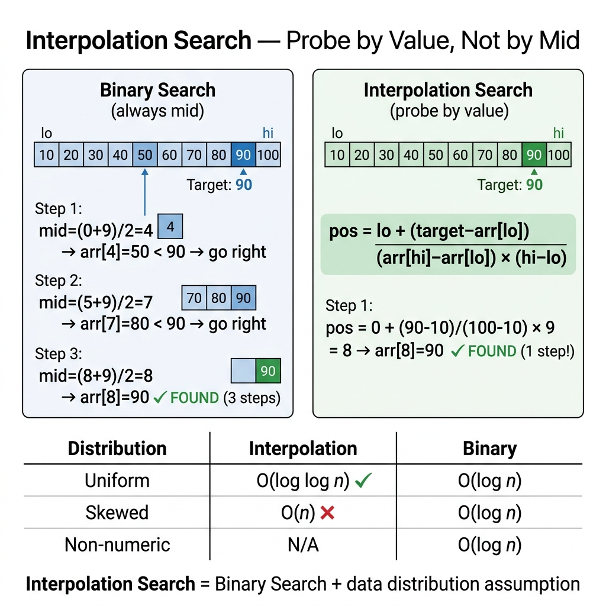

<!-- tags: dsa, algorithms, searching -->
# 📊 Interpolation Search

> Interpolation search predicts positions based on values instead of halving blindly. It blazes through uniform distributions but stalls on skewed ones. This highlights the immense power of data assumptions.

📅 Created: 2026-03-20 · 🔄 Updated: 2026-04-10 · ⏱️ 13 min read

| Aspect | Detail |
| ------ | ------ |
| **Complexity** | Average O(log log n) on uniform data, worst O(n) |
| **Use case** | Sorted + near-uniform distribution |
| **Recognition** | Target value strongly indicates its own position |

---

## 1. DEFINE

<!-- [Beginner layer] -->

<!-- [Beginner layer] -->
You seek `70` inside `[10,20,30,...,100]`. Binary search hits the middle and works fine. Intuition says `70` sits roughly at the 70% mark. Interpolation search turns this exact intuition into a formal algorithm.

<!-- [Experienced layer] -->
`Interpolation Search` estimates the target location using value ratios:

`pos = lo + (target - arr[lo]) * (hi - lo) / (arr[hi] - arr[lo])`

Uniform data puts `pos` very close to the true answer. This slashes iterations compared to rigid binary halving.

Core insight: **this algorithm exploits data distribution alongside sorted order**.

| Variant | When to use | Core Idea |
| ------- | -------- | ------- |
| Standard interpolation | Sorted and uniform data | Probe via estimated value ratio |
| Safe fallback | Data lacks true uniformity | Fallback to binary after bad probes |

| Approach | Time | Space | When to pick |
| -------- | ---- | ----- | -------- |
| Binary search | O(log n) | O(1) | Safe default |
| Interpolation search | O(log log n) average, O(n) worst | O(1) | When data distributes evenly |

### 1.1 Quick Recognition

- Sorted data
- Values grow almost linearly
- Target value suggests a highly proportional position

### 1.2 Invariants & Failure Modes

<!-- [Expert layer] -->
- The probe formula requires `arr[hi] - arr[lo]` to reflect the internal distribution.
- Heavily skewed data forces terrible probes, degrading performance near O(n).
- Guard against `arr[hi] == arr[lo]` to prevent fatal division by zero.

---

## 2. VISUAL

This image answers why interpolation diverges from binary search: **how does value probing help, and when does it fail?**



These traces anchor the concept to uniform and skewed distributions without repeating the graphic.


### Level 1 — Simple
```text
nums   = [10,20,30,40,50,60,70,80,90,100]
target = 70

pos = 0 + (70-10) * 9 / (100-10) = 6
nums[6] = 70 ✅
```
*Figure: Interpolation search can guess the right spot instantly on uniform data.*

### Level 2 — Detailed
```text
uniform-ish data:
  probe lands near target -> fast

skewed data:
  [1,2,3,4,5,1000,2000,5000,10000]
  target = 5000
  formula may keep probing too far left first

=> good only when distribution assumption is believable
```
*Figure: The power of interpolation search hinges entirely on the shape of the data distribution.*

## 3. CODE

The trace shows the flow. We implement the clean baseline before moving to the memorable variants.


### Problem 1: Standard Interpolation Search
> **Goal**: Find target in a sorted, near-uniform array
> **Approach**: Probe via estimated value position
> **Example**: `[10,20,30,40,50,60,70], target=70` → `6`

```go
// interpolation_search.go — Searching: Standard interpolation search
func InterpolationSearch(nums []int, target int) int {
    lo, hi := 0, len(nums)-1

    for lo <= hi && target >= nums[lo] && target <= nums[hi] {
        if nums[lo] == nums[hi] {
            if nums[lo] == target {
                return lo
            }
            return -1
        }

        pos := lo + (target-nums[lo])*(hi-lo)/(nums[hi]-nums[lo])
        if nums[pos] == target {
            return pos
        }
        if nums[pos] < target {
            lo = pos + 1
        } else {
            hi = pos - 1
        }
    }

    return -1
}
```
```typescript
// interpolation_search.ts — Searching: Standard interpolation search
function interpolationSearch(nums: number[], target: number): number {
    let lo = 0;
    let hi = nums.length - 1;

    while (lo <= hi && target >= nums[lo] && target <= nums[hi]) {
        if (nums[lo] === nums[hi]) {
            return nums[lo] === target ? lo : -1;
        }

        const pos = lo + Math.floor((target - nums[lo]) * (hi - lo) / (nums[hi] - nums[lo]));
        if (nums[pos] === target) return pos;
        if (nums[pos] < target) lo = pos + 1;
        else hi = pos - 1;
    }

    return -1;
}
```
```java
// InterpolationSearchBasic.java — Searching: Standard interpolation search
final class InterpolationSearchBasic {
    private InterpolationSearchBasic() {}

    static int interpolationSearch(int[] nums, int target) {
        int lo = 0;
        int hi = nums.length - 1;

        while (lo <= hi && target >= nums[lo] && target <= nums[hi]) {
            if (nums[lo] == nums[hi]) {
                return nums[lo] == target ? lo : -1;
            }

            int pos = lo + (int) ((long) (target - nums[lo]) * (hi - lo) / (nums[hi] - nums[lo]));
            if (nums[pos] == target) return pos;
            if (nums[pos] < target) lo = pos + 1;
            else hi = pos - 1;
        }

        return -1;
    }
}
```
```rust
// interpolation_search.rs — Searching: Standard interpolation search
fn interpolation_search(nums: &[i32], target: i32) -> isize {
    let (mut lo, mut hi) = (0isize, nums.len() as isize - 1);

    while lo <= hi && target >= nums[lo as usize] && target <= nums[hi as usize] {
        if nums[lo as usize] == nums[hi as usize] {
            return if nums[lo as usize] == target { lo } else { -1 };
        }

        let pos = lo
            + ((target - nums[lo as usize]) as isize * (hi - lo))
                / (nums[hi as usize] - nums[lo as usize]) as isize;

        match nums[pos as usize].cmp(&target) {
            std::cmp::Ordering::Equal => return pos,
            std::cmp::Ordering::Less => lo = pos + 1,
            std::cmp::Ordering::Greater => hi = pos - 1,
        }
    }

    -1
}
```
```cpp
// interpolation_search.cpp — Searching: Standard interpolation search
int interpolationSearch(const std::vector<int>& nums, int target) {
    int lo = 0;
    int hi = static_cast<int>(nums.size()) - 1;

    while (lo <= hi && target >= nums[lo] && target <= nums[hi]) {
        if (nums[lo] == nums[hi]) {
            return nums[lo] == target ? lo : -1;
        }

        int pos = lo + static_cast<int>((static_cast<long long>(target - nums[lo]) * (hi - lo)) / (nums[hi] - nums[lo]));
        if (nums[pos] == target) return pos;
        if (nums[pos] < target) lo = pos + 1;
        else hi = pos - 1;
    }

    return -1;
}
```
```python
# interpolation_search.py — Searching: Standard interpolation search
def interpolation_search(nums: list[int], target: int) -> int:
    lo, hi = 0, len(nums) - 1

    while lo <= hi and target >= nums[lo] and target <= nums[hi]:
        if nums[lo] == nums[hi]:
            return lo if nums[lo] == target else -1

        pos = lo + (target - nums[lo]) * (hi - lo) // (nums[hi] - nums[lo])
        if nums[pos] == target:
            return pos
        if nums[pos] < target:
            lo = pos + 1
        else:
            hi = pos - 1

    return -1
```

> **Why?** Interpolation search leverages endpoint values to estimate target locations instead of assuming uniform probabilities everywhere. It requires both sorted order and smooth distribution to excel.

> **Conclusion**: Basic interpolation proves that sorted searching does not strictly mandate middle probing.

---

### Problem 2: Interpolation Search with Binary Fallback
> **Goal**: Retain interpolation speed while preventing massive worst-case slowdowns
> **Approach**: Fallback to binary-style midpoints after consecutive bad probes
> **Example**: Heavily skewed data arrays

```go
// interpolation_search_safe.go — Searching: Interpolation with binary fallback
func InterpolationSearchSafe(nums []int, target int) int {
    lo, hi := 0, len(nums)-1
    badProbes := 0

    for lo <= hi && target >= nums[lo] && target <= nums[hi] {
        if nums[lo] == nums[hi] {
            if nums[lo] == target {
                return lo
            }
            return -1
        }

        pos := lo + (target-nums[lo])*(hi-lo)/(nums[hi]-nums[lo])
        if badProbes >= 3 {
            pos = lo + (hi-lo)/2
        }

        if nums[pos] == target {
            return pos
        }
        if nums[pos] < target {
            lo = pos + 1
        } else {
            hi = pos - 1
        }
        badProbes++
    }

    return -1
}
```
```typescript
// interpolation_search_safe.ts — Searching: Interpolation with binary fallback
function interpolationSearchSafe(nums: number[], target: number): number {
    let lo = 0;
    let hi = nums.length - 1;
    let badProbes = 0;

    while (lo <= hi && target >= nums[lo] && target <= nums[hi]) {
        if (nums[lo] === nums[hi]) {
            return nums[lo] === target ? lo : -1;
        }

        let pos = lo + Math.floor((target - nums[lo]) * (hi - lo) / (nums[hi] - nums[lo]));
        if (badProbes >= 3) {
            pos = lo + Math.floor((hi - lo) / 2);
        }

        if (nums[pos] === target) return pos;
        if (nums[pos] < target) lo = pos + 1;
        else hi = pos - 1;
        badProbes++;
    }

    return -1;
}
```
```java
// InterpolationSearchIntermediate.java — Searching: Interpolation with binary fallback
final class InterpolationSearchIntermediate {
    private InterpolationSearchIntermediate() {}

    static int interpolationSearchSafe(int[] nums, int target) {
        int lo = 0;
        int hi = nums.length - 1;
        int badProbes = 0;

        while (lo <= hi && target >= nums[lo] && target <= nums[hi]) {
            if (nums[lo] == nums[hi]) {
                return nums[lo] == target ? lo : -1;
            }

            int pos = lo + (int) ((long) (target - nums[lo]) * (hi - lo) / (nums[hi] - nums[lo]));
            if (badProbes >= 3) {
                pos = lo + (hi - lo) / 2;
            }

            if (nums[pos] == target) return pos;
            if (nums[pos] < target) lo = pos + 1;
            else hi = pos - 1;
            badProbes++;
        }

        return -1;
    }
}
```
```rust
// interpolation_search_safe.rs — Searching: Interpolation with binary fallback
fn interpolation_search_safe(nums: &[i32], target: i32) -> isize {
    let (mut lo, mut hi) = (0isize, nums.len() as isize - 1);
    let mut bad_probes = 0;

    while lo <= hi && target >= nums[lo as usize] && target <= nums[hi as usize] {
        if nums[lo as usize] == nums[hi as usize] {
            return if nums[lo as usize] == target { lo } else { -1 };
        }

        let mut pos = lo
            + ((target - nums[lo as usize]) as isize * (hi - lo))
                / (nums[hi as usize] - nums[lo as usize]) as isize;
        if bad_probes >= 3 {
            pos = lo + (hi - lo) / 2;
        }

        match nums[pos as usize].cmp(&target) {
            std::cmp::Ordering::Equal => return pos,
            std::cmp::Ordering::Less => lo = pos + 1,
            std::cmp::Ordering::Greater => hi = pos - 1,
        }
        bad_probes += 1;
    }

    -1
}
```
```cpp
// interpolation_search_safe.cpp — Searching: Interpolation with binary fallback
int interpolationSearchSafe(const std::vector<int>& nums, int target) {
    int lo = 0;
    int hi = static_cast<int>(nums.size()) - 1;
    int badProbes = 0;

    while (lo <= hi && target >= nums[lo] && target <= nums[hi]) {
        if (nums[lo] == nums[hi]) {
            return nums[lo] == target ? lo : -1;
        }

        int pos = lo + static_cast<int>((static_cast<long long>(target - nums[lo]) * (hi - lo)) / (nums[hi] - nums[lo]));
        if (badProbes >= 3) {
            pos = lo + (hi - lo) / 2;
        }

        if (nums[pos] == target) return pos;
        if (nums[pos] < target) lo = pos + 1;
        else hi = pos - 1;
        ++badProbes;
    }

    return -1;
}
```
```python
# interpolation_search_safe.py — Searching: Interpolation with binary fallback
def interpolation_search_safe(nums: list[int], target: int) -> int:
    lo, hi = 0, len(nums) - 1
    bad_probes = 0

    while lo <= hi and target >= nums[lo] and target <= nums[hi]:
        if nums[lo] == nums[hi]:
            return lo if nums[lo] == target else -1

        pos = lo + (target - nums[lo]) * (hi - lo) // (nums[hi] - nums[lo])
        if bad_probes >= 3:
            pos = lo + (hi - lo) // 2

        if nums[pos] == target:
            return pos
        if nums[pos] < target:
            lo = pos + 1
        else:
            hi = pos - 1
        bad_probes += 1

    return -1
```

> **Why?** Safe fallback admits interpolation fails on ugly distributions. Reverting to binary search pulls the algorithm back to stable behavior when probe quality drops.

> **Conclusion**: This intermediate variant transforms a theoretical algorithm into a pragmatic tool.

---

### Problem 3: First Occurrence with Interpolation Lower Bound
> **Goal**: Find the first occurrence in a sorted, near-uniform array containing duplicates
> **Approach**: Shift interpolation toward lower-bound logic by keeping the left half when `nums[pos] >= target`
> **Example**: `[10,20,20,20,30,40]`, target `20` → `1`

```go
// interpolation_first.go — Searching: first occurrence via interpolation-style lower bound
func InterpolationSearchFirst(nums []int, target int) int {
	lo, hi := 0, len(nums)-1
	answer := -1

	for lo <= hi && len(nums) > 0 && target >= nums[lo] && target <= nums[hi] {
		if nums[lo] == nums[hi] {
			if nums[lo] == target {
				return lo
			}
			break
		}

		pos := lo + (target-nums[lo])*(hi-lo)/(nums[hi]-nums[lo])
		if nums[pos] >= target {
			if nums[pos] == target {
				answer = pos
			}
			hi = pos - 1
		} else {
			lo = pos + 1
		}
	}

	return answer
}
```
```typescript
// interpolation_first.ts — Searching: first occurrence via interpolation-style lower bound
function interpolationSearchFirst(nums: number[], target: number): number {
  let lo = 0;
  let hi = nums.length - 1;
  let answer = -1;

  while (lo <= hi && nums.length > 0 && target >= nums[lo] && target <= nums[hi]) {
    if (nums[lo] === nums[hi]) {
      return nums[lo] === target ? lo : answer;
    }

    const pos = lo + Math.floor((target - nums[lo]) * (hi - lo) / (nums[hi] - nums[lo]));
    if (nums[pos] >= target) {
      if (nums[pos] === target) answer = pos;
      hi = pos - 1;
    } else {
      lo = pos + 1;
    }
  }

  return answer;
}
```
```java
// InterpolationSearchAdvanced.java — Searching: first occurrence via interpolation-style lower bound
final class InterpolationSearchAdvanced {
    private InterpolationSearchAdvanced() {}

    static int interpolationSearchFirst(int[] nums, int target) {
        int lo = 0, hi = nums.length - 1, answer = -1;

        while (lo <= hi && nums.length > 0 && target >= nums[lo] && target <= nums[hi]) {
            if (nums[lo] == nums[hi]) {
                return nums[lo] == target ? lo : answer;
            }

            int pos = lo + (int) ((long) (target - nums[lo]) * (hi - lo) / (nums[hi] - nums[lo]));
            if (nums[pos] >= target) {
                if (nums[pos] == target) answer = pos;
                hi = pos - 1;
            } else {
                lo = pos + 1;
            }
        }

        return answer;
    }
}
```
```rust
// interpolation_first.rs — Searching: first occurrence via interpolation-style lower bound
fn interpolation_search_first(nums: &[i32], target: i32) -> isize {
    if nums.is_empty() {
        return -1;
    }

    let (mut lo, mut hi, mut answer) = (0isize, nums.len() as isize - 1, -1isize);
    while lo <= hi && target >= nums[lo as usize] && target <= nums[hi as usize] {
        if nums[lo as usize] == nums[hi as usize] {
            return if nums[lo as usize] == target { lo } else { answer };
        }

        let pos = lo
            + ((target - nums[lo as usize]) as isize * (hi - lo))
                / (nums[hi as usize] - nums[lo as usize]) as isize;

        if nums[pos as usize] >= target {
            if nums[pos as usize] == target {
                answer = pos;
            }
            hi = pos - 1;
        } else {
            lo = pos + 1;
        }
    }

    answer
}
```
```cpp
// interpolation_first.cpp — Searching: first occurrence via interpolation-style lower bound
int interpolationSearchFirst(const std::vector<int>& nums, int target) {
    if (nums.empty()) return -1;

    int lo = 0, hi = static_cast<int>(nums.size()) - 1, answer = -1;
    while (lo <= hi && target >= nums[lo] && target <= nums[hi]) {
        if (nums[lo] == nums[hi]) {
            return nums[lo] == target ? lo : answer;
        }

        int pos = lo + static_cast<int>((static_cast<long long>(target - nums[lo]) * (hi - lo)) / (nums[hi] - nums[lo]));
        if (nums[pos] >= target) {
            if (nums[pos] == target) answer = pos;
            hi = pos - 1;
        } else {
            lo = pos + 1;
        }
    }
    return answer;
}
```
```python
# interpolation_first.py — Searching: first occurrence via interpolation-style lower bound
def interpolation_search_first(nums: list[int], target: int) -> int:
    if not nums:
        return -1

    lo, hi = 0, len(nums) - 1
    answer = -1

    while lo <= hi and target >= nums[lo] and target <= nums[hi]:
        if nums[lo] == nums[hi]:
            return lo if nums[lo] == target else answer

        pos = lo + (target - nums[lo]) * (hi - lo) // (nums[hi] - nums[lo])
        if nums[pos] >= target:
            if nums[pos] == target:
                answer = pos
            hi = pos - 1
        else:
            lo = pos + 1

    return answer
```

> **Why?** This advanced version proves interpolation search handles boundaries too. It tracks candidate positions while preserving the leftward momentum of lower-bound searches.

> **Conclusion**: This requires mastering both the interpolation heuristic and boundary-invariant reasoning simultaneously.

---

## 4. PITFALLS

When search fails, the bug usually hides in boundaries, stop conditions, and structural assumptions rather than the main idea.


| # | Severity | Defect | Consequence | Fix |
|---|----------|-----|---------|-----|
| 1 | 🔴 Fatal | Expecting O(log log n) on heavily skewed data | Degrades runtime near O(n) | Use only with justified distribution assumptions |
| 2 | 🔴 Fatal | Forgetting to guard `arr[hi] == arr[lo]` | Triggers division by zero | Check condition before computing `pos` |
| 3 | 🟡 Common | Assuming sorted data is sufficient alone | Picks wrong algorithm for the distribution | Sorted is necessary but uniform data is required |
| 4 | 🔵 Minor | Comparing interpolation and binary via Big-O only | Evaluates practicality poorly | Always weigh worst-case and distribution assumptions |

---

## 5. REF

| Resource | Type | Link | Note |
| -------- | ---- | ---- | ------- |
| Interpolation search | Reference | https://en.wikipedia.org/wiki/Interpolation_search | Formula and complexity |

---

## 6. RECOMMEND

When you master this lane, learn when to pivot to neighboring patterns instead of forcing the same template.


| Expansion | When to use | Reason | File/Link |
| ------- | ------- | ----- | --------- |
| Binary Search | Need a highly stable baseline | Binary search ignores data distributions | [./02-binary-search.md](./02-binary-search.md) |
| Exponential Search | Unknown upper bound | Provides another approach to range refinement | [./05-exponential-search.md](./05-exponential-search.md) |

---

## 7. QUICK REF

| Problem Signal | Sub-pattern | Short Template |
| --------------- | ----------- | ------------- |
| `sorted + uniform values` | interpolation | probe by value ratio |
| `sorted but skewed` | safe fallback | fallback to binary after bad probes |

---

Interpolation search proves algorithm performance depends on data distribution. Uniform yields O(log log n) while skewed yields O(n). Always question the distribution before selecting your tool.

**Links**: [← Jump Search](./03-jump-search.md) · [→ Exponential Search](./05-exponential-search.md)
