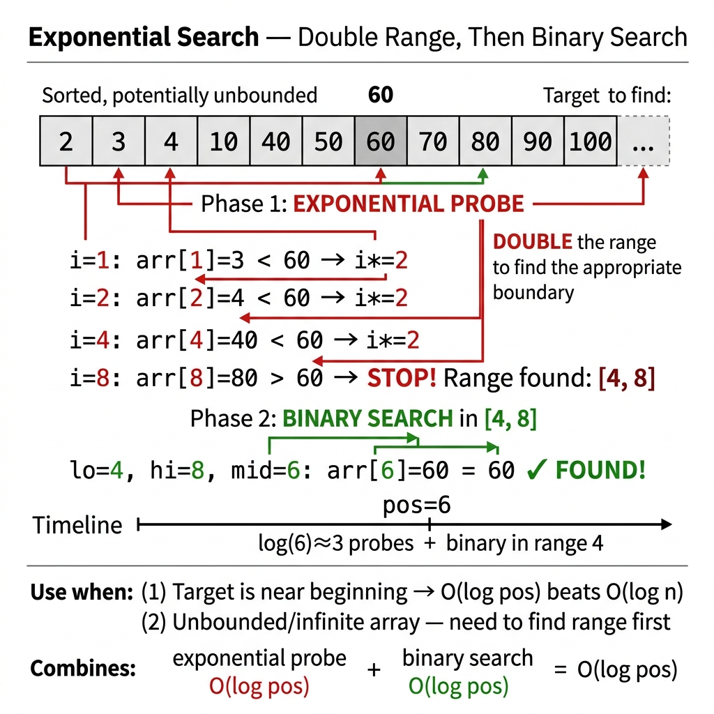

<!-- tags: dsa, algorithms, searching -->
# 🚀 Exponential Search

> Exponential search shines when search boundaries remain unknown or targets sit near the front. It rapidly expands a search window before applying standard binary halving.

📅 Created: 2026-03-20 · 🔄 Updated: 2026-04-10 · ⏱️ 14 min read

| Aspect | Detail |
| ------ | ------ |
| **Complexity** | O(log i) time, where `i` represents target position |
| **Use case** | Sorted data, unknown bound, target near front |
| **Recognition** | Lacks a known boundary but allows probing via `1,2,4,8,...` |

---

## 1. DEFINE

🚀 Exponential Search exists for moments when binary search lacks an upper boundary. It separates target discovery from rapid window framing.

<!-- [Beginner layer] -->
You query sorted data without knowing its length or expect the target early. Binary search demands an initial `hi` value. Exponential search discovers this range by doubling: 1, 2, 4, 8, ...

<!-- [Experienced layer] -->
`Exponential Search` runs two distinct phases:
- **range finding**: double the index until surpassing target or exhausting data
- **local binary search**: execute binary halving inside the discovered block

Core insight: **binary search cannot always know its boundaries upfront; exponential search builds that domain rapidly**.

| Variant | When to use | Core Idea |
| ------- | -------- | ------- |
| Standard exponential | Sorted array with known length | Range doubling then binary search |
| Unbounded source | Streams or APIs lacking size data | Use `Get(i)` to discover boundaries |

| Approach | Time | Space | When to pick |
| -------- | ---- | ----- | -------- |
| Binary search | O(log n) | O(1) | Safe default inside `[0..n-1]` |
| Exponential search | O(log i) | O(1) | Unknown bounds or early targets |

### 1.1 Quick Recognition

- Sorted data
- Unknown size or upper bound
- Access model permits progressive outward probing

### 1.2 Invariants & Failure Modes

<!-- [Expert layer] -->
- The doubling phase guarantees the target sits inside `[i/2, min(i, n-1)]`.
- O(log i) complexity means earlier targets resolve substantially faster.
- Common failure modes mix range discovery logic with the binary search phase.

---

## 2. VISUAL

This image answers the core question: **how does doubling lock the binary window before searching begins?**



These static traces clarify the boundary discovery and local halving phases.


### Level 1 — Simple
```text
nums   = [1,2,3,4,5,6,7,8,9,10,11,12,13]
target = 12

probe 1  -> 2  < 12
probe 2  -> 3  < 12
probe 4  -> 5  < 12
probe 8  -> 9  < 12
probe 16 -> stop (out of range)

=> target must be in [8, 12]
=> binary search there
```
*Figure: Exponential search locates a suitably small window to enable binary search.*

### Level 2 — Detailed
```text
target at index i

1, 2, 4, 8, ... , 2^k >= i

Doubling phase cost  ~ O(log i)
Binary search window ~ O(log i)
Total                ~ O(log i)
```
*Figure: The final window matches the target position scale, making performance depend on target depth rather than overall array size.*

## 3. CODE

The trace shows the flow. We implement the clean baseline before moving to the memorable variants.


### Problem 1: Standard Exponential Search
> **Goal**: Find target using range doubling followed by binary halving
> **Approach**: Probe `1,2,4,8,...` to define boundaries
> **Example**: `[1,2,3,4,5,6,7,8,9,10,11,12]`, target `12` → `11`

```go
// exponential_search.go — Searching: Standard exponential search
func ExponentialSearch(nums []int, target int) int {
    if len(nums) == 0 {
        return -1
    }
    if nums[0] == target {
        return 0
    }

    i := 1
    for i < len(nums) && nums[i] < target {
        i *= 2
    }

    lo := i / 2
    hi := i
    if hi >= len(nums) {
        hi = len(nums) - 1
    }

    for lo <= hi {
        mid := lo + (hi-lo)/2
        if nums[mid] == target {
            return mid
        }
        if nums[mid] < target {
            lo = mid + 1
        } else {
            hi = mid - 1
        }
    }

    return -1
}
```
```typescript
// exponential_search.ts — Searching: Standard exponential search
function exponentialSearch(nums: number[], target: number): number {
    if (nums.length === 0) return -1;
    if (nums[0] === target) return 0;

    let i = 1;
    while (i < nums.length && nums[i] < target) {
        i *= 2;
    }

    let lo = i >> 1;
    let hi = Math.min(i, nums.length - 1);
    while (lo <= hi) {
        const mid = lo + Math.floor((hi - lo) / 2);
        if (nums[mid] === target) return mid;
        if (nums[mid] < target) lo = mid + 1;
        else hi = mid - 1;
    }

    return -1;
}
```
```java
// ExponentialSearchBasic.java — Searching: Standard exponential search
final class ExponentialSearchBasic {
    private ExponentialSearchBasic() {}

    static int exponentialSearch(int[] nums, int target) {
        if (nums.length == 0) return -1;
        if (nums[0] == target) return 0;

        int i = 1;
        while (i < nums.length && nums[i] < target) {
            i *= 2;
        }

        int lo = i / 2;
        int hi = Math.min(i, nums.length - 1);
        while (lo <= hi) {
            int mid = lo + (hi - lo) / 2;
            if (nums[mid] == target) return mid;
            if (nums[mid] < target) lo = mid + 1;
            else hi = mid - 1;
        }

        return -1;
    }
}
```
```rust
// exponential_search.rs — Searching: Standard exponential search
fn exponential_search(nums: &[i32], target: i32) -> isize {
    if nums.is_empty() {
        return -1;
    }
    if nums[0] == target {
        return 0;
    }

    let mut i = 1usize;
    while i < nums.len() && nums[i] < target {
        i *= 2;
    }

    let (mut lo, mut hi) = ((i / 2) as isize, i.min(nums.len() - 1) as isize);
    while lo <= hi {
        let mid = lo + (hi - lo) / 2;
        match nums[mid as usize].cmp(&target) {
            std::cmp::Ordering::Equal => return mid,
            std::cmp::Ordering::Less => lo = mid + 1,
            std::cmp::Ordering::Greater => hi = mid - 1,
        }
    }

    -1
}
```
```cpp
// exponential_search.cpp — Searching: Standard exponential search
int exponentialSearch(const std::vector<int>& nums, int target) {
    if (nums.empty()) return -1;
    if (nums[0] == target) return 0;

    int i = 1;
    while (i < static_cast<int>(nums.size()) && nums[i] < target) {
        i *= 2;
    }

    int lo = i / 2;
    int hi = std::min(i, static_cast<int>(nums.size()) - 1);
    while (lo <= hi) {
        int mid = lo + (hi - lo) / 2;
        if (nums[mid] == target) return mid;
        if (nums[mid] < target) lo = mid + 1;
        else hi = mid - 1;
    }

    return -1;
}
```
```python
# exponential_search.py — Searching: Standard exponential search
def exponential_search(nums: list[int], target: int) -> int:
    if not nums:
        return -1
    if nums[0] == target:
        return 0

    i = 1
    while i < len(nums) and nums[i] < target:
        i *= 2

    lo = i // 2
    hi = min(i, len(nums) - 1)
    while lo <= hi:
        mid = lo + (hi - lo) // 2
        if nums[mid] == target:
            return mid
        if nums[mid] < target:
            lo = mid + 1
        else:
            hi = mid - 1

    return -1
```

> **Why?** Binary search stalls without a valid `hi`. The doubling phase securely locates a block containing the target before halving begins.

> **Conclusion**: Standard exponential search provides an excellent lesson on search range discovery rather than mere target discovery.

---

### Problem 2: Unbounded Data Source Search
> **Goal**: Search through an endless or unknown-length data source
> **Approach**: Probe via `get(index)` doubling, then binary search the bounded segment
> **Example**: Sorted API or stream without `len()`

```go
// unbounded_search.go — Searching: Exponential search on unknown-size data source
type DataSource interface {
    Get(index int) (value int, ok bool)
}

func UnboundedSearch(ds DataSource, target int) int {
    i := 1
    for {
        value, ok := ds.Get(i)
        if !ok || value >= target {
            break
        }
        i *= 2
    }

    lo, hi := i/2, i
    for lo <= hi {
        mid := lo + (hi-lo)/2
        value, ok := ds.Get(mid)
        if !ok {
            hi = mid - 1
            continue
        }
        if value == target {
            return mid
        }
        if value < target {
            lo = mid + 1
        } else {
            hi = mid - 1
        }
    }

    return -1
}
```
```typescript
// unbounded_search.ts — Searching: Exponential search on unknown-size data source
interface DataSource {
    get(index: number): [number, boolean];
}

function unboundedSearch(ds: DataSource, target: number): number {
    let i = 1;
    while (true) {
        const [value, ok] = ds.get(i);
        if (!ok || value >= target) break;
        i *= 2;
    }

    let lo = i >> 1;
    let hi = i;
    while (lo <= hi) {
        const mid = lo + Math.floor((hi - lo) / 2);
        const [value, ok] = ds.get(mid);
        if (!ok) {
            hi = mid - 1;
            continue;
        }
        if (value === target) return mid;
        if (value < target) lo = mid + 1;
        else hi = mid - 1;
    }

    return -1;
}
```
```java
// ExponentialSearchIntermediate.java — Searching: Exponential search on unknown-size data source
interface DataSource {
    Result get(int index);
}

record Result(int value, boolean ok) {}

final class ExponentialSearchIntermediate {
    private ExponentialSearchIntermediate() {}

    static int unboundedSearch(DataSource ds, int target) {
        int i = 1;
        while (true) {
            Result result = ds.get(i);
            if (!result.ok() || result.value() >= target) break;
            i *= 2;
        }

        int lo = i / 2;
        int hi = i;
        while (lo <= hi) {
            int mid = lo + (hi - lo) / 2;
            Result result = ds.get(mid);
            if (!result.ok()) {
                hi = mid - 1;
                continue;
            }
            if (result.value() == target) return mid;
            if (result.value() < target) lo = mid + 1;
            else hi = mid - 1;
        }

        return -1;
    }
}
```
```rust
// unbounded_search.rs — Searching: Exponential search on unknown-size data source
trait DataSource {
    fn get(&self, index: usize) -> Option<i32>;
}

fn unbounded_search(ds: &impl DataSource, target: i32) -> isize {
    let mut i = 1usize;
    while matches!(ds.get(i), Some(value) if value < target) {
        i *= 2;
    }

    let (mut lo, mut hi) = ((i / 2) as isize, i as isize);
    while lo <= hi {
        let mid = lo + (hi - lo) / 2;
        match ds.get(mid as usize) {
            Some(value) if value == target => return mid,
            Some(value) if value < target => lo = mid + 1,
            Some(_) | None => hi = mid - 1,
        }
    }

    -1
}
```
```cpp
// unbounded_search.cpp — Searching: Exponential search on unknown-size data source
struct DataSource {
    virtual std::optional<int> get(int index) const = 0;
};

int unboundedSearch(const DataSource& ds, int target) {
    int i = 1;
    while (true) {
        auto value = ds.get(i);
        if (!value.has_value() || *value >= target) break;
        i *= 2;
    }

    int lo = i / 2;
    int hi = i;
    while (lo <= hi) {
        int mid = lo + (hi - lo) / 2;
        auto value = ds.get(mid);
        if (!value.has_value()) {
            hi = mid - 1;
            continue;
        }
        if (*value == target) return mid;
        if (*value < target) lo = mid + 1;
        else hi = mid - 1;
    }

    return -1;
}
```
```python
# unbounded_search.py — Searching: Exponential search on unknown-size data source
from typing import Protocol

class DataSource(Protocol):
    def get(self, index: int) -> tuple[int, bool]: ...

def unbounded_search(ds: DataSource, target: int) -> int:
    i = 1
    while True:
        value, ok = ds.get(i)
        if not ok or value >= target:
            break
        i *= 2

    lo, hi = i // 2, i
    while lo <= hi:
        mid = lo + (hi - lo) // 2
        value, ok = ds.get(mid)
        if not ok:
            hi = mid - 1
            continue
        if value == target:
            return mid
        if value < target:
            lo = mid + 1
        else:
            hi = mid - 1

    return -1
```

> **Why?** Unbounded sources represent the purest exponential search scenario. Binary halving requires an upper bound, and doubling provides the cheapest boundary discovery.

> **Conclusion**: This intermediate variant transforms theoretical range-discovery into an extremely practical tool.

---

### Problem 3: First Occurrence in Unknown-Size Data Source
> **Goal**: Locate the first occurrence on a boundless data source
> **Approach**: Double bounds first, then deploy a lower-bound binary search
> **Example**: Stream `[1,2,2,2,5,...]`, target `2` → `1`

```go
// unbounded_first.go — Searching: first occurrence in unknown-size sorted source
func UnboundedSearchFirst(ds DataSource, target int) int {
	i := 1
	for {
		value, ok := ds.Get(i)
		if !ok || value >= target {
			break
		}
		i *= 2
	}

	lo, hi := 0, i
	answer := -1
	for lo <= hi {
		mid := lo + (hi-lo)/2
		value, ok := ds.Get(mid)
		if !ok || value >= target {
			if ok && value == target {
				answer = mid
			}
			hi = mid - 1
		} else {
			lo = mid + 1
		}
	}

	return answer
}
```
```typescript
// unbounded_first.ts — Searching: first occurrence in unknown-size sorted source
function unboundedSearchFirst(ds: DataSource, target: number): number {
  let i = 1;
  while (true) {
    const [value, ok] = ds.get(i);
    if (!ok || value >= target) break;
    i *= 2;
  }

  let lo = 0, hi = i, answer = -1;
  while (lo <= hi) {
    const mid = lo + Math.floor((hi - lo) / 2);
    const [value, ok] = ds.get(mid);
    if (!ok || value >= target) {
      if (ok && value === target) answer = mid;
      hi = mid - 1;
    } else {
      lo = mid + 1;
    }
  }
  return answer;
}
```
```java
// ExponentialSearchAdvanced.java — Searching: first occurrence in unknown-size sorted source
final class ExponentialSearchAdvanced {
    private ExponentialSearchAdvanced() {}

    static int unboundedSearchFirst(DataSource ds, int target) {
        int i = 1;
        while (true) {
            Result result = ds.get(i);
            if (!result.ok() || result.value() >= target) break;
            i *= 2;
        }

        int lo = 0, hi = i, answer = -1;
        while (lo <= hi) {
            int mid = lo + (hi - lo) / 2;
            Result result = ds.get(mid);
            if (!result.ok() || result.value() >= target) {
                if (result.ok() && result.value() == target) answer = mid;
                hi = mid - 1;
            } else {
                lo = mid + 1;
            }
        }

        return answer;
    }
}
```
```rust
// unbounded_first.rs — Searching: first occurrence in unknown-size sorted source
fn unbounded_search_first(ds: &impl DataSource, target: i32) -> isize {
    let mut i = 1usize;
    while matches!(ds.get(i), Some(value) if value < target) {
        i *= 2;
    }

    let (mut lo, mut hi, mut answer) = (0isize, i as isize, -1isize);
    while lo <= hi {
        let mid = lo + (hi - lo) / 2;
        match ds.get(mid as usize) {
            Some(value) if value >= target => {
                if value == target {
                    answer = mid;
                }
                hi = mid - 1;
            }
            Some(_) => lo = mid + 1,
            None => hi = mid - 1,
        }
    }

    answer
}
```
```cpp
// unbounded_first.cpp — Searching: first occurrence in unknown-size sorted source
int unboundedSearchFirst(const DataSource& ds, int target) {
    int i = 1;
    while (true) {
        auto value = ds.get(i);
        if (!value.has_value() || *value >= target) break;
        i *= 2;
    }

    int lo = 0, hi = i, answer = -1;
    while (lo <= hi) {
        int mid = lo + (hi - lo) / 2;
        auto value = ds.get(mid);
        if (!value.has_value() || *value >= target) {
            if (value.has_value() && *value == target) answer = mid;
            hi = mid - 1;
        } else {
            lo = mid + 1;
        }
    }
    return answer;
}
```
```python
# unbounded_first.py — Searching: first occurrence in unknown-size sorted source
def unbounded_search_first(ds: DataSource, target: int) -> int:
    i = 1
    while True:
        value, ok = ds.get(i)
        if not ok or value >= target:
            break
        i *= 2

    lo, hi = 0, i
    answer = -1
    while lo <= hi:
        mid = lo + (hi - lo) // 2
        value, ok = ds.get(mid)
        if (not ok) or value >= target:
            if ok and value == target:
                answer = mid
            hi = mid - 1
        else:
            lo = mid + 1

    return answer
```

> **Why?** This represents exponential search maturity. It handles unbounded streams containing duplicates by maintaining lower-bound invariants inside the discovered window.

> **Conclusion**: This advanced pattern demands simultaneous mastery of unbounded range building and lower-bound invariant tracking.

---

## 4. PITFALLS

When search fails, the bug usually hides in boundaries, stop conditions, and structural assumptions rather than the main idea.


| # | Severity | Defect | Consequence | Fix |
|---|----------|-----|---------|-----|
| 1 | 🔴 Fatal | Forgetting data must be sorted | Produces meaningless boundary blocks | Exponential search mandates strict sorting |
| 2 | 🟡 Common | Binary searching the wrong block after doubling | Misses target entirely | Confine search to `[i/2, i]` or `[i/2, min(i,n-1)]` |
| 3 | 🟡 Common | Assuming O(log i) inherently beats O(log n) | Overestimates real-world advantages | Only yields gains for early targets or unknown bounds |
| 4 | 🔵 Minor | Tangling range logic with the binary phase | Creates fragile code | Isolate phases clearly |

---

## 5. REF

| Resource | Type | Link | Note |
| -------- | ---- | ---- | ------- |
| Exponential search | Reference | https://en.wikipedia.org/wiki/Exponential_search | Range doubling concept |

---

## 6. RECOMMEND

When you master this lane, learn when to pivot to neighboring patterns instead of forcing the same template.


| Expansion | When to use | Reason | File/Link |
| ------- | ------- | ----- | --------- |
| Binary Search | Upper boundary already known | Phase 2 mimics binary search exactly | [./02-binary-search.md](./02-binary-search.md) |
| Jump Search | Need a different 2-phase approach | Explores linear blocks instead of doubling | [./03-jump-search.md](./03-jump-search.md) |

---

## 7. QUICK REF

| Problem Signal | Sub-pattern | Short Template |
| --------------- | ----------- | ------------- |
| `unknown bound` + sorted | exponential | `1,2,4,8,...` then binary |
| `target near front` | exponential | O(log i) |

---

Exponential search solves the unknown-boundary problem. It doubles outwards then halves inwards. It yields O(log i) when targets sit near the front.

**Links**: [← Interpolation Search](./04-interpolation-search.md) · [↗ Binary Search](./02-binary-search.md)
