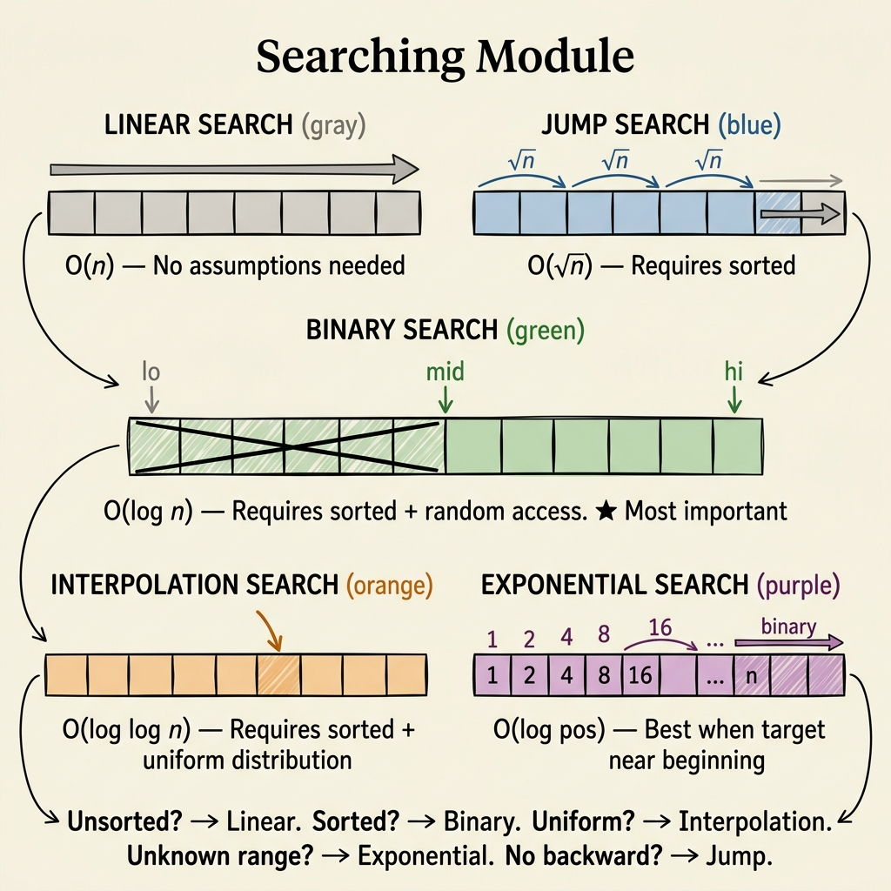

<!-- tags: dsa, algorithms, searching, overview -->
# Searching — Boundary, Predicate, and Position

> This module explains more than finding an element. It identifies the exact question type. You might seek a specific value, a boundary, or the smallest answer satisfying a condition.

📅 Created: 2026-04-04 · 🔄 Updated: 2026-04-10 · ⏱️ 8 min read

| Aspect | Detail |
| ------ | ------ |
| **Focus** | Position, boundary, and answer space |
| **Core invariant** | Never lose the domain that still contains the answer |
| **When it matters** | Any problem with sorted order or monotone predicate |

---

## 1. DEFINE

Imagine you are in an interview. The whiteboard is empty, and the clock ticks. Searching requires recognizing patterns early before brute force consumes your time. You rarely need tricks here.

Many learn searching as a collection of small algorithms. This view misses the main point. Each algorithm exists because it exploits a different data structure.
Linear Search assumes nothing except data existence. Binary Search thrives on sorted order or a monotone predicate. Exponential Search helps when you lack an upper bound. Interpolation Search shines when data distributes evenly. You use the wrong tool if you ignore these assumptions.
This hub resets your perspective. First, identify the question type. Then, pick the algorithm that minimizes checks.

### Module Articles
| Article | Core Tension | Learning Point | Link |
| --- | --- | --- | --- |
| Linear Search | No auxiliary structure to exploit | Correct but expensive baseline | [01-linear-search.md](./01-linear-search.md) |
| Binary Search | Has sorted order or phase-shift predicate | Boundary and midpoint bias | [02-binary-search.md](./02-binary-search.md) |
| Jump Search | Wants fewer comparisons on sorted data | Block step and cache trade-offs | [03-jump-search.md](./03-jump-search.md) |
| Interpolation Search | Values distribute almost evenly | Predicts position instead of mechanical halving | [04-interpolation-search.md](./04-interpolation-search.md) |
| Exponential Search | Useful upper bound remains unknown | Widens bounds before binary searching | [05-exponential-search.md](./05-exponential-search.md) |

## 2. VISUAL

This image serves as the first scan of the searching lane. It reveals the question type you are answering rather than the coolest algorithm.



A proper read shows search is not a flat family. It features at least three distinct tensions:
- finding a specific exact value
- finding the first boundary satisfying a condition
- finding an answer within a monotone search space

The flow below acts as a bridge between the router image and each detailed article.

```text

Search Question
  |
  +-- No order? -> Linear Search
  |
  +-- Has sorted order?
  |     +-- need exact value / first / last? -> Binary Search
  |     +-- unknown upper bound?             -> Exponential Search
  |     +-- uniform distribution?            -> Interpolation Search
  |
  +-- Need the smallest/largest valid answer?
        -> Binary Search on predicate
```
*Figure: "Search" is just a surface name. The real decision relies on the structure the problem allows you to exploit.*

## 3. CODE

You should read from the baseline to predicate thinking. Do not start with smarter variants before locking down boundary reasoning.

| Order | File | Why read now | Key Takeaway |
| --- | --- | --- | --- |
| 1 | [01-linear-search.md](./01-linear-search.md) | Keep baseline correct and cost model simple | Why you cannot improve without assumptions |
| 2 | [02-binary-search.md](./02-binary-search.md) | Lock boundary and invariant | How the `[lo, hi]` range keeps the answer |
| 3 | [05-exponential-search.md](./05-exponential-search.md) | Expand binary search with unknown bounds | How doubling avoids losing the answer |
| 4 | [03-jump-search.md](./03-jump-search.md) / [04-interpolation-search.md](./04-interpolation-search.md) | Read as conditional optimizations | Assumptions about distribution and access patterns |

## 4. PITFALLS

When search fails, the bug usually hides in boundaries, stop conditions, and structural assumptions rather than the main idea.

| Pitfall | Symptom | Why it fails | Fix | Severity |
| ------- | -------- | ---------- | -------- | -------- |
| Confusing exact search with boundary search | Returns a valid index but wrong occurrence | Different stop condition and update branch | Clarify if you seek value or boundary | high |
| Trusting Interpolation Search too early | Seeking interpolation just seeing numbers | Skewed distribution degrades worst-case | Use only with justified uniform distribution | medium |
| Midpoint overflow or bias | Loop hangs or skips last element | `lo/hi` updates misalign with `mid` calculation | Pick one fixed invariant and keep it | high |
| Binary search on non-monotone predicate | Sample passes but hidden test fails | Search domain lacks single phase shift | Prove monotonicity before picking binary search | high |

## 5. REF

- Binary search algorithm: https://en.wikipedia.org/wiki/Binary_search_algorithm
- CP-Algorithms binary search: https://cp-algorithms.com/num_methods/binary_search.html
- Exponential search: https://en.wikipedia.org/wiki/Exponential_search
- Interpolation search: https://en.wikipedia.org/wiki/Interpolation_search

## 6. RECOMMEND

When searching shifts from finding one value to finding an answer space, you enter pattern territory.

- If you want to master predicate thinking: visit [../patterns/binary-search/README.md](../patterns/binary-search/README.md).
- If the problem requires sorting before searching: read [../sorting/README.md](../sorting/README.md).
- If the state involves a tree or graph, search implies traversal: see [../tree-algorithms/README.md](../tree-algorithms/README.md) or [../graph/README.md](../graph/README.md).

## 7. QUICK REF

- Exact match, boundary search, and answer search present three distinct problems.
- Binary search creates an optimization illusion if the predicate lacks monotonicity.
- Exponential search equals boundary discovery followed by binary halving.
