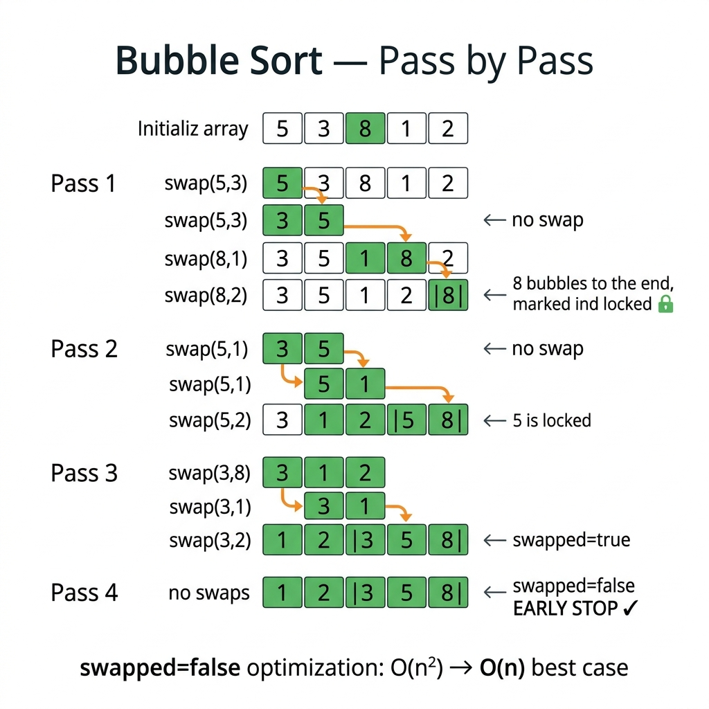

<!-- tags: dsa, algorithms, sorting, bubble-sort -->
# 🫧 Bubble Sort

> You will almost certainly not deploy Bubble Sort into production. However, in interviews and early sorting studies, it is the best topic to clearly see what a `pass`, `boundary`, `swap`, and `stability` are, and why a small optimization like `swapped=false` drops the best-case from O(n²) to O(n).

📅 Created: 2026-03-20 · 🔄 Updated: 2026-04-10 · ⏱️ 18 min read

| Aspect | Detail |
| ------ | ------ |
| **Complexity** | O(n²) average/worst · O(n) best with early-stop |
| **Use case** | Teaching baseline, tiny nearly-sorted arrays, explaining stability |
| **Recognition** | After each pass, the largest element of the unsorted zone is pushed to the end |

---

## 1. DEFINE

<!-- [Experienced layer] -->

<!-- [Beginner layer] -->
You have a messy array of numbers and want to watch the "sorting" happen. Bubble Sort is the most visible method: compare two adjacent elements, and swap them if they are out of order. Doing this multiple times causes the largest element to drift to the end like a bubble rising.

<!-- [Experienced layer] -->
`Bubble Sort` is a comparison-based, in-place, stable sort. During pass `i`, we scan the unsorted zone from left to right, swap adjacent inversions, and finish the pass with the largest element locked at the end.

Core insight: **Bubble Sort does not "find the correct element" directly; it continuously removes local inversions until none remain**.

| Variant | When to use | Key idea | Example problem |
| ------- | -------- | ------- | ------- |
| **Basic bubble** | Learning sorting from scratch | Two loops, always runs entirely | Sorting 101 |
| **Optimized bubble** | Want best-case O(n) on nearly sorted arrays | Break early if a whole pass has no swaps | Nearly sorted input |
| **Cocktail shaker** | Tiny data where small elements are far right | Scan bidirectionally to push max and pull min | Bidirectional local repair |

| Approach | Time | Space | When to choose |
| -------- | ---- | ----- | -------- |
| Bubble sort | O(n²) | O(1) | Used to teach invariants, stability, and early stops |
| Insertion sort | O(n²) | O(1) | Better than bubble on nearly-sorted input |
| Merge sort | O(n log n) | O(n) | Need large-scale stable sorting |
| Quick sort | O(n log n) average | O(log n) stack | Need practical speed, accepting unstable |

### 1.1 Fast Recognition

- The problem or lecture asks you to explain sorting step-by-step.
- You need to illustrate a `stable sort` using local swaps.
- The input is small, and the goal is to grasp how local disorder is gradually repaired.

### 1.2 Invariants & Failure Modes

<!-- [Expert layer] -->
- After pass `i`, the suffix `nums[n-i..n-1]` is properly sorted and untouchable.
- Bubble Sort is stable because equal elements do not swap if the condition uses `>`, not `>=`.
- A common failure mode is forgetting `n-1-i`, which pointlessly rescans the already-sorted suffix.
- Another conceptual failure mode is thinking Bubble Sort is "always terrible". With early-stop, the best-case is O(n), though the constant factor remains worse than insertion sort.

---

## 2. VISUAL

This card answers the article's central question: **what does each Bubble Sort pass lock, and why are local swaps enough to make the largest element float to the end?**



### Level 1 — Simple
This trace answers the question: **what does each Bubble Sort pass guarantee?**

```text
nums = [5, 3, 8, 1, 2]

Pass 1:
  5 vs 3 -> swap  => [3, 5, 8, 1, 2]
  5 vs 8 -> keep  => [3, 5, 8, 1, 2]
  8 vs 1 -> swap  => [3, 5, 1, 8, 2]
  8 vs 2 -> swap  => [3, 5, 1, 2, 8]

=> 8 is at its correct final position.
```
*Figure: A full pass does not sort the whole array, but it always locks the largest element of the unsorted zone.*

### Level 2 — Detailed
This trace answers the question: **why does `swapped=false` allow early stopping?**

```text
nums = [1, 2, 3, 4, 5]

Pass 1:
  1 vs 2 -> keep
  2 vs 3 -> keep
  3 vs 4 -> keep
  4 vs 5 -> keep

swapped = false
=> no local inversions exist
=> the array is globally sorted
=> stop immediately, skip Pass 2..4
```
*Figure: If a pass makes zero swaps, all adjacent pairs are ordered; under total order, this implies the entire array is sorted.*

## 3. CODE

Once you clearly see the suffix locking per pass, coding becomes about choosing your control level: a baseline to observe local inversions, early-stop for best-case, or bidirectional scanning to repair both ends.

### Problem 1: Basic Bubble Sort
> *(The baseline. This is where you learn `pass`, `boundary`, and local inversion.)*
>
> **Goal**: Sort ascending using basic Bubble Sort — O(n²) time, O(1) space.
> **Approach**: Two loops; the outer pass locks the suffix, the inner loop swaps out-of-order adjacent pairs.
> **Example**: `[5, 1, 4, 2, 8]` → `[1, 2, 4, 5, 8]`

```go
// bubble_sort.go — Bubble Sort: basic adjacent-swap baseline
func BubbleSort(nums []int) {
    n := len(nums)
    for pass := 0; pass < n-1; pass++ {
        // Each pass floats the largest element of the unsorted zone to the end.
        for i := 0; i < n-1-pass; i++ {
            // Only swap when strictly out of order to maintain stability.
            if nums[i] > nums[i+1] {
                nums[i], nums[i+1] = nums[i+1], nums[i]
            }
        }
    }
}
```
```typescript
// bubble_sort.ts — Bubble Sort: basic adjacent-swap baseline
function bubbleSort(nums: number[]): void {
  for (let pass = 0; pass < nums.length - 1; pass++) {
    for (let i = 0; i < nums.length - 1 - pass; i++) {
      if (nums[i] > nums[i + 1]) {
        [nums[i], nums[i + 1]] = [nums[i + 1], nums[i]];
      }
    }
  }
}
```
```java
// BubbleSortBasic.java — Bubble Sort: basic adjacent-swap baseline
final class BubbleSortBasic {
    private BubbleSortBasic() {}

    static void bubbleSort(int[] nums) {
        for (int pass = 0; pass < nums.length - 1; pass++) {
            for (int i = 0; i < nums.length - 1 - pass; i++) {
                if (nums[i] > nums[i + 1]) {
                    int temp = nums[i];
                    nums[i] = nums[i + 1];
                    nums[i + 1] = temp;
                }
            }
        }
    }
}
```
```rust
// bubble_sort.rs — Bubble Sort: basic adjacent-swap baseline
fn bubble_sort(nums: &mut [i32]) {
    let n = nums.len();
    for pass in 0..n.saturating_sub(1) {
        for i in 0..n - 1 - pass {
            if nums[i] > nums[i + 1] {
                nums.swap(i, i + 1);
            }
        }
    }
}
```
```cpp
// bubble_sort.cpp — Bubble Sort: basic adjacent-swap baseline
void bubbleSort(std::vector<int>& nums) {
    const int n = static_cast<int>(nums.size());
    for (int pass = 0; pass < n - 1; ++pass) {
        for (int i = 0; i < n - 1 - pass; ++i) {
            if (nums[i] > nums[i + 1]) {
                std::swap(nums[i], nums[i + 1]);
            }
        }
    }
}
```
```python
# bubble_sort.py — Bubble Sort: basic adjacent-swap baseline
def bubble_sort(nums: list[int]) -> None:
    for pas in range(len(nums) - 1):
        for i in range(len(nums) - 1 - pas):
            if nums[i] > nums[i + 1]:
                nums[i], nums[i + 1] = nums[i + 1], nums[i]
```

> **Why?** Bubble Sort exposes a very visible invariant: after each pass, the largest element of the unsorted region "floats" to the end. It does not actively select the correct element like Selection Sort; it merely fixes local inversions continuously until global order emerges naturally.

> **Takeaway**: Basic Bubble Sort is worth learning because its invariant is crystal clear. Its weakness is equally clear: it scans the full suffix even when the input is already correct.

---

### Problem 2: Optimized Bubble Sort with Early Stop
> *(A better interview version: same core idea but knows when to stop.)*
>
> **Goal**: Keep Bubble Sort but achieve O(n) best-case on sorted arrays.
> **Approach**: Use a `swapped` flag; if a whole pass makes zero swaps, break out.
> **Example**: `[1, 2, 3, 4, 5]` → stops right after the first pass.

```go
// bubble_sort_optimized.go — Bubble Sort: stop when one pass makes no swap
func BubbleSortOptimized(nums []int) {
    n := len(nums)
    for pass := 0; pass < n-1; pass++ {
        swapped := false

        for i := 0; i < n-1-pass; i++ {
            if nums[i] > nums[i+1] {
                nums[i], nums[i+1] = nums[i+1], nums[i]
                swapped = true
            }
        }

        // No local inversions in this pass means the array is globally sorted.
        if !swapped {
            break
        }
    }
}
```
```typescript
// bubble_sort_optimized.ts — Bubble Sort: stop when one pass makes no swap
function bubbleSortOptimized(nums: number[]): void {
  for (let pass = 0; pass < nums.length - 1; pass++) {
    let swapped = false;

    for (let i = 0; i < nums.length - 1 - pass; i++) {
      if (nums[i] > nums[i + 1]) {
        [nums[i], nums[i + 1]] = [nums[i + 1], nums[i]];
        swapped = true;
      }
    }

    if (!swapped) break;
  }
}
```
```java
// BubbleSortIntermediate.java — Bubble Sort: stop when one pass makes no swap
final class BubbleSortIntermediate {
    private BubbleSortIntermediate() {}

    static void bubbleSortOptimized(int[] nums) {
        for (int pass = 0; pass < nums.length - 1; pass++) {
            boolean swapped = false;

            for (int i = 0; i < nums.length - 1 - pass; i++) {
                if (nums[i] > nums[i + 1]) {
                    int temp = nums[i];
                    nums[i] = nums[i + 1];
                    nums[i + 1] = temp;
                    swapped = true;
                }
            }

            if (!swapped) {
                break;
            }
        }
    }
}
```
```rust
// bubble_sort_optimized.rs — Bubble Sort: stop when one pass makes no swap
fn bubble_sort_optimized(nums: &mut [i32]) {
    let n = nums.len();
    for pass in 0..n.saturating_sub(1) {
        let mut swapped = false;

        for i in 0..n - 1 - pass {
            if nums[i] > nums[i + 1] {
                nums.swap(i, i + 1);
                swapped = true;
            }
        }

        if !swapped {
            break;
        }
    }
}
```
```cpp
// bubble_sort_optimized.cpp — Bubble Sort: stop when one pass makes no swap
void bubbleSortOptimized(std::vector<int>& nums) {
    const int n = static_cast<int>(nums.size());
    for (int pass = 0; pass < n - 1; ++pass) {
        bool swapped = false;

        for (int i = 0; i < n - 1 - pass; ++i) {
            if (nums[i] > nums[i + 1]) {
                std::swap(nums[i], nums[i + 1]);
                swapped = true;
            }
        }

        if (!swapped) {
            break;
        }
    }
}
```
```python
# bubble_sort_optimized.py — Bubble Sort: stop when one pass makes no swap
def bubble_sort_optimized(nums: list[int]) -> None:
    for pas in range(len(nums) - 1):
        swapped = False
        for i in range(len(nums) - 1 - pas):
            if nums[i] > nums[i + 1]:
                nums[i], nums[i + 1] = nums[i + 1], nums[i]
                swapped = True
        if not swapped:
            break
```

> **Why?** `swapped=false` is not just a micro-optimization. It transforms Bubble Sort into an adaptive algorithm for the best case: if one pass detects zero local inversions, the global order is correct. This beautifully links a local condition to a global property.

> **Takeaway**: If an interviewer asks whether Bubble Sort can beat O(n²), this is the correct answer. However, on true nearly-sorted inputs, insertion sort typically wins because it performs fewer swaps.

---

### Problem 3: Cocktail Shaker Sort
> *(Bidirectional variant: push max right and pull min left in the same cycle.)*
>
> **Goal**: Fix local disorder at both ends faster than one-way Bubble Sort on certain small inputs.
> **Approach**: A left-to-right pass pushes max to the end, then a right-to-left pass pulls min to the front.
> **Example**: `[3, 0, 2, 5, -1, 4, 1]` → `[-1, 0, 1, 2, 3, 4, 5]`

```go
// cocktail_shaker.go — Bubble family: bidirectional adjacent-swap passes
func CocktailShakerSort(nums []int) {
    left, right := 0, len(nums)-1

    for left < right {
        swapped := false

        for i := left; i < right; i++ {
            if nums[i] > nums[i+1] {
                nums[i], nums[i+1] = nums[i+1], nums[i]
                swapped = true
            }
        }
        right--

        for i := right; i > left; i-- {
            if nums[i-1] > nums[i] {
                nums[i-1], nums[i] = nums[i], nums[i-1]
                swapped = true
            }
        }
        left++

        if !swapped {
            break
        }
    }
}
```
```typescript
// cocktail_shaker.ts — Bubble family: bidirectional adjacent-swap passes
function cocktailShakerSort(nums: number[]): void {
  let left = 0;
  let right = nums.length - 1;

  while (left < right) {
    let swapped = false;

    for (let i = left; i < right; i++) {
      if (nums[i] > nums[i + 1]) {
        [nums[i], nums[i + 1]] = [nums[i + 1], nums[i]];
        swapped = true;
      }
    }
    right--;

    for (let i = right; i > left; i--) {
      if (nums[i - 1] > nums[i]) {
        [nums[i - 1], nums[i]] = [nums[i], nums[i - 1]];
        swapped = true;
      }
    }
    left++;

    if (!swapped) break;
  }
}
```
```java
// CocktailShakerSort.java — Bubble family: bidirectional adjacent-swap passes
final class CocktailShakerSort {
    private CocktailShakerSort() {}

    static void cocktailShakerSort(int[] nums) {
        int left = 0;
        int right = nums.length - 1;

        while (left < right) {
            boolean swapped = false;

            for (int i = left; i < right; i++) {
                if (nums[i] > nums[i + 1]) {
                    int temp = nums[i];
                    nums[i] = nums[i + 1];
                    nums[i + 1] = temp;
                    swapped = true;
                }
            }
            right--;

            for (int i = right; i > left; i--) {
                if (nums[i - 1] > nums[i]) {
                    int temp = nums[i - 1];
                    nums[i - 1] = nums[i];
                    nums[i] = temp;
                    swapped = true;
                }
            }
            left++;

            if (!swapped) {
                break;
            }
        }
    }
}
```
```rust
// cocktail_shaker.rs — Bubble family: bidirectional adjacent-swap passes
fn cocktail_shaker_sort(nums: &mut [i32]) {
    if nums.len() < 2 {
        return;
    }

    let (mut left, mut right) = (0usize, nums.len() - 1);
    while left < right {
        let mut swapped = false;

        for i in left..right {
            if nums[i] > nums[i + 1] {
                nums.swap(i, i + 1);
                swapped = true;
            }
        }
        right -= 1;

        for i in (left + 1..=right).rev() {
            if nums[i - 1] > nums[i] {
                nums.swap(i - 1, i);
                swapped = true;
            }
        }
        left += 1;

        if !swapped {
            break;
        }
    }
}
```
```cpp
// cocktail_shaker.cpp — Bubble family: bidirectional adjacent-swap passes
void cocktailShakerSort(std::vector<int>& nums) {
    if (nums.size() < 2) return;

    int left = 0;
    int right = static_cast<int>(nums.size()) - 1;
    while (left < right) {
        bool swapped = false;

        for (int i = left; i < right; ++i) {
            if (nums[i] > nums[i + 1]) {
                std::swap(nums[i], nums[i + 1]);
                swapped = true;
            }
        }
        --right;

        for (int i = right; i > left; --i) {
            if (nums[i - 1] > nums[i]) {
                std::swap(nums[i - 1], nums[i]);
                swapped = true;
            }
        }
        ++left;

        if (!swapped) break;
    }
}
```
```python
# cocktail_shaker.py — Bubble family: bidirectional adjacent-swap passes
def cocktail_shaker_sort(nums: list[int]) -> None:
    if len(nums) < 2:
        return

    left, right = 0, len(nums) - 1
    while left < right:
        swapped = False

        for i in range(left, right):
            if nums[i] > nums[i + 1]:
                nums[i], nums[i + 1] = nums[i + 1], nums[i]
                swapped = True
        right -= 1

        for i in range(right, left, -1):
            if nums[i - 1] > nums[i]:
                nums[i - 1], nums[i] = nums[i], nums[i - 1]
                swapped = True
        left += 1

        if not swapped:
            break
```

> **Why?** One-way Bubble Sort repairs local disorder well for large elements on the left, but is terribly slow when small elements sit far right. Cocktail Shaker handles both directions in one cycle, reducing pass count on inputs with "turtles" (small elements at the end). It remains O(n²), giving you a great intuition about how reversing the scan direction repairs different disorder types.

> **Takeaway**: Cocktail Shaker is a fascinating variant to deepen your understanding of sorting passes, but it still does not rescue the O(n²) nature of the bubble family.

---

## 4. PITFALLS

In sorting, mistakes are rarely just syntax. They usually stem from misunderstanding which area is safe and which area is still moving.

| # | Severity | Defect | Consequence | Fix |
|---|----------|-----|---------|-----|
| 1 | 🔴 Fatal | Using `>=` instead of `>` for comparisons | Loss of stability; equal elements swap relative order | Only swap when `nums[i] > nums[i+1]` |
| 2 | 🟡 Common | Forgetting `n-1-pass` in the inner loop | Already-sorted suffix is scanned pointlessly | Shrink the right boundary after each pass |
| 3 | 🟡 Common | Adding `swapped` but forgetting to reset it | Early-stop fails, breaking incorrectly or not at all | Reset `swapped=false` at the start of each pass |
| 4 | 🟡 Common | Assuming nearly-sorted Bubble Sort is always fine | Wrong algorithm choice, slower than insertion sort | Prefer Insertion Sort for nearly sorted inputs |
| 5 | 🔵 Minor | Using Bubble Sort for production benchmarks | Wrong conclusions about sorting performance | Treat bubble as a teaching or interview baseline only |

---

## 5. REF

| Resource | Type | Link | Notes |
| -------- | ---- | ---- | ------- |
| Bubble sort | Official reference | https://en.wikipedia.org/wiki/Bubble_sort | Properties, stability, and variants overview |
| Sorting and searching | Book | https://algs4.cs.princeton.edu/21elementary/ | Groups elementary sorts for intuition comparison |
| Go slices package | Official docs | https://pkg.go.dev/slices | Contrast with practical sorting in Go |

---

## 6. RECOMMEND

Once Bubble Sort clarifies local inversions and pass boundaries, the next step is contrasting it with algorithms that keep the same intuition but spend their cost more wisely or partition entirely differently.

| Next Topic | Why read it next | Link |
| ------------- | ------------------- | ---- |
| Insertion Sort | Also O(n²) but far more practical on nearly-sorted input | [03-insertion-sort.md](./03-insertion-sort.md) |
| Selection Sort | Compare the number of swaps and stability | [02-selection-sort.md](./02-selection-sort.md) |
| Dutch National Flag | See partition-based sorting which radically differs from adjacent swaps | [06-dutch-national-flag.md](./06-dutch-national-flag.md) |

---

## 7. QUICK REF

**Template**

```text
for each pass:
  swapped = false
  for each adjacent pair in unsorted range:
    if out of order:
      swap
      swapped = true
  if not swapped:
    break
```

**Pattern recognition**

- If asked to illustrate sorting step-by-step: Bubble Sort is the easiest baseline to trace.
- If asked about `stable`, `in-place`, or `adjacent swap`: think of Bubble Sort or Insertion Sort.
- If asked for `best-case O(n) via early stop`: optimized Bubble Sort is the textbook example.

---

Returning to the opening question: why is `swapped=false` important? Because it transforms an O(n²) algorithm into O(n) on sorted data—a tiny optimization that completely changes the best-case behavior.
