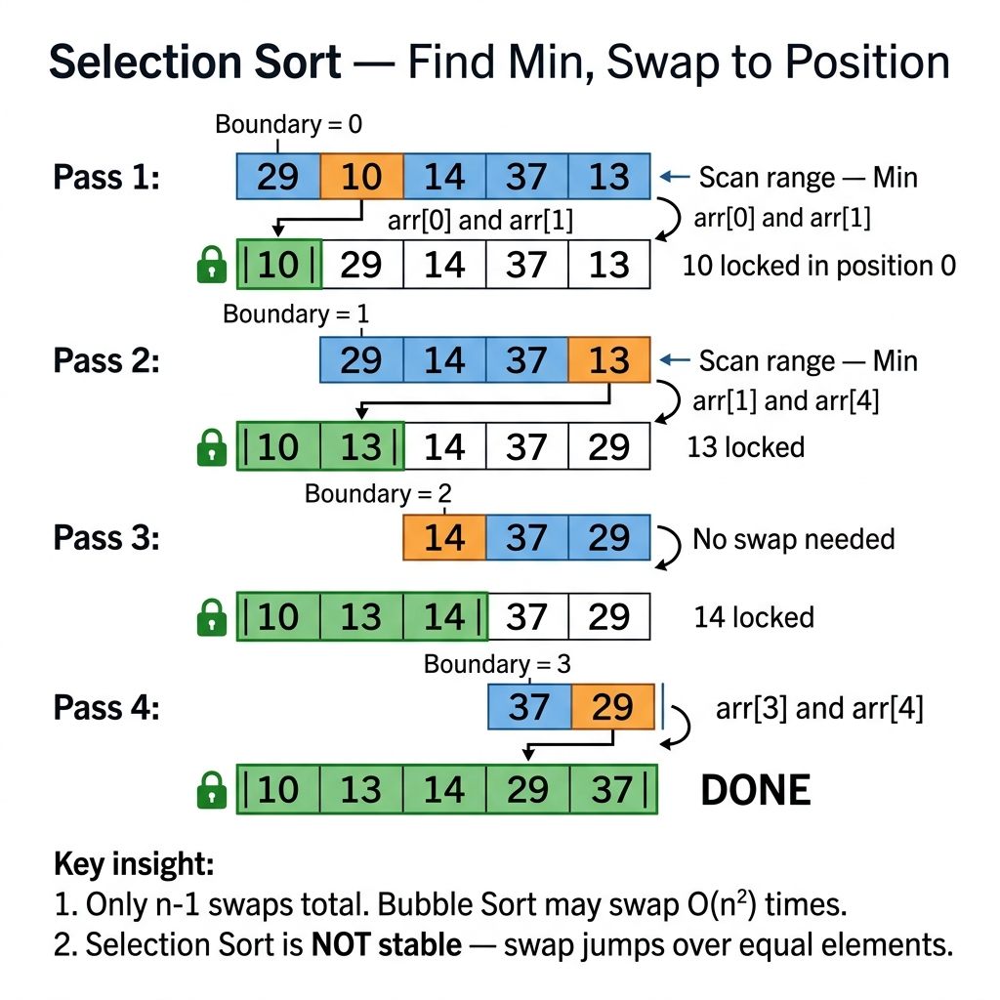

<!-- tags: dsa, algorithms, sorting, selection-sort -->
# 🎯 Selection Sort

> Selection Sort does not nudge elements into place little by little like Bubble Sort. It hunts for the absolutely correct element for the current position and locks it immediately. Thus, this is an excellent topic to distinguish two sorting mindsets: repairing local disorder incrementally versus committing absolute positions per boundary.

📅 Created: 2026-03-20 · 🔄 Updated: 2026-04-10 · ⏱️ 17 min read

| Aspect | Detail |
| ------ | ------ |
| **Complexity** | O(n²) time · O(1) extra space |
| **Use case** | Teaching boundary selection, minimize swap count, tiny arrays |
| **Recognition** | Each pass selects the absolute best min/max for the current boundary position |

---

## 1. DEFINE

Imagine sorting a tiny array in an interview or an algorithms class, and you want each pass to lock exactly one boundary rather than swapping randomly everywhere. That is when the `Selection Sort` intuition becomes useful.

<!-- [Beginner layer] -->
You are sorting an array and looking at the very first slot. Instead of constantly swapping adjacent pairs, you ask: "Which element is the absolute smallest in the rest of the array? Let's just put it here now." That is the core idea of Selection Sort.

<!-- [Experienced layer] -->
`Selection Sort` partitions the array into two zones: a sorted prefix and an unsorted suffix. Every pass, it scans the suffix to locate the minimum element, then performs a single swap with the first element of that suffix. It remains O(n²) because the search for min requires a full scan, but the swap count maxes out at O(n).

Core insight: **Selection Sort optimizes the swap count, not the comparison count**.

| Variant | When to use | Key idea | Example problem |
| ------- | -------- | ------- | ------- |
| **Basic selection** | Lock min for each slot from left to right | 1 pass = 1 boundary decided | Intro sorting |
| **Double selection** | Want to grab both min and max per loop | Scan between two shrinking boundaries | Tiny arrays / teaching |
| **Stable selection** | Need to preserve relative order of equal elements | Shift elements instead of swapping | Stable O(n²) demo |

| Approach | Time | Space | When to choose |
| -------- | ---- | ----- | -------- |
| Selection sort | O(n²) | O(1) | Want fewer swaps, simple boundary logic |
| Bubble sort | O(n²) | O(1) | Want to illustrate local swaps + stability |
| Insertion sort | O(n²) | O(1) | Input nearly sorted, need practical performance |

### 1.1 Fast Recognition

- The problem emphasizes "selecting the smallest/largest element per step".
- You want to reduce write/swap operations instead of comparisons.
- You need to learn how left/right boundaries shrink after each pass.

### 1.2 Invariants & Failure Modes

<!-- [Expert layer] -->
- After pass `i`, the prefix `nums[0..i]` contains the `i+1` smallest elements of the entire array, in exact order.
- Basic selection sort is **unstable** because a swap can drag an equal element past another equal element.
- A common failure mode is executing a swap even when `minIndex == i`; it is logically correct but increases writes needlessly.

---

## 2. VISUAL

This card answers the article's central question: **how does Selection Sort lock the current boundary, and why doesn't minimizing swaps guarantee minimal comparisons or stability?**



### Level 1 — Simple
This trace answers the question: **what does each pass of Selection Sort lock?**

```text
nums = [29, 10, 14, 37, 13]

Pass 1:
  find min in [29, 10, 14, 37, 13] => 10 at index 1
  swap index 0 with index 1
  => [10, 29, 14, 37, 13]

Pass 2:
  find min in [29, 14, 37, 13] => 13 at index 4
  swap index 1 with index 4
  => [10, 13, 14, 37, 29]
```
*Figure: Selection Sort does not repair local disorder gradually; it grabs the perfect element for the current boundary and locks that boundary immediately.*

### Level 2 — Detailed
This trace answers the question: **why does basic selection sort lose stability?**

```text
Input with labels: [(2,a), (2,b), (1,x)]

Pass 1:
  min = (1,x)
  swap with index 0
  => [(1,x), (2,b), (2,a)]

Relative order of equal keys changed:
  (2,a) was before (2,b)
  now (2,b) is before (2,a)
```
*Figure: A single long-distance swap can drag an element past its equal counterpart, rendering basic selection sort unstable.*

## 3. CODE

Once boundary commitment is visually clear, coding is just picking your write cost: keeping a single swap per pass, expanding to both ends, or paying more writes to buy back stability.

### Problem 1: Basic Selection Sort
> *(The baseline for the "lock one boundary per pass" pattern.)*
>
> **Goal**: Sort ascending using basic selection sort — O(n²) time, O(1) space.
> **Approach**: For each `i`, scan `[i..n-1]` to find `minIndex`, then swap it to `i`.
> **Example**: `[29, 10, 14, 37, 13]` → `[10, 13, 14, 29, 37]`

```go
// selection_sort.go — Selection Sort: choose minimum for each boundary
func SelectionSort(nums []int) {
    n := len(nums)
    for i := 0; i < n-1; i++ {
        minIndex := i
        for j := i + 1; j < n; j++ {
            // The inner loop does not swap continuously; it merely hunts for the best candidate.
            if nums[j] < nums[minIndex] {
                minIndex = j
            }
        }

        if minIndex != i {
            nums[i], nums[minIndex] = nums[minIndex], nums[i]
        }
    }
}
```
```typescript
// selection_sort.ts — Selection Sort: choose minimum for each boundary
function selectionSort(nums: number[]): void {
  for (let i = 0; i < nums.length - 1; i++) {
    let minIndex = i;
    for (let j = i + 1; j < nums.length; j++) {
      if (nums[j] < nums[minIndex]) {
        minIndex = j;
      }
    }
    if (minIndex !== i) {
      [nums[i], minIndex]] = [nums[minIndex], nums[i]];
    }
  }
}
```
```java
// SelectionSortBasic.java — Selection Sort: choose minimum for each boundary
final class SelectionSortBasic {
    private SelectionSortBasic() {}

    static void selectionSort(int[] nums) {
        for (int i = 0; i < nums.length - 1; i++) {
            int minIndex = i;
            for (int j = i + 1; j < nums.length; j++) {
                if (nums[j] < nums[minIndex]) {
                    minIndex = j;
                }
            }
            if (minIndex != i) {
                int temp = nums[i];
                nums[i] = nums[minIndex];
                nums[minIndex] = temp;
            }
        }
    }
}
```
```rust
// selection_sort.rs — Selection Sort: choose minimum for each boundary
fn selection_sort(nums: &mut [i32]) {
    for i in 0..nums.len().saturating_sub(1) {
        let mut min_index = i;
        for j in i + 1..nums.len() {
            if nums[j] < nums[min_index] {
                min_index = j;
            }
        }
        if min_index != i {
            nums.swap(i, min_index);
        }
    }
}
```
```cpp
// selection_sort.cpp — Selection Sort: choose minimum for each boundary
void selectionSort(std::vector<int>& nums) {
    for (int i = 0; i < static_cast<int>(nums.size()) - 1; ++i) {
        int minIndex = i;
        for (int j = i + 1; j < static_cast<int>(nums.size()); ++j) {
            if (nums[j] < nums[minIndex]) {
                minIndex = j;
            }
        }
        if (minIndex != i) {
            std::swap(nums[i], nums[minIndex]);
        }
    }
}
```
```python
# selection_sort.py — Selection Sort: choose minimum for each boundary
def selection_sort(nums: list[int]) -> None:
    for i in range(len(nums) - 1):
        min_index = i
        for j in range(i + 1, len(nums)):
            if nums[j] < nums[min_index]:
                min_index = j
        if min_index != i:
            nums[i], nums[min_index] = nums[min_index], nums[i]
```

> **Why?** Selection Sort differs from Bubble Sort because it ignores local inversions entirely; it scans the whole suffix before committing exactly one swap for the current boundary. Therefore, it saves writes but cannot save comparisons.

> **Takeaway**: Basic Selection Sort is great for practicing boundary invariants. Its weakness is that even if the array is already sorted, it still scans the entire suffix to verify the min is truly the min.

---

### Problem 2: Double Selection Sort
> *(A variant that exposes two-sided boundaries clearly.)*
>
> **Goal**: Lock both min on the left and max on the right in every cycle.
> **Approach**: Scan the segment `[left..right]`, update `minIndex` and `maxIndex` in parallel, then swap twice.
> **Example**: `[7, 2, 9, 4, 3, 8]` → `[2, 3, 4, 7, 8, 9]`

```go
// double_selection_sort.go — Selection Sort: place min and max together
func DoubleSelectionSort(nums []int) {
    left, right := 0, len(nums)-1

    for left < right {
        minIndex, maxIndex := left, left

        for i := left; i <= right; i++ {
            if nums[i] < nums[minIndex] {
                minIndex = i
            }
            if nums[i] > nums[maxIndex] {
                maxIndex = i
            }
        }

        nums[left], nums[minIndex] = nums[minIndex], nums[left]

        // If max was sitting at 'left' before the min swap, it has been moved to minIndex.
        if maxIndex == left {
            maxIndex = minIndex
        }
        nums[right], nums[maxIndex] = nums[maxIndex], nums[right]

        left++
        right--
    }
}
```
```typescript
// double_selection_sort.ts — Selection Sort: place min and max together
function doubleSelectionSort(nums: number[]): void {
  let left = 0;
  let right = nums.length - 1;

  while (left < right) {
    let minIndex = left;
    let maxIndex = left;

    for (let i = left; i <= right; i++) {
      if (nums[i] < nums[minIndex]) minIndex = i;
      if (nums[i] > nums[maxIndex]) maxIndex = i;
    }

    [nums[left], nums[minIndex]] = [nums[minIndex], nums[left]];
    if (maxIndex === left) maxIndex = minIndex;
    [nums[right], nums[maxIndex]] = [nums[maxIndex], nums[right]];

    left++;
    right--;
  }
}
```
```java
// SelectionSortIntermediate.java — Selection Sort: place min and max together
final class SelectionSortIntermediate {
    private SelectionSortIntermediate() {}

    static void doubleSelectionSort(int[] nums) {
        int left = 0;
        int right = nums.length - 1;

        while (left < right) {
            int minIndex = left;
            int maxIndex = left;

            for (int i = left; i <= right; i++) {
                if (nums[i] < nums[minIndex]) minIndex = i;
                if (nums[i] > nums[maxIndex]) maxIndex = i;
            }

            int temp = nums[left];
            nums[left] = nums[minIndex];
            nums[minIndex] = temp;

            if (maxIndex == left) maxIndex = minIndex;

            temp = nums[right];
            nums[right] = nums[maxIndex];
            nums[maxIndex] = temp;

            left++;
            right--;
        }
    }
}
```
```rust
// double_selection_sort.rs — Selection Sort: place min and max together
fn double_selection_sort(nums: &mut [i32]) {
    if nums.is_empty() {
        return;
    }

    let (mut left, mut right) = (0usize, nums.len() - 1);
    while left < right {
        let (mut min_index, mut max_index) = (left, left);

        for i in left..=right {
            if nums[i] < nums[min_index] {
                min_index = i;
            }
            if nums[i] > nums[max_index] {
                max_index = i;
            }
        }

        nums.swap(left, min_index);
        if max_index == left {
            max_index = min_index;
        }
        nums.swap(right, max_index);

        left += 1;
        right = right.saturating_sub(1);
    }
}
```
```cpp
// double_selection_sort.cpp — Selection Sort: place min and max together
void doubleSelectionSort(std::vector<int>& nums) {
    int left = 0;
    int right = static_cast<int>(nums.size()) - 1;

    while (left < right) {
        int minIndex = left;
        int maxIndex = left;

        for (int i = left; i <= right; ++i) {
            if (nums[i] < nums[minIndex]) minIndex = i;
            if (nums[i] > nums[maxIndex]) maxIndex = i;
        }

        std::swap(nums[left], nums[minIndex]);
        if (maxIndex == left) maxIndex = minIndex;
        std::swap(nums[right], nums[maxIndex]);

        ++left;
        --right;
    }
}
```
```python
# double_selection_sort.py — Selection Sort: place min and max together
def double_selection_sort(nums: list[int]) -> None:
    left, right = 0, len(nums) - 1
    while left < right:
        min_index = left
        max_index = left
        for i in range(left, right + 1):
            if nums[i] < nums[min_index]:
                min_index = i
            if nums[i] > nums[max_index]:
                max_index = i

        nums[left], nums[min_index] = nums[min_index], nums[left]
        if max_index == left:
            max_index = min_index
        nums[right], nums[max_index] = nums[max_index], nums[right]

        left += 1
        right -= 1
```

> **Why?** This variant does not improve big-O, but it exposes a brilliant interview bug: when swapping `min` first, `maxIndex` becomes invalid if it pointed to `left`. If you neglect to update this index, your code yields wrong answers on a narrow set of test cases.

> **Takeaway**: Double Selection Sort is worth learning because it forces you to track index invalidation after swaps, a highly valuable skill for partitioning and in-place array algorithms.

---

### Problem 3: Stable Selection Sort
> *(When stability is required, rough swapping is no longer viable.)*
>
> **Goal**: Preserve the relative order of equal elements while keeping the "select min" concept.
> **Approach**: Find the minimum, shift the block `[i..minIndex-1]` one step right, then insert min at `i`.
> **Example**: `[(2,a), (2,b), (1,x)]` → `[(1,x), (2,a), (2,b)]`

```go
// stable_selection_sort.go — Selection Sort: preserve equal-key order by shifting
type Pair struct {
    Key   int
    Label string
}

func StableSelectionSort(nums []Pair) {
    for i := 0; i < len(nums)-1; i++ {
        minIndex := i
        for j := i + 1; j < len(nums); j++ {
            if nums[j].Key < nums[minIndex].Key {
                minIndex = j
            }
        }

        minValue := nums[minIndex]
        // Instead of swapping, shift the block right to preserve relative order.
        for minIndex > i {
            nums[minIndex] = nums[minIndex-1]
            minIndex--
        }
        nums[i] = minValue
    }
}
```
```typescript
// stable_selection_sort.ts — Selection Sort: preserve equal-key order by shifting
type Pair = { key: number; label: string };

function stableSelectionSort(nums: Pair[]): void {
  for (let i = 0; i < nums.length - 1; i++) {
    let minIndex = i;
    for (let j = i + 1; j < nums.length; j++) {
      if (nums[j].key < nums[minIndex].key) {
        minIndex = j;
      }
    }

    const minValue = nums[minIndex];
    while (minIndex > i) {
      nums[minIndex] = nums[minIndex - 1];
      minIndex--;
    }
    nums[i] = minValue;
  }
}
```
```java
// StableSelectionSort.java — Selection Sort: preserve equal-key order by shifting
final class StableSelectionSort {
    static final class Pair {
        int key;
        String label;

        Pair(int key, String label) {
            this.key = key;
            this.label = label;
        }
    }

    private StableSelectionSort() {}

    static void stableSelectionSort(Pair[] nums) {
        for (int i = 0; i < nums.length - 1; i++) {
            int minIndex = i;
            for (int j = i + 1; j < nums.length; j++) {
                if (nums[j].key < nums[minIndex].key) {
                    minIndex = j;
                }
            }

            Pair minValue = nums[minIndex];
            while (minIndex > i) {
                nums[minIndex] = nums[minIndex - 1];
                minIndex--;
            }
            nums[i] = minValue;
        }
    }
}
```
```rust
// stable_selection_sort.rs — Selection Sort: preserve equal-key order by shifting
#[derive(Clone)]
struct Pair {
    key: i32,
    label: String,
}

fn stable_selection_sort(nums: &mut [Pair]) {
    for i in 0..nums.len().saturating_sub(1) {
        let mut min_index = i;
        for j in i + 1..nums.len() {
            if nums[j].key < nums[min_index].key {
                min_index = j;
            }
        }

        let min_value = nums[min_index].clone();
        while min_index > i {
            nums[min_index] = nums[min_index - 1].clone();
            min_index -= 1;
        }
        nums[i] = min_value;
    }
}
```
```cpp
// stable_selection_sort.cpp — Selection Sort: preserve equal-key order by shifting
struct Pair {
    int key;
    std::string label;
};

void stableSelectionSort(std::vector<Pair>& nums) {
    for (int i = 0; i < static_cast<int>(nums.size()) - 1; ++i) {
        int minIndex = i;
        for (int j = i + 1; j < static_cast<int>(nums.size()); ++j) {
            if (nums[j].key < nums[minIndex].key) {
                minIndex = j;
            }
        }

        Pair minValue = nums[minIndex];
        while (minIndex > i) {
            nums[minIndex] = nums[minIndex - 1];
            --minIndex;
        }
        nums[i] = minValue;
    }
}
```
```python
# stable_selection_sort.py — Selection Sort: preserve equal-key order by shifting
from dataclasses import dataclass

@dataclass
class Pair:
    key: int
    label: str

def stable_selection_sort(nums: list[Pair]) -> None:
    for i in range(len(nums) - 1):
        min_index = i
        for j in range(i + 1, len(nums)):
            if nums[j].key < nums[min_index].key:
                min_index = j

        min_value = nums[min_index]
        while min_index > i:
            nums[min_index] = nums[min_index - 1]
            min_index -= 1
        nums[i] = min_value
```

> **Why?** Basic selection sort is unstable because one swap can pull a new element forward while dragging its equal counterpart backward. The stable version replaces swaps with shifting the entire block right, meaning internal relative order stays intact. In return, the write count increases.

> **Takeaway**: Stable Selection Sort acts as a prime trade-off lesson: demanding stability while maintaining the "select min" pattern forces you to pay heavily in data movement.

---

## 4. PITFALLS

In sorting, mistakes are rarely just syntax. They usually stem from misunderstanding which area is safe and which area is still moving.

| # | Severity | Defect | Consequence | Fix |
|---|----------|-----|---------|-----|
| 1 | 🔴 Fatal | Forgetting to update `maxIndex` after swapping `min` in double-selection | Corrupts data on the right half | If `maxIndex == left`, reassign it to `minIndex` |
| 2 | 🟡 Common | Assuming Selection Sort is stable like Bubble Sort | Flawed algorithm analysis | Remember basic selection is inherently unstable |
| 3 | 🟡 Common | Swapping even when `minIndex == i` | Causes useless writes and messy code | Only swap when the boundary differs from the min |
| 4 | 🟡 Common | Using Selection Sort expecting speed on nearly-sorted data | Fails to exploit the "nearly sorted" advantage | Switch to Insertion Sort |
| 5 | 🔵 Minor | Not clarifying the "fewer swaps but still many compares" trade-off | Misses crucial insight when comparing algorithms | Highlight Selection Sort's true optimization target |

---

## 5. REF

| Resource | Type | Link | Notes |
| -------- | ---- | ---- | ------- |
| Selection sort | Official reference | https://en.wikipedia.org/wiki/Selection_sort | Properties and stability discussion |
| Elementary sorts | Book | https://algs4.cs.princeton.edu/21elementary/ | Compares bubble, selection, and insertion |
| Go slices package | Official docs | https://pkg.go.dev/slices | Contrast with practical sorting in Go |

---

## 6. RECOMMEND

Once Selection Sort clarifies the cost of committing an exact position per pass, the next step is comparing it with local repair or divide-and-conquer to see where true algorithmic trade-offs lie.

| Next Topic | Why read it next | Link |
| ------------- | ------------------- | ---- |
| Bubble Sort | Compare "repair local inversions" with "select absolute min" | [01-bubble-sort.md](./01-bubble-sort.md) |
| Insertion Sort | Also O(n²) but far more adaptive on nearly-sorted input | [03-insertion-sort.md](./03-insertion-sort.md) |
| Merge Sort | See the massive leap from elementary sort to divide-and-conquer | [04-merge-sort.md](./04-merge-sort.md) |

---

## 7. QUICK REF

**Template**

```text
for i in [0..n-2]:
  minIndex = i
  scan suffix [i+1..n-1]
  place smallest element at i
```

**Pattern recognition**

- If the problem demands "lock the absolutely correct element for the boundary each pass" -> Selection Sort mindset.
- If a follow-up asks for stability -> basic selection fails; you must shift instead of swap.
- If a follow-up asks "does it swap less than bubble?" -> yes, but comparisons are still O(n²).

---

Returning to the opening question: why is "choosing the correct element" different from "repairing local disorder"? Because Selection Sort commits to the right position instantly and never looks back. It achieves fewer swaps but requires O(n²) comparisons universally.
