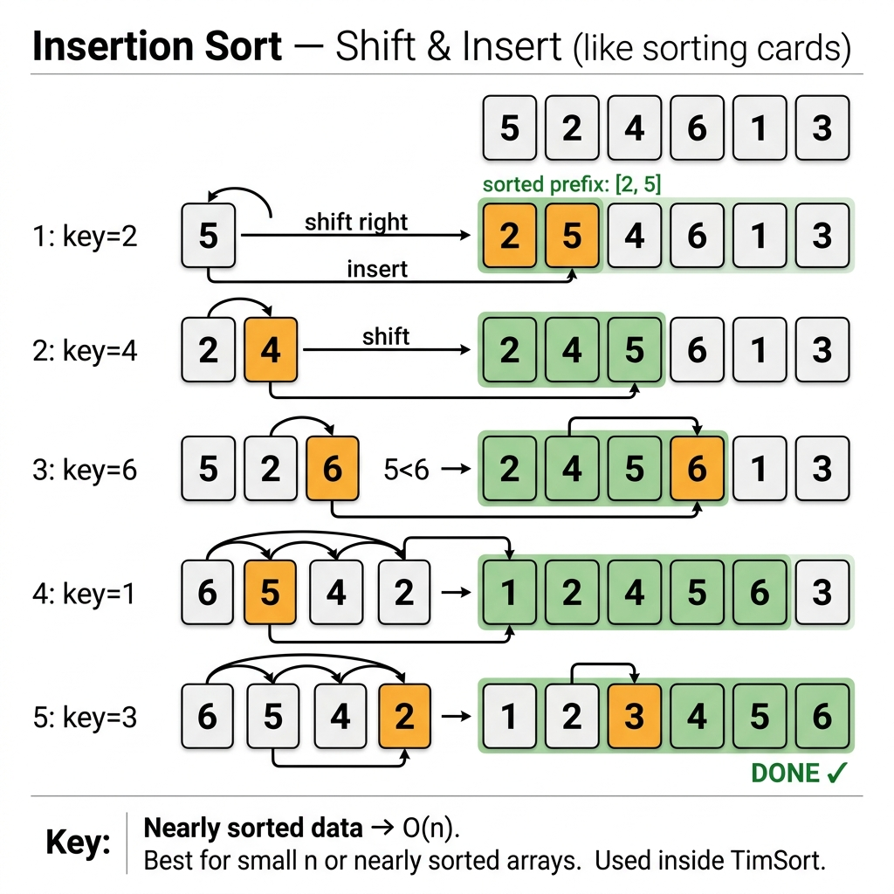

<!-- tags: dsa, algorithms, sorting, insertion-sort -->
# 🃏 Insertion Sort

> Insertion Sort makes many rethink the O(n²) algorithm group: not all quadratic algorithms are equally terrible. When data is nearly sorted, the actual cost of insertion sort drops so low that it becomes a practical component in hybrid sorts and standard libraries.

📅 Created: 2026-03-20 · 🔄 Updated: 2026-04-10 · ⏱️ 20 min read

| Aspect | Detail |
| ------ | ------ |
| **Complexity** | O(n²) average/worst · O(n) best |
| **Use case** | Nearly-sorted input, tiny arrays, online insertion, hybrid sort cutoff |
| **Recognition** | The left prefix is always sorted; a new element is inserted into its correct prefix slot |

---

## 1. DEFINE

<!-- [Experienced layer] -->

<!-- [Beginner layer] -->
You hold a hand of playing cards and draw a new card, sliding it into the exact correct slot among the cards already sorted in your hand. That is the perfect intuition for Insertion Sort: each step simply finds where the current element belongs within the existing sorted prefix.

<!-- [Experienced layer] -->
`Insertion Sort` maintains the invariant that the prefix `nums[0..i-1]` is always sorted. At step `i`, we take `nums[i]` as the `key`, shift larger elements rightward, and insert the `key` into the newly created gap.

Core insight: **Insertion Sort's cost depends on the actual number of inversions it must repair, not just on the size n**.

| Variant | When to use | Key idea | Example problem |
| ------- | -------- | ------- | ------- |
| **Basic insertion** | Intro sorting, nearly-sorted arrays | Shift then insert `key` | Elementary sort |
| **Binary insertion** | Want to reduce comparisons | Use binary search to find the insertion point | Comparison optimization |
| **Linked-list insertion** | Data is a list or stream | Insert a node into the sorted prefix | Online ordered structure |

| Approach | Time | Space | When to choose |
| -------- | ---- | ----- | -------- |
| Insertion sort | O(n²) | O(1) | Nearly sorted, small n, stable sort |
| Bubble sort | O(n²) | O(1) | Want illustrative adjacent swaps |
| Selection sort | O(n²) | O(1) | Want fewer writes overall |
| Merge sort | O(n log n) | O(n) | Large scale data, need stability |

### 1.1 Fast Recognition

- The "already correct" prefix can gradually expand.
- The input is nearly sorted, featuring a low inversion count.
- You need a simple, in-place, stable sort.

### 1.2 Invariants & Failure Modes

<!-- [Expert layer] -->
- Before step `i`, `nums[0..i-1]` is completely sorted.
- After shifting elements `> key`, index `j+1` is the only valid insertion point for `key`.
- Common failure mode: using continuous swaps instead of block shifting, which obscures the invariant and increases write overhead pointlessly.

---

## 2. VISUAL

This card answers the central question: **how does a new element enter a sorted prefix, and why does the true cost rely on inversions rather than a blind n²?**



### Level 1 — Simple
This trace answers the question: **how does the sorted prefix expand step by step?**

```text
nums = [5, 2, 4, 6, 1, 3]

Step i=1, key=2:
  [5] | 2 4 6 1 3
  shift 5 to the right
  [2, 5] | 4 6 1 3

Step i=2, key=4:
  [2, 5] | 4 6 1 3
  shift 5 to the right
  [2, 4, 5] | 6 1 3
```
*Figure: Insertion Sort does not resort the whole array each time; it simply finds the correct slot for the new element inside the sorted prefix.*

### Level 2 — Detailed
This trace answers the question: **why is insertion sort incredibly strong on nearly-sorted input?**

```text
nums = [1, 2, 3, 5, 4, 6]

Only one inversion: (5,4)

i=4, key=4:
  prefix = [1,2,3,5]
  only need to shift 5 one step right
  insert 4 into the gap

=> total data movement is tiny despite n
```
*Figure: Insertion Sort's actual cost scales almost linearly with the inversions repaired; if data is nearly sorted, it performs vastly faster than its "O(n²)" label suggests.*

## 3. CODE

Once the sorted prefix shines through the visuals, coding merely requires swapping how you locate the insertion point or applying the insert logic to a different underlying data structure.

### Problem 1: Basic Insertion Sort
> *(The gold standard of the "sorted prefix + insert key" pattern.)*
>
> **Goal**: Sort ascending using stable insertion sort — O(n²) worst, O(n) best.
> **Approach**: For each `key`, shift larger prefix elements right, then insert the key into the gap.
> **Example**: `[5, 2, 4, 6, 1, 3]` → `[1, 2, 3, 4, 5, 6]`

```go
// insertion_sort.go — Insertion Sort: shift larger values, then insert key
func InsertionSort(nums []int) {
    for i := 1; i < len(nums); i++ {
        key := nums[i]
        j := i - 1

        // Shift the entire block larger than the key one step right.
        for j >= 0 && nums[j] > key {
            nums[j+1] = nums[j]
            j--
        }

        nums[j+1] = key
    }
}
```
```typescript
// insertion_sort.ts — Insertion Sort: shift larger values, then insert key
function insertionSort(nums: number[]): void {
  for (let i = 1; i < nums.length; i++) {
    const key = nums[i];
    let j = i - 1;

    while (j >= 0 && nums[j] > key) {
      nums[j + 1] = nums[j];
      j--;
    }

    nums[j + 1] = key;
  }
}
```
```java
// InsertionSortBasic.java — Insertion Sort: shift larger values, then insert key
final class InsertionSortBasic {
    private InsertionSortBasic() {}

    static void insertionSort(int[] nums) {
        for (int i = 1; i < nums.length; i++) {
            int key = nums[i];
            int j = i - 1;

            while (j >= 0 && nums[j] > key) {
                nums[j + 1] = nums[j];
                j--;
            }

            nums[j + 1] = key;
        }
    }
}
```
```rust
// insertion_sort.rs — Insertion Sort: shift larger values, then insert key
fn insertion_sort(nums: &mut [i32]) {
    for i in 1..nums.len() {
        let key = nums[i];
        let mut j = i;

        while j > 0 && nums[j - 1] > key {
            nums[j] = nums[j - 1];
            j -= 1;
        }

        nums[j] = key;
    }
}
```
```cpp
// insertion_sort.cpp — Insertion Sort: shift larger values, then insert key
void insertionSort(std::vector<int>& nums) {
    for (int i = 1; i < static_cast<int>(nums.size()); ++i) {
        int key = nums[i];
        int j = i - 1;

        while (j >= 0 && nums[j] > key) {
            nums[j + 1] = nums[j];
            --j;
        }

        nums[j + 1] = key;
    }
}
```
```python
# insertion_sort.py — Insertion Sort: shift larger values, then insert key
def insertion_sort(nums: list[int]) -> None:
    for i in range(1, len(nums)):
        key = nums[i]
        j = i - 1
        while j >= 0 and nums[j] > key:
            nums[j + 1] = nums[j]
            j -= 1
        nums[j + 1] = key
```

> **Why?** Insertion Sort thrives on nearly-sorted data because it never pointlessly scans the entire suffix. It merely shifts elements strictly larger than the `key`, tightly coupling its true runtime to the actual inversions remaining.

> **Takeaway**: Basic Insertion Sort showcases the algorithm in its purest form: zero arbitrary swapping, no reliance on extra buffers, and an easily provable invariant.

---

### Problem 2: Binary Insertion Sort
> *(Reduces comparisons, but does not eliminate data movement.)*
>
> **Goal**: Use binary search to discover the insertion point, saving prefix comparisons.
> **Approach**: Binary search for the insertion index, then execute the standard right-shift.
> **Example**: `[5, 2, 4, 6, 1, 3]` → same output, fewer comparisons on a large prefix.

```go
// binary_insertion_sort.go — Insertion Sort: binary-search the insertion position
func BinaryInsertionSort(nums []int) {
    for i := 1; i < len(nums); i++ {
        key := nums[i]

        left, right := 0, i
        for left < right {
            mid := left + (right-left)/2
            if nums[mid] <= key {
                left = mid + 1
            } else {
                right = mid
            }
        }

        for j := i; j > left; j-- {
            nums[j] = nums[j-1]
        }
        nums[left] = key
    }
}
```
```typescript
// binary_insertion_sort.ts — Insertion Sort: binary-search the insertion position
function binaryInsertionSort(nums: number[]): void {
  for (let i = 1; i < nums.length; i++) {
    const key = nums[i];
    let left = 0;
    let right = i;

    while (left < right) {
      const mid = left + Math.floor((right - left) / 2);
      if (nums[mid] <= key) left = mid + 1;
      else right = mid;
    }

    for (let j = i; j > left; j--) {
      nums[j] = nums[j - 1];
    }
    nums[left] = key;
  }
}
```
```java
// InsertionSortIntermediate.java — Insertion Sort: binary-search the insertion position
final class InsertionSortIntermediate {
    private InsertionSortIntermediate() {}

    static void binaryInsertionSort(int[] nums) {
        for (int i = 1; i < nums.length; i++) {
            int key = nums[i];
            int left = 0;
            int right = i;

            while (left < right) {
                int mid = left + (right - left) / 2;
                if (nums[mid] <= key) left = mid + 1;
                else right = mid;
            }

            for (int j = i; j > left; j--) {
                nums[j] = nums[j - 1];
            }
            nums[left] = key;
        }
    }
}
```
```rust
// binary_insertion_sort.rs — Insertion Sort: binary-search the insertion position
fn binary_insertion_sort(nums: &mut [i32]) {
    for i in 1..nums.len() {
        let key = nums[i];
        let (mut left, mut right) = (0usize, i);

        while left < right {
            let mid = left + (right - left) / 2;
            if nums[mid] <= key {
                left = mid + 1;
            } else {
                right = mid;
            }
        }

        for j in (left + 1..=i).rev() {
            nums[j] = nums[j - 1];
        }
        nums[left] = key;
    }
}
```
```cpp
// binary_insertion_sort.cpp — Insertion Sort: binary-search the insertion position
void binaryInsertionSort(std::vector<int>& nums) {
    for (int i = 1; i < static_cast<int>(nums.size()); ++i) {
        int key = nums[i];
        int left = 0;
        int right = i;

        while (left < right) {
            int mid = left + (right - left) / 2;
            if (nums[mid] <= key) left = mid + 1;
            else right = mid;
        }

        for (int j = i; j > left; --j) {
            nums[j] = nums[j - 1];
        }
        nums[left] = key;
    }
}
```
```python
# binary_insertion_sort.py — Insertion Sort: binary-search the insertion position
def binary_insertion_sort(nums: list[int]) -> None:
    for i in range(1, len(nums)):
        key = nums[i]
        left, right = 0, i
        while left < right:
            mid = left + (right - left) // 2
            if nums[mid] <= key:
                left = mid + 1
            else:
                right = mid

        for j in range(i, left, -1):
            nums[j] = nums[j - 1]
        nums[left] = key
```

> **Why?** Binary search accelerates the "find the slot" step, but it completely ignores the "shift the block" step. Consequently, the worst-case time remains O(n²). This acts as a superb interview follow-up to decouple `comparison cost` from `data movement cost`.

> **Takeaway**: If an interviewer asks "Can binary search optimize Insertion Sort?", correctly reply "Yes, but it only reduces comparisons, leaving the overall big-O unchanged."

---

### Problem 3: Insertion Sort on a Linked List
> *(The exact same sorted prefix idea, applied to radically different data architecture.)*
>
> **Goal**: Sort a singly linked list using insertion sort — O(n²) time, O(1) extra space.
> **Approach**: Maintain a dummy head for the sorted prefix, sequentially detach nodes, and splice them into the correct spots.
> **Example**: `4 -> 2 -> 1 -> 3` → `1 -> 2 -> 3 -> 4`

```go
// insertion_sort_list.go — Insertion Sort: build a sorted linked-list prefix
type ListNode struct {
    Val  int
    Next *ListNode
}

func InsertionSortList(head *ListNode) *ListNode {
    dummy := &ListNode{}
    curr := head

    for curr != nil {
        next := curr.Next

        prev := dummy
        for prev.Next != nil && prev.Next.Val < curr.Val {
            prev = prev.Next
        }

        curr.Next = prev.Next
        prev.Next = curr
        curr = next
    }

    return dummy.Next
}
```
```typescript
// insertion_sort_list.ts — Insertion Sort: build a sorted linked-list prefix
type ListNode = { val: number; next: ListNode | null };

function insertionSortList(head: ListNode | null): ListNode | null {
  const dummy: ListNode = { val: 0, next: null };
  let curr = head;

  while (curr) {
    const next = curr.next;
    let prev = dummy;

    while (prev.next && prev.next.val < curr.val) {
      prev = prev.next;
    }

    curr.next = prev.next;
    prev.next = curr;
    curr = next;
  }

  return dummy.next;
}
```
```java
// InsertionSortList.java — Insertion Sort: build a sorted linked-list prefix
final class InsertionSortList {
    static final class ListNode {
        int val;
        ListNode next;
        ListNode(int val) { this.val = val; }
    }

    private InsertionSortList() {}

    static ListNode insertionSortList(ListNode head) {
        ListNode dummy = new ListNode(0);
        ListNode curr = head;

        while (curr != null) {
            ListNode next = curr.next;
            ListNode prev = dummy;

            while (prev.next != null && prev.next.val < curr.val) {
                prev = prev.next;
            }

            curr.next = prev.next;
            prev.next = curr;
            curr = next;
        }

        return dummy.next;
    }
}
```
```rust
// insertion_sort_list.rs — Insertion Sort: linked-list version
#[derive(Clone)]
struct ListNode {
    val: i32,
    next: Option<Box<ListNode>>,
}

fn insertion_sort_list(mut head: Option<Box<ListNode>>) -> Option<Box<ListNode>> {
    let mut values = Vec::new();
    while let Some(node) = head {
        values.push(node.val);
        head = node.next;
    }
    insertion_sort(&mut values);

    let mut result = None;
    for &value in values.iter().rev() {
        result = Some(Box::new(ListNode { val: value, next: result }));
    }
    result
}
```
```cpp
// insertion_sort_list.cpp — Insertion Sort: build a sorted linked-list prefix
struct ListNode {
    int val;
    ListNode* next;
    ListNode(int v) : val(v), next(nullptr) {}
};

ListNode* insertionSortList(ListNode* head) {
    ListNode dummy(0);
    ListNode* curr = head;

    while (curr != nullptr) {
        ListNode* next = curr->next;
        ListNode* prev = &dummy;

        while (prev->next != nullptr && prev->next->val < curr->val) {
            prev = prev->next;
        }

        curr->next = prev->next;
        prev->next = curr;
        curr = next;
    }

    return dummy.next;
}
```
```python
# insertion_sort_list.py — Insertion Sort: build a sorted linked-list prefix
class ListNode:
    def __init__(self, val: int, next: "ListNode | None" = None):
        self.val = val
        self.next = next

def insertion_sort_list(head: ListNode | None) -> ListNode | None:
    dummy = ListNode(0)
    curr = head

    while curr:
        nxt = curr.next
        prev = dummy

        while prev.next and prev.next.val < curr.val:
            prev = prev.next

        curr.next = prev.next
        prev.next = curr
        curr = nxt

    return dummy.next
```

> **Why?** Insertion Sort on a linked list is fascinating because array block shifting becomes node relinking. This lesson proves that an algorithm relies not just on its conceptual idea, but heavily on the underlying data structure's cost model.

> **Takeaway**: When handling linked lists, the insertion mindset remains powerful. On arrays, the linked-list variant adds zero performance value; it exists purely to broaden your mental models.

---

## 4. PITFALLS

In sorting, mistakes are rarely just syntax. They usually stem from misunderstanding which area is safe and which area is still moving.

| # | Severity | Defect | Consequence | Fix |
|---|----------|-----|---------|-----|
| 1 | 🔴 Fatal | Forgetting to save `key` before shifting | Overwrites and destroys the inserting element | Cache `key = nums[i]` before the while loop |
| 2 | 🟡 Common | Implementing binary search and claiming O(n log n) total time | Erroneous analysis ignoring data movement | Explicitly state shifting remains O(n) |
| 3 | 🟡 Common | Swapping pairs instead of block shifting | Degrades readability and increases writes | Always shift elements, then insert key |
| 4 | 🟡 Common | Forgetting to store `next` node on linked lists | Orphaning the remainder of the original list | `next := curr.Next` before any relinking |
| 5 | 🔵 Minor | Failing to mention best-case O(n) on nearly-sorted data | Missing the most profound insight of insertion sort | Always correlate performance with inversion counts |

---

## 5. REF

| Resource | Type | Link | Notes |
| -------- | ---- | ---- | ------- |
| Insertion sort | Official reference | https://en.wikipedia.org/wiki/Insertion_sort | Properties, variants, and runtime analysis |
| Elementary sorts | Book | https://algs4.cs.princeton.edu/21elementary/ | Explores insertion sort within the O(n²) group |
| Insertion Sort List | LeetCode | https://leetcode.com/problems/insertion-sort-list/ | Demonstrates the linked-list variant |

---

## 6. RECOMMEND

Once Insertion Sort clarifies sorted prefixes and inversion costs, the next step is assessing which local repairs are worth keeping, and when you must pivot to divide-and-conquer entirely.

| Next Topic | Why read it next | Link |
| ------------- | ------------------- | ---- |
| Bubble Sort | Compare adjacent swap logic to shift-and-insert | [01-bubble-sort.md](./01-bubble-sort.md) |
| Selection Sort | Contrast "adaptive behavior" with "fewer writes" | [02-selection-sort.md](./02-selection-sort.md) |
| Merge Sort | Discover why dividing data crushes O(n²) scaling limits | [04-merge-sort.md](./04-merge-sort.md) |

---

## 7. QUICK REF

**Template**

```text
for i = 1..n-1:
  key = nums[i]
  shift all larger elements in sorted prefix
  insert key into the hole
```

**Pattern recognition**

- `nearly sorted` + `stable` + `tiny input` -> default to Insertion Sort.
- If asked about optimization -> binary insertion reduces comparisons, not data movement.
- If data is a linked list -> insertion logic holds, but the underlying primitive shifts from moving memory to rewriting pointers.

---

Returning to the opening question: why is insertion sort inside TimSort? Because for small subarrays (n < 64), the overhead of merge or quick sort outweighs their scaling benefits. Insertion sort rips through nearly-sorted data in O(n) time, acting perfectly on the tiny blocks merge sort generates.
