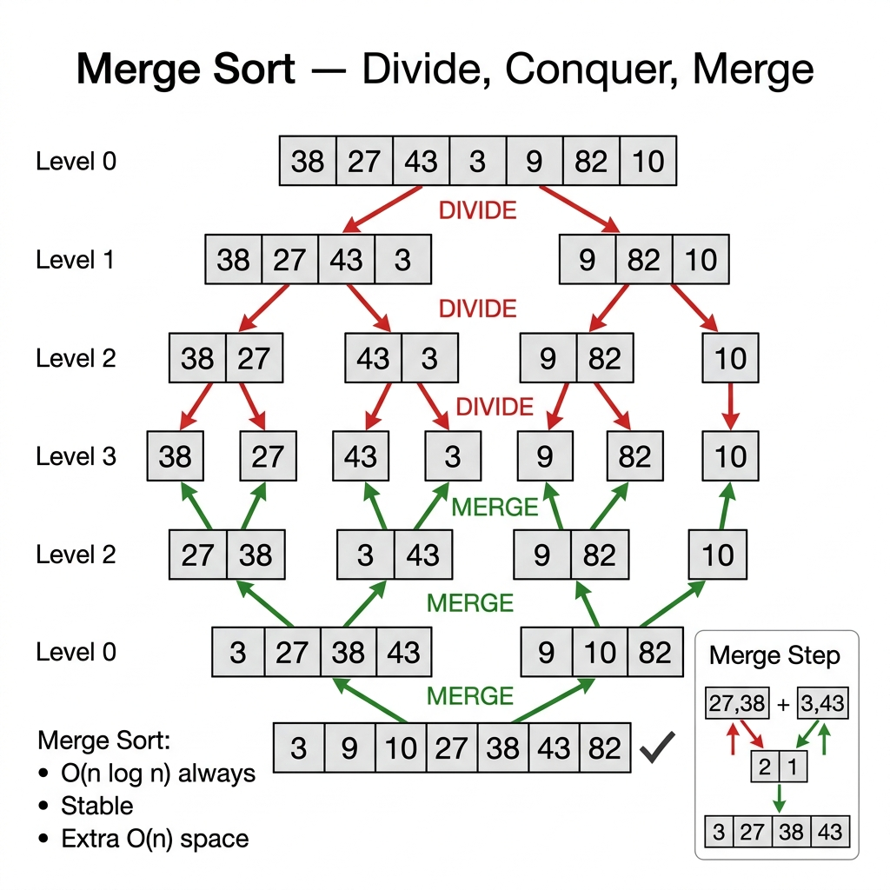

<!-- tags: dsa, algorithms, sorting, merge-sort -->
# 🧩 Merge Sort

> Merge Sort is where you systematically learn divide-and-conquer: halving the problem until it becomes trivial, then merging back while maintaining the "both halves are sorted" invariant. If Quick Sort is famous for average speed, Merge Sort is famous for stability and a beautiful worst-case complexity.

📅 Created: 2026-03-20 · 🔄 Updated: 2026-04-10 · ⏱️ 20 min read

| Aspect | Detail |
| ------ | ------ |
| **Complexity** | O(n log n) time · O(n) extra space |
| **Use case** | Stable sort, linked list sort, external sort, predictable worst-case |
| **Recognition** | Divide array into two halves, sort each half, then merge the two sorted sequences |

---

## 1. DEFINE

<!-- [Experienced layer] -->

<!-- [Beginner layer] -->
You have an array too messy to sort directly. A very natural approach is to split it in half, sort each smaller half, and then merge the two sorted halves. Merge Sort is exactly that strategy, repeated until the array has only one element.

<!-- [Experienced layer] -->
`Merge Sort` is a divide-and-conquer algorithm. It has two main phases:
- `divide`: split the problem into two roughly equal subproblems.
- `merge`: combine two sorted sequences into a larger sequence that remains sorted.

Core insight: **the hard part of Merge Sort is not dividing; it is merging two sorted zones without breaking the global invariant**.

| Variant | When to use | Key idea | Example problem |
| ------- | -------- | ------- | ------- |
| **Top-down recursive** | Easiest to understand | Halve via recursion then merge | Intro merge sort |
| **Bottom-up iterative** | Want to remove recursion | Merge blocks of size 1, 2, 4, 8... | Iterative D&C |
| **External merge** | Data exceeds RAM | Sort small chunks then merge from files | Big data / files |

| Approach | Time | Space | When to choose |
| -------- | ---- | ----- | -------- |
| Merge sort | O(n log n) | O(n) | Need stability and predictable worst-case |
| Quick sort | O(n log n) avg | O(log n) stack | Usually faster in-memory |
| Heap sort | O(n log n) | O(1) | Need in-place and worst-case safety |

### 1.1 Fast Recognition

- The problem mentions `stable sort`.
- Data can be divided and sub-results merged.
- You want a clear O(n log n) worst-case.

### 1.2 Invariants & Failure Modes

<!-- [Expert layer] -->
- Every `merge(left, right)` call is only correct if `left` and `right` are already sorted.
- Stability depends on the tie-breaking rule: you must pick from the left half first.
- A common failure mode is correct merge logic but flawed copying or boundaries, leading to dropped elements.

---

## 2. VISUAL

This card answers the central question: **how does Merge Sort maintain the merge invariant so two sorted halves combine without breaking global order?**



### Level 1 — Simple
This trace answers the question: **how does Merge Sort divide the problem?**

```text
[38, 27, 43, 3, 9, 82, 10]
         /                \
[38, 27, 43]         [3, 9, 82, 10]
   /     \               /       \
[38]  [27,43]         [3,9]    [82,10]
```
*Figure: The divide phase has one job: reducing a large problem into subproblems small enough to be trivial.*

### Level 2 — Detailed
This trace answers the question: **how does merging two sorted sequences preserve the invariant?**

```text
left  = [3, 27, 38, 43]
right = [9, 10, 82]

compare 3 vs 9   -> take 3
compare 27 vs 9  -> take 9
compare 27 vs 10 -> take 10
compare 27 vs 82 -> take 27
compare 38 vs 82 -> take 38
compare 43 vs 82 -> take 43
append remaining -> 82

result = [3, 9, 10, 27, 38, 43, 82]
```
*Figure: Merge always picks the smaller element at the head of the two sub-sequences, so the result prefix is always the next valid smallest prefix.*

## 3. CODE

Once dividing and merging are clearly separated visually, coding is just choosing recursion or iteration; the true difficulty of the algorithm is no longer ambiguous.

### Problem 1: Top-Down Merge Sort
> *(The standard blueprint for learning divide-and-conquer.)*
>
> **Goal**: Sort ascending using recursive merge sort — O(n log n) time, O(n) space.
> **Approach**: Halve the array, sort both halves, and merge them using a temporary buffer.
> **Example**: `[38, 27, 43, 3, 9, 82, 10]` → `[3, 9, 10, 27, 38, 43, 82]`

```go
// merge_sort.go — Merge Sort: top-down recursive split and merge
func MergeSort(nums []int) []int {
    if len(nums) <= 1 {
        return append([]int(nil), nums...)
    }

    mid := len(nums) / 2
    left := MergeSort(nums[:mid])
    right := MergeSort(nums[mid:])
    return merge(left, right)
}

func merge(left, right []int) []int {
    result := make([]int, 0, len(left)+len(right))
    i, j := 0, 0

    for i < len(left) && j < len(right) {
        if left[i] <= right[j] { // <= preserves stability
            result = append(result, left[i])
            i++
        } else {
            result = append(result, right[j])
            j++
        }
    }

    result = append(result, left[i:]...)
    result = append(result, right[j:]...)
    return result
}
```
```typescript
// merge_sort.ts — Merge Sort: top-down recursive split and merge
function mergeSort(nums: number[]): number[] {
  if (nums.length <= 1) return [...nums];
  const mid = Math.floor(nums.length / 2);
  return merge(mergeSort(nums.slice(0, mid)), mergeSort(nums.slice(mid)));
}

function merge(left: number[], right: number[]): number[] {
  const result: number[] = [];
  let i = 0;
  let j = 0;

  while (i < left.length && j < right.length) {
    if (left[i] <= right[j]) result.push(left[i++]);
    else result.push(right[j++]);
  }

  return result.concat(left.slice(i), right.slice(j));
}
```
```java
// MergeSortBasic.java — Merge Sort: top-down recursive split and merge
import java.util.Arrays;

final class MergeSortBasic {
    private MergeSortBasic() {}

    static int[] mergeSort(int[] nums) {
        if (nums.length <= 1) {
            return Arrays.copyOf(nums, nums.length);
        }

        int mid = nums.length / 2;
        int[] left = mergeSort(Arrays.copyOfRange(nums, 0, mid));
        int[] right = mergeSort(Arrays.copyOfRange(nums, mid, nums.length));
        return merge(left, right);
    }

    static int[] merge(int[] left, int[] right) {
        int[] result = new int[left.length + right.length];
        int i = 0, j = 0, k = 0;

        while (i < left.length && j < right.length) {
            if (left[i] <= right[j]) result[k++] = left[i++];
            else result[k++] = right[j++];
        }
        while (i < left.length) result[k++] = left[i++];
        while (j < right.length) result[k++] = right[j++];
        return result;
    }
}
```
```rust
// merge_sort.rs — Merge Sort: top-down recursive split and merge
fn merge_sort(nums: &[i32]) -> Vec<i32> {
    if nums.len() <= 1 {
        return nums.to_vec();
    }

    let mid = nums.len() / 2;
    let left = merge_sort(&nums[..mid]);
    let right = merge_sort(&nums[mid..]);
    merge(&left, &right)
}

fn merge(left: &[i32], right: &[i32]) -> Vec<i32> {
    let mut result = Vec::with_capacity(left.len() + right.len());
    let (mut i, mut j) = (0usize, 0usize);

    while i < left.len() && j < right.len() {
        if left[i] <= right[j] {
            result.push(left[i]);
            i += 1;
        } else {
            result.push(right[j]);
            j += 1;
        }
    }

    result.extend_from_slice(&left[i..]);
    result.extend_from_slice(&right[j..]);
    result
}
```
```cpp
// merge_sort.cpp — Merge Sort: top-down recursive split and merge
std::vector<int> merge(const std::vector<int>& left, const std::vector<int>& right) {
    std::vector<int> result;
    result.reserve(left.size() + right.size());
    size_t i = 0, j = 0;

    while (i < left.size() && j < right.size()) {
        if (left[i] <= right[j]) result.push_back(left[i++]);
        else result.push_back(right[j++]);
    }
    result.insert(result.end(), left.begin() + i, left.end());
    result.insert(result.end(), right.begin() + j, right.end());
    return result;
}

std::vector<int> mergeSort(const std::vector<int>& nums) {
    if (nums.size() <= 1) return nums;
    size_t mid = nums.size() / 2;
    std::vector<int> left(nums.begin(), nums.begin() + mid);
    std::vector<int> right(nums.begin() + mid, nums.end());
    return merge(mergeSort(left), mergeSort(right));
}
```
```python
# merge_sort.py — Merge Sort: top-down recursive split and merge
def merge_sort(nums: list[int]) -> list[int]:
    if len(nums) <= 1:
        return nums[:]
    mid = len(nums) // 2
    return merge(merge_sort(nums[:mid]), merge_sort(nums[mid:]))

def merge(left: list[int], right: list[int]) -> list[int]:
    result: list[int] = []
    i = j = 0
    while i < len(left) and j < len(right):
        if left[i] <= right[j]:
            result.append(left[i])
            i += 1
        else:
            result.append(right[j])
            j += 1
    result.extend(left[i:])
    result.extend(right[j:])
    return result
```

> **Why?** Merge Sort wins not through partitioning tricks, but via a very clean invariant: once two sub-halves are sorted, they strictly increase, making the merge a trivial "pick the smaller head" task. This is why the correctness of merge sort is generally easier to prove than quick sort.

> **Takeaway**: If you are new to Merge Sort, ensure you fully understand `merge()` first. Divide merely reduces the problem size; merge is where correctness actually resides.

---

### Problem 2: Bottom-Up Merge Sort
> *(The same core idea, completely stripped of recursion.)*
>
> **Goal**: Sort ascending using iterative merge sort — O(n log n) time, O(n) space.
> **Approach**: Merge blocks of sizes `1, 2, 4, 8...` iteratively instead of making recursive calls.
> **Example**: Any array; the first pass merges pairs of 1 element, the next merges blocks of 2 elements.

```go
// merge_sort_bottom_up.go — Merge Sort: iterative runs of size 1,2,4,...
func MergeSortBottomUp(nums []int) []int {
    n := len(nums)
    if n <= 1 {
        return append([]int(nil), nums...)
    }

    src := append([]int(nil), nums...)
    dst := make([]int, n)

    for size := 1; size < n; size *= 2 {
        for start := 0; start < n; start += 2 * size {
            mid := min(start+size, n)
            end := min(start+2*size, n)

            i, j, k := start, mid, start
            for i < mid && j < end {
                if src[i] <= src[j] {
                    dst[k] = src[i]
                    i++
                } else {
                    dst[k] = src[j]
                    j++
                }
                k++
            }
            for i < mid {
                dst[k] = src[i]
                i++
                k++
            }
            for j < end {
                dst[k] = src[j]
                j++
                k++
            }
        }
        src, dst = dst, src
    }
    return src
}

func min(a, b int) int {
    if a < b {
        return a
    }
    return b
}
```
```typescript
// merge_sort_bottom_up.ts — Merge Sort: iterative runs of size 1,2,4,...
function mergeSortBottomUp(nums: number[]): number[] {
  const n = nums.length;
  if (n <= 1) return [...nums];

  let src = [...nums];
  let dst = new Array<number>(n);

  for (let size = 1; size < n; size *= 2) {
    for (let start = 0; start < n; start += 2 * size) {
      const mid = Math.min(start + size, n);
      const end = Math.min(start + 2 * size, n);
      let i = start, j = mid, k = start;

      while (i < mid && j < end) {
        dst[k++] = src[i] <= src[j] ? src[i++] : src[j++];
      }
      while (i < mid) dst[k++] = src[i++];
      while (j < end) dst[k++] = src[j++];
    }
    [src, dst] = [dst, src];
  }
  return src;
}
```
```java
// MergeSortIntermediate.java — Merge Sort: iterative runs of size 1,2,4,...
import java.util.Arrays;

final class MergeSortIntermediate {
    private MergeSortIntermediate() {}

    static int[] mergeSortBottomUp(int[] nums) {
        int n = nums.length;
        if (n <= 1) return Arrays.copyOf(nums, n);

        int[] src = Arrays.copyOf(nums, n);
        int[] dst = new int[n];

        for (int size = 1; size < n; size *= 2) {
            for (int start = 0; start < n; start += 2 * size) {
                int mid = Math.min(start + size, n);
                int end = Math.min(start + 2 * size, n);
                int i = start, j = mid, k = start;

                while (i < mid && j < end) {
                    dst[k++] = (src[i] <= src[j]) ? src[i++] : src[j++];
                }
                while (i < mid) dst[k++] = src[i++];
                while (j < end) dst[k++] = src[j++];
            }
            int[] temp = src; src = dst; dst = temp;
        }
        return src;
    }
}
```
```rust
// merge_sort_bottom_up.rs — Merge Sort: iterative runs of size 1,2,4,...
fn merge_sort_bottom_up(nums: &[i32]) -> Vec<i32> {
    let n = nums.len();
    if n <= 1 {
        return nums.to_vec();
    }

    let mut src = nums.to_vec();
    let mut dst = vec![0; n];
    let mut size = 1;

    while size < n {
        let mut start = 0;
        while start < n {
            let mid = (start + size).min(n);
            let end = (start + 2 * size).min(n);
            let (mut i, mut j, mut k) = (start, mid, start);

            while i < mid && j < end {
                if src[i] <= src[j] {
                    dst[k] = src[i];
                    i += 1;
                } else {
                    dst[k] = src[j];
                    j += 1;
                }
                k += 1;
            }
            while i < mid {
                dst[k] = src[i];
                i += 1;
                k += 1;
            }
            while j < end {
                dst[k] = src[j];
                j += 1;
                k += 1;
            }
            start += 2 * size;
        }
        std::mem::swap(&mut src, &mut dst);
        size *= 2;
    }
    src
}
```
```cpp
// merge_sort_bottom_up.cpp — Merge Sort: iterative runs of size 1,2,4,...
std::vector<int> mergeSortBottomUp(const std::vector<int>& nums) {
    const int n = static_cast<int>(nums.size());
    if (n <= 1) return nums;

    std::vector<int> src = nums;
    std::vector<int> dst(n);

    for (int size = 1; size < n; size *= 2) {
        for (int start = 0; start < n; start += 2 * size) {
            int mid = std::min(start + size, n);
            int end = std::min(start + 2 * size, n);
            int i = start, j = mid, k = start;

            while (i < mid && j < end) {
                dst[k++] = (src[i] <= src[j]) ? src[i++] : src[j++];
            }
            while (i < mid) dst[k++] = src[i++];
            while (j < end) dst[k++] = src[j++];
        }
        std::swap(src, dst);
    }
    return src;
}
```
```python
# merge_sort_bottom_up.py — Merge Sort: iterative runs of size 1,2,4,...
def merge_sort_bottom_up(nums: list[int]) -> list[int]:
    n = len(nums)
    if n <= 1:
        return nums[:]

    src = nums[:]
    dst = [0] * n
    size = 1

    while size < n:
        for start in range(0, n, 2 * size):
            mid = min(start + size, n)
            end = min(start + 2 * size, n)
            i, j, k = start, mid, start

            while i < mid and j < end:
                if src[i] <= src[j]:
                    dst[k] = src[i]
                    i += 1
                else:
                    dst[k] = src[j]
                    j += 1
                k += 1
            while i < mid:
                dst[k] = src[i]
                i += 1
                k += 1
            while j < end:
                dst[k] = src[j]
                j += 1
                k += 1

        src, dst = dst, src
        size *= 2

    return src
```

> **Why?** Bottom-up merge sort proves that divide-and-conquer does not mandate recursion. All you truly need is the relationship: "merge run size k into run size 2k". The iterative version excels when you need strict stack control or want to clearly observe sort progression level by level.

> **Takeaway**: If recursion leaves you confused, bottom-up turns Merge Sort into a mechanical, easily debuggable process.

---

### Problem 3: External Merge Sort
> *(The production-grade version for data exceeding RAM.)*
>
> **Goal**: Sort a massive file by chunking, sorting each chunk, and then streaming merges.
> **Approach**: Sort chunks in-memory, then run a k-way merge via a min-heap.
> **Example**: A 50GB log file, while RAM only allows 200MB active data.

```go
// external_merge_sort.go — Merge Sort: chunk files + k-way heap merge
import (
    "bufio"
    "container/heap"
    "os"
    "sort"
    "strconv"
)

type runItem struct {
    value int
    runID int
}

type minHeap []runItem

func (h minHeap) Len() int            { return len(h) }
func (h minHeap) Less(i, j int) bool  { return h[i].value < h[j].value }
func (h minHeap) Swap(i, j int)       { h[i], h[j] = h[j], h[i] }
func (h *minHeap) Push(x any)         { *h = append(*h, x.(runItem)) }
func (h *minHeap) Pop() any           { old := *h; x := old[len(old)-1]; *h = old[:len(old)-1]; return x }

func SortChunk(chunk []int) []int {
    sort.Ints(chunk)
    return chunk
}

func MergeSortedRuns(runs [][]int) []int {
    h := &minHeap{}
    heap.Init(h)
    positions := make([]int, len(runs))

    for runID, run := range runs {
        if len(run) > 0 {
            heap.Push(h, runItem{value: run[0], runID: runID})
        }
    }

    result := make([]int, 0)
    for h.Len() > 0 {
        item := heap.Pop(h).(runItem)
        result = append(result, item.value)

        positions[item.runID]++
        if positions[item.runID] < len(runs[item.runID]) {
            nextValue := runs[item.runID][positions[item.runID]]
            heap.Push(h, runItem{value: nextValue, runID: item.runID})
        }
    }

    return result
}

func LoadInts(path string) ([]int, error) {
    file, err := os.Open(path)
    if err != nil {
        return nil, err
    }
    defer file.Close()

    result := make([]int, 0)
    scanner := bufio.NewScanner(file)
    for scanner.Scan() {
        value, err := strconv.Atoi(scanner.Text())
        if err != nil {
            return nil, err
        }
        result = append(result, value)
    }
    return result, scanner.Err()
}
```
```typescript
// external_merge_sort.ts — Merge Sort: chunk files + k-way heap merge
type RunItem = { value: number; runId: number };

function mergeSortedRuns(runs: number[][]): number[] {
  const positions = Array(runs.length).fill(0);
  const heap: RunItem[] = [];
  const push = (item: RunItem) => {
    heap.push(item);
    heap.sort((a, b) => a.value - b.value);
  };

  runs.forEach((run, runId) => {
    if (run.length) push({ value: run[0], runId });
  });

  const result: number[] = [];
  while (heap.length) {
    const item = heap.shift()!;
    result.push(item.value);
    positions[item.runId]++;
    if (positions[item.runId] < runs[item.runId].length) {
      push({ value: runs[item.runId][positions[item.runId]], runId: item.runId });
    }
  }
  return result;
}
```
```java
// ExternalMergeSort.java — Merge Sort: chunk files + k-way heap merge
import java.util.ArrayList;
import java.util.List;
import java.util.PriorityQueue;

final class ExternalMergeSort {
    record RunItem(int value, int runId) {}

    private ExternalMergeSort() {}

    static List<Integer> mergeSortedRuns(List<List<Integer>> runs) {
        PriorityQueue<RunItem> pq = new PriorityQueue<>((a, b) -> Integer.compare(a.value(), b.value()));
        int[] pos = new int[runs.size()];

        for (int runId = 0; runId < runs.size(); runId++) {
            if (!runs.get(runId).isEmpty()) {
                pq.add(new RunItem(runs.get(runId).get(0), runId));
            }
        }

        List<Integer> result = new ArrayList<>();
        while (!pq.isEmpty()) {
            RunItem item = pq.poll();
            result.add(item.value());
            pos[item.runId()]++;
            if (pos[item.runId()] < runs.get(item.runId()).size()) {
                pq.add(new RunItem(runs.get(item.runId()).get(pos[item.runId()]), item.runId()));
            }
        }
        return result;
    }
}
```
```rust
// external_merge_sort.rs — Merge Sort: chunk files + k-way heap merge
use std::cmp::Reverse;
use std::collections::BinaryHeap;

fn merge_sorted_runs(runs: Vec<Vec<i32>>) -> Vec<i32> {
    let mut heap: BinaryHeap<Reverse<(i32, usize)>> = BinaryHeap::new();
    let mut pos = vec![0usize; runs.len()];

    for (run_id, run) in runs.iter().enumerate() {
        if let Some(&value) = run.first() {
            heap.push(Reverse((value, run_id)));
        }
    }

    let mut result = Vec::new();
    while let Some(Reverse((value, run_id))) = heap.pop() {
        result.push(value);
        pos[run_id] += 1;
        if pos[run_id] < runs[run_id].len() {
            heap.push(Reverse((runs[run_id][pos[run_id]], run_id)));
        }
    }
    result
}
```
```cpp
// external_merge_sort.cpp — Merge Sort: chunk files + k-way heap merge
std::vector<int> mergeSortedRuns(const std::vector<std::vector<int>>& runs) {
    using Item = std::tuple<int, int>;
    auto cmp = [](const Item& a, const Item& b) { return std::get<0>(a) > std::get<0>(b); };
    std::priority_queue<Item, std::vector<Item>, decltype(cmp)> pq(cmp);

    std::vector<int> pos(runs.size(), 0);
    for (int runId = 0; runId < static_cast<int>(runs.size()); ++runId) {
        if (!runs[runId].empty()) {
            pq.emplace(runs[runId][0], runId);
        }
    }

    std::vector<int> result;
    while (!pq.empty()) {
        auto [value, runId] = pq.top();
        pq.pop();
        result.push_back(value);
        if (++pos[runId] < static_cast<int>(runs[runId].size())) {
            pq.emplace(runs[runId][pos[runId]], runId);
        }
    }
    return result;
}
```
```python
# external_merge_sort.py — Merge Sort: chunk files + k-way heap merge
import heapq

def merge_sorted_runs(runs: list[list[int]]) -> list[int]:
    heap: list[tuple[int, int]] = []
    positions = [0] * len(runs)

    for run_id, run in enumerate(runs):
        if run:
            heapq.heappush(heap, (run[0], run_id))

    result: list[int] = []
    while heap:
        value, run_id = heapq.heappop(heap)
        result.append(value)
        positions[run_id] += 1
        if positions[run_id] < len(runs[run_id]):
            next_value = runs[run_id][positions[run_id]]
            heapq.heappush(heap, (next_value, run_id))

    return result
```

> **Why?** External Merge Sort demonstrates that "merge" is a bigger idea than just sorting an array in RAM. When RAM falls short, divide-and-conquer still works; the unit of work simply shifts from "subarray" to "sorted run on disk", and the merge operation moves from "two vectors" to a "k-way streaming merge".

> **Takeaway**: If an interview or actual system mentions a file larger than memory, Merge Sort should be the very first pattern that comes to mind.

---

## 4. PITFALLS

In sorting, mistakes are rarely just syntax. They usually stem from misunderstanding which area is safe and which area is still moving.

| # | Severity | Defect | Consequence | Fix |
|---|----------|-----|---------|-----|
| 1 | 🔴 Fatal | Merging but forgetting to append the remainder of a half | Data loss, output misses elements | Always append the tails of `left` and `right` after the main loop |
| 2 | 🔴 Fatal | Using `<` instead of `<=` during a stable merge | Loss of stability | Always prioritize the `left` array when elements tie |
| 3 | 🟡 Common | Assuming bottom-up is a totally different algorithm | Losing a unified mental model | Remember only orchestration differs, not the core merge invariant |
| 4 | 🟡 Common | Mentioning chunk sort but forgetting the k-way merge for external sort | Supplying an incomplete solution | Explicitly describe the heap and run pointers |
| 5 | 🔵 Minor | Analyzing Merge Sort but omitting the O(n) extra space | Erroneous comparison against quick/heap sorts | Always clearly document both time and space |

---

## 5. REF

| Resource | Type | Link | Notes |
| -------- | ---- | ---- | ------- |
| Merge sort | Official reference | https://en.wikipedia.org/wiki/Merge_sort | Properties, recursion tree, variants |
| Princeton Algorithms | Book | https://algs4.cs.princeton.edu/22mergesort/ | Extremely clear analysis of merge sort |
| Go slices package | Official docs | https://pkg.go.dev/slices | Comparison against standard library sorting |

---

## 6. RECOMMEND

Once Merge Sort clarifies the cost of stability and a beautiful worst-case, the next step is contrasting it with partition-based divide-and-conquer, or returning to small-array cutoffs where insertion sort dominates.

| Next Topic | Why read it next | Link |
| ------------- | ------------------- | ---- |
| Quick Sort | Compare partition-based O(n log n) with merge-based O(n log n) | [05-quick-sort.md](./05-quick-sort.md) |
| Insertion Sort | Understand why hybrid sorts cut over to insertion on small arrays | [03-insertion-sort.md](./03-insertion-sort.md) |
| Linked List Flatten / Merge ideas | Merge mindset fits lists and streams perfectly | [../linked-lists/06-flatten-multilevel.md](../linked-lists/06-flatten-multilevel.md) |

---

## 7. QUICK REF

**Template**

```text
mergeSort(nums):
  split into left/right
  sort left
  sort right
  merge two sorted halves
```

**Pattern recognition**

- `stable sort` + `predictable O(n log n)` -> reach for Merge Sort.
- `file too large for memory` -> external merge.
- `follow-up: eliminate recursion` -> bottom-up merge sort.

---

Returning to the opening question: why is a beautiful worst-case important? Because production systems demand guarantees, not just averages. Merge Sort guarantees O(n log n) always—no pathological input can break it.
