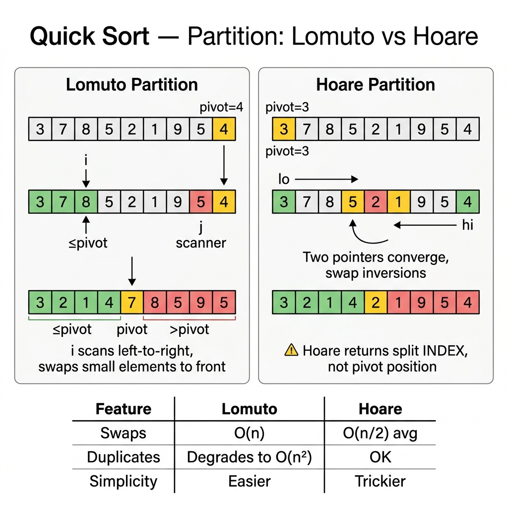

<!-- tags: dsa, algorithms, sorting, quick-sort -->
# ⚡ Quick Sort

> Quick Sort is an algorithm you cannot learn halfway. If you fail to grasp the partition invariant, you will write a version that "looks correct" but fails on duplicates, infinite-loops on Hoare partition, or worse, degrades to O(n²) without you realizing why.

📅 Created: 2026-03-20 · 🔄 Updated: 2026-04-10 · ⏱️ 22 min read

| Aspect | Detail |
| ------ | ------ |
| **Complexity** | O(n log n) average · O(n²) worst |
| **Use case** | Fast in-memory sorting, partition-based reasoning, quickselect family |
| **Recognition** | Pick a pivot then partition so everything smaller is left, larger is right |

---

## 1. DEFINE

<!-- [Beginner layer] -->

<!-- [Beginner layer] -->
You do not want to sort the whole array by merging back together like Merge Sort. You want to pick a landmark, split the array into a "smaller than pivot" side and a "larger than pivot" side, and simply repeat this on each side. That is how Quick Sort thinks.

<!-- [Experienced layer] -->
`Quick Sort` is a divide-and-conquer algorithm driven by `partitioning`. Each step selects a pivot and rearranges the array so that:
- one side contains elements `< pivot`
- the other side contains elements `> pivot`
- you then recursively sort both sides

Core insight: **Quick Sort is fast when the partition is reasonably balanced and the partition itself is cheap**.

| Variant | When to use | Key idea | Example problem |
| ------- | -------- | ------- | ------- |
| **Lomuto** | Easiest to understand | One boundary tracks the `< pivot` zone | Intro quick sort |
| **Hoare** | Want fewer swaps | Two pointers moving from opposite ends | Performance-oriented partition |
| **3-way partition** | Many duplicates | Separate into `<`, `=`, and `>` zones | DNF quick sort |

| Approach | Time | Space | When to choose |
| -------- | ---- | ----- | -------- |
| Quick sort | O(n log n) avg | O(log n) stack avg | Practical in-memory sorting |
| Merge sort | O(n log n) | O(n) | Stable / predictable worst-case |
| Heap sort | O(n log n) | O(1) | Worst-case safe + in-place |

### 1.1 Fast Recognition

- The problem features `partition`, `pivot`, `quickselect`, or `sort colors`.
- Duplicates or pivot selection are key follow-up discussions.
- You can clearly describe the left/right invariants of the pivot zone.

### 1.2 Invariants & Failure Modes

<!-- [Expert layer] -->
- With Lomuto: before each step, `nums[low..store-1] < pivot`, `nums[store..i-1] >= pivot`.
- With Hoare: two pointers stop when finding misplaced elements, then swap them.
- The most common failure mode is using naive 2-way partitioning on heavy duplicate data -> causing massive partition skew and severe performance drops.

---

## 2. VISUAL

This card answers the central question: **which exact zone is the Quick Sort partition isolating, and why can bad pivots or duplicates wreck the entire recursion tree?**



### Level 1 — Simple
This trace answers the question: **what does a Quick Sort partition actually accomplish?**

```text
nums = [9, 3, 7, 1, 8, 2], pivot = 2

after partition:
[1] [2] [9, 3, 7, 8]
 ^   ^       ^
 < pivot     > pivot
```
*Figure: Partitioning does not sort the whole array. It strictly guarantees zones relative to the pivot are correct.*

### Level 2 — Detailed
This trace answers the question: **how does 3-way partitioning help when duplicates abound?**

```text
nums = [4, 2, 4, 1, 4, 3, 4], pivot = 4

< pivot : [2, 1, 3]
= pivot : [4, 4, 4, 4]
> pivot : []

=> no need to recurse on the = pivot zone
```
*Figure: When duplicates are heavy, 3-way partitioning cuts the entire equal-to-pivot zone out of the recursion, preventing uselessly skewed partitions.*

## 3. CODE

Once the partition invariant is visually clear, coding simply means picking the scheme that fits your goal: an easy baseline, fewer swaps, or robust duplicate handling.

### Problem 1: Quick Sort with Lomuto Partition
> *(The easiest baseline for learning partition invariants.)*
>
> **Goal**: Sort in-place using basic Quick Sort — O(n log n) average.
> **Approach**: Pick the last element as pivot, execute Lomuto partition via a `store` pointer.
> **Example**: `[10, 7, 8, 9, 1, 5]` → `[1, 5, 7, 8, 9, 10]`

```go
// quick_sort.go — Quick Sort: Lomuto partition baseline
func QuickSort(nums []int) {
    quickSort(nums, 0, len(nums)-1)
}

func quickSort(nums []int, low, high int) {
    if low >= high {
        return
    }
    p := lomutoPartition(nums, low, high)
    quickSort(nums, low, p-1)
    quickSort(nums, p+1, high)
}

func lomutoPartition(nums []int, low, high int) int {
    pivot := nums[high]
    store := low

    for i := low; i < high; i++ {
        if nums[i] < pivot {
            nums[store], nums[i] = nums[i], nums[store]
            store++
        }
    }

    nums[store], nums[high] = nums[high], nums[store]
    return store
}
```
```typescript
// quick_sort.ts — Quick Sort: Lomuto partition baseline
function quickSort(nums: number[]): void {
  const sort = (low: number, high: number): void => {
    if (low >= high) return;
    const p = lomutoPartition(nums, low, high);
    sort(low, p - 1);
    sort(p + 1, high);
  };
  sort(0, nums.length - 1);
}

function lomutoPartition(nums: number[], low: number, high: number): number {
  const pivot = nums[high];
  let store = low;
  for (let i = low; i < high; i++) {
    if (nums[i] < pivot) {
      [nums[store], nums[i]] = [nums[i], nums[store]];
      store++;
    }
  }
  [nums[store], nums[high]] = [nums[high], nums[store]];
  return store;
}
```
```java
// QuickSortBasic.java — Quick Sort: Lomuto partition baseline
final class QuickSortBasic {
    private QuickSortBasic() {}

    static void quickSort(int[] nums) {
        quickSort(nums, 0, nums.length - 1);
    }

    static void quickSort(int[] nums, int low, int high) {
        if (low >= high) return;
        int p = lomutoPartition(nums, low, high);
        quickSort(nums, low, p - 1);
        quickSort(nums, p + 1, high);
    }

    static int lomutoPartition(int[] nums, int low, int high) {
        int pivot = nums[high];
        int store = low;
        for (int i = low; i < high; i++) {
            if (nums[i] < pivot) {
                int temp = nums[store];
                nums[store] = nums[i];
                nums[i] = temp;
                store++;
            }
        }
        int temp = nums[store];
        nums[store] = nums[high];
        nums[high] = temp;
        return store;
    }
}
```
```rust
// quick_sort.rs — Quick Sort: Lomuto partition baseline
fn quick_sort(nums: &mut [i32]) {
    fn sort(nums: &mut [i32], low: isize, high: isize) {
        if low >= high {
            return;
        }
        let p = lomuto_partition(nums, low as usize, high as usize) as isize;
        sort(nums, low, p - 1);
        sort(nums, p + 1, high);
    }

    if !nums.is_empty() {
        sort(nums, 0, nums.len() as isize - 1);
    }
}

fn lomuto_partition(nums: &mut [i32], low: usize, high: usize) -> usize {
    let pivot = nums[high];
    let mut store = low;
    for i in low..high {
        if nums[i] < pivot {
            nums.swap(store, i);
            store += 1;
        }
    }
    nums.swap(store, high);
    store
}
```
```cpp
// quick_sort.cpp — Quick Sort: Lomuto partition baseline
int lomutoPartition(std::vector<int>& nums, int low, int high) {
    int pivot = nums[high];
    int store = low;
    for (int i = low; i < high; ++i) {
        if (nums[i] < pivot) {
            std::swap(nums[store], nums[i]);
            ++store;
        }
    }
    std::swap(nums[store], nums[high]);
    return store;
}

void quickSort(std::vector<int>& nums, int low, int high) {
    if (low >= high) return;
    int p = lomutoPartition(nums, low, high);
    quickSort(nums, low, p - 1);
    quickSort(nums, p + 1, high);
}
```
```python
# quick_sort.py — Quick Sort: Lomuto partition baseline
def quick_sort(nums: list[int]) -> None:
    def sort(low: int, high: int) -> None:
        if low >= high:
            return
        p = lomuto_partition(low, high)
        sort(low, p - 1)
        sort(p + 1, high)

    def lomuto_partition(low: int, high: int) -> int:
        pivot = nums[high]
        store = low
        for i in range(low, high):
            if nums[i] < pivot:
                nums[store], nums[i] = nums[i], nums[store]
                store += 1
        nums[store], nums[high] = nums[high], nums[store]
        return store

    sort(0, len(nums) - 1)
```

> **Why?** Quick Sort lives or dies on its partition invariant: after partitioning, the pivot stands in its final, perfectly correct position, with smaller elements left and larger elements right. If this invariant breaks, subsequent recursion merely amplifies the error.

> **Takeaway**: Lomuto is the finest baseline for learning partitions, even though it is not the most optimal regarding swaps or duplicate handling.

---

### Problem 2: Hoare Partition
> *(A highly-regarded interview version yielding fewer swaps and a more natural split.)*
>
> **Goal**: Partition faster than Lomuto on average — retaining O(n log n) overall.
> **Approach**: Two pointers approach from opposite ends, stopping at "misplaced" elements to swap.
> **Example**: Use when minimizing swaps is key, but you must meticulously manage the stopping condition.

```go
// quick_sort_hoare.go — Quick Sort: Hoare partition with two scanning pointers
func QuickSortHoare(nums []int) {
    var sort func(int, int)
    sort = func(low, high int) {
        if low >= high {
            return
        }
        p := hoarePartition(nums, low, high)
        sort(low, p)
        sort(p+1, high)
    }
    if len(nums) > 0 {
        sort(0, len(nums)-1)
    }
}

func hoarePartition(nums []int, low, high int) int {
    pivot := nums[low+(high-low)/2]
    i, j := low-1, high+1

    for {
        for {
            i++
            if nums[i] >= pivot {
                break
            }
        }
        for {
            j--
            if nums[j] <= pivot {
                break
            }
        }
        if i >= j {
            return j
        }
        nums[i], nums[j] = nums[j], nums[i]
    }
}
```
```typescript
// quick_sort_hoare.ts — Quick Sort: Hoare partition with two scanning pointers
function quickSortHoare(nums: number[]): void {
  const sort = (low: number, high: number): void => {
    if (low >= high) return;
    const p = hoarePartition(nums, low, high);
    sort(low, p);
    sort(p + 1, high);
  };
  if (nums.length) sort(0, nums.length - 1);
}

function hoarePartition(nums: number[], low: number, high: number): number {
  const pivot = nums[Math.floor((low + high) / 2)];
  let i = low - 1;
  let j = high + 1;

  while (true) {
    do { i++; } while (nums[i] < pivot);
    do { j--; } while (nums[j] > pivot);
    if (i >= j) return j;
    [nums[i], nums[j]] = [nums[j], nums[i]];
  }
}
```
```java
// QuickSortIntermediate.java — Quick Sort: Hoare partition with two scanning pointers
final class QuickSortIntermediate {
    private QuickSortIntermediate() {}

    static void quickSortHoare(int[] nums) {
        if (nums.length > 0) sort(nums, 0, nums.length - 1);
    }

    static void sort(int[] nums, int low, int high) {
        if (low >= high) return;
        int p = hoarePartition(nums, low, high);
        sort(nums, low, p);
        sort(nums, p + 1, high);
    }

    static int hoarePartition(int[] nums, int low, int high) {
        int pivot = nums[low + (high - low) / 2];
        int i = low - 1, j = high + 1;
        while (true) {
            do { i++; } while (nums[i] < pivot);
            do { j--; } while (nums[j] > pivot);
            if (i >= j) return j;
            int temp = nums[i];
            nums[i] = nums[j];
            nums[j] = temp;
        }
    }
}
```
```rust
// quick_sort_hoare.rs — Quick Sort: Hoare partition with two scanning pointers
fn quick_sort_hoare(nums: &mut [i32]) {
    fn sort(nums: &mut [i32], low: isize, high: isize) {
        if low >= high {
            return;
        }
        let p = hoare_partition(nums, low as usize, high as usize) as isize;
        sort(nums, low, p);
        sort(nums, p + 1, high);
    }

    if !nums.is_empty() {
        sort(nums, 0, nums.len() as isize - 1);
    }
}

fn hoare_partition(nums: &mut [i32], low: usize, high: usize) -> usize {
    let pivot = nums[low + (high - low) / 2];
    let (mut i, mut j) = (low as isize - 1, high as isize + 1);

    loop {
        loop { i += 1; if nums[i as usize] >= pivot { break; } }
        loop { j -= 1; if nums[j as usize] <= pivot { break; } }
        if i >= j {
            return j as usize;
        }
        nums.swap(i as usize, j as usize);
    }
}
```
```cpp
// quick_sort_hoare.cpp — Quick Sort: Hoare partition with two scanning pointers
int hoarePartition(std::vector<int>& nums, int low, int high) {
    int pivot = nums[low + (high - low) / 2];
    int i = low - 1;
    int j = high + 1;

    while (true) {
        do { ++i; } while (nums[i] < pivot);
        do { --j; } while (nums[j] > pivot);
        if (i >= j) return j;
        std::swap(nums[i], nums[j]);
    }
}

void quickSortHoare(std::vector<int>& nums, int low, int high) {
    if (low >= high) return;
    int p = hoarePartition(nums, low, high);
    quickSortHoare(nums, low, p);
    quickSortHoare(nums, p + 1, high);
}
```
```python
# quick_sort_hoare.py — Quick Sort: Hoare partition with two scanning pointers
def quick_sort_hoare(nums: list[int]) -> None:
    def sort(low: int, high: int) -> None:
        if low >= high:
            return
        p = hoare_partition(low, high)
        sort(low, p)
        sort(p + 1, high)

    def hoare_partition(low: int, high: int) -> int:
        pivot = nums[(low + high) // 2]
        i, j = low - 1, high + 1
        while True:
            i += 1
            while nums[i] < pivot:
                i += 1
            j -= 1
            while nums[j] > pivot:
                j -= 1
            if i >= j:
                return j
            nums[i], nums[j] = nums[j], nums[i]

    if nums:
        sort(0, len(nums) - 1)
```

> **Why?** Hoare partition earns its fame by executing fewer swaps than Lomuto, but it breeds more bugs: the recursion range differs, the pivot might not sit at the returned index, and the `do...while` structure easily fails. This is an excellent exercise distinguishing "memorizing code" from "truly grasping invariants".

> **Takeaway**: If you master Lomuto, Hoare is a superb upgrade. However, do not treat it as a copy-paste ritual; a botched recursion range triggers brutal, silent bugs.

---

### Problem 3: 3-Way Quick Sort
> *(A critical adaptation when dealing with duplicate-heavy inputs.)*
>
> **Goal**: Sort efficiently even when identical elements dominate the array.
> **Approach**: Implement Dutch National Flag to split `<`, `=`, `>` zones, only recursing outside the middle bounds.
> **Example**: `[4, 9, 4, 4, 3, 1, 4, 8]` → `[1, 3, 4, 4, 4, 4, 8, 9]`

```go
// quick_sort_three_way.go — Quick Sort: Dutch National Flag partition
func QuickSortThreeWay(nums []int) {
    var sort func(int, int)
    sort = func(low, high int) {
        if low >= high {
            return
        }

        pivot := nums[low]
        lt, i, gt := low, low+1, high

        for i <= gt {
            switch {
            case nums[i] < pivot:
                nums[lt], nums[i] = nums[i], nums[lt]
                lt++
                i++
            case nums[i] > pivot:
                nums[i], nums[gt] = nums[gt], nums[i]
                gt--
            default:
                i++
            }
        }

        sort(low, lt-1)
        sort(gt+1, high)
    }

    if len(nums) > 0 {
        sort(0, len(nums)-1)
    }
}
```
```typescript
// quick_sort_three_way.ts — Quick Sort: Dutch National Flag partition
function quickSortThreeWay(nums: number[]): void {
  const sort = (low: number, high: number): void => {
    if (low >= high) return;

    const pivot = nums[low];
    let lt = low;
    let i = low + 1;
    let gt = high;

    while (i <= gt) {
      if (nums[i] < pivot) {
        [nums[lt], nums[i]] = [nums[i], nums[lt]];
        lt++;
        i++;
      } else if (nums[i] > pivot) {
        [nums[i], nums[gt]] = [nums[gt], nums[i]];
        gt--;
      } else {
        i++;
      }
    }

    sort(low, lt - 1);
    sort(gt + 1, high);
  };
  if (nums.length) sort(0, nums.length - 1);
}
```
```java
// QuickSortAdvanced.java — Quick Sort: Dutch National Flag partition
final class QuickSortAdvanced {
    private QuickSortAdvanced() {}

    static void quickSortThreeWay(int[] nums) {
        if (nums.length > 0) sort(nums, 0, nums.length - 1);
    }

    static void sort(int[] nums, int low, int high) {
        if (low >= high) return;

        int pivot = nums[low];
        int lt = low, i = low + 1, gt = high;

        while (i <= gt) {
            if (nums[i] < pivot) {
                int temp = nums[lt];
                nums[lt++] = nums[i];
                nums[i++] = temp;
            } else if (nums[i] > pivot) {
                int temp = nums[i];
                nums[i] = nums[gt];
                nums[gt--] = temp;
            } else {
                i++;
            }
        }

        sort(nums, low, lt - 1);
        sort(nums, gt + 1, high);
    }
}
```
```rust
// quick_sort_three_way.rs — Quick Sort: Dutch National Flag partition
fn quick_sort_three_way(nums: &mut [i32]) {
    fn sort(nums: &mut [i32], low: isize, high: isize) {
        if low >= high {
            return;
        }

        let pivot = nums[low as usize];
        let (mut lt, mut i, mut gt) = (low as usize, low as usize + 1, high as usize);

        while i <= gt {
            if nums[i] < pivot {
                nums.swap(lt, i);
                lt += 1;
                i += 1;
            } else if nums[i] > pivot {
                nums.swap(i, gt);
                if gt == 0 { break; }
                gt -= 1;
            } else {
                i += 1;
            }
        }

        sort(nums, low, lt as isize - 1);
        sort(nums, gt as isize + 1, high);
    }

    if !nums.is_empty() {
        sort(nums, 0, nums.len() as isize - 1);
    }
}
```
```cpp
// quick_sort_three_way.cpp — Quick Sort: Dutch National Flag partition
void quickSortThreeWay(std::vector<int>& nums, int low, int high) {
    if (low >= high) return;

    int pivot = nums[low];
    int lt = low, i = low + 1, gt = high;

    while (i <= gt) {
        if (nums[i] < pivot) std::swap(nums[lt++], nums[i++]);
        else if (nums[i] > pivot) std::swap(nums[i], nums[gt--]);
        else ++i;
    }

    quickSortThreeWay(nums, low, lt - 1);
    quickSortThreeWay(nums, gt + 1, high);
}
```
```python
# quick_sort_three_way.py — Quick Sort: Dutch National Flag partition
def quick_sort_three_way(nums: list[int]) -> None:
    def sort(low: int, high: int) -> None:
        if low >= high:
            return
        pivot = nums[low]
        lt, i, gt = low, low + 1, high

        while i <= gt:
            if nums[i] < pivot:
                nums[lt], nums[i] = nums[i], nums[lt]
                lt += 1
                i += 1
            elif nums[i] > pivot:
                nums[i], nums[gt] = nums[gt], nums[i]
                gt -= 1
            else:
                i += 1

        sort(low, lt - 1)
        sort(gt + 1, high)

    if nums:
        sort(0, len(nums) - 1)
```

> **Why?** Quick Sort performs worst when partitions skew heavily, and excessive duplicates represent a common trigger. The 3-way partition tackles this head-on: if elements equal to the pivot abound, we group them tightly in the middle and completely bypass them in further recursion.

> **Takeaway**: When facing numerous duplicates or repetitive pivot choices, 3-way Quick Sort acts as a far more intelligent default than a naive 2-way partition.

---

## 4. PITFALLS

In sorting, mistakes are rarely just syntax. They usually stem from misunderstanding which area is safe and which area is still moving.

| # | Severity | Defect | Consequence | Fix |
|---|----------|-----|---------|-----|
| 1 | 🔴 Fatal | Wrong recursion ranges in Hoare partition | Infinite loops or un-sorted segments | With Hoare, recurse `low..p` and `p+1..high` strictly |
| 2 | 🔴 Fatal | Ignoring duplicate-heavy inputs on naive Quick Sort | Massively skewed partitions, abysmal runtime | Deploy 3-way partitioning when duplicates dominate |
| 3 | 🟡 Common | Utilizing a static end-pivot on nearly-sorted data | Plummets to O(n²) performance easily | Use randomization or median-of-three pivot selection |
| 4 | 🟡 Common | Assuming partitioning inherently sorts the halves | Flawed reasoning regarding correctness | Remember partition only validates elements relative to the pivot |
| 5 | 🔵 Minor | Memorizing Lomuto but failing to explain its invariant | Failing interview follow-up inquiries | Verbally articulate the exact `< pivot`, `= pivot`, `> pivot` boundaries |

---

## 5. REF

| Resource | Type | Link | Notes |
| -------- | ---- | ---- | ------- |
| Quicksort | Official reference | https://en.wikipedia.org/wiki/Quicksort | Details partitioning schemes and complexity bounds |
| Dijkstra 3-way partitioning | Reference | https://algs4.cs.princeton.edu/23quicksort/ | The definitive duplicate-handling variant |
| Quickselect family | Official reference | https://en.wikipedia.org/wiki/Quickselect | Connects directly to DNF and general partitioning |

---

## 6. RECOMMEND

Once Quick Sort clarifies the exact partition boundaries, decide whether to delve deeper into 3-way partitioning specifically or compare its structure against more stable divide-and-conquer techniques.

| Next Topic | Why read it next | Link |
| ------------- | ------------------- | ---- |
| Dutch National Flag | Master 3-way partitioning isolated from quicksort entirely | [06-dutch-national-flag.md](./06-dutch-national-flag.md) |
| Merge Sort | Contrast partition-based D&C with merge-based D&C | [04-merge-sort.md](./04-merge-sort.md) |
| Binary Search on Answer | Practice maintaining invariants in searching contexts | [../patterns/06-binary-search-on-answer.md](../patterns/06-binary-search-on-answer.md) |

---

## 7. QUICK REF

**Template**

```text
pick pivot
partition into zones
recurse only on unsolved zones
```

**Pattern recognition**

- `pivot`, `partition`, `quickselect`, `kth` -> look to the Quick Sort / Quickselect tree.
- `many duplicates` -> leverage a 3-way partition.
- `follow-up: perform fewer swaps` -> pivot to a Hoare partition scheme.

---

Returning to the opening question: why is the partition invariant the core? Because breaking it means infinite loops on duplicates, or O(n²) crashes on sorted inputs. Lomuto, Hoare, and 3-way simply represent three distinct methods to guard that vital invariant.
