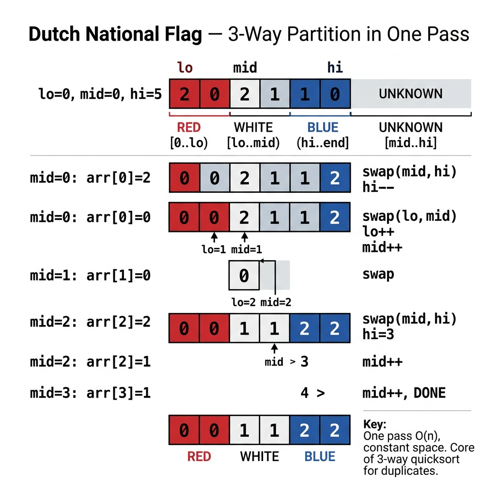

<!-- tags: dsa, algorithms, sorting, dutch-national-flag -->
# 🇳🇱 Dutch National Flag

> Many mistake this for a simple "sort 0-1-2" problem. In reality, it is a highly potent partitioning pattern: dividing an array into `< pivot`, `= pivot`, and `> pivot` zones in a single pass. If you study this merely as a color-sorting trick, you miss its true value.

📅 Created: 2026-03-31 · 🔄 Updated: 2026-04-10 · ⏱️ 16 min read

| Aspect | Detail |
| ------ | ------ |
| **Complexity** | O(n) time · O(1) space |
| **Use case** | Sort Colors, 3-way partition, quicksort with duplicates, quickselect prep |
| **Recognition** | Three concurrent zones dynamically maintained via `low / mid / high` pointers |

---

## 1. DEFINE

<!-- [Experienced layer] -->

<!-- [Beginner layer] -->
You have an array containing only three discrete values, like `0, 1, 2`. A naive approach counts each type and overwrites the array, or sorts it in O(n log n). But if the true goal is just grouping into distinct zones, three pointers accomplish it in one pass.

<!-- [Experienced layer] -->
`Dutch National Flag` is a 3-zone partitioning pattern:
- `[0..low-1]` defines the `< pivot` zone.
- `[low..mid-1]` defines the `= pivot` zone.
- `[mid..high]` defines the unprocessed zone.
- `[high+1..end]` defines the `> pivot` zone.

Core insight: **advance `mid` only when you verify the current element is in its correct zone; if swapping with `high`, re-evaluate the newly pulled element**.

| Variant | When to use | Key idea | Example problem |
| ------- | -------- | ------- | ------- |
| **Sort colors** | Strictly 3 discrete values | The implicit pivot is `1` | LC 75 |
| **3-way partition** | Arbitrary pivot | Group `<`, `=`, `>` in one pass | Quick sort duplicates |
| **Quickselect prep** | Select recursion target | Partition, then prune unnecessary zones entirely | kth element |

| Approach | Time | Space | When to choose |
| -------- | ---- | ----- | -------- |
| Counting sort (3 values) | O(n) | O(1) | When handling a few static buckets easily |
| DNF partition | O(n) | O(1) | When prioritizing in-place logic and 3-way invariants |
| General sort | O(n log n) | varies | Massive overkill for simple partitioning needs |

### 1.1 Fast Recognition

- The problem introduces three distinct groups or relative zones around a pivot.
- You need an in-place, one-pass partition.
- Duplicate clusters around the pivot form the core challenge.

### 1.2 Invariants & Failure Modes

<!-- [Expert layer] -->
- `mid` is the sole pointer scanning the unprocessed zone.
- When `nums[mid] > pivot`, swap with `high` but **do not increment mid**, because the newly retrieved right-side element remains unclassified.
- The most frequent failure mode involves eagerly incrementing `mid` after every swap, completely skipping the inspection of the pulled element.

---

## 2. VISUAL

This card answers the central question: **how do three zones (`< pivot`, `= pivot`, `> pivot`) coexist, and why is the unprocessed middle zone the absolute key to invariant control?**



### Level 1 — Simple
This trace answers the question: **how do the four DNF zones shift over time?**

```text
nums = [2, 0, 2, 1, 1, 0], pivot = 1

low=0 mid=0 high=5

[ | 2 0 2 1 1 0 | ]
   ^
  mid sees > pivot -> swap with high

[ | 0 0 2 1 1 | 2 ]
   ^
  re-check mid
```
*Figure: The unprocessed zone always sits directly between `mid` and `high`; every pointer action strictly shrinks this exact boundary.*

### Level 2 — Detailed
This trace answers the question: **why does swapping with `high` forbid incrementing `mid`?**

```text
before:
  nums = [2, 0, 1]
  low=0 mid=0 high=2

nums[mid]=2 > pivot
swap nums[mid] with nums[high]
=> [1, 0, 2]

mid remains 0
because the 1 dragged to index 0 has never been classified
```
*Figure: Incrementing `mid` immediately after a high swap risks bypassing an unclassified element, utterly destroying the invariant.*

## 3. CODE

Once the visual isolates the unresolved middle zone, writing code simply means strictly obeying the movement rules for `low / mid / high` and never skipping a pulled right-side element.

### Problem 1: Sort Colors [LC #75]
> *(The textbook Dutch National Flag exercise.)*
>
> **Goal**: Sort an array of `0,1,2` in a single in-place pass — O(n) time, O(1) space.
> **Approach**: Deploy `low / mid / high` using `1` as the implicit pivot.
> **Example**: `[2,0,2,1,1,0]` → `[0,0,1,1,2,2]`

```go
// dutch_national_flag.go — DNF: sort colors with low/mid/high boundaries
func SortColors(nums []int) {
    low, mid, high := 0, 0, len(nums)-1

    for mid <= high {
        switch nums[mid] {
        case 0:
            nums[low], nums[mid] = nums[mid], nums[low]
            low++
            mid++
        case 1:
            mid++
        default: // nums[mid] == 2
            nums[mid], nums[high] = nums[high], nums[mid]
            high--
        }
    }
}
```
```typescript
// dutch_national_flag.ts — DNF: sort colors with low/mid/high boundaries
function sortColors(nums: number[]): void {
  let low = 0, mid = 0, high = nums.length - 1;

  while (mid <= high) {
    if (nums[mid] === 0) {
      [nums[low], nums[mid]] = [nums[mid], nums[low]];
      low++;
      mid++;
    } else if (nums[mid] === 1) {
      mid++;
    } else {
      [nums[mid], nums[high]] = [nums[high], nums[mid]];
      high--;
    }
  }
}
```
```java
// DutchNationalFlagBasic.java — DNF: sort colors with low/mid/high boundaries
final class DutchNationalFlagBasic {
    private DutchNationalFlagBasic() {}

    static void sortColors(int[] nums) {
        int low = 0, mid = 0, high = nums.length - 1;
        while (mid <= high) {
            if (nums[mid] == 0) {
                int temp = nums[low];
                nums[low] = nums[mid];
                nums[mid] = temp;
                low++;
                mid++;
            } else if (nums[mid] == 1) {
                mid++;
            } else {
                int temp = nums[mid];
                nums[mid] = nums[high];
                nums[high] = temp;
                high--;
            }
        }
    }
}
```
```rust
// dutch_national_flag.rs — DNF: sort colors with low/mid/high boundaries
fn sort_colors(nums: &mut [i32]) {
    let (mut low, mut mid, mut high) = (0usize, 0usize, nums.len().saturating_sub(1));
    while mid <= high && !nums.is_empty() {
        match nums[mid] {
            0 => {
                nums.swap(low, mid);
                low += 1;
                mid += 1;
            }
            1 => mid += 1,
            _ => {
                nums.swap(mid, high);
                if high == 0 { break; }
                high -= 1;
            }
        }
    }
}
```
```cpp
// dutch_national_flag.cpp — DNF: sort colors with low/mid/high boundaries
void sortColors(std::vector<int>& nums) {
    int low = 0, mid = 0, high = static_cast<int>(nums.size()) - 1;
    while (mid <= high) {
        if (nums[mid] == 0) {
            std::swap(nums[low++], nums[mid++]);
        } else if (nums[mid] == 1) {
            ++mid;
        } else {
            std::swap(nums[mid], nums[high--]);
        }
    }
}
```
```python
# dutch_national_flag.py — DNF: sort colors with low/mid/high boundaries
def sort_colors(nums: list[int]) -> None:
    low = mid = 0
    high = len(nums) - 1
    while mid <= high:
        if nums[mid] == 0:
            nums[low], nums[mid] = nums[mid], nums[low]
            low += 1
            mid += 1
        elif nums[mid] == 1:
            mid += 1
        else:
            nums[mid], nums[high] = nums[high], nums[mid]
            high -= 1
```

> **Why?** Dutch National Flag is not magic one-pass sorting; it is the strict management of three concurrent invariant zones: `< pivot`, `= pivot`, and `> pivot`. Each `0/1/2` branch modifies a specific boundary, so mis-stepping a single pointer shatters the entire invariant immediately.

> **Takeaway**: Sort Colors is compact enough to cleanly demonstrate the DNF invariant. Until you grasp exactly why `mid` advances in some cases but freezes in others, refrain from injecting this pattern into quicksort.

---

### Problem 2: 3-Way Partition Around Pivot
> *(Generalizing from colors to a robust partitioning engine.)*
>
> **Goal**: Partition an array into `< pivot`, `= pivot`, and `> pivot` cleanly — O(n), O(1).
> **Approach**: Retain `low / mid / high`, swapping literal `0/1/2` comparisons for relative pivot checks.
> **Example**: `[4, 5, 3, 4, 2, 4, 6], pivot=4` → `[3,2 | 4,4,4 | 5,6]`

```go
// three_way_partition.go — DNF: generic partition around an arbitrary pivot
func ThreeWayPartition(nums []int, pivot int) {
    low, mid, high := 0, 0, len(nums)-1

    for mid <= high {
        switch {
        case nums[mid] < pivot:
            nums[low], nums[mid] = nums[mid], nums[low]
            low++
            mid++
        case nums[mid] > pivot:
            nums[mid], nums[high] = nums[high], nums[mid]
            high--
        default:
            mid++
        }
    }
}
```
```typescript
// three_way_partition.ts — DNF: generic partition around an arbitrary pivot
function threeWayPartition(nums: number[], pivot: number): void {
  let low = 0, mid = 0, high = nums.length - 1;
  while (mid <= high) {
    if (nums[mid] < pivot) {
      [nums[low], nums[mid]] = [nums[mid], nums[low]];
      low++;
      mid++;
    } else if (nums[mid] > pivot) {
      [nums[mid], nums[high]] = [nums[high], nums[mid]];
      high--;
    } else {
      mid++;
    }
  }
}
```
```java
// DutchNationalFlagIntermediate.java — DNF: generic partition around an arbitrary pivot
final class DutchNationalFlagIntermediate {
    private DutchNationalFlagIntermediate() {}

    static void threeWayPartition(int[] nums, int pivot) {
        int low = 0, mid = 0, high = nums.length - 1;
        while (mid <= high) {
            if (nums[mid] < pivot) {
                int temp = nums[low];
                nums[low] = nums[mid];
                nums[mid] = temp;
                low++;
                mid++;
            } else if (nums[mid] > pivot) {
                int temp = nums[mid];
                nums[mid] = nums[high];
                nums[high] = temp;
                high--;
            } else {
                mid++;
            }
        }
    }
}
```
```rust
// three_way_partition.rs — DNF: generic partition around an arbitrary pivot
fn three_way_partition(nums: &mut [i32], pivot: i32) {
    let (mut low, mut mid, mut high) = (0usize, 0usize, nums.len().saturating_sub(1));
    while mid <= high && !nums.is_empty() {
        if nums[mid] < pivot {
            nums.swap(low, mid);
            low += 1;
            mid += 1;
        } else if nums[mid] > pivot {
            nums.swap(mid, high);
            if high == 0 { break; }
            high -= 1;
        } else {
            mid += 1;
        }
    }
}
```
```cpp
// three_way_partition.cpp — DNF: generic partition around an arbitrary pivot
void threeWayPartition(std::vector<int>& nums, int pivot) {
    int low = 0, mid = 0, high = static_cast<int>(nums.size()) - 1;
    while (mid <= high) {
        if (nums[mid] < pivot) {
            std::swap(nums[low++], nums[mid++]);
        } else if (nums[mid] > pivot) {
            std::swap(nums[mid], nums[high--]);
        } else {
            ++mid;
        }
    }
}
```
```python
# three_way_partition.py — DNF: generic partition around an arbitrary pivot
def three_way_partition(nums: list[int], pivot: int) -> None:
    low = mid = 0
    high = len(nums) - 1
    while mid <= high:
        if nums[mid] < pivot:
            nums[low], nums[mid] = nums[mid], nums[low]
            low += 1
            mid += 1
        elif nums[mid] > pivot:
            nums[mid], nums[high] = nums[high], nums[mid]
            high -= 1
        else:
            mid += 1
```

> **Why?** This generic formulation graduates the concept from a "color sorting puzzle" into an indispensable "partitioning engine". Once you view `0/1/2` purely as aliases for `< / = / > pivot`, the entire quicksort-duplicates and quickselect algorithm families become profoundly more approachable.

> **Takeaway**: If you only memorize Sort Colors without recognizing it as a 3-way partition, you arbitrarily restrict a remarkably versatile architectural pattern.

---

### Problem 3: Quickselect via 3-Way Partition
> *(DNF goes beyond sorting; it excels at violently pruning search spaces.)*
>
> **Goal**: Locate the `kth` largest or smallest element bypassing a full sort — average O(n).
> **Approach**: Apply 3-way partitioning, then iterate strictly inside the zone harboring the target rank.
> **Example**: `nums=[3,2,1,5,6,4], k=2 largest` → `5`

```go
// quickselect.go — DNF: keep only the partition that can still contain the answer
func FindKthLargest(nums []int, k int) int {
    target := len(nums) - k
    low, high := 0, len(nums)-1

    for low <= high {
        pivot := nums[low]
        lt, i, gt := low, low, high

        for i <= gt {
            switch {
            case nums[i] < pivot:
                nums[lt], nums[i] = nums[i], nums[lt]
                lt++
                i++
            case nums[i] > pivot:
                nums[i], nums[gt] = nums[gt], nums[i]
                gt--
            default:
                i++
            }
        }

        if target < lt {
            high = lt - 1
        } else if target > gt {
            low = gt + 1
        } else {
            return nums[target]
        }
    }

    return -1
}
```
```typescript
// quickselect.ts — DNF: keep only the partition that can still contain the answer
function findKthLargest(nums: number[], k: number): number {
  const target = nums.length - k;
  let low = 0;
  let high = nums.length - 1;

  while (low <= high) {
    const pivot = nums[low];
    let lt = low, i = low, gt = high;

    while (i <= gt) {
      if (nums[i] < pivot) {
        [nums[lt], nums[i]] = [nums[i], nums[lt]];
        lt++;
        i++;
      } else if (nums[i] > pivot) {
        [nums[i], nums[gt]] = [nums[gt], nums[i]];
        gt--;
      } else {
        i++;
      }
    }

    if (target < lt) high = lt - 1;
    else if (target > gt) low = gt + 1;
    else return nums[target];
  }

  return -1;
}
```
```java
// DutchNationalFlagAdvanced.java — DNF: quickselect with 3-way partition
final class DutchNationalFlagAdvanced {
    private DutchNationalFlagAdvanced() {}

    static int findKthLargest(int[] nums, int k) {
        int target = nums.length - k;
        int low = 0, high = nums.length - 1;

        while (low <= high) {
            int pivot = nums[low];
            int lt = low, i = low, gt = high;

            while (i <= gt) {
                if (nums[i] < pivot) {
                    int temp = nums[lt];
                    nums[lt++] = nums[i];
                    nums[i++] = temp;
                } else if (nums[i] > pivot) {
                    int temp = nums[i];
                    nums[i] = nums[gt];
                    nums[gt--] = temp;
                } else {
                    i++;
                }
            }

            if (target < lt) high = lt - 1;
            else if (target > gt) low = gt + 1;
            else return nums[target];
        }

        return -1;
    }
}
```
```rust
// quickselect.rs — DNF: keep only the partition that can still contain the answer
fn find_kth_largest(nums: &mut [i32], k: usize) -> i32 {
    let target = nums.len() - k;
    let (mut low, mut high) = (0usize, nums.len() - 1);

    loop {
        let pivot = nums[low];
        let (mut lt, mut i, mut gt) = (low, low, high);

        while i <= gt {
            if nums[i] < pivot {
                nums.swap(lt, i);
                lt += 1;
                i += 1;
            } else if nums[i] > pivot {
                nums.swap(i, gt);
                if gt == 0 { break; }
                gt -= 1;
            } else {
                i += 1;
            }
        }

        if target < lt {
            high = lt - 1;
        } else if target > gt {
            low = gt + 1;
        } else {
            return nums[target];
        }
    }
}
```
```cpp
// quickselect.cpp — DNF: keep only the partition that can still contain the answer
int findKthLargest(std::vector<int>& nums, int k) {
    int target = static_cast<int>(nums.size()) - k;
    int low = 0, high = static_cast<int>(nums.size()) - 1;

    while (low <= high) {
        int pivot = nums[low];
        int lt = low, i = low, gt = high;

        while (i <= gt) {
            if (nums[i] < pivot) std::swap(nums[lt++], nums[i++]);
            else if (nums[i] > pivot) std::swap(nums[i], nums[gt--]);
            else ++i;
        }

        if (target < lt) high = lt - 1;
        else if (target > gt) low = gt + 1;
        else return nums[target];
    }
    return -1;
}
```
```python
# quickselect.py — DNF: keep only the partition that can still contain the answer
def find_kth_largest(nums: list[int], k: int) -> int:
    target = len(nums) - k
    low, high = 0, len(nums) - 1

    while low <= high:
        pivot = nums[low]
        lt = i = low
        gt = high

        while i <= gt:
            if nums[i] < pivot:
                nums[lt], nums[i] = nums[i], nums[lt]
                lt += 1
                i += 1
            elif nums[i] > pivot:
                nums[i], nums[gt] = nums[gt], nums[i]
                gt -= 1
            else:
                i += 1

        if target < lt:
            high = lt - 1
        elif target > gt:
            low = gt + 1
        else:
            return nums[target]

    return -1
```

> **Why?** Quickselect is where DNF truly shines: after one partitioning pass, you discard the irrelevant zones rather than recursing blindly down both sides. This upgrades the mission from "sort completely to find the kth" to "partition aggressively to discard excess data".

> **Takeaway**: When facing `kth largest`, `median`, or `top-k threshold` requests, the DNF pattern should emerge immediately as a core pruning technique, not just an isolated color-sorting gimmick.

---

## 4. PITFALLS

In sorting, mistakes are rarely just syntax. They usually stem from misunderstanding which area is safe and which area is still moving.

| # | Severity | Defect | Consequence | Fix |
|---|----------|-----|---------|-----|
| 1 | 🔴 Fatal | Incrementing `mid` right after a swap with `high` | Silent omissions of unclassified elements | Lock `mid` precisely when swapping with `high` |
| 2 | 🔴 Fatal | Mismanaging the strict boundaries of all four zones | Scrambled arrays and chaotic bugs | Consistently define `[0..low-1]`, `[low..mid-1]`, `[mid..high]`, `[high+1..]` |
| 3 | 🟡 Common | Restricting DNF to strictly `0, 1, 2` problems | Blindness toward broader partition applications | Generalize mentally to arbitrary pivot comparisons immediately |
| 4 | 🟡 Common | Executing quickselect but recursing into irrelevant partitions | Erasing the entire O(n) average-case advantage | Aggressively prune any zone lacking the target rank |
| 5 | 🔵 Minor | Lacking a solid verbal defense of why `mid` halts | Indicating rote memorization | Trace the invariant on a scratchpad to deeply internalize the behavior |

---

## 5. REF

| Resource | Type | Link | Notes |
| -------- | ---- | ---- | ------- |
| Dutch national flag problem | Official reference | https://en.wikipedia.org/wiki/Dutch_national_flag_problem | Core origins and invariant theory |
| Sort Colors | LeetCode | https://leetcode.com/problems/sort-colors/ | The quintessential introductory problem |
| Quickselect | Official reference | https://en.wikipedia.org/wiki/Quickselect | Shows direct integration with partition-based pruning |

---

## 6. RECOMMEND

Once DNF crystallizes three-way partitioning, shift your focus toward implementing robust duplicate-handling quicksorts or contrasting this invariant with other scanning strategies.

| Next Topic | Why read it next | Link |
| ------------- | ------------------- | ---- |
| Quick Sort | DNF forms the beating heart of 3-way quicksort | [05-quick-sort.md](./05-quick-sort.md) |
| Two Pointers | Contrast partition invariants with standard scan invariants | [../patterns/01-two-pointers.md](../patterns/01-two-pointers.md) |
| Binary Search on Answer | Another vital pattern thriving on ironclad invariants | [../patterns/06-binary-search-on-answer.md](../patterns/06-binary-search-on-answer.md) |

---

## 7. QUICK REF

**Template**

```text
while mid <= high:
  if nums[mid] < pivot: swap low/mid, low++, mid++
  if nums[mid] == pivot: mid++
  if nums[mid] > pivot: swap mid/high, high--
```

**Pattern recognition**

- `3 groups`, `pivot`, `one pass`, `in-place` -> default directly to Dutch National Flag.
- `many duplicates` inside a quicksort context -> integrate 3-way partitioning.
- `kth element` -> combine quickselect with this very partitioning scheme.

---

Returning to the opening question: why is DNF more than a simple color sort? Because it represents a pure 3-way partition—the foundational pattern for duplicate-heavy quicksorts, bucket clustering, and any challenge requiring dynamic three-zone management.
