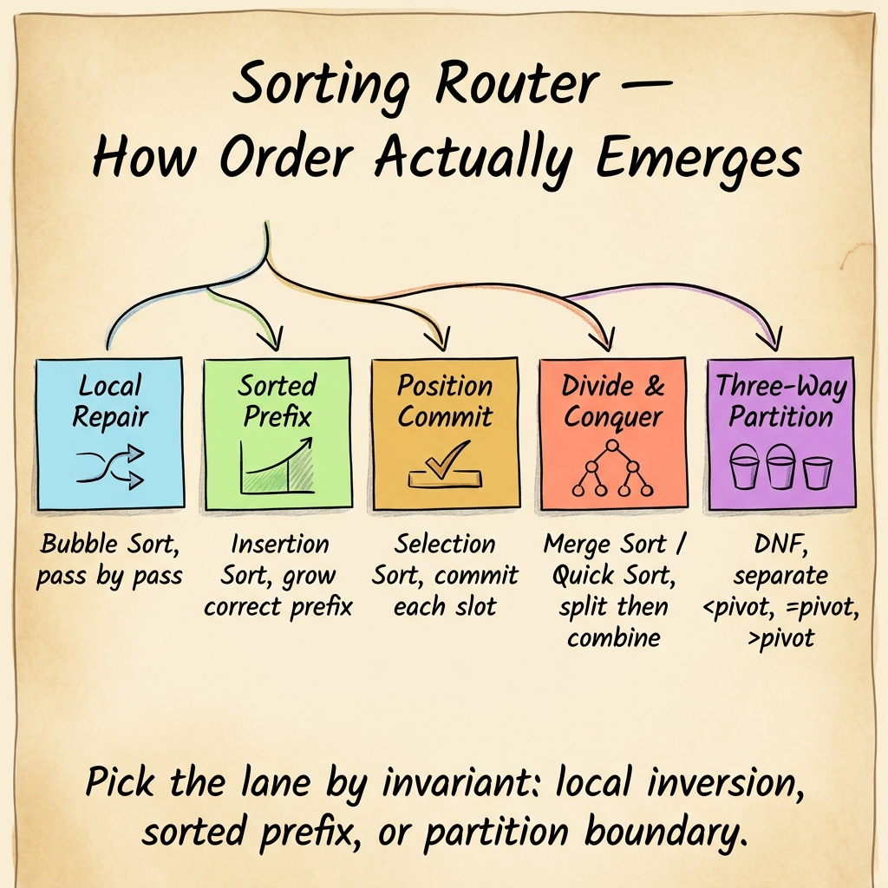
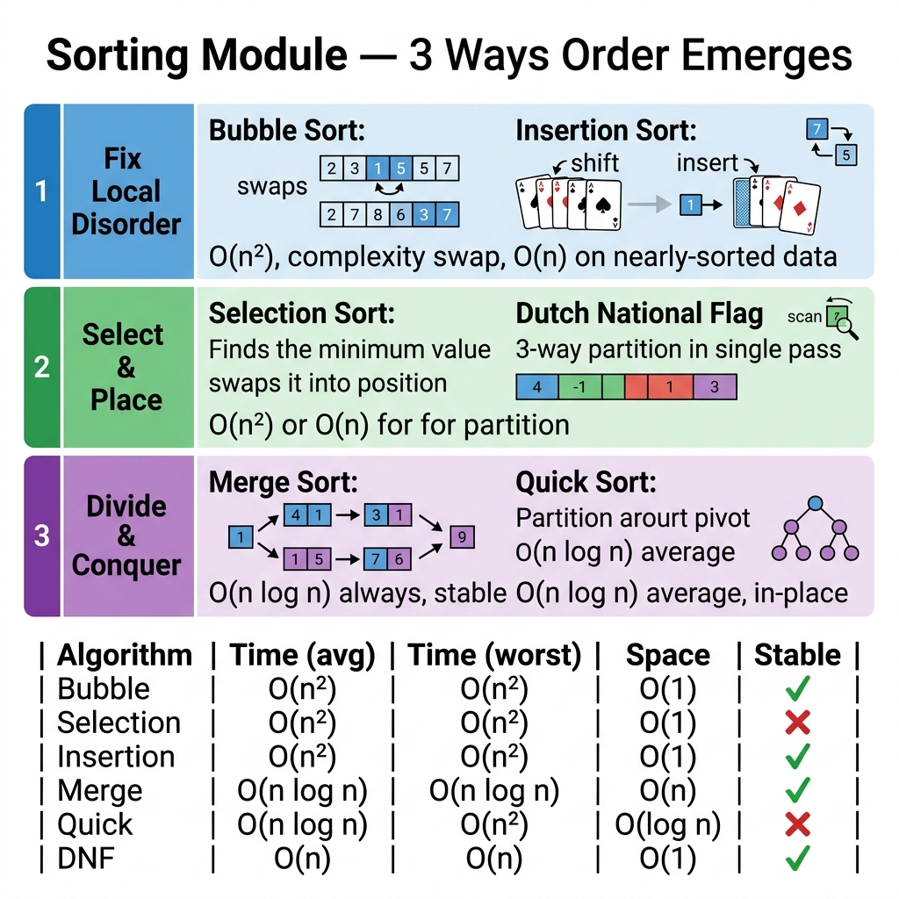

<!-- tags: dsa, algorithms, sorting, overview -->
# Sorting

> Sorting is easily taught as a dry Big-O table. This module takes a different path: observing how order emerges, how elements move, and why one algorithm is more reliable than another in specific contexts.

📅 Created: 2026-04-04 · 🔄 Updated: 2026-04-10 · ⏱️ 8 min read

| Aspect | Detail |
| ------ | ------ |
| **Focus** | Pass structure, partitioning, stability, divide-and-conquer |
| **Key trade-off** | Time cost vs memory vs stability |
| **Audience** | People wanting to understand sorting as mechanisms, not just interview answers |

---

## 1. DEFINE

Sorting is not worth learning as a slogan table like "which is faster". The real value of this lane lies in recognizing **how order emerges**: repairing local inversions, extending a correct prefix, or dividing data into domains and reorganizing.

Bubble, Selection, Insertion, Merge, Quick, and Dutch National Flag look like six separate topics. In reality, they are six different answers to the same question: *after the current step, which part of the data is safe and which part is still moving?*

After this module, you should see sorting as a family of invariants:
- local repair for nearly correct data
- prefix commitment for ordered build-up
- partition / divide-and-conquer for larger data or many duplicates

### Module topics
| Topic | Core Mechanism | Key Invariant | Link |
| --- | --- | --- | --- |
| Bubble Sort | Adjacent swap per pass | largest suffix gradually locked | [01-bubble-sort.md](./01-bubble-sort.md) |
| Selection Sort | Select min for each position | prefix perfectly correct | [02-selection-sort.md](./02-selection-sort.md) |
| Insertion Sort | Insert new element into sorted prefix | prefix always ordered | [03-insertion-sort.md](./03-insertion-sort.md) |
| Merge Sort | Divide in half and merge | each sub-half sorted before merge | [04-merge-sort.md](./04-merge-sort.md) |
| Quick Sort | Partition around pivot | pivot moves to relative correct zone | [05-quick-sort.md](./05-quick-sort.md) |
| Dutch National Flag | Three-way partition | three zones (left/mid/right) have distinct meanings | [06-dutch-national-flag.md](./06-dutch-national-flag.md) |

## 2. VISUAL

The router map above answers the entry question: **does order emerge via local passes, a sorted prefix, or partition/divide-and-conquer?**

Once you identify the mechanism, the module overview below zooms into each group — mapping algorithms to their invariant, showing how complexity and stability trade off, and revealing that six algorithms are really three families with different guarantees.

*Image: Six algorithms collapse into three families. The complexity table at the bottom is the fastest way to remember which trades stability for speed and which trades memory for guaranteed O(n log n).*

## 3. CODE

Your reading sequence should follow the invariant you find most blurry, not the slogan of "the most famous algorithm".

| Order | File | Learning Goal | Question to Answer |
| --- | --- | --- | --- |
| 1 | [01-bubble-sort.md](./01-bubble-sort.md) | See passes and local inversions | What does one pass guarantee? |
| 2 | [03-insertion-sort.md](./03-insertion-sort.md) | Understand sorted prefix | Why does nearly-sorted input favor insertion over bubble? |
| 3 | [04-merge-sort.md](./04-merge-sort.md) | Lock divide-and-conquer + merge invariant | What do you trade auxiliary memory for? |
| 4 | [05-quick-sort.md](./05-quick-sort.md) and [06-dutch-national-flag.md](./06-dutch-national-flag.md) | Master partitioning | What does the pivot/partition isolate? |

## 4. PITFALLS

In sorting, mistakes are rarely just syntax. They usually stem from misunderstanding which area is safe and which area is still moving.

| Pitfall | Signal | Why it fails | How to fix | Severity |
| ------- | -------- | ---------- | -------- | -------- |
| Remembering Big-O but forgetting invariants | Knowing Quick is O(n log n) average but failing to partition | Complexity does not replace correctness | You must state which area is safe after one step | high |
| Equating stable with in-place | Assuming a stable algorithm uses little memory | These two properties are independent in many cases | Track each trade-off separately | medium |
| Ignoring input distribution | Using Quick Sort blindly on data with many duplicates | The pivot strategy or partition scheme degrades | Read Dutch National Flag as a variant handling duplicates | medium |
| Viewing sorting as "fire and forget" | Failing to link sorting with searching / greedy / interval problems | You miss the role of order as an intermediate tool | After each sort, ask what this order unlocks next | medium |

## 5. REF

- Algorithms, 4th Edition — Elementary Sorts: https://algs4.cs.princeton.edu/21elementary/
- Algorithms, 4th Edition — Quicksort: https://algs4.cs.princeton.edu/23quicksort/
- Wikipedia — Sorting algorithm: https://en.wikipedia.org/wiki/Sorting_algorithm

## 6. RECOMMEND

Once you see order created by passes, prefixes, or partitions, the next step is using that order as a tool for another family.

- If sorting exposes the sorted order to eliminate search space, move to [../patterns/two-pointers/README.md](../patterns/two-pointers/README.md).
- If sorting is just to find boundaries, check [../searching/README.md](../searching/README.md).
- If you want to understand partitioning on trees/ranges instead of arrays, proceed to [../tree-algorithms/README.md](../tree-algorithms/README.md).

## 7. QUICK REF

- Bubble/Insertion fix locally or extend a prefix; Merge/Quick restructure domains.
- Stable refers to the relative order of equal elements; in-place refers to memory.
- The invariant of a pass/partition is more important than the "fast/slow" slogan.
