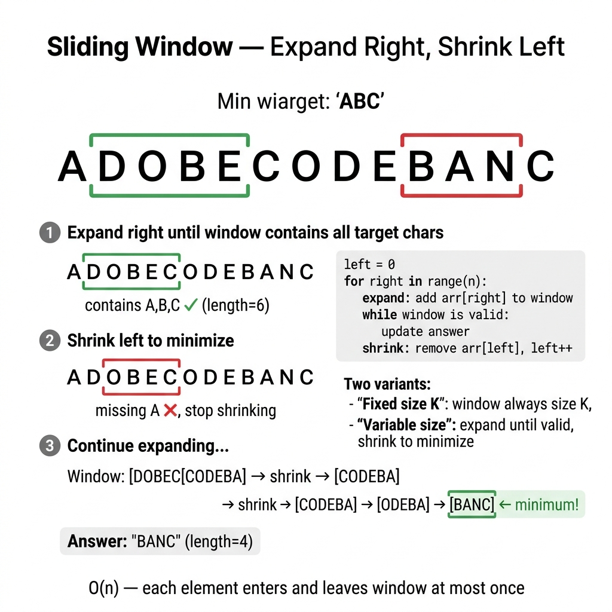

<!-- tags: dsa, algorithms -->
# 🪟 Sliding Window

> **Category**: Array/String Pattern, O(n)
> **Summary**: Maintain a "window" that slides across data — find max/min subarray/substring.

📅 Created: 2026-03-20 · 🔄 Updated: 2026-04-10 · ⏱️ 15 min read

---

## 1. DEFINE

<!-- [Beginner layer] -->

Many array or string problems do not require comparing every subarray from scratch. They only require maintaining one contiguous region that meets a condition or is being optimized. `Sliding Window` turns subarray scanning into updating a sliding window.

The beauty of this pattern is that it makes the problem online. Each element enters the window once and leaves at most once. If you manage the window invariant correctly, the solution drops to O(n).

Core insight: **Sliding window is not a generic two-pointer trick. It guarantees that a contiguous segment state updates incrementally when boundaries shift.**

| Metric       | Value                                                     |
| ------------ | --------------------------------------------------------- |
| **Time**     | O(n) — each element enters/leaves the window at most once |
| **Space**    | O(k) for window, O(1) fixed-size                          |
| **Keywords** | contiguous, subarray, substring, window size, consecutive |

### 2 Types of Sliding Window

| Type | Description | Example |
| ----------------- | --------------------------------- | ------------------------------ |
| **Fixed size**    | Window length = k, slide 1 step   | Max sum subarray size k        |
| **Variable size** | Expand right, shrink left as needed | Smallest subarray with sum ≥ S |

---

| Variant | When to use | Core Idea |
| ------- | ------- | ------- |
| Fixed Window — Max Sum Subarray of Size K | When needing a baseline for manual tracing | Grasp the core invariant and stop condition before optimizing |
| Variable Window — Smallest Subarray with Sum ≥ S | When adding state or practical constraints | Keep the invariant but add state, cache, or auxiliary structure |
| Longest Substring Without Repeating Characters | When inputs are large or optimization is clear | Optimize the core via pruning, ordering, or state compression |
| Minimum Window Substring (Hard) | When needing abstraction or production-grade scaling | Combine techniques to solve harder edge cases |

| Approach | Time | Space | When to choose |
| --- | --- | --- | --- |
| Fixed Window — Max Sum Subarray of Size K | O(1) | Varies | Use to understand the invariant before optimizing |
| Variable Window — Smallest Subarray with Sum ≥ S | O(n) | O(log n) | Use when the problem adds moderate constraints |
| Longest Substring Without Repeating Characters | Varies | Varies | Use to scale better or eliminate brute force |
| Minimum Window Substring (Hard) | Varies | Varies | Use to extend the pattern for hard cases |

### 1.1 Quick Identification

- The prompt contains keywords like `subarray`, `substring`, `contiguous`, `window size`, `at most / at least`.
- You only care about consecutive segments, not arbitrary subsequences.
- The problem features a fixed-size or variable-size window.

### 1.2 Invariants & Failure Modes

- The window state must update when adding a right element and removing a left element.
- The left boundary should only move when the window invariant demands it.
- Common failure mode: Using two pointers without defining what the window represents. This makes shrinking or expanding arbitrary.

## 2. VISUAL

The card below answers the central question: **Which window slides as a block, and which window must expand and shrink to keep the constraint?**



The two traces below distinguish these two fundamental shapes before diving into code.

### Level 1 — Core intuition

```text
  Fixed Window (k=3):
  [1, 3, 2, 6, -1, 4, 1, 8, 2]
   └──┘         slide →
     └──┘
       └──┘

  Variable Window:
  target sum ≥ 7
  [2, 1, 5, 2, 3, 2]
   L──────R           sum=8 ≥ 7 → shrink L
      L───R           sum=7 ≥ 7 → record, shrink L
```

*Caption*: Once you see what state the window holds and when the left pointer can shift, the rest becomes mechanical.

### Level 2 — Decision trace

- Choose a representation to reuse scanned information: window, prefix, trie node, or center pair.
- Each character should enter or leave the state a finite number of times to avoid brute-force.
- Encode boundary conditions like duplicates, empty substrings, and overlaps directly in the state update.
- When the state reflects the target string segment, fetch the answer directly without rescanning.

## 3. CODE

When the visual locks the expand/shrink rhythm, the code simply preserves that state.

### Problem 1: Basic — Fixed Window — Max Sum Subarray of Size K
> **Objective**: Find the maximum sum of any subarray with a fixed length `k`
> **Approach**: Maintain a window of size `k`. Add a new element on the right and drop one element on the left.
> **Example**: `[1, 3, 2, 6, -1, 4, 1, 8, 2]`, `k=3` → `13`
> **Complexity**: O(n) time, O(1) extra space

```go
package strings

// ━━━━━━━━━━━━━━━━━━━━━━━━━━━━━━━━━━━━━━━━━
// MaxSumSubarray: max sum of any subarray with length k
// Time: O(n), Space: O(1)
// ━━━━━━━━━━━━━━━━━━━━━━━━━━━━━━━━━━━━━━━━━
func MaxSumSubarray(arr []int, k int) int {
    n := len(arr)
    if n < k { return 0 }

    // Initial window
    windowSum := 0
    for i := 0; i < k; i++ {
        windowSum += arr[i]
    }
    maxSum := windowSum

    // Slide: add right, remove left
    for i := k; i < n; i++ {
        windowSum += arr[i] - arr[i-k]
        if windowSum > maxSum {
            maxSum = windowSum
        }
    }
    return maxSum
}
```

```typescript
function maxSumSubarray(arr: number[], k: number): number {
    if (arr.length<k) return 0; let sum=0;
    for (let i=0;i<k;i++) sum+=arr[i]; let max=sum;
    for (let i=k;i<arr.length;i++) { sum+=arr[i]-arr[i-k]; max=Math.max(max,sum); }
    return max;
}
```

```rust
fn max_sum_subarray(arr: &[i32], k: usize) -> i32 {
    if arr.len() < k { return 0; }
    let mut sum: i32 = arr[..k].iter().sum();
    let mut best = sum;
    for i in k..arr.len() {
        sum += arr[i] - arr[i - k];
        best = best.max(sum);
    }
    best
}
```

```cpp
int maxSumSubarray(const std::vector<int>& arr, int k) {
    if (static_cast<int>(arr.size()) < k) return 0;
    int sum = std::accumulate(arr.begin(), arr.begin() + k, 0);
    int best = sum;
    for (int i = k; i < static_cast<int>(arr.size()); ++i) {
        sum += arr[i] - arr[i - k];
        best = std::max(best, sum);
    }
    return best;
}
```

```python
def max_sum_subarray(arr: list[int], k: int) -> int:
    if len(arr)<k: return 0
    s = sum(arr[:k]); mx = s
    for i in range(k,len(arr)): s+=arr[i]-arr[i-k]; mx=max(mx,s)
    return mx
```

> **Why?** A fixed window is correct when the width is constant. Once you know the window always has `k` elements, the state is just the aggregate of that segment. You have no reason to rescan all `k` elements during a slide.

> **Conclusion**: A fixed window is the cleanest pattern. It has a fixed width, mechanical updates, and no shrink logic. If the problem asks for the shortest or longest segment under a constraint, you need a variable window.

### Problem 2: Intermediate — Variable Window — Smallest Subarray with Sum ≥ S
> **Objective**: Find the minimum length of a subarray with a sum greater than or equal to `target`
> **Approach**: Expand `right` until the window meets the condition. Then shrink `left` as much as possible while remaining valid.
> **Example**: `target=7`, `[2, 1, 5, 2, 3, 2]` → `2` because of `[5,2]`
> **Complexity**: O(n) time, O(1) extra space

```go
package strings

import "math"

// ━━━━━━━━━━━━━━━━━━━━━━━━━━━━━━━━━━━━━━━━━
// MinSubarrayLen: shortest subarray with sum ≥ target
// Expand right → shrink left while valid
// ━━━━━━━━━━━━━━━━━━━━━━━━━━━━━━━━━━━━━━━━━
func MinSubarrayLen(target int, arr []int) int {
    n := len(arr)
    minLen := math.MaxInt32
    sum, left := 0, 0

    for right := 0; right < n; right++ {
        sum += arr[right]
        for sum >= target {
            if right-left+1 < minLen {
                minLen = right - left + 1
            }
            sum -= arr[left]
            left++
        }
    }
    if minLen == math.MaxInt32 { return 0 }
    return minLen
}
```

```typescript
function minSubarrayLen(target: number, arr: number[]): number {
    let min=Infinity, sum=0, left=0;
    for (let r=0;r<arr.length;r++) { sum+=arr[r]; while(sum>=target){min=Math.min(min,r-left+1);sum-=arr[left++];} }
    return min===Infinity?0:min;
}
```

```rust
fn min_subarray_len(target: i32, arr: &[i32]) -> usize {
    let (mut best, mut sum, mut left) = (usize::MAX, 0, 0usize);
    for right in 0..arr.len() {
        sum += arr[right];
        while sum >= target {
            best = best.min(right - left + 1);
            sum -= arr[left];
            left += 1;
        }
    }
    if best == usize::MAX { 0 } else { best }
}
```

```cpp
int minSubarrayLen(int target, const std::vector<int>& arr) {
    int best = INT_MAX, sum = 0, left = 0;
    for (int right = 0; right < static_cast<int>(arr.size()); ++right) {
        sum += arr[right];
        while (sum >= target) {
            best = std::min(best, right - left + 1);
            sum -= arr[left++];
        }
    }
    return best == INT_MAX ? 0 : best;
}
```

```python
def min_subarray_len(target: int, arr: list[int]) -> int:
    mn, s, left = float('inf'), 0, 0
    for r in range(len(arr)):
        s += arr[r]
        while s >= target: mn=min(mn,r-left+1); s-=arr[left]; left+=1
    return 0 if mn==float('inf') else mn
```

> **Why?** Unlike a fixed window, the width has no constant value. The constant factor is the predicate `sum >= target`. Therefore, `left` should only shift while the window is valid. Each shrink buys a better chance for a shorter answer.

> **Conclusion**: A variable window appears when the constraint dictates the width. When the constraint state can shrink after expanding, you are in the expand-right and shrink-left family.

### Problem 3: Advanced — Longest Substring Without Repeating Characters
> **Objective**: Find the maximum length of a substring without repeating characters
> **Approach**: Use a `last seen index` map to jump `left` past the nearest duplicate, instead of shrinking step by step.
> **Example**: `"abcabcbb"` → `3` with longest substring like `"abc"`
> **Complexity**: O(n) time, O(min(n, alphabet)) space

```go
package strings

// ━━━━━━━━━━━━━━━━━━━━━━━━━━━━━━━━━━━━━━━━━
// LengthOfLongestSubstring: variable window + hashmap
// LeetCode #3 — classic sliding window
// ━━━━━━━━━━━━━━━━━━━━━━━━━━━━━━━━━━━━━━━━━
func LengthOfLongestSubstring(s string) int {
    charIndex := make(map[byte]int)
    maxLen, left := 0, 0

    for right := 0; right < len(s); right++ {
        if idx, exists := charIndex[s[right]]; exists && idx >= left {
            left = idx + 1 // shrink past duplicate
        }
        charIndex[s[right]] = right
        if right-left+1 > maxLen {
            maxLen = right - left + 1
        }
    }
    return maxLen
}
```

```typescript
function lengthOfLongestSubstring(s: string): number {
    const idx = new Map<string,number>(); let max=0, left=0;
    for (let r=0;r<s.length;r++) { if (idx.has(s[r])&&idx.get(s[r])!>=left) left=idx.get(s[r])!+1; idx.set(s[r],r); max=Math.max(max,r-left+1); }
    return max;
}
```

```rust
use std::collections::HashMap;

fn length_of_longest_substring(s: &str) -> usize {
    let bytes = s.as_bytes();
    let mut seen = HashMap::new();
    let (mut best, mut left) = (0usize, 0usize);
    for (right, &b) in bytes.iter().enumerate() {
        if let Some(&idx) = seen.get(&b) {
            if idx >= left {
                left = idx + 1;
            }
        }
        seen.insert(b, right);
        best = best.max(right - left + 1);
    }
    best
}
```

```cpp
int lengthOfLongestSubstring(const std::string& s) {
    std::unordered_map<char, int> seen;
    int best = 0, left = 0;
    for (int right = 0; right < static_cast<int>(s.size()); ++right) {
        if (seen.count(s[right]) && seen[s[right]] >= left) left = seen[s[right]] + 1;
        seen[s[right]] = right;
        best = std::max(best, right - left + 1);
    }
    return best;
}
```

```python
def length_of_longest_substring(s: str) -> int:
    idx, mx, left = {}, 0, 0
    for r, c in enumerate(s):
        if c in idx and idx[c]>=left: left=idx[c]+1
        idx[c]=r; mx=max(mx,r-left+1)
    return mx
```

> **Why?** This window needs no global sum or count. It needs to know where the closest duplicate lies. A `last seen index` map beats a frequency map here. It lets `left` jump while maintaining the unique character invariant.

> **Conclusion**: When duplicates are the main constraint, ask if you need frequencies or just the closest position. The last-seen map provides the leanest state for new boundaries.

### Problem 4: Expert — Minimum Window Substring (Hard)
> **Objective**: Find the shortest substring of `s` containing all characters of `t`
> **Approach**: Use two maps for `need/window`, count `have/required`, and only shrink while all required characters remain sufficient.
> **Example**: `s="ADOBECODEBANC"`, `t="ABC"` → `"BANC"`
> **Complexity**: O(|s| + |t|) time, O(|alphabet in t|) extra space

```go
package strings

import "math"

// ━━━━━━━━━━━━━━━━━━━━━━━━━━━━━━━━━━━━━━━━━
// MinWindowSubstring: shortest substring of s containing all chars of t
// LeetCode #76
// ━━━━━━━━━━━━━━━━━━━━━━━━━━━━━━━━━━━━━━━━━
func MinWindowSubstring(s, t string) string {
    if len(t) > len(s) { return "" }

    need := make(map[byte]int)
    for i := range t { need[t[i]]++ }

    have, required := 0, len(need)
    window := make(map[byte]int)
    minLen := math.MaxInt32
    start := 0
    left := 0

    for right := 0; right < len(s); right++ {
        c := s[right]
        window[c]++
        if window[c] == need[c] { have++ }

        for have == required {
            if right-left+1 < minLen {
                minLen = right - left + 1
                start = left
            }
            lc := s[left]
            window[lc]--
            if window[lc] < need[lc] { have-- }
            left++
        }
    }
    if minLen == math.MaxInt32 { return "" }
    return s[start : start+minLen]
}
```

```typescript
function minWindowSubstring(s: string, t: string): string {
    const need = new Map<string,number>(); for (const c of t) need.set(c,(need.get(c)??0)+1);
    const win = new Map<string,number>(); let have=0, req=need.size, minLen=Infinity, start=0, left=0;
    for (let r=0;r<s.length;r++) { win.set(s[r],(win.get(s[r])??0)+1); if (win.get(s[r])===need.get(s[r])) have++;
        while(have===req){if(r-left+1<minLen){minLen=r-left+1;start=left;} win.set(s[left],win.get(s[left])!-1); if((win.get(s[left])??0)<(need.get(s[left])??0))have--; left++;} }
    return minLen===Infinity?'':s.slice(start,start+minLen);
}
```

```rust
use std::collections::HashMap;

fn min_window_substring(s: &str, t: &str) -> String {
    if t.len() > s.len() { return String::new(); }
    let mut need = HashMap::new();
    for b in t.bytes() { *need.entry(b).or_insert(0) += 1; }
    let mut window = HashMap::new();
    let (mut have, required) = (0, need.len());
    let bytes = s.as_bytes();
    let (mut best_len, mut start, mut left) = (usize::MAX, 0usize, 0usize);
    for right in 0..bytes.len() {
        let c = bytes[right];
        *window.entry(c).or_insert(0) += 1;
        if window[&c] == *need.get(&c).unwrap_or(&0) { have += 1; }
        while have == required {
            if right - left + 1 < best_len {
                best_len = right - left + 1;
                start = left;
            }
            let lc = bytes[left];
            if let Some(v) = window.get_mut(&lc) { *v -= 1; }
            if window.get(&lc).copied().unwrap_or(0) < need.get(&lc).copied().unwrap_or(0) {
                have -= 1;
            }
            left += 1;
        }
    }
    if best_len == usize::MAX { String::new() } else { s[start..start + best_len].to_string() }
}
```

```cpp
std::string minWindowSubstring(const std::string& s, const std::string& t) {
    std::unordered_map<char, int> need, window;
    for (char c : t) ++need[c];
    int have = 0, required = static_cast<int>(need.size());
    int bestLen = INT_MAX, start = 0, left = 0;
    for (int right = 0; right < static_cast<int>(s.size()); ++right) {
        ++window[s[right]];
        if (window[s[right]] == need[s[right]]) ++have;
        while (have == required) {
            if (right - left + 1 < bestLen) {
                bestLen = right - left + 1;
                start = left;
            }
            --window[s[left]];
            if (window[s[left]] < need[s[left]]) --have;
            ++left;
        }
    }
    return bestLen == INT_MAX ? "" : s.substr(start, bestLen);
}
```

```python
def min_window_substring(s: str, t: str) -> str:
    from collections import Counter
    need = Counter(t); win = {}; have, req = 0, len(need)
    mn, start, left = float('inf'), 0, 0
    for r, c in enumerate(s):
        win[c] = win.get(c,0)+1
        if win[c] == need.get(c): have+=1
        while have == req:
            if r-left+1 < mn: mn=r-left+1; start=left
            win[s[left]]-=1
            if win[s[left]] < need.get(s[left],0): have-=1
            left+=1
    return '' if mn==float('inf') else s[start:start+mn]
```

> **Why?** This is a hard window problem because validity is a count vector, not a single sum. The `have == required` check compresses the validity question into a single flag to control shrinking.

> **Conclusion**: Minimum Window Substring turns the sliding window into a true state machine. Keep `need`, `window`, and validity distinct. The rest is boundary control.

---

## 4. PITFALLS

String problems rarely fail on character syntax. They fail on boundaries, overlaps, and incorrect state representations.

| Pitfall | Symptom | Why it fails | Fix | Severity |
| ------- | -------- | ---------- | -------- | -------- |
| Shrinking with `if` instead of `while` | The window remains valid but misses a better answer | One shrink is rarely enough for a variable window | Keep shrinking until the smallest valid boundary is found | high |
| Using a window for non-contiguous problems | Pointers move but the invariant is unclear | This pattern relies on contiguous segments | Ask if the output must be a consecutive subarray | high |
| Choosing the wrong state | You have a map but must rescan the window | The state cannot represent validity | Decide if the window needs a sum, a count, or a last-seen index | high |
| Off-by-one window sizes | Results deviate by exactly one character | Boundaries do not map to an inclusive range | Always calculate width via `right - left + 1` | medium |

---

## 5. REF

| Resource                      | Link                                                                                          |
| ----------------------------- | --------------------------------------------------------------------------------------------- |
| LeetCode Longest Substring    | [leetcode.com](https://leetcode.com/problems/longest-substring-without-repeating-characters/) |
| LeetCode Min Window Substring | [leetcode.com](https://leetcode.com/problems/minimum-window-substring/)                       |

---

## 6. RECOMMEND

Once you see sliding window as boundary control rather than a two-pointer game, you can recognize when contiguous states apply.

| Next Topic | When to read | Link |
| ------------- | -------------------- | ---- |
| String router | To review strings via boundaries, prefixes, or symmetry | [README.md](./README.md) |
| Hash Maps & Sets | When the window needs explicit frequency states | [../patterns/hash-maps-sets/README.md](../patterns/hash-maps-sets/README.md) |
| Trie | When constraints apply to shared prefixes instead of contiguous segments | [02-trie.md](./02-trie.md) |
| Sliding Window pattern router | To compare string windows with the general family | [../patterns/sliding-window/README.md](../patterns/sliding-window/README.md) |

---

## 7. QUICK REF

| # | Pattern | Code |
|---|---------|------|
| 1 | Fixed window sum | `sum := 0; for i:=0;i<k;i++ { sum+=a[i] }; maxSum:=sum; for i:=k;i<n;i++ { sum+=a[i]-a[i-k]; maxSum=max(maxSum,sum) }` |
| 2 | Variable window | `l := 0; for r := 0; r < n; r++ { window.add(a[r]); for !valid(window) { window.remove(a[l]); l++ }; update(best) }` |
| 3 | Shrink condition | `for len(window) > k { remove(a[l]); l++ }  // too wide` |
| 4 | Expand condition | `for window.sum < target { r++ }  // too narrow` |
| 5 | Complexity | `// O(n) time · O(k) space` |
| 6 | Char frequency map | `freq := make(map[byte]int); freq[s[r]]++; freq[s[l]]--; if freq[s[l]]==0 { delete(freq,s[l]) }` |
| 7 | When to use | `// Subarray/substring with constraint, max/min window, anagram check` |

**Links**: [← README](./README.md) · [→ Trie](./02-trie.md)

---

Back to the opening question: Why does sliding window achieve O(n)? Each element enters the useful window once and leaves at most once. The entire pattern relies on `left` moving forward without resetting.