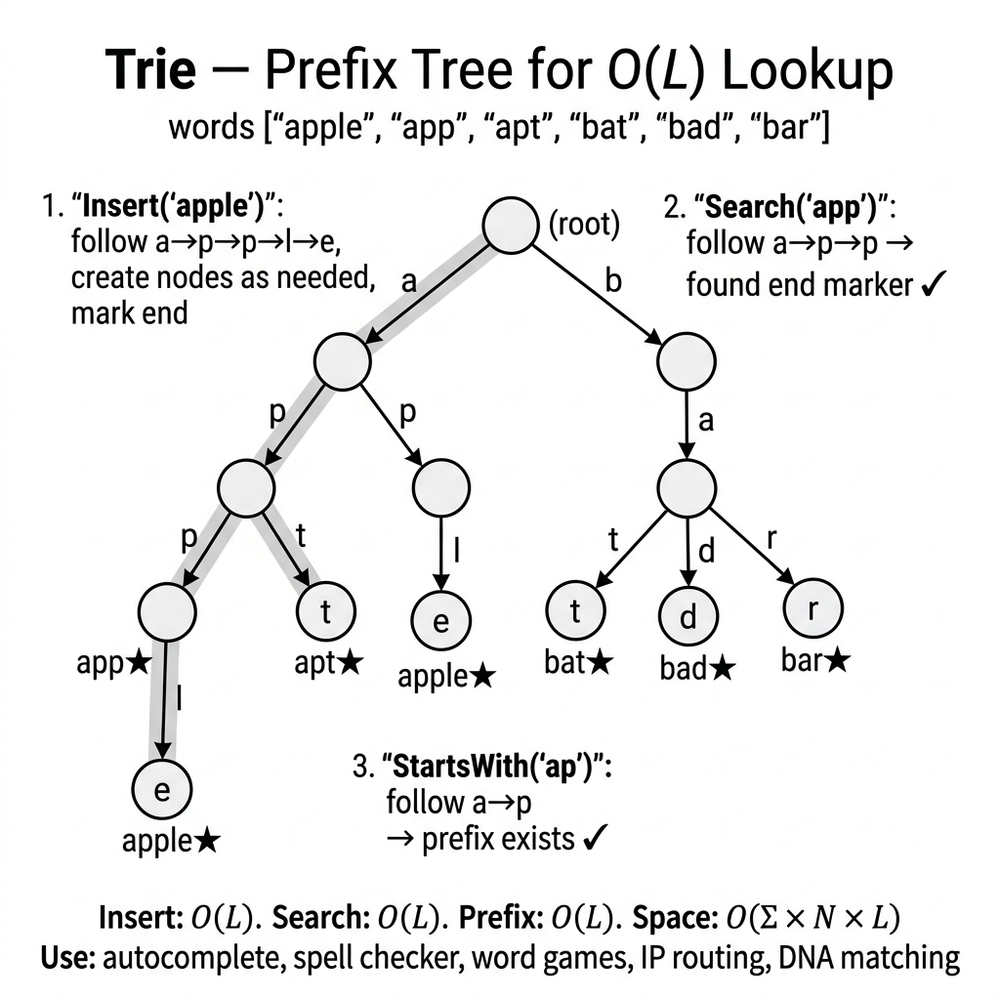

<!-- tags: dsa, algorithms, tree-graph -->
# 🌳 Trie (Prefix Tree)

> **Category**: Tree Data Structure, String
> **Summary**: Tree for prefix-based operations — autocomplete, dictionary, spell check.

📅 Created: 2026-03-20 · 🔄 Updated: 2026-04-10 · ⏱️ 15 min read

---

## 1. DEFINE

<!-- [Experienced layer] -->

When data is a large set of strings and queries focus on prefixes, a flat map becomes clumsy. A `Trie` organizes characters into a tree to share common prefixes. This turns prefix queries into edge traversals.

A trie is valuable because it changes the data representation. You stop checking if a string exists by comparing the whole string. Instead, you check if a character path survives from the root.

Core insight: **A trie is powerful when the data value lies in shared prefixes, not in strings acting as isolated keys.**

| Metric            | Value                          |
| ----------------- | ------------------------------ |
| **Insert**        | O(m), m = word length          |
| **Search**        | O(m)                           |
| **Prefix search** | O(m)                           |
| **Space**         | O(ALPHABET × N × m) worst case |

---

| Variant | When to use | Core Idea |
| ------- | ------- | ------- |
| Basic Trie | When needing a baseline for manual tracing | Grasp the core invariant and stop condition before optimizing |
| Autocomplete — Find all words with prefix | When adding state or practical constraints | Keep the invariant but add state, cache, or auxiliary structure |
| Word Search in Board (Backtracking + Trie) | When inputs are large or optimization is clear | Optimize the core via pruning, ordering, or state compression |

| Approach | Time | Space | When to choose |
| --- | --- | --- | --- |
| Basic Trie | O(1) | Varies | Use to understand the invariant before optimizing |
| Autocomplete — Find all words with prefix | O(n) | O(log n) | Use when the problem adds moderate constraints |
| Word Search in Board (Backtracking + Trie) | Varies | Varies | Use to scale better or eliminate brute force |

### 1.1 Quick Identification

- The prompt asks for autocomplete, prefix search, or a dictionary.
- Each character leads to a node representing a longer prefix step.
- Variants often add an `isEnd` flag, counts, wildcards, or top-k suggestions.

### 1.2 Invariants & Failure Modes

- Each node must represent exactly one specific prefix of all inserted strings.
- Reaching the end of a path does not guarantee the word exists. A terminal flag is required.
- Common failure mode: Using a trie when the problem lacks prefix reuse. This inflates memory without improving query semantics.

## 2. VISUAL

The card below answers the central question: **When should a word set be viewed as shared prefix paths instead of isolated strings in a map?**



The two traces below clarify the two biggest payoffs. They show how prefixes are shared and how `search` differs from `startsWith`.

### Level 1 — Core intuition

```text
  Words: ["cat", "car", "card", "do", "dog"]

          root
        /      \
       c        d
       |        |
       a        o
      / \       |
     t   r      g
         |
         d

  Search "car" → c→a→r → found (isEnd=true)
  Prefix "ca"  → c→a   → ["cat", "car", "card"]
```

*Caption*: A trie is valuable when shared prefixes are real assets. Without prefix reuse, this tree is just memory overhead acting as a fancy structure.

### Level 2 — Decision trace

- Choose a representation to reuse scanned information: window, prefix, trie node, or center pair.
- Each character should enter or leave the state a finite number of times to avoid brute-force.
- Encode boundary conditions like duplicates, empty substrings, and overlaps directly in the state update.
- When the state reflects the target string segment, fetch the answer directly without rescanning.

## 3. CODE

When the visual locks the idea that "shared prefix equals shared path", the code simply preserves that path.

### Problem 1: Basic — Basic Trie
> **Objective**: Support `insert`, `search`, and `startsWith` on a dictionary.
> **Approach**: Each character descends exactly one edge. The `isEnd` flag separates a living path from a complete word.
> **Example**: Insert `cat`, `car`, `card`. `search("car") = true`, `startsWith("ca") = true`, `search("ca") = false`.
> **Complexity**: O(m) time for queries, where `m` is the word length.

```go
package trie

type TrieNode struct {
    Children map[rune]*TrieNode
    IsEnd    bool
    Word     string // optional: store full word
}

type Trie struct {
    Root *TrieNode
}

func NewTrie() *Trie {
    return &Trie{Root: &TrieNode{Children: make(map[rune]*TrieNode)}}
}

func (t *Trie) Insert(word string) {
    node := t.Root
    for _, ch := range word {
        if _, ok := node.Children[ch]; !ok {
            node.Children[ch] = &TrieNode{Children: make(map[rune]*TrieNode)}
        }
        node = node.Children[ch]
    }
    node.IsEnd = true
    node.Word = word
}

func (t *Trie) Search(word string) bool {
    node := t.Root
    for _, ch := range word {
        if _, ok := node.Children[ch]; !ok {
            return false
        }
        node = node.Children[ch]
    }
    return node.IsEnd
}

func (t *Trie) StartsWith(prefix string) bool {
    node := t.Root
    for _, ch := range prefix {
        if _, ok := node.Children[ch]; !ok {
            return false
        }
        node = node.Children[ch]
    }
    return true
}
```

```typescript
class TrieNode { children = new Map<string,TrieNode>(); isEnd = false; word = ''; }
class Trie {
    root = new TrieNode();
    insert(word: string) { let n=this.root; for(const c of word){if(!n.children.has(c))n.children.set(c,new TrieNode()); n=n.children.get(c)!;} n.isEnd=true; n.word=word; }
    search(word: string): boolean { let n=this.root; for(const c of word){if(!n.children.has(c))return false; n=n.children.get(c)!;} return n.isEnd; }
    startsWith(prefix: string): boolean { let n=this.root; for(const c of prefix){if(!n.children.has(c))return false; n=n.children.get(c)!;} return true; }
}
```

```rust
use std::collections::HashMap;

#[derive(Default)]
struct TrieNode {
    children: HashMap<char, TrieNode>,
    is_end: bool,
    word: String,
}

#[derive(Default)]
struct Trie {
    root: TrieNode,
}

impl Trie {
    fn insert(&mut self, word: &str) {
        let mut node = &mut self.root;
        for ch in word.chars() {
            node = node.children.entry(ch).or_default();
        }
        node.is_end = true;
        node.word = word.to_string();
    }

    fn search(&self, word: &str) -> bool {
        let mut node = &self.root;
        for ch in word.chars() {
            if let Some(next) = node.children.get(&ch) { node = next; } else { return false; }
        }
        node.is_end
    }

    fn starts_with(&self, prefix: &str) -> bool {
        let mut node = &self.root;
        for ch in prefix.chars() {
            if let Some(next) = node.children.get(&ch) { node = next; } else { return false; }
        }
        true
    }
}
```

```cpp
struct TrieNode {
    std::unordered_map<char, TrieNode*> children;
    bool isEnd = false;
    std::string word;
};

class Trie {
public:
    TrieNode* root = new TrieNode();

    void insert(const std::string& word) {
        auto* node = root;
        for (char ch : word) {
            if (!node->children.count(ch)) node->children[ch] = new TrieNode();
            node = node->children[ch];
        }
        node->isEnd = true;
        node->word = word;
    }

    bool search(const std::string& word) const {
        auto* node = root;
        for (char ch : word) {
            if (!node->children.count(ch)) return false;
            node = node->children.at(ch);
        }
        return node->isEnd;
    }

    bool startsWith(const std::string& prefix) const {
        auto* node = root;
        for (char ch : prefix) {
            if (!node->children.count(ch)) return false;
            node = node->children.at(ch);
        }
        return true;
    }
};
```

```python
class TrieNode:
    def __init__(self): self.children={}; self.is_end=False; self.word=''
class Trie:
    def __init__(self): self.root=TrieNode()
    def insert(self, word: str):
        node=self.root
        for c in word:
            if c not in node.children: node.children[c]=TrieNode()
            node=node.children[c]
        node.is_end=True; node.word=word
    def search(self, word: str) -> bool:
        node=self.root
        for c in word:
            if c not in node.children: return False
            node=node.children[c]
        return node.is_end
    def starts_with(self, prefix: str) -> bool:
        node=self.root
        for c in prefix:
            if c not in node.children: return False
            node=node.children[c]
        return True
```

> **Why?** A trie reorganizes data by prefixes instead of keeping strings as flat keys. Each downward step reuses a known prefix. A prefix query skips comparing every dictionary word.

> **Conclusion**: The basic trie shows the difference between a living path and a terminated word. If the problem asks to enumerate completions, you must move to autocomplete.

### Problem 2: Intermediate — Autocomplete — Find all words with prefix
> **Objective**: Return all words starting with a given prefix.
> **Approach**: Traverse to the prefix node, then run DFS on that subtree to collect completions.
> **Example**: For `cat`, `car`, `card`, `dog`. `autocomplete("ca")` returns `["cat", "car", "card"]`.
> **Complexity**: O(p + output_subtree_size), where `p` is the prefix length.

```go
package trie

func (t *Trie) Autocomplete(prefix string) []string {
    node := t.Root
    for _, ch := range prefix {
        if _, ok := node.Children[ch]; !ok {
            return nil
        }
        node = node.Children[ch]
    }
    var results []string
    t.collectWords(node, prefix, &results)
    return results
}

func (t *Trie) collectWords(node *TrieNode, prefix string, results *[]string) {
    if node.IsEnd {
        *results = append(*results, prefix)
    }
    for ch, child := range node.Children {
        t.collectWords(child, prefix+string(ch), results)
    }
}
```

```typescript
// Add to Trie class:
// autocomplete(prefix: string): string[] {
//     let n=this.root; for(const c of prefix){if(!n.children.has(c))return []; n=n.children.get(c)!;}
//     const results: string[]=[]; const collect=(node:TrieNode,p:string)=>{if(node.isEnd)results.push(p); for(const[c,ch]of node.children)collect(ch,p+c);}; collect(n,prefix); return results; }
function autocomplete(trie: Trie, prefix: string): string[] {
    let n = (trie as any).root; for(const c of prefix){if(!n.children.has(c))return []; n=n.children.get(c)!;}
    const results: string[]=[]; const collect=(node: any,p: string)=>{if(node.isEnd)results.push(p); for(const[c,ch]of node.children)collect(ch,p+c);}; collect(n,prefix); return results;
}
```

```rust
fn autocomplete(trie: &Trie, prefix: &str) -> Vec<String> {
    let mut node = &trie.root;
    for ch in prefix.chars() {
        if let Some(next) = node.children.get(&ch) { node = next; } else { return Vec::new(); }
    }
    let mut results = Vec::new();
    fn collect(node: &TrieNode, prefix: String, results: &mut Vec<String>) {
        if node.is_end { results.push(prefix.clone()); }
        for (ch, child) in &node.children {
            let mut next = prefix.clone();
            next.push(*ch);
            collect(child, next, results);
        }
    }
    collect(node, prefix.to_string(), &mut results);
    results
}
```

```cpp
std::vector<std::string> autocomplete(Trie& trie, const std::string& prefix) {
    auto* node = trie.root;
    for (char ch : prefix) {
        if (!node->children.count(ch)) return {};
        node = node->children[ch];
    }
    std::vector<std::string> results;
    std::function<void(TrieNode*, std::string)> collect = [&](TrieNode* cur, std::string p) {
        if (cur->isEnd) results.push_back(p);
        for (auto& [ch, child] : cur->children) collect(child, p + ch);
    };
    collect(node, prefix);
    return results;
}
```

```python
def autocomplete(trie, prefix: str) -> list[str]:
    node = trie.root
    for c in prefix:
        if c not in node.children: return []
        node = node.children[c]
    results = []
    def collect(n, p):
        if n.is_end: results.append(p)
        for c, ch in n.children.items(): collect(ch, p+c)
    collect(node, prefix); return results
```

> **Why?** Autocomplete reveals the true value of a trie. The prefix query stops being a yes/no question. It opens the exact subtree holding all valid completions. You pay in memory to step directly into that subtree.

> **Conclusion**: When a problem asks for all completions of a prefix, a trie is the natural choice. If memory inflates, consider a compressed trie or ternary search tree.

### Problem 3: Advanced — Word Search in Board (Backtracking + Trie)
> **Objective**: Find all dictionary words in a character board.
> **Approach**: Build a trie for the dictionary and backtrack on the board. Stop early when the current prefix dies in the trie.
> **Example**: A board with overlapping paths and a dictionary with shared prefixes like `oath`, `pea`, `eat`, `rain`.
> **Complexity**: O(sum of word lengths) to build the trie, followed by pruned backtracking. The worst-case is large, but practical runtime beats brute-forcing words.

```go
package trie

// FindWords: find all words in board — LeetCode #212
func FindWords(board [][]byte, words []string) []string {
    t := NewTrie()
    for _, w := range words { t.Insert(w) }

    rows, cols := len(board), len(board[0])
    var results []string
    found := make(map[string]bool)

    var dfs func(r, c int, node *TrieNode)
    dfs = func(r, c int, node *TrieNode) {
        if r < 0 || r >= rows || c < 0 || c >= cols { return }
        ch := rune(board[r][c])
        if ch == '#' { return }
        child, ok := node.Children[ch]
        if !ok { return }

        if child.IsEnd && !found[child.Word] {
            results = append(results, child.Word)
            found[child.Word] = true
        }

        board[r][c] = '#' // mark visited
        dfs(r+1, c, child)
        dfs(r-1, c, child)
        dfs(r, c+1, child)
        dfs(r, c-1, child)
        board[r][c] = byte(ch) // restore
    }

    for r := 0; r < rows; r++ {
        for c := 0; c < cols; c++ {
            dfs(r, c, t.Root)
        }
    }
    return results
}
```

```typescript
function findWords(board: string[][], words: string[]): string[] {
    const trie = new Trie(); for (const w of words) trie.insert(w);
    const R=board.length,C=board[0].length, results: string[]=[], found=new Set<string>();
    const dfs=(r:number,c:number,node:any)=>{ if(r<0||r>=R||c<0||c>=C||board[r][c]==='#')return;
        const ch=board[r][c]; const child=node.children.get(ch); if(!child)return;
        if(child.isEnd&&!found.has(child.word)){results.push(child.word);found.add(child.word);}
        board[r][c]='#'; dfs(r+1,c,child);dfs(r-1,c,child);dfs(r,c+1,child);dfs(r,c-1,child); board[r][c]=ch; };
    for(let r=0;r<R;r++) for(let c=0;c<C;c++) dfs(r,c,(trie as any).root); return results;
}
```

```rust
fn find_words(board: &mut [Vec<char>], words: &[String]) -> Vec<String> {
    let mut trie = Trie::default();
    for word in words {
        trie.insert(word);
    }
    let (rows, cols) = (board.len() as i32, board[0].len() as i32);
    let mut results = Vec::new();
    let mut found = std::collections::HashSet::new();

    fn dfs(
        r: i32,
        c: i32,
        board: &mut [Vec<char>],
        node: &TrieNode,
        results: &mut Vec<String>,
        found: &mut std::collections::HashSet<String>,
    ) {
        if r < 0 || c < 0 || r >= board.len() as i32 || c >= board[0].len() as i32 {
            return;
        }
        let ch = board[r as usize][c as usize];
        if ch == '#' { return; }
        let Some(child) = node.children.get(&ch) else { return; };
        if child.is_end && found.insert(child.word.clone()) {
            results.push(child.word.clone());
        }
        board[r as usize][c as usize] = '#';
        for (dr, dc) in [(1, 0), (-1, 0), (0, 1), (0, -1)] {
            dfs(r + dr, c + dc, board, child, results, found);
        }
        board[r as usize][c as usize] = ch;
    }

    for r in 0..rows {
        for c in 0..cols {
            dfs(r, c, board, &trie.root, &mut results, &mut found);
        }
    }
    results
}
```

```cpp
std::vector<std::string> findWords(std::vector<std::vector<char>>& board, const std::vector<std::string>& words) {
    Trie trie;
    for (const auto& word : words) trie.insert(word);
    std::vector<std::string> results;
    std::unordered_set<std::string> found;
    int rows = board.size(), cols = board[0].size();

    std::function<void(int, int, TrieNode*)> dfs = [&](int r, int c, TrieNode* node) {
        if (r < 0 || c < 0 || r >= rows || c >= cols || board[r][c] == '#') return;
        char ch = board[r][c];
        if (!node->children.count(ch)) return;
        auto* child = node->children[ch];
        if (child->isEnd && !found.count(child->word)) {
            results.push_back(child->word);
            found.insert(child->word);
        }
        board[r][c] = '#';
        dfs(r + 1, c, child); dfs(r - 1, c, child); dfs(r, c + 1, child); dfs(r, c - 1, child);
        board[r][c] = ch;
    };

    for (int r = 0; r < rows; ++r)
        for (int c = 0; c < cols; ++c)
            dfs(r, c, trie.root);
    return results;
}
```

```python
def find_words(board: list[list[str]], words: list[str]) -> list[str]:
    trie = Trie()
    for w in words: trie.insert(w)
    R,C = len(board),len(board[0]); results, found = [], set()
    def dfs(r,c,node):
        if r<0 or r>=R or c<0 or c>=C or board[r][c]=='#': return
        ch = board[r][c]; child = node.children.get(ch)
        if not child: return
        if child.is_end and child.word not in found: results.append(child.word); found.add(child.word)
        board[r][c]='#'
        for dr,dc in [(1,0),(-1,0),(0,1),(0,-1)]: dfs(r+dr,c+dc,child)
        board[r][c]=ch
    for r in range(R):
        for c in range(C): dfs(r,c,trie.root)
    return results
```

> **Why?** Running isolated backtracking for each word repeats prefix checks. A trie turns the validity check into a direct lookup. This allows early pruning when a board path dies at the prefix level.

> **Conclusion**: A trie is not just for lookup. It is a pruning structure for search trees. When a prefix dies, an entire backtracking branch dies with it.

---

## 4. PITFALLS

String problems rarely fail on character syntax. They fail on boundaries, overlaps, and incorrect state representations.

| Pitfall | Symptom | Why it fails | Fix | Severity |
| ------- | -------- | ---------- | -------- | -------- |
| Forgetting `isEnd` or terminal markers | `search("ca")` returns `true` just because `cat` exists | A living path does not equal a living word | Separate `startsWith` and `search` using terminal markers | high |
| Using a trie without real prefix reuse | Memory spikes but queries remain slow | You pay for a structure the data ignores | Only pick a trie when shared prefixes are real assets | high |
| Hardcoding the alphabet | Unicode breaks the node design | An array of 26 applies only to narrow alphabets | Use maps or abstractions fitting the charset | medium |
| DFS collection lacks output control | Autocomplete returns too many random results | A trie provides a subtree, but output policy is separate | Enforce ordering, limits, and stop conditions during enumeration | medium |

---

## 5. REF

| Resource | Link |
| -------- | ---- |
| Wikipedia Trie | [en.wikipedia.org](https://en.wikipedia.org/wiki/Trie) |
| Open Data Structures | [opendatastructures.org](https://opendatastructures.org/) |
| Implement Trie (Prefix Tree) | [leetcode.com](https://leetcode.com/problems/implement-trie-prefix-tree/) |

---

## 6. RECOMMEND

Once you see a trie as a data representation shift, you recognize when prefix reuse justifies the memory cost.

| Next Topic | When to read | Link |
| ------------- | -------------------- | ---- |
| String router | To review strings via boundaries, prefixes, or symmetry | [README.md](./README.md) |
| Sliding Window | When the problem requires contiguous boundary control | [01-sliding-window.md](./01-sliding-window.md) |
| KMP | When needing exact linear matching without a full trie | [../important-algorithms/02-kmp.md](../important-algorithms/02-kmp.md) |
| Rabin-Karp | When comparing substrings via rolling hashes | [../important-algorithms/03-rabin-karp.md](../important-algorithms/03-rabin-karp.md) |

---

## 7. QUICK REF

| # | Pattern | Code |
|---|---------|------|
| 1 | Node struct | `type TrieNode struct { children [26]*TrieNode; isEnd bool }` |
| 2 | Insert | `for _, ch := range word { idx := ch-'a'; if node.children[idx]==nil { node.children[idx]=&TrieNode{} }; node=node.children[idx] }; node.isEnd=true` |
| 3 | Search | `for _, ch := range word { idx := ch-'a'; if node.children[idx]==nil { return false }; node=node.children[idx] }; return node.isEnd` |
| 4 | StartsWith | `// Same as Search but return true at end (not check isEnd)` |
| 5 | Delete | `// Recursive: unset isEnd, then prune leaf nodes bottom-up` |
| 6 | Complexity | `// Insert/Search/Delete: O(m) m=word length · O(ALPHABET×N×M) space` |
| 7 | When to use | `// Autocomplete, spell check, IP routing, prefix queries` |

**Links**: [← Sliding Window](./01-sliding-window.md) · [→ Palindromes](./03-palindromes.md)

---

Back to the opening question: Why is a trie faster than a hash map for prefix queries? A hash map hashes the full string O(L) for an exact match. A trie shares paths, so a prefix search only traverses O(prefix_length). The trade-off is O(Σ × N × L) space.