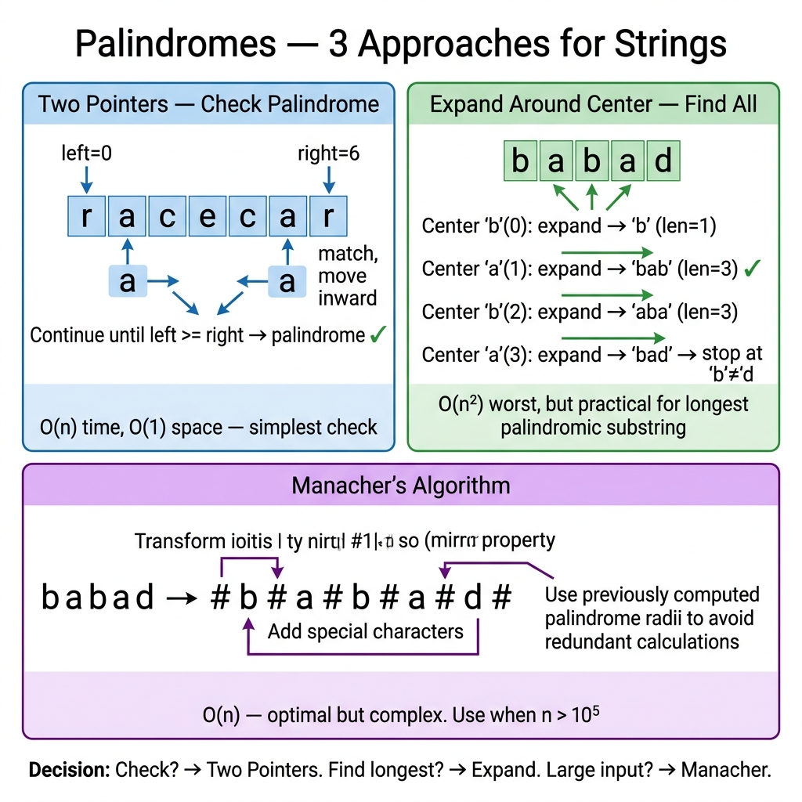

<!-- tags: dsa, algorithms -->
# 🪞 Palindromes

> **Category**: String, Two Pointers / DP
> **Summary**: Check or find palindromes — expand from center, Manacher O(n).

📅 Created: 2026-03-20 · 🔄 Updated: 2026-04-10 · ⏱️ 15 min read

---

## 1. DEFINE

<!-- [Beginner layer] -->

People often view palindromes as simple symmetry checks. When a question shifts from "is this symmetric" to "find the longest palindrome", comparing from both ends fails. You need an expanding center representation or subproblem reuse.

`Palindrome Patterns` are valuable because the same symmetry requires different strategies. Use two-pointers for checking, center expansion for longest substrings, and DP or Manacher for scaling.

Core insight: **The key is finding the center or state that allows symmetric expansion without rescanning.**

| Variant | When to use | Core Idea |
| ------- | ------- | ------- |
| Check palindrome | When verifying symmetry of a single string | Use two pointers from both ends |
| Longest palindromic substring | When finding the longest symmetric segment | Expand from each center to leverage symmetry |
| Count / enumerate palindromes | When listing or counting palindromic subsegments | Let each center generate multiple candidates |
| Manacher | When handling large inputs needing O(n) | Use mirrors and radius reuse to skip comparisons |

| Approach | Time | Space | When to choose |
| -------- | ---- | ----- | -------- |
| Two pointers | O(n) | O(1) | Use for simple validation |
| Expand from center | O(n²) | O(1) | Use for longest substring or counting |
| Manacher's algorithm | O(n) | O(n) | Use for true asymptotic optimization |

### 1.1 Quick Identification

- Prompts mention palindrome substrings, counting palindromes, or longest palindromes.
- You must exploit center symmetry or rely on smaller subproblems.
- Variants differ in representation and target complexity.

### 1.2 Invariants & Failure Modes

- A segment remains a palindrome only if its new outer characters match and its core is symmetric.
- Center expansion must check both odd and even centers.
- Common failure mode: Using the validation pattern for a counting problem. This inflates costs or misses cases.

## 2. VISUAL

The card below answers the central question: **When do you check symmetry from the ends, and when do you expand from every position?**



The two traces below separate the core intuitions. They highlight odd/even centers and the value of expanding around a center instead of brute-forcing all substrings.

### Level 1 — Core intuition

```text
s = "babad"

Centers:
  b | a | b | a | d      (odd)
  b a b a d              (even gaps)

Expand around center "a":
left='b', right='b'  -> "bab"
```

*Caption*: Palindrome problems become manageable when the center becomes your primary object, not just the string boundaries.

### Level 2 — Decision trace

- Pick a fixed center.
- Expand outward while both ends match.
- Each successful expansion yields a valid palindrome or updates the best answer.
- Invariant: The current segment `[l..r]` is a palindrome before the next expansion step.

## 3. CODE

When symmetry locks the visual, the code chooses a representation for the question. Is it validating, expanding, or reusing states?

### Problem 1: Basic — Check Palindrome
> **Objective**: Check if a string is a complete palindrome.
> **Approach**: Move two pointers inward from both ends and stop on any mismatch.
> **Example**: `"racecar"` → `true`, `"abca"` → `false`.
> **Complexity**: O(n) time, O(1) extra space.

```go
func IsPalindrome(s string) bool {
    l, r := 0, len(s)-1
    for l < r {
        if s[l] != s[r] { return false }
        l++; r--
    }
    return true
}
```

```typescript
function isPalindrome(s: string): boolean {
    let l=0, r=s.length-1; while(l<r){if(s[l]!==s[r])return false;l++;r--;} return true;
}
```

```rust
fn is_palindrome(s: &str) -> bool {
    let bytes = s.as_bytes();
    let (mut l, mut r) = (0usize, bytes.len().saturating_sub(1));
    while l < r {
        if bytes[l] != bytes[r] { return false; }
        l += 1;
        r -= 1;
    }
    true
}
```

```cpp
bool isPalindrome(const std::string& s) {
    int l = 0, r = static_cast<int>(s.size()) - 1;
    while (l < r) {
        if (s[l++] != s[r--]) return false;
    }
    return true;
}
```

```python
def is_palindrome(s: str) -> bool:
    return s == s[::-1]
```

> **Why?** A pure palindrome check needs no center expansion or rich state. The question only asks about global symmetry. Two inward pointers offer the leanest representation.

> **Conclusion**: Two pointers work for validation. When the prompt asks for longest or counting, the problem stops being a fixed segment check.

### Problem 2: Intermediate — Longest Palindromic Substring — Expand from Center
> **Objective**: Find the longest palindromic substring.
> **Approach**: Try all odd and even centers, expand until symmetry breaks, and keep the longest.
> **Example**: `"babad"` → `"bab"` or `"aba"`.
> **Complexity**: O(n²) time, O(1) extra space.

```go
// ━━━━━━━━━━━━━━━━━━━━━━━━━━━━━━━━━━━━━━━━━
// LongestPalSubstr: try each center, expand outward
// O(n²) time, O(1) space
// ━━━━━━━━━━━━━━━━━━━━━━━━━━━━━━━━━━━━━━━━━
func LongestPalSubstr(s string) string {
    if len(s) < 2 { return s }
    start, maxLen := 0, 1

    expand := func(l, r int) {
        for l >= 0 && r < len(s) && s[l] == s[r] {
            if r-l+1 > maxLen {
                start = l
                maxLen = r - l + 1
            }
            l--; r++
        }
    }

    for i := 0; i < len(s); i++ {
        expand(i, i)   // odd length (single center)
        expand(i, i+1) // even length (double center)
    }
    return s[start : start+maxLen]
}
```

```typescript
function longestPalSubstr(s: string): string {
    if (s.length<2) return s; let start=0, maxLen=1;
    const expand=(l:number,r:number)=>{while(l>=0&&r<s.length&&s[l]===s[r]){if(r-l+1>maxLen){start=l;maxLen=r-l+1;}l--;r++;}};
    for(let i=0;i<s.length;i++){expand(i,i);expand(i,i+1);}
    return s.slice(start,start+maxLen);
}
```

```rust
fn longest_pal_substr(s: &str) -> String {
    if s.len() < 2 { return s.to_string(); }
    let bytes = s.as_bytes();
    let (mut start, mut best_len) = (0usize, 1usize);
    let mut expand = |mut l: isize, mut r: isize| {
        while l >= 0 && r < bytes.len() as isize && bytes[l as usize] == bytes[r as usize] {
            let len = (r - l + 1) as usize;
            if len > best_len {
                start = l as usize;
                best_len = len;
            }
            l -= 1;
            r += 1;
        }
    };
    for i in 0..bytes.len() {
        expand(i as isize, i as isize);
        expand(i as isize, i as isize + 1);
    }
    s[start..start + best_len].to_string()
}
```

```cpp
std::string longestPalSubstr(const std::string& s) {
    if (s.size() < 2) return s;
    int start = 0, bestLen = 1;
    auto expand = [&](int l, int r) {
        while (l >= 0 && r < static_cast<int>(s.size()) && s[l] == s[r]) {
            if (r - l + 1 > bestLen) {
                start = l;
                bestLen = r - l + 1;
            }
            --l; ++r;
        }
    };
    for (int i = 0; i < static_cast<int>(s.size()); ++i) {
        expand(i, i);
        expand(i, i + 1);
    }
    return s.substr(start, bestLen);
}
```

```python
def longest_pal_substr(s: str) -> str:
    if len(s)<2: return s
    start, mx = 0, 1
    def expand(l,r):
        nonlocal start, mx
        while l>=0 and r<len(s) and s[l]==s[r]:
            if r-l+1>mx: start,mx = l,r-l+1
            l-=1; r+=1
    for i in range(len(s)): expand(i,i); expand(i,i+1)
    return s[start:start+mx]
```

> **Why?** A single scan from the ends fails here because you lack the center position. Expanding from centers beats brute force. It reuses the inner symmetry instead of rechecking the entire substring.

> **Conclusion**: Expand from center is the sweet spot. It solves most interview cases while avoiding complex auxiliary states.

### Problem 3: Advanced — Count Palindromic Substrings
> **Objective**: Count total palindromic substrings.
> **Approach**: Expand around every center. Each successful step adds one new palindrome.
> **Example**: `"aaa"` → `6` for `a, a, a, aa, aa, aaa`.
> **Complexity**: O(n²) time, O(1) extra space.

```go
func CountPalSubstrings(s string) int {
    count := 0
    expand := func(l, r int) {
        for l >= 0 && r < len(s) && s[l] == s[r] {
            count++
            l--; r++
        }
    }
    for i := 0; i < len(s); i++ {
        expand(i, i)
        expand(i, i+1)
    }
    return count
}
```

```typescript
function countPalSubstrings(s: string): number {
    let count=0; const expand=(l:number,r:number)=>{while(l>=0&&r<s.length&&s[l]===s[r]){count++;l--;r++;}};
    for(let i=0;i<s.length;i++){expand(i,i);expand(i,i+1);} return count;
}
```

```rust
fn count_pal_substrings(s: &str) -> i32 {
    let bytes = s.as_bytes();
    let mut count = 0;
    let mut expand = |mut l: isize, mut r: isize, count: &mut i32| {
        while l >= 0 && r < bytes.len() as isize && bytes[l as usize] == bytes[r as usize] {
            *count += 1;
            l -= 1;
            r += 1;
        }
    };
    for i in 0..bytes.len() {
        expand(i as isize, i as isize, &mut count);
        expand(i as isize, i as isize + 1, &mut count);
    }
    count
}
```

```cpp
int countPalSubstrings(const std::string& s) {
    int count = 0;
    auto expand = [&](int l, int r) {
        while (l >= 0 && r < static_cast<int>(s.size()) && s[l] == s[r]) {
            ++count;
            --l; ++r;
        }
    };
    for (int i = 0; i < static_cast<int>(s.size()); ++i) {
        expand(i, i);
        expand(i, i + 1);
    }
    return count;
}
```

```python
def count_pal_substrings(s: str) -> int:
    count = 0
    def expand(l,r):
        nonlocal count
        while l>=0 and r<len(s) and s[l]==s[r]: count+=1; l-=1; r+=1
    for i in range(len(s)): expand(i,i); expand(i,i+1)
    return count
```

> **Why?** Center expansion is very natural for counting. Each sustained symmetry step yields exactly one valid palindrome. You do not need to store segments if the question only requires a count.

> **Conclusion**: Longest palindrome asks for the best center. Count palindrome asks how many valid segments each center generates. The primitive remains the same, but the payoff changes.

### Problem 4: Expert — DP — Palindrome Partition (Min Cuts)
> **Objective**: Find the minimum cuts to partition a string into palindromes.
> **Approach**: Precompute an `isPal[i][j]` table. Then use 1D DP on the prefix to minimize cuts.
> **Example**: `"aab"` → `1` for `"aa" | "b"`.
> **Complexity**: O(n²) time, O(n²) space.

```go
// MinCutPalPartition: min cuts to partition s into palindromes
func MinCutPalPartition(s string) int {
    n := len(s)
    isPal := make([][]bool, n)
    for i := range isPal { isPal[i] = make([]bool, n) }

    for l := 1; l <= n; l++ {
        for i := 0; i+l-1 < n; i++ {
            j := i + l - 1
            if s[i] == s[j] && (l <= 2 || isPal[i+1][j-1]) {
                isPal[i][j] = true
            }
        }
    }

    cuts := make([]int, n)
    for i := range cuts { cuts[i] = i }
    for i := 1; i < n; i++ {
        if isPal[0][i] { cuts[i] = 0; continue }
        for j := 0; j < i; j++ {
            if isPal[j+1][i] && cuts[j]+1 < cuts[i] {
                cuts[i] = cuts[j] + 1
            }
        }
    }
    return cuts[n-1]
}
```

```typescript
function minCutPalPartition(s: string): number {
    const n=s.length; const isPal=Array.from({length:n},()=>Array(n).fill(false));
    for(let l=1;l<=n;l++) for(let i=0;i+l-1<n;i++){const j=i+l-1;if(s[i]===s[j]&&(l<=2||isPal[i+1][j-1]))isPal[i][j]=true;}
    const cuts=Array.from({length:n},(_,i)=>i);
    for(let i=1;i<n;i++){if(isPal[0][i]){cuts[i]=0;continue;} for(let j=0;j<i;j++){if(isPal[j+1][i])cuts[i]=Math.min(cuts[i],cuts[j]+1);}}
    return cuts[n-1];
}
```

```rust
fn min_cut_pal_partition(s: &str) -> i32 {
    let bytes = s.as_bytes();
    let n = bytes.len();
    let mut is_pal = vec![vec![false; n]; n];
    for len in 1..=n {
        for i in 0..=n - len {
            let j = i + len - 1;
            if bytes[i] == bytes[j] && (len <= 2 || is_pal[i + 1][j - 1]) {
                is_pal[i][j] = true;
            }
        }
    }
    let mut cuts: Vec<i32> = (0..n as i32).collect();
    for i in 1..n {
        if is_pal[0][i] {
            cuts[i] = 0;
            continue;
        }
        for j in 0..i {
            if is_pal[j + 1][i] {
                cuts[i] = cuts[i].min(cuts[j] + 1);
            }
        }
    }
    cuts[n - 1]
}
```

```cpp
int minCutPalPartition(const std::string& s) {
    int n = static_cast<int>(s.size());
    std::vector<std::vector<bool>> isPal(n, std::vector<bool>(n, false));
    for (int len = 1; len <= n; ++len) {
        for (int i = 0; i + len - 1 < n; ++i) {
            int j = i + len - 1;
            if (s[i] == s[j] && (len <= 2 || isPal[i + 1][j - 1])) isPal[i][j] = true;
        }
    }
    std::vector<int> cuts(n);
    std::iota(cuts.begin(), cuts.end(), 0);
    for (int i = 1; i < n; ++i) {
        if (isPal[0][i]) {
            cuts[i] = 0;
            continue;
        }
        for (int j = 0; j < i; ++j)
            if (isPal[j + 1][i]) cuts[i] = std::min(cuts[i], cuts[j] + 1);
    }
    return cuts[n - 1];
}
```

```python
def min_cut_pal_partition(s: str) -> int:
    n = len(s); isPal = [[False]*n for _ in range(n)]
    for l in range(1,n+1):
        for i in range(n-l+1):
            j = i+l-1
            if s[i]==s[j] and (l<=2 or isPal[i+1][j-1]): isPal[i][j]=True
    cuts = list(range(n))
    for i in range(1,n):
        if isPal[0][i]: cuts[i]=0; continue
        for j in range(i):
            if isPal[j+1][i]: cuts[i]=min(cuts[i],cuts[j]+1)
    return cuts[n-1]
```

> **Why?** Symmetry alone cannot control this problem via center expansion. You must repeatedly ask if `s[i..j]` is a palindrome. The `isPal` table becomes the shared state for cut decisions.

> **Conclusion**: When palindrome status is repeatedly queried across ranges, the problem leaves pure symmetry scanning and enters dynamic programming.

---

## 4. PITFALLS

String problems rarely fail on character syntax. They fail on boundaries, overlaps, and incorrect state representations.

| Pitfall | Symptom | Why it fails | Fix | Severity |
| ------- | -------- | ---------- | -------- | -------- |
| Forgetting even centers | `"abba"` is missed as the longest palindrome | Checking only `(i,i)` misses all even-length centers | Expand both `(i,i)` and `(i,i+1)` | high |
| Using two pointers for longest/counting | The code validates but fails to scale | You picked the wrong iteration object | Shift focus from string boundaries to possible centers | high |
| Confusing substrings with subsequences | DP or output diverges from prompt | Substrings and subsequences have different states | Confirm if the prompt demands contiguous elements | high |
| Ignoring charset boundaries | Unicode strings yield wrong answers | Byte-level indexing misses logical characters | Use proper representation for the given language charset | medium |

---

## 5. REF

| Resource                               | Link                                                                            |
| -------------------------------------- | ------------------------------------------------------------------------------- |
| LeetCode Longest Palindromic Substring | [leetcode.com](https://leetcode.com/problems/longest-palindromic-substring/)    |
| Wikipedia Manacher                     | [en.wikipedia.org](https://en.wikipedia.org/wiki/Longest_palindromic_substring) |

---

## 6. RECOMMEND

Once you see palindrome problems shift based on the required symmetry, you know when DP tables replace symmetry scanning.

| Next Topic | When to read | Link |
| ------------- | -------------------- | ---- |
| String router | To review strings via boundaries, prefixes, or symmetry | [README.md](./README.md) |
| Sliding Window | When the problem is contiguous boundary control, not symmetry | [01-sliding-window.md](./01-sliding-window.md) |
| Palindrome DP | When symmetry needs a table state for reuse | [../dynamic-programming/07-palindrome-dp.md](../dynamic-programming/07-palindrome-dp.md) |
| KMP | When the problem shifts to exact matching | [../important-algorithms/02-kmp.md](../important-algorithms/02-kmp.md) |

---

## 7. QUICK REF

| # | Pattern | Code |
|---|---------|------|
| 1 | Is palindrome | `for l, r := 0, len(s)-1; l < r; l, r = l+1, r-1 { if s[l] != s[r] { return false } }; return true` |
| 2 | Expand around center | `l, r := i, i; for l>=0 && r<n && s[l]==s[r] { l--; r++ }; return s[l+1:r]` |
| 3 | Even palindrome | `l, r := i, i+1; for l>=0 && r<n && s[l]==s[r] { l--; r++ }` |
| 4 | Longest palindrome | `best := ""; for i := range s { odd := expand(s,i,i); even := expand(s,i,i+1); if len(odd)>len(best) { best=odd }; if len(even)>len(best) { best=even } }` |
| 5 | Complexity | `// O(n²) expand · O(n) Manacher's algorithm` |
| 6 | DP approach | `dp[i][j] = s[i]==s[j] && (j-i<=2 || dp[i+1][j-1])` |
| 7 | When to use | `// Palindrome check, longest palindromic substring/subsequence` |

**Links**: [← Trie](./02-trie.md) · [← README](./README.md)

---

Back to the opening question: Why do palindromes have so many solutions? The question is not just about symmetry. It is about validating a string, finding the best center, counting symmetries, or reusing states for optimization.
