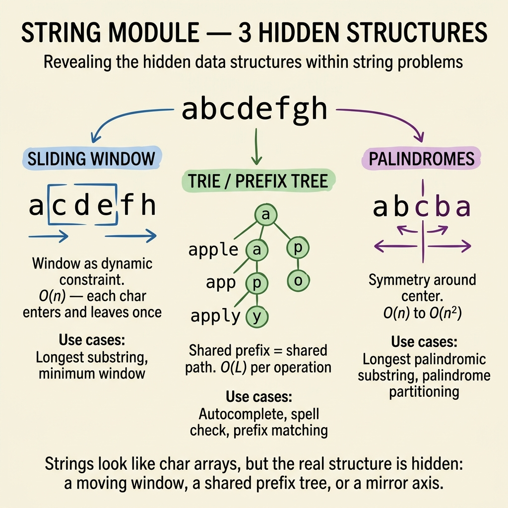
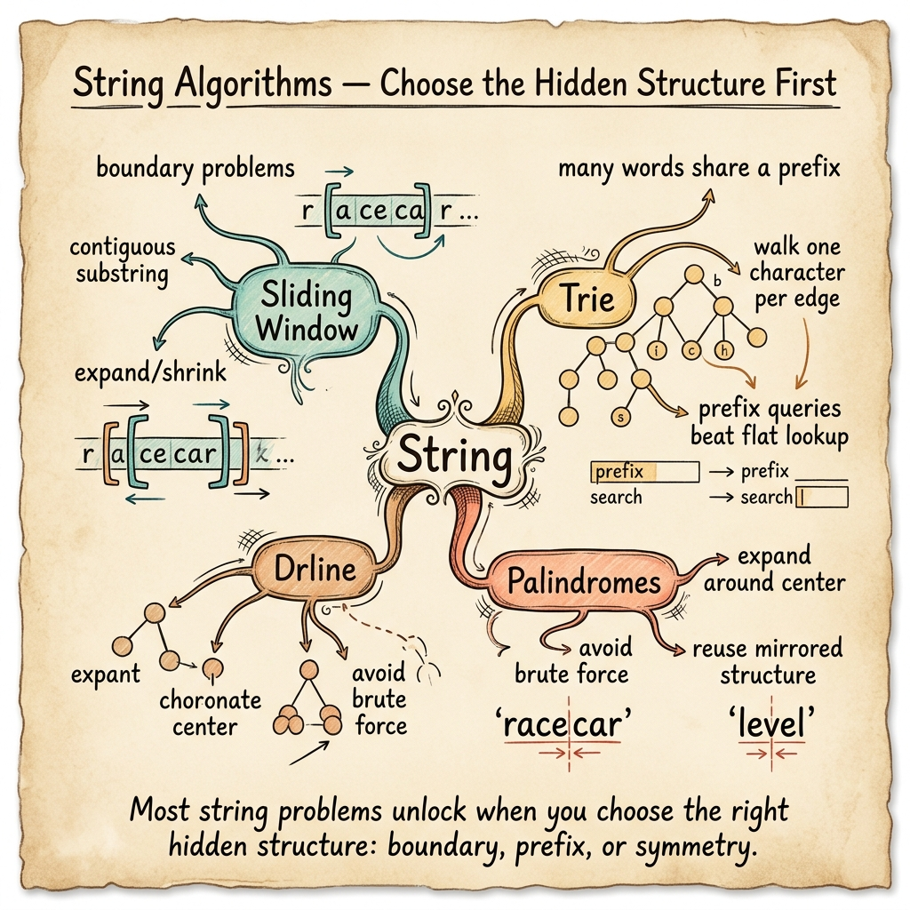

<!-- tags: dsa, algorithms, string, overview -->
# String Algorithms — Structure Hidden Inside Text

> A string looks like a character array. However, many string problems only unlock when you see the hidden structure. This structure can be an expanding window, a shared prefix, or symmetry around a center.

📅 Created: 2026-04-04 · 🔄 Updated: 2026-04-10 · ⏱️ 8 min read

| Aspect | Detail |
| ------ | ------ |
| **Focus** | Substring windows, trie, palindromic structure |
| **Core tension** | Repeated comparisons occur if you ignore the string structure |
| **Adjacent modules** | Patterns and Important Algorithms |

---




## 1. DEFINE

You face a string problem. You debate between a window, a hash map, a trie, or a symmetry check. This router exists to lock in the right question before writing code. **Does a dynamic boundary, a shared prefix, or center symmetry govern the problem?**

String problems easily drag you toward brute force. You might try every substring, compare character pairs, or rescan prefixes. Those solutions pass simple samples before breaking on large inputs.
The difference in string algorithms does not lie in processing characters. It lies in finding the hidden structure inside the string. This structure is an informative contiguous window, a prefix tree grouping shared paths, or symmetry allowing result reuse.
This hub connects basic string problems with deeper patterns. The goal is to see text as a shaped structure, not just a sequential character array.

### Module Articles
| Article | Core Tension | Invariant | Link |
| --- | --- | --- | --- |
| Sliding Window | Contiguous substring with dynamic constraints | The window always maintains the tracked condition | [01-sliding-window.md](./01-sliding-window.md) |
| Trie | Multiple strings share prefixes | Each edge is a character and each path is a valid prefix | [02-trie.md](./02-trie.md) |
| Palindromes | Symmetry around a center or range | Symmetric character pairs must be preserved | [03-palindromes.md](./03-palindromes.md) |

## 2. VISUAL

The card router below distinguishes three very different ways to exploit string structure.



The text diagram below keeps the same decision tree in a compact format for fast scanning.

```text

String problem
  |
  +-- contiguous substring + changing constraint? -> Sliding Window
  +-- multiple words share prefix / autocomplete? -> Trie
  +-- symmetry around a center / range?           -> Palindromes
```
*Figure: String algorithms rarely need a universal master algorithm. They require you to choose the correct hidden structure governing the problem.*

## 3. CODE

The reading order moves from the most familiar pattern to specialized structures. It ends with the deeper symmetry of palindromic problems.

| Order | File | Learning Point | When to move on |
| --- | --- | --- | --- |
| 1 | [01-sliding-window.md](./01-sliding-window.md) | Contiguous window as a dynamic state | You know which window shrinks and which only expands |
| 2 | [02-trie.md](./02-trie.md) | Prefix sharing as a data structure | You see a trie is not just a nested map |
| 3 | [03-palindromes.md](./03-palindromes.md) | Symmetry as an invariant | You stop brute-forcing every substring to check palindromes |

## 4. PITFALLS

String problems rarely fail due to character iteration syntax. They fail at boundaries, overlaps, and wrong representations for the given question.

| Pitfall | Symptom | Why it fails | Fix | Severity |
| ------- | ------- | ------------ | --- | -------- |
| Treating string as a plain array | Using multiple rescanning passes without seeing the cost | Strings have many repeatable structures worth exploiting | Check if the problem needs a window, prefix, or symmetry | high |
| Using a trie without real prefix reuse | The structure is heavier than needed | A trie only adds value when strings share paths | If you only need simple membership, a set suffices | medium |
| Brute-force palindrome checks | Every substring is compared from start to end | The cost multiplies by the number of substrings | Use center expansion or DP based on the tension | high |
| Isolating strings from pattern modules | Learning strings as an isolated island | Many string problems are actually sliding window or hashing | Cross-link to `patterns/` and `important-algorithms/` | medium |

## 5. REF

- Open Data Structures: https://opendatastructures.org/
- Longest Substring Without Repeating Characters: https://leetcode.com/problems/longest-substring-without-repeating-characters/
- Implement Trie (Prefix Tree): https://leetcode.com/problems/implement-trie-prefix-tree/

## 6. RECOMMEND

String problems often act as a gateway to deeper patterns or specialized algorithms.

- If the string problem is a contiguous constraint, read [../patterns/sliding-window/README.md](../patterns/sliding-window/README.md).
- If you need efficient exact pattern matching, proceed to [../important-algorithms/02-kmp.md](../important-algorithms/02-kmp.md) and [../important-algorithms/03-rabin-karp.md](../important-algorithms/03-rabin-karp.md).
- If the palindrome turns into a state table, connect to [../dynamic-programming/07-palindrome-dp.md](../dynamic-programming/07-palindrome-dp.md).

## 7. QUICK REF

- String problems revolve around windows, prefixes, or symmetry.
- A trie provides value when prefixes are heavily shared.
- Palindromes require symmetry or state reuse, not mechanical brute-force.
