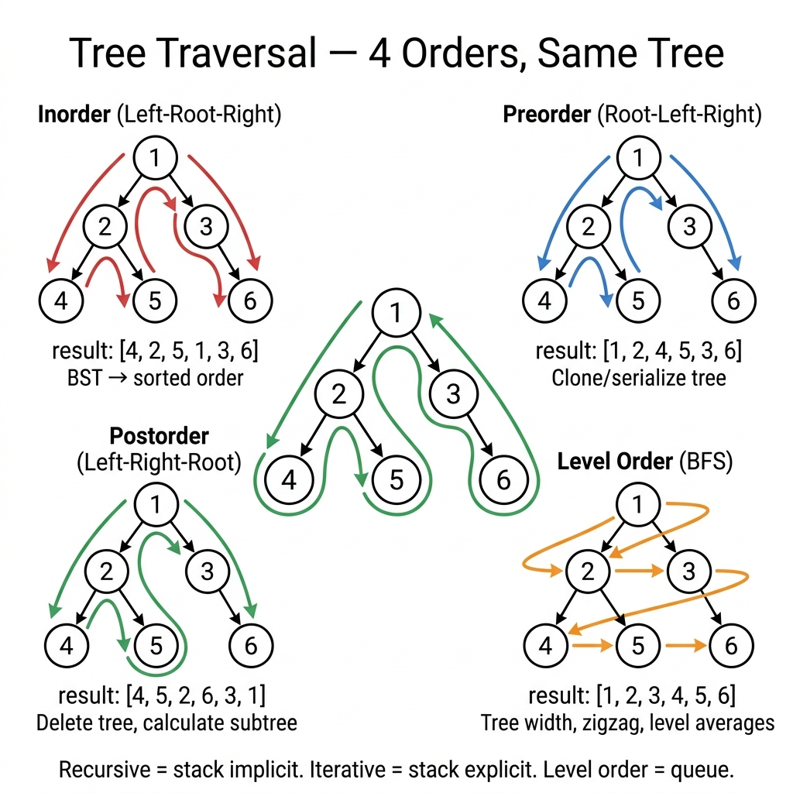

<!-- tags: dsa, algorithms, tree-graph -->
# 🌿 Tree Traversals

> **Category**: Tree, Recursion / Stack / Queue
> **Summary**: Inorder, Preorder, Postorder (DFS) + Level Order (BFS).

📅 Created: 2026-03-20 · 🔄 Updated: 2026-04-09 · ⏱️ 15 min read

---

## 1. DEFINE

<!-- [Experienced layer] -->

Traversal appears basic. However, changing the visit order alters the entire problem meaning. `Tree Traversal` encodes exactly when you process the root, descend left, and backtrack.

This topic is crucial. Many tree patterns are traversals with auxiliary state. You must understand what preorder, inorder, postorder, and level-order promise. Otherwise, BSTs, heaps, and tree serialization become rote memorization.

Core insight: **The traversal order is the exact contract between the tree structure and your node operations.**

| Traversal       | Order               | Use case                    |
| --------------- | ------------------- | --------------------------- |
| **Inorder**     | Left → Root → Right | BST → sorted order.          |
| **Preorder**    | Root → Left → Right | Copy/serialize tree.         |
| **Postorder**   | Left → Right → Root | Delete tree, calculate size. |
| **Level Order** | BFS by level        | Visualize, find depth.       |

---

| Variant | When to use | Key idea |
| ------- | ------- | ------- |
| Tree Node + All Traversals | When you need a manual baseline. | Grasp core invariants and stop conditions before optimizing. |
| Iterative Inorder (no recursion) | When the problem adds constraints. | Maintain the invariant while adding state or auxiliary structures. |
| Level Order (BFS) | When input is large. | Optimize the baseline via pruning or state compression. |
| Max Depth + Validate BST | When needing abstraction. | Combine techniques to solve complex edge cases. |

| Approach | Time | Space | When to choose |
| --- | --- | --- | --- |
| Tree Node + All Traversals | O(1) | Varies | Use this to understand the invariant before optimizing. |
| Iterative Inorder (no recursion) | O(n) | O(log n) | Use this when the problem adds moderate constraints. |
| Level Order (BFS) | Varies | Varies | Use this to scale better and avoid brute force. |
| Max Depth + Validate BST | Varies | Varies | Use this to extend the pattern for hard edge cases. |

### 1.1 Quick Recognition

- The problem requires visiting the entire tree in a specific order.
- You must distinguish DFS across three orders and BFS by level.
- Output relies directly on the node processing time.

### 1.2 Invariants & Failure Modes

- Preorder processes nodes before descending. Inorder processes nodes between branches. Postorder processes nodes after finishing children.
- Level-order needs a queue because it reasons by depth rather than call stack.
- Common failure: memorizing the traversal shape without knowing why a problem demands postorder.

## 2. VISUAL

Trees create an illusion of natural correctness. This trace separates when each node is processed and what metadata is maintained.

### Level 1 — Core intuition

```text
        1
       / \
      2   3
     / \
    4   5

  Inorder:    4, 2, 5, 1, 3
  Preorder:   1, 2, 4, 5, 3
  Postorder:  4, 5, 2, 3, 1
  Level:      [1], [2,3], [4,5]
```

---

*Caption*: 🌿 Tree Traversals at Level 1 show core intuition. Level 2 details state updates from input to output.

### Level 2 — Decision trace

- Start from the root or a subtree. Define what each recursive call must return.
- Ensure left and right subtree invariants remain valid before combining results.
- For iterative traversals, the stack or queue must reflect unprocessed tree sections.
- When unwinding completes, the root return value becomes the entire tree answer.




## 3. CODE

Once the topology and invariants are clear, tree code simply maintains traversal order and updates metadata.

### Problem 1: Basic — Tree Node + All Traversals
> **Goal**: <!-- TODO: problem-specific goal -->
> **Approach**: Start with a small traceable tree. Move to variants with ordering or structural constraints.
> **Example**: A small tree reveals traversal order, state propagation, and balancing invariants.
> **Complexity**: <!-- TODO: specific complexity -->

```go
package tree

type TreeNode struct {
    Val   int
    Left  *TreeNode
    Right *TreeNode
}

// ━━━ Recursive ━━━
func Inorder(root *TreeNode) []int {
    if root == nil { return nil }
    var result []int
    result = append(result, Inorder(root.Left)...)
    result = append(result, root.Val)
    result = append(result, Inorder(root.Right)...)
    return result
}

func Preorder(root *TreeNode) []int {
    if root == nil { return nil }
    var result []int
    result = append(result, root.Val)
    result = append(result, Preorder(root.Left)...)
    result = append(result, Preorder(root.Right)...)
    return result
}

func Postorder(root *TreeNode) []int {
    if root == nil { return nil }
    var result []int
    result = append(result, Postorder(root.Left)...)
    result = append(result, Postorder(root.Right)...)
    result = append(result, root.Val)
    return result
}
```

```typescript
class TreeNode { constructor(public val:number, public left:TreeNode|null=null, public right:TreeNode|null=null){} }
function inorder(root: TreeNode|null): number[] { return root?[...inorder(root.left),root.val,...inorder(root.right)]:[]; }
function preorder(root: TreeNode|null): number[] { return root?[root.val,...preorder(root.left),...preorder(root.right)]:[]; }
function postorder(root: TreeNode|null): number[] { return root?[...postorder(root.left),...postorder(root.right),root.val]:[]; }
```

```rust
#[derive(Clone)]
struct TreeNode {
    val: i32,
    left: Option<Box<TreeNode>>,
    right: Option<Box<TreeNode>>,
}

fn inorder(root: &Option<Box<TreeNode>>) -> Vec<i32> {
    if let Some(node) = root {
        let mut result = inorder(&node.left);
        result.push(node.val);
        result.extend(inorder(&node.right));
        result
    } else {
        Vec::new()
    }
}

fn preorder(root: &Option<Box<TreeNode>>) -> Vec<i32> {
    if let Some(node) = root {
        let mut result = vec![node.val];
        result.extend(preorder(&node.left));
        result.extend(preorder(&node.right));
        result
    } else {
        Vec::new()
    }
}

fn postorder(root: &Option<Box<TreeNode>>) -> Vec<i32> {
    if let Some(node) = root {
        let mut result = postorder(&node.left);
        result.extend(postorder(&node.right));
        result.push(node.val);
        result
    } else {
        Vec::new()
    }
}
```

```cpp
struct TreeNode {
    int val;
    TreeNode* left;
    TreeNode* right;
    TreeNode(int v, TreeNode* l = nullptr, TreeNode* r = nullptr) : val(v), left(l), right(r) {}
};

std::vector<int> inorder(TreeNode* root) {
    if (!root) return {};
    auto left = inorder(root->left);
    left.push_back(root->val);
    auto right = inorder(root->right);
    left.insert(left.end(), right.begin(), right.end());
    return left;
}

std::vector<int> preorder(TreeNode* root) {
    if (!root) return {};
    std::vector<int> result{root->val};
    auto left = preorder(root->left), right = preorder(root->right);
    result.insert(result.end(), left.begin(), left.end());
    result.insert(result.end(), right.begin(), right.end());
    return result;
}

std::vector<int> postorder(TreeNode* root) {
    if (!root) return {};
    auto result = postorder(root->left);
    auto right = postorder(root->right);
    result.insert(result.end(), right.begin(), right.end());
    result.push_back(root->val);
    return result;
}
```

```python
class TreeNode:
    def __init__(self, val=0, left=None, right=None): self.val=val; self.left=left; self.right=right
def inorder(root): return inorder(root.left)+[root.val]+inorder(root.right) if root else []
def preorder(root): return [root.val]+preorder(root.left)+preorder(root.right) if root else []
def postorder(root): return postorder(root.left)+postorder(root.right)+[root.val] if root else []
```

> **Why?** This approach works because each step relies on locked subtree or frontier information. Consistent visit orders and return values naturally yield the correct whole-tree result upon completion.

> **Conclusion**: <!-- TODO: Add unique conclusion with next-step guidance -->

### Problem 2: Intermediate — Iterative Inorder (no recursion)
> **Goal**: <!-- TODO: problem-specific goal -->
> **Approach**: <!-- TODO: problem-specific approach -->
> **Example**: A small tree reveals traversal order, state propagation, and balancing invariants.
> **Complexity**: <!-- TODO: specific complexity -->

```go
func InorderIterative(root *TreeNode) []int {
    var result []int
    var stack []*TreeNode
    curr := root

    for curr != nil || len(stack) > 0 {
        for curr != nil {
            stack = append(stack, curr)
            curr = curr.Left
        }
        curr = stack[len(stack)-1]
        stack = stack[:len(stack)-1]
        result = append(result, curr.Val)
        curr = curr.Right
    }
    return result
}
```

```typescript
function inorderIterative(root: TreeNode|null): number[] {
    const result: number[]=[], stack: TreeNode[]=[]; let curr=root;
    while(curr||stack.length){while(curr){stack.push(curr);curr=curr.left;} curr=stack.pop()!; result.push(curr.val); curr=curr.right;}
    return result;
}
```

```rust
fn inorder_iterative(root: &Option<Box<TreeNode>>) -> Vec<i32> {
    let mut result = Vec::new();
    let mut stack: Vec<&TreeNode> = Vec::new();
    let mut curr = root.as_deref();
    while curr.is_some() || !stack.is_empty() {
        while let Some(node) = curr {
            stack.push(node);
            curr = node.left.as_deref();
        }
        let node = stack.pop().unwrap();
        result.push(node.val);
        curr = node.right.as_deref();
    }
    result
}
```

```cpp
std::vector<int> inorderIterative(TreeNode* root) {
    std::vector<int> result;
    std::vector<TreeNode*> stack;
    auto* curr = root;
    while (curr || !stack.empty()) {
        while (curr) {
            stack.push_back(curr);
            curr = curr->left;
        }
        curr = stack.back();
        stack.pop_back();
        result.push_back(curr->val);
        curr = curr->right;
    }
    return result;
}
```

```python
def inorder_iterative(root):
    result, stack, curr = [], [], root
    while curr or stack:
        while curr: stack.append(curr); curr=curr.left
        curr=stack.pop(); result.append(curr.val); curr=curr.right
    return result
```

> **Why?** This approach works because each step relies on locked subtree or frontier information. Consistent visit orders and return values naturally yield the correct whole-tree result upon completion.

> **Conclusion**: <!-- TODO: Add unique conclusion -->

### Problem 3: Advanced — Level Order (BFS)
> **Goal**: <!-- TODO: problem-specific goal -->
> **Approach**: <!-- TODO: problem-specific approach -->
> **Example**: A small tree reveals traversal order, subtree invariants, and answer update timing.
> **Complexity**: <!-- TODO: specific complexity -->

```go
func LevelOrder(root *TreeNode) [][]int {
    if root == nil { return nil }
    var levels [][]int
    queue := []*TreeNode{root}

    for len(queue) > 0 {
        size := len(queue)
        var level []int
        for i := 0; i < size; i++ {
            node := queue[0]
            queue = queue[1:]
            level = append(level, node.Val)
            if node.Left != nil { queue = append(queue, node.Left) }
            if node.Right != nil { queue = append(queue, node.Right) }
        }
        levels = append(levels, level)
    }
    return levels
}
```

```typescript
function levelOrder(root: TreeNode|null): number[][] {
    if (!root) return []; const levels: number[][]=[], queue: TreeNode[]=[root];
    while(queue.length){const size=queue.length, level: number[]=[]; for(let i=0;i<size;i++){const n=queue.shift()!;level.push(n.val);if(n.left)queue.push(n.left);if(n.right)queue.push(n.right);} levels.push(level);}
    return levels;
}
```

```rust
use std::collections::VecDeque;

fn level_order(root: &Option<Box<TreeNode>>) -> Vec<Vec<i32>> {
    let Some(root_ref) = root.as_deref() else { return Vec::new(); };
    let mut levels = Vec::new();
    let mut queue = VecDeque::from([root_ref]);
    while !queue.is_empty() {
        let size = queue.len();
        let mut level = Vec::new();
        for _ in 0..size {
            let node = queue.pop_front().unwrap();
            level.push(node.val);
            if let Some(left) = node.left.as_deref() { queue.push_back(left); }
            if let Some(right) = node.right.as_deref() { queue.push_back(right); }
        }
        levels.push(level);
    }
    levels
}
```

```cpp
std::vector<std::vector<int>> levelOrder(TreeNode* root) {
    if (!root) return {};
    std::vector<std::vector<int>> levels;
    std::queue<TreeNode*> queue;
    queue.push(root);
    while (!queue.empty()) {
        int size = queue.size();
        std::vector<int> level;
        while (size--) {
            auto* node = queue.front();
            queue.pop();
            level.push_back(node->val);
            if (node->left) queue.push(node->left);
            if (node->right) queue.push(node->right);
        }
        levels.push_back(level);
    }
    return levels;
}
```

```python
from collections import deque
def level_order(root):
    if not root: return []
    levels, queue = [], deque([root])
    while queue:
        level = []
        for _ in range(len(queue)):
            n = queue.popleft(); level.append(n.val)
            if n.left: queue.append(n.left)
            if n.right: queue.append(n.right)
        levels.append(level)
    return levels
```

> **Why?** This approach works because each step relies on locked subtree or frontier information. Consistent visit orders and return values naturally yield the correct whole-tree result upon completion.

> **Conclusion**: <!-- TODO: Add unique conclusion -->

### Problem 4: Expert — Max Depth + Validate BST
> **Goal**: <!-- TODO: problem-specific goal -->
> **Approach**: <!-- TODO: problem-specific approach -->
> **Example**: A small tree reveals traversal order, state propagation, and balancing invariants.
> **Complexity**: <!-- TODO: specific complexity -->

```go
func MaxDepth(root *TreeNode) int {
    if root == nil { return 0 }
    l := MaxDepth(root.Left)
    r := MaxDepth(root.Right)
    if l > r { return l + 1 }
    return r + 1
}

import "math"

func IsValidBST(root *TreeNode) bool {
    return validate(root, math.MinInt64, math.MaxInt64)
}

func validate(node *TreeNode, min, max int) bool {
    if node == nil { return true }
    if node.Val <= min || node.Val >= max { return false }
    return validate(node.Left, min, node.Val) && validate(node.Right, node.Val, max)
}
```

```typescript
function maxDepth(root: TreeNode|null): number { return root?1+Math.max(maxDepth(root.left),maxDepth(root.right)):0; }
function isValidBST(root: TreeNode|null, min=-Infinity, max=Infinity): boolean {
    if (!root) return true;
    if (root.val<=min||root.val>=max) return false;
    return isValidBST(root.left,min,root.val)&&isValidBST(root.right,root.val,max);
}
```

```rust
fn max_depth(root: &Option<Box<TreeNode>>) -> i32 {
    if let Some(node) = root {
        1 + max_depth(&node.left).max(max_depth(&node.right))
    } else {
        0
    }
}

fn is_valid_bst(root: &Option<Box<TreeNode>>, lo: i64, hi: i64) -> bool {
    if let Some(node) = root {
        let val = node.val as i64;
        val > lo
            && val < hi
            && is_valid_bst(&node.left, lo, val)
            && is_valid_bst(&node.right, val, hi)
    } else {
        true
    }
}
```

```cpp
int maxDepth(TreeNode* root) {
    return root ? 1 + std::max(maxDepth(root->left), maxDepth(root->right)) : 0;
}

bool isValidBST(TreeNode* root, long long lo = LLONG_MIN, long long hi = LLONG_MAX) {
    if (!root) return true;
    return root->val > lo
        && root->val < hi
        && isValidBST(root->left, lo, root->val)
        && isValidBST(root->right, root->val, hi);
}
```

```python
def max_depth(root) -> int: return 1+max(max_depth(root.left),max_depth(root.right)) if root else 0
def is_valid_bst(root, lo=float('-inf'), hi=float('inf')) -> bool:
    if not root: return True
    if root.val<=lo or root.val>=hi: return False
    return is_valid_bst(root.left,lo,root.val) and is_valid_bst(root.right,root.val,hi)
```

> **Why?** This approach works because each step relies on locked subtree or frontier information. Consistent visit orders and return values naturally yield the correct whole-tree result upon completion.

> **Conclusion**: <!-- TODO: Add unique conclusion -->

---

## 4. PITFALLS

Tree problems break when local updates ignore the broader subtree promise.

| # | Severity | Error | Consequence | Fix |
| --- | --- | --- | --- | --- |
| 1 | 🔴 Fatal | Deep recursion causes stack overflow. | Process crash. | Use iterative approach with explicit stack. |
| 2 | 🟡 Common | BST validation only checks parent. | Misses deep violations. | Must check entire range [min, max]. |

---

## 5. REF

| Resource                 | Link                                                             |
| ------------------------ | ---------------------------------------------------------------- |
| Visualgo BST             | [visualgo.net/bst](https://visualgo.net/en/bst)                  |
| Wikipedia Tree Traversal | [en.wikipedia.org](https://en.wikipedia.org/wiki/Tree_traversal) |

---

## 6. RECOMMEND

Once a tree pattern is solid, learn how it connects to BSTs, heaps, segment trees, or graph reasoning.

| Extension            | When to use            | Reason              |
| -------------------- | ---------------------- | ------------------- |
| **Inorder (LNR)**    | BST sorted output      | Left → Node → Right |
| **Preorder (NLR)**   | Serialize/copy tree    | Node → Left → Right |
| **Postorder (LRN)**  | Delete tree, eval expr | Left → Right → Node |
| **Level-order**      | BFS on tree            | Queue-based         |
| **Morris Traversal** | O(1) space inorder     | Threading, no stack |

---

## 7. QUICK REF

| # | Pattern | Code |
|---|---------|------|
| 1 | Inorder recursive | `func inorder(root *TreeNode) { if root==nil { return }; inorder(root.Left); visit(root); inorder(root.Right) }` |
| 2 | Preorder | `visit(root); preorder(root.Left); preorder(root.Right)` |
| 3 | Postorder | `postorder(root.Left); postorder(root.Right); visit(root)` |
| 4 | Iterative inorder | `stack := []*TreeNode{}; curr := root; for curr!=nil \|\| len(stack)>0 { for curr!=nil { stack=append(stack,curr); curr=curr.Left }; curr=stack[len(stack)-1]; stack=stack[:len(stack)-1]; visit(curr); curr=curr.Right }` |
| 5 | Level order (BFS) | `queue := []*TreeNode{root}; for len(queue)>0 { node:=queue[0]; queue=queue[1:]; if node.Left!=nil { queue=append(queue,node.Left) }; if node.Right!=nil { queue=append(queue,node.Right) } }` |
| 6 | Complexity | `// O(n) time · O(h) space recursive · O(n) BFS space` |
| 7 | Morris traversal | `// O(1) space inorder using threaded tree` |
| 8 | When to use | `// Inorder→sorted BST · Preorder→copy/serialize · Postorder→delete/eval` |

**Links**: [← README](./README.md) · [→ BST](./02-bst.md)

---

Return to the opening question: why does the same tree yield four different results? The processing order determines the extracted information. Inorder yields sorted data. Preorder serializes. Postorder aggregates subtrees. Level order measures distance.