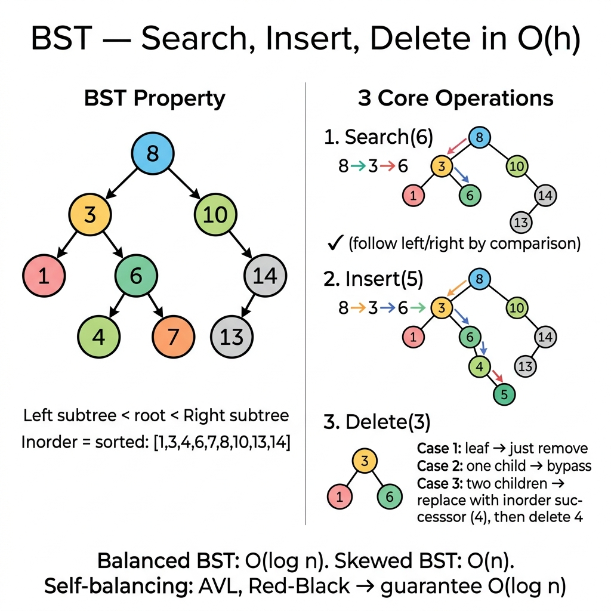

<!-- tags: dsa, algorithms, tree-graph -->
# 🔎 Binary Search Tree (BST)

> **Category**: Tree Data Structure
> **Summary**: Insert, Search, Delete — all O(h), h = tree height.

📅 Created: 2026-03-20 · 🔄 Updated: 2026-04-09 · ⏱️ 15 min read

---

## 1. DEFINE

<!-- [Experienced layer] -->

A binary search tree is only useful when every left/right decision eliminates half the search space. A `BST` fails if this ordering invariant applies only locally rather than across the entire subtree.

You learn `BST` not to memorize basic operations, but to understand how structures encode ordering into their topology. When the invariant holds, ordered set queries become completely natural.

Core insight: **Every operation centers on one promise: the left subtree is smaller, the right subtree is larger, and this holds recursively.**

| Variant | When to use | Key idea |
| ------- | ------- | ------- |
| Search / Insert / Delete | When needing a simple ordered set or map. | Go left if smaller, go right if larger. |
| Lowest Common Ancestor | When both nodes exist in the BST. | Use ordering to descend without full traversal. |
| Range query / validation | When exploiting the sorted property. | Inorder for ascending order, min-max bounds for validation. |

| Approach | Time | Space | When to choose |
| -------- | ---- | ----- | -------- |
| Recursive BST operations | O(h) | O(h) stack | Use this for concise code matching the definition. |
| Iterative search / insert | O(h) | O(1) | Use this to avoid deep recursion. |
| Validation via min/max bounds | O(n) | O(h) | Use this to prove the entire tree maintains the invariant. |

### 1.1 Quick Recognition

- The problem requires search, insert, delete, validation, or range queries on an ordered tree.
- Each routing decision relies on a single comparison with `node.Val`.
- Inorder traversal often reveals the sorted order naturally.

### 1.2 Invariants & Failure Modes

- The BST invariant is global across the subtree, not just relative to the immediate parent.
- Deleting a node with two children requires a successor or predecessor to preserve ordering.
- Common failure: validating a BST by only checking immediate children instead of full subtree bounds.

## 2. VISUAL

Trees create an illusion of natural correctness. This trace separates when each node is processed and what metadata is maintained.

### Level 1 — Core intuition

```text
        8
      /   \
     3     10
    / \      \
   1   6      14
      / \     /
     4   7   13

Search 7:
8 -> left -> 3 -> right -> 6 -> right -> 7
```

*Caption*: A BST eliminates half the search space at each step because ordering is encoded structurally.

### Level 2 — Decision trace

- When `target < node.Val`, all right nodes become useless for the current decision.
- When `target > node.Val`, the entire left tree can be immediately ignored.
- Deleting a node with two children is the hardest part. You must find a successor to preserve invariants.
- The global invariant survives only if the updated subtree remains an independent BST.




## 3. CODE

Once the topology and invariants are clear, tree code simply maintains traversal order and updates metadata.

### Problem 1: Basic — BST — Insert, Search, Delete
> **Goal**: <!-- TODO: problem-specific goal -->
> **Approach**: Start with a small traceable tree. Move to variants with ordering, aggregation, or structural constraints.
> **Example**: A small input allows visual tracing of partitions, comparisons, and pointer movements.
> **Complexity**: <!-- TODO: specific complexity -->

```go
package tree

// Insert: add value maintaining BST property
func Insert(root *TreeNode, val int) *TreeNode {
    if root == nil { return &TreeNode{Val: val} }
    if val < root.Val {
        root.Left = Insert(root.Left, val)
    } else {
        root.Right = Insert(root.Right, val)
    }
    return root
}

// Search: find node with value
func Search(root *TreeNode, val int) *TreeNode {
    if root == nil || root.Val == val { return root }
    if val < root.Val { return Search(root.Left, val) }
    return Search(root.Right, val)
}

// Delete: remove node — 3 cases
func Delete(root *TreeNode, val int) *TreeNode {
    if root == nil { return nil }
    if val < root.Val {
        root.Left = Delete(root.Left, val)
    } else if val > root.Val {
        root.Right = Delete(root.Right, val)
    } else {
        // Case 1: leaf or 1 child
        if root.Left == nil { return root.Right }
        if root.Right == nil { return root.Left }
        // Case 2: 2 children → replace with inorder successor
        succ := root.Right
        for succ.Left != nil { succ = succ.Left }
        root.Val = succ.Val
        root.Right = Delete(root.Right, succ.Val)
    }
    return root
}
```

```typescript
function insertBST(root: TreeNode|null, val: number): TreeNode {
    if (!root) return new TreeNode(val);
    if (val<root.val) root.left=insertBST(root.left,val); else root.right=insertBST(root.right,val);
    return root;
}
function searchBST(root: TreeNode|null, val: number): TreeNode|null {
    if (!root||root.val===val) return root;
    return val<root.val?searchBST(root.left,val):searchBST(root.right,val);
}
function deleteBST(root: TreeNode|null, val: number): TreeNode|null {
    if (!root) return null;
    if (val<root.val) root.left=deleteBST(root.left,val);
    else if (val>root.val) root.right=deleteBST(root.right,val);
    else { if (!root.left) return root.right; if (!root.right) return root.left;
        let succ=root.right; while(succ.left)succ=succ.left; root.val=succ.val; root.right=deleteBST(root.right,succ.val); }
    return root;
}
```

```rust
#[derive(Clone)]
struct TreeNode {
    val: i32,
    left: Option<Box<TreeNode>>,
    right: Option<Box<TreeNode>>,
}

fn insert_bst(root: Option<Box<TreeNode>>, val: i32) -> Option<Box<TreeNode>> {
    match root {
        None => Some(Box::new(TreeNode { val, left: None, right: None })),
        Some(mut node) => {
            if val < node.val {
                node.left = insert_bst(node.left, val);
            } else {
                node.right = insert_bst(node.right, val);
            }
            Some(node)
        }
    }
}

fn search_bst(root: &Option<Box<TreeNode>>, val: i32) -> bool {
    match root {
        None => false,
        Some(node) if node.val == val => true,
        Some(node) if val < node.val => search_bst(&node.left, val),
        Some(node) => search_bst(&node.right, val),
    }
}

fn delete_bst(root: Option<Box<TreeNode>>, val: i32) -> Option<Box<TreeNode>> {
    match root {
        None => None,
        Some(mut node) if val < node.val => {
            node.left = delete_bst(node.left, val);
            Some(node)
        }
        Some(mut node) if val > node.val => {
            node.right = delete_bst(node.right, val);
            Some(node)
        }
        Some(mut node) => {
            if node.left.is_none() { return node.right; }
            if node.right.is_none() { return node.left; }
            let mut succ = node.right.as_ref().unwrap();
            while let Some(left) = succ.left.as_ref() { succ = left; }
            node.val = succ.val;
            node.right = delete_bst(node.right, succ.val);
            Some(node)
        }
    }
}
```

```cpp
struct TreeNode {
    int val;
    TreeNode* left;
    TreeNode* right;
    TreeNode(int v, TreeNode* l = nullptr, TreeNode* r = nullptr) : val(v), left(l), right(r) {}
};

TreeNode* insertBST(TreeNode* root, int val) {
    if (!root) return new TreeNode(val);
    if (val < root->val) root->left = insertBST(root->left, val);
    else root->right = insertBST(root->right, val);
    return root;
}

TreeNode* searchBST(TreeNode* root, int val) {
    if (!root || root->val == val) return root;
    return val < root->val ? searchBST(root->left, val) : searchBST(root->right, val);
}

TreeNode* deleteBST(TreeNode* root, int val) {
    if (!root) return nullptr;
    if (val < root->val) root->left = deleteBST(root->left, val);
    else if (val > root->val) root->right = deleteBST(root->right, val);
    else {
        if (!root->left) return root->right;
        if (!root->right) return root->left;
        auto* succ = root->right;
        while (succ->left) succ = succ->left;
        root->val = succ->val;
        root->right = deleteBST(root->right, succ->val);
    }
    return root;
}
```

```python
def insert_bst(root, val):
    if not root: return TreeNode(val)
    if val<root.val: root.left=insert_bst(root.left,val)
    else: root.right=insert_bst(root.right,val)
    return root
def search_bst(root, val):
    if not root or root.val==val: return root
    return search_bst(root.left,val) if val<root.val else search_bst(root.right,val)
def delete_bst(root, val):
    if not root: return None
    if val<root.val: root.left=delete_bst(root.left,val)
    elif val>root.val: root.right=delete_bst(root.right,val)
    else:
        if not root.left: return root.right
        if not root.right: return root.left
        succ=root.right
        while succ.left: succ=succ.left
        root.val=succ.val; root.right=delete_bst(root.right,succ.val)
    return root
```

> **Why?** This approach works because each step relies on locked subtree or frontier information. Consistent visit orders and return values naturally yield the correct whole-tree result upon completion.

> **Conclusion**: <!-- TODO: Add unique conclusion with next-step guidance -->

### Problem 2: Intermediate — Lowest Common Ancestor (BST)
> **Goal**: <!-- TODO: problem-specific goal -->
> **Approach**: <!-- TODO: problem-specific approach -->
> **Example**: A small tree reveals traversal order, state propagation, and balancing invariants.
> **Complexity**: <!-- TODO: specific complexity -->

```go
func LowestCommonAncestorBST(root, p, q *TreeNode) *TreeNode {
    if root == nil { return nil }
    if p.Val < root.Val && q.Val < root.Val {
        return LowestCommonAncestorBST(root.Left, p, q)
    }
    if p.Val > root.Val && q.Val > root.Val {
        return LowestCommonAncestorBST(root.Right, p, q)
    }
    return root // split point = LCA
}
```

```typescript
function lcaBST(root: TreeNode|null, p: TreeNode, q: TreeNode): TreeNode|null {
    if (!root) return null;
    if (p.val<root.val&&q.val<root.val) return lcaBST(root.left,p,q);
    if (p.val>root.val&&q.val>root.val) return lcaBST(root.right,p,q);
    return root;
}
```

```rust
fn lca_bst<'a>(root: &'a Option<Box<TreeNode>>, p: i32, q: i32) -> Option<&'a TreeNode> {
    let mut curr = root.as_deref();
    while let Some(node) = curr {
        if p < node.val && q < node.val {
            curr = node.left.as_deref();
        } else if p > node.val && q > node.val {
            curr = node.right.as_deref();
        } else {
            return Some(node);
        }
    }
    None
}
```

```cpp
TreeNode* lcaBST(TreeNode* root, TreeNode* p, TreeNode* q) {
    if (!root) return nullptr;
    if (p->val < root->val && q->val < root->val) return lcaBST(root->left, p, q);
    if (p->val > root->val && q->val > root->val) return lcaBST(root->right, p, q);
    return root;
}
```

```python
def lca_bst(root, p, q):
    if not root: return None
    if p.val<root.val and q.val<root.val: return lca_bst(root.left,p,q)
    if p.val>root.val and q.val>root.val: return lca_bst(root.right,p,q)
    return root
```

> **Why?** This approach works because each step relies on locked subtree or frontier information. Consistent visit orders and return values naturally yield the correct whole-tree result upon completion.

> **Conclusion**: <!-- TODO: Add unique conclusion -->

### Problem 3: Advanced — Kth Smallest in BST
> **Goal**: <!-- TODO: problem-specific goal -->
> **Approach**: <!-- TODO: problem-specific approach -->
> **Example**: A small tree reveals traversal order, state propagation, and balancing invariants.
> **Complexity**: <!-- TODO: specific complexity -->

```go
func KthSmallest(root *TreeNode, k int) int {
    var stack []*TreeNode
    curr := root
    for curr != nil || len(stack) > 0 {
        for curr != nil {
            stack = append(stack, curr)
            curr = curr.Left
        }
        curr = stack[len(stack)-1]
        stack = stack[:len(stack)-1]
        k--
        if k == 0 { return curr.Val }
        curr = curr.Right
    }
    return -1
}
```

```typescript
function kthSmallestBST(root: TreeNode|null, k: number): number {
    const stack: TreeNode[]=[]; let curr=root;
    while(curr||stack.length){while(curr){stack.push(curr);curr=curr.left;} curr=stack.pop()!; k--; if(k===0)return curr.val; curr=curr.right;}
    return -1;
}
```

```rust
fn kth_smallest_bst(root: &Option<Box<TreeNode>>, mut k: i32) -> i32 {
    let mut stack: Vec<&TreeNode> = Vec::new();
    let mut curr = root.as_deref();
    while curr.is_some() || !stack.is_empty() {
        while let Some(node) = curr {
            stack.push(node);
            curr = node.left.as_deref();
        }
        let node = stack.pop().unwrap();
        k -= 1;
        if k == 0 { return node.val; }
        curr = node.right.as_deref();
    }
    -1
}
```

```cpp
int kthSmallestBST(TreeNode* root, int k) {
    std::vector<TreeNode*> stack;
    auto* curr = root;
    while (curr || !stack.empty()) {
        while (curr) {
            stack.push_back(curr);
            curr = curr->left;
        }
        curr = stack.back();
        stack.pop_back();
        if (--k == 0) return curr->val;
        curr = curr->right;
    }
    return -1;
}
```

```python
def kth_smallest_bst(root, k):
    stack, curr = [], root
    while curr or stack:
        while curr: stack.append(curr); curr=curr.left
        curr=stack.pop(); k-=1
        if k==0: return curr.val
        curr=curr.right
    return -1
```

> **Why?** This approach works because each step relies on locked subtree or frontier information. Consistent visit orders and return values naturally yield the correct whole-tree result upon completion.

> **Conclusion**: <!-- TODO: Add unique conclusion -->

---

## 4. PITFALLS

Tree problems break when local updates ignore the broader subtree promise.

| # | Severity | Error | Consequence | Fix |
|---|----------|-----|---------|-----|
| 1 | 🔴 Fatal | Skewed BST behaves as O(n). | All operations degrade to O(n). | Use self-balancing trees like AVL or Red-Black. |
| 2 | 🟡 Common | Deleting node with two children. | Incorrect pointers cause data loss. | Replace with inorder successor. |

---

## 5. REF

| Resource         | Link                                                                             |
| ---------------- | -------------------------------------------------------------------------------- |
| Visualgo BST     | [visualgo.net/bst](https://visualgo.net/en/bst)                                  |
| Wikipedia BST    | [en.wikipedia.org](https://en.wikipedia.org/wiki/Binary_search_tree)             |
| Go btree library | [pkg.go.dev/github.com/google/btree](https://pkg.go.dev/github.com/google/btree) |

---

## 6. RECOMMEND

Once a tree pattern is solid, learn how it connects to BSTs, heaps, segment trees, or graph reasoning.

| Extension            | When to use            | Reason                  |
| ------------------ | ------------------ | ----------------------- |
| **BST**            | Simple, unbalanced | O(h) operations.         |
| **AVL Tree**       | Strict balance     | O(log n) guaranteed.     |
| **Red-Black Tree** | General purpose    | Fewer rotations than AVL. |
| **B-Tree**         | Disk-based         | Database indexes.        |
| **Treap**          | Randomized         | Expected O(log n).       |

---

## 7. QUICK REF

| # | Pattern | Code |
|---|---------|------|
| 1 | Search | `for node != nil { if val==node.Val { return node } else if val<node.Val { node=node.Left } else { node=node.Right } }; return nil` |
| 2 | Insert | `if root==nil { return &TreeNode{Val:val} }; if val<root.Val { root.Left=insert(root.Left,val) } else { root.Right=insert(root.Right,val) }; return root` |
| 3 | Find min | `for node.Left != nil { node = node.Left }; return node` |
| 4 | Delete | `// Find inorder successor (min of right subtree), replace, delete successor` |
| 5 | Complexity | `// O(h) search/insert/delete · O(log n) balanced · O(n) worst` |
| 6 | Validate BST | `func valid(root *TreeNode, min, max int) bool { return root==nil \|\| (root.Val>min && root.Val<max && valid(root.Left,min,root.Val) && valid(root.Right,root.Val,max)) }` |
| 7 | When to use | `// Dynamic sorted set, range queries, predecessor/successor` |

**Links**: [← Tree Traversal](./01-tree-traversal.md) · [→ Heap](./03-heap.md)

---

Return to the opening question: why can a BST degrade to O(n) in the worst case? A skewed tree effectively becomes a linked list. Self-balancing trees maintain height via rotations. They trade complexity for guarantees.