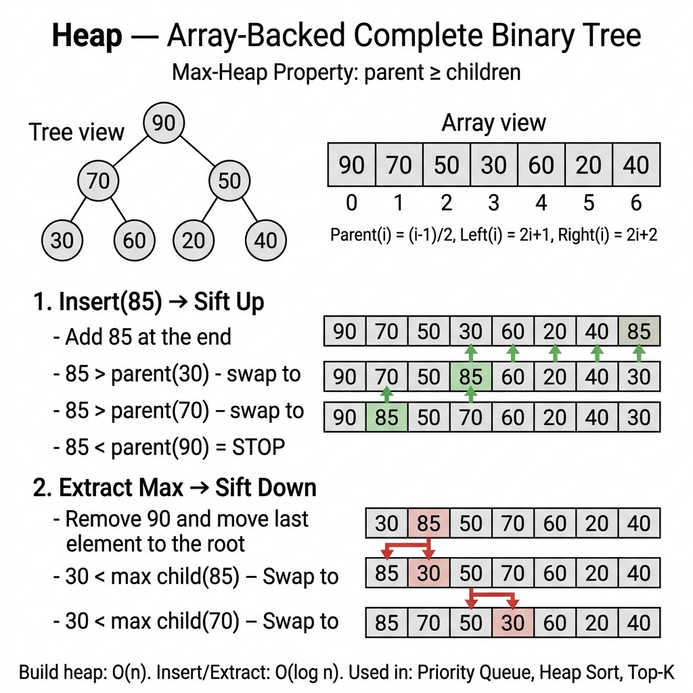

<!-- tags: dsa, algorithms, stack-queue -->
# ⛰️ Heap / Priority Queue

> **Category**: Data Structure, Complete Binary Tree
> **Summary**: Min-heap / Max-heap — O(log n) insert/extract, O(1) peek. Top-K, median, scheduling.

📅 Created: 2026-03-20 · 🔄 Updated: 2026-04-09 · ⏱️ 15 min read

---

## 1. DEFINE

<!-- [Experienced layer] -->

People often mistake a heap for an ordered tree. It only maintains a weaker but highly useful promise: parents always hold priority over children. A `Heap` continuously extracts the best element without sorting the entire dataset.

This topic bridges tree representations and priority-based processing. You must view a heap as a complete binary tree compressed into an array. `Push` and `pop` operations simply restore invariants via sifting.

Core insight: **A heap does not maintain global sorted order. It only preserves the top element correctly for priority queues.**

| Operation                 | Time                    |
| ------------------------- | ----------------------- |
| **Insert (Push)**         | O(log n)                |
| **Extract Min/Max (Pop)** | O(log n)                |
| **Peek**                  | O(1)                    |
| **Heapify**               | O(n) — build from array |

---

| Variant | When to use | Key idea |
| ------- | ------- | ------- |
| Go container/heap — Min Heap | When you need a manual baseline. | Grasp core invariants and stop conditions before optimizing. |
| Top-K Elements | When the problem adds constraints. | Maintain the invariant while adding state or auxiliary structures. |
| Heap Sort | When input is large. | Optimize the baseline via pruning or state compression. |
| Running Median (Two Heaps) | When needing abstraction. | Combine techniques to solve complex edge cases. |

| Approach | Time | Space | When to choose |
| --- | --- | --- | --- |
| Go container/heap — Min Heap | O(1) | Varies | Use this to understand the invariant before optimizing. |
| Top-K Elements | O(n) | O(log n) | Use this when the problem adds moderate constraints. |
| Heap Sort | Varies | Varies | Use this to scale better and avoid brute force. |
| Running Median (Two Heaps) | Varies | Varies | Use this to extend the pattern for hard edge cases. |

### 1.1 Quick Recognition

- The problem asks for repeated min/max retrievals, top-k elements, or stream processing.
- An array representation with index-based parent-child relationships is a clear signal.
- Common variants include min-heaps, max-heaps, or heaps of complex state tuples.

### 1.2 Invariants & Failure Modes

- In a min-heap, every parent node must be `<=` its immediate children.
- After an insertion or extraction, only paths connecting the moved node require invariant restoration.
- Common failure: treating the heap like a nearly-sorted array. Do not expect deep elements to maintain strict ordering.

## 2. VISUAL

Trees create an illusion of natural correctness. This trace separates when each node is processed and what metadata is maintained.

### Level 1 — Core intuition

```text
  Min-Heap:         Max-Heap:
      1                 9
     / \               / \
    3   5             7   5
   / \               / \
  7   9             3   1

  Parent = i, Left = 2i+1, Right = 2i+2
```

---

*Caption*: ⛰️ Heap / Priority Queue at Level 1 shows core intuition. Level 2 details state updates from input to output.

### Level 2 — Decision trace

- Start from the root or a subtree. Define what each recursive call must return.
- Ensure left and right subtree invariants remain valid before combining results.
- For iterative traversals, the stack or queue must reflect unprocessed tree sections.
- When unwinding completes, the root return value becomes the entire tree answer.




## 3. CODE

Once the topology and invariants are clear, tree code simply maintains traversal order and updates metadata.

### Problem 1: Basic — Go container/heap — Min Heap
> **Goal**: <!-- TODO: problem-specific goal -->
> **Approach**: Start with a small traceable tree. Move to variants with ordering, aggregation, or structural constraints.
> **Example**: A small tree reveals traversal order, state propagation, and balancing invariants.
> **Complexity**: <!-- TODO: specific complexity -->

```go
package tree

import (
    "container/heap"
    "fmt"
)

type IntHeap []int
func (h IntHeap) Len() int           { return len(h) }
func (h IntHeap) Less(i, j int) bool { return h[i] < h[j] } // min-heap
func (h IntHeap) Swap(i, j int)      { h[i], h[j] = h[j], h[i] }
func (h *IntHeap) Push(x any)        { *h = append(*h, x.(int)) }
func (h *IntHeap) Pop() any {
    old := *h; val := old[len(old)-1]; *h = old[:len(old)-1]; return val
}

func ExampleHeap() {
    h := &IntHeap{5, 3, 7, 1}
    heap.Init(h)
    heap.Push(h, 2)
    fmt.Println(heap.Pop(h)) // 1 (min)
}
```

```typescript
// MinHeap using array (simplified)
class MinHeap {
    private data: number[]=[];
    push(val: number) { this.data.push(val); let i=this.data.length-1; while(i>0){const p=Math.floor((i-1)/2);if(this.data[p]<=this.data[i])break;[this.data[p],this.data[i]]=[this.data[i],this.data[p]];i=p;} }
    pop(): number { const top=this.data[0]; this.data[0]=this.data[this.data.length-1]; this.data.pop(); let i=0; while(true){let s=i;const l=2*i+1,r=2*i+2;if(l<this.data.length&&this.data[l]<this.data[s])s=l;if(r<this.data.length&&this.data[r]<this.data[s])s=r;if(s===i)break;[this.data[s],this.data[i]]=[this.data[i],this.data[s]];i=s;} return top; }
    peek(): number { return this.data[0]; }
    size(): number { return this.data.length; }
}
```

```rust
use std::cmp::Reverse;
use std::collections::BinaryHeap;

fn example_heap() {
    let mut heap = BinaryHeap::from(vec![Reverse(5), Reverse(3), Reverse(7), Reverse(1)]);
    heap.push(Reverse(2));
    println!("{}", heap.pop().unwrap().0); // 1
}
```

```cpp
void exampleHeap() {
    std::priority_queue<int, std::vector<int>, std::greater<int>> heap({5, 3, 7, 1});
    heap.push(2);
    std::cout << heap.top() << "\n"; // 1
    heap.pop();
}
```

```python
import heapq
# Python heapq is min-heap by default
h = [5,3,7,1]; heapq.heapify(h)
heapq.heappush(h, 2)
print(heapq.heappop(h))  # 1 (min)
```

> **Why?** This approach works because each step relies on locked subtree or frontier information. Consistent visit orders and return values naturally yield the correct whole-tree result upon completion.

> **Conclusion**: <!-- TODO: Add unique conclusion with next-step guidance -->

### Problem 2: Intermediate — Top-K Elements
> **Goal**: <!-- TODO: problem-specific goal -->
> **Approach**: <!-- TODO: problem-specific approach -->
> **Example**: A small tree reveals traversal order, state propagation, and balancing invariants.
> **Complexity**: <!-- TODO: specific complexity -->

```go
func TopKLargest(nums []int, k int) []int {
    h := &IntHeap{}
    heap.Init(h)
    for _, n := range nums {
        heap.Push(h, n)
        if h.Len() > k {
            heap.Pop(h) // remove smallest → keeps k largest
        }
    }
    return []int(*h)
}
```

```typescript
function topKLargest(nums: number[], k: number): number[] {
    const h = new MinHeap();
    for (const n of nums) { h.push(n); if (h.size()>k) h.pop(); }
    const res: number[]=[]; while(h.size()) res.push(h.pop()); return res;
}
```

```rust
use std::cmp::Reverse;
use std::collections::BinaryHeap;

fn top_k_largest(nums: &[i32], k: usize) -> Vec<i32> {
    let mut heap = BinaryHeap::new();
    for &n in nums {
        heap.push(Reverse(n));
        if heap.len() > k {
            heap.pop();
        }
    }
    heap.into_iter().map(|x| x.0).collect()
}
```

```cpp
std::vector<int> topKLargest(const std::vector<int>& nums, int k) {
    std::priority_queue<int, std::vector<int>, std::greater<int>> heap;
    for (int n : nums) {
        heap.push(n);
        if (static_cast<int>(heap.size()) > k) heap.pop();
    }
    std::vector<int> result;
    while (!heap.empty()) {
        result.push_back(heap.top());
        heap.pop();
    }
    return result;
}
```

```python
def top_k_largest(nums: list[int], k: int) -> list[int]:
    import heapq
    return heapq.nlargest(k, nums)
```

> **Why?** This approach works because each step relies on locked subtree or frontier information. Consistent visit orders and return values naturally yield the correct whole-tree result upon completion.

> **Conclusion**: <!-- TODO: Add unique conclusion -->

### Problem 3: Advanced — Heap Sort
> **Goal**: <!-- TODO: problem-specific goal -->
> **Approach**: <!-- TODO: problem-specific approach -->
> **Example**: A small input allows visual tracing of partitions, comparisons, and pointer movements.
> **Complexity**: <!-- TODO: specific complexity -->

```go
func HeapSort(arr []int) {
    h := &IntHeap{}
    heap.Init(h)
    for _, v := range arr { heap.Push(h, v) }
    for i := 0; i < len(arr); i++ {
        arr[i] = heap.Pop(h).(int)
    }
}
```

```typescript
function heapSort(arr: number[]): number[] {
    const h = new MinHeap(); for (const v of arr) h.push(v);
    return arr.map(()=>h.pop());
}
```

```rust
use std::cmp::Reverse;
use std::collections::BinaryHeap;

fn heap_sort(arr: &[i32]) -> Vec<i32> {
    let mut heap = BinaryHeap::from(arr.iter().copied().map(Reverse).collect::<Vec<_>>());
    let mut result = Vec::with_capacity(arr.len());
    while let Some(Reverse(v)) = heap.pop() {
        result.push(v);
    }
    result
}
```

```cpp
std::vector<int> heapSort(const std::vector<int>& arr) {
    std::priority_queue<int, std::vector<int>, std::greater<int>> heap(arr.begin(), arr.end());
    std::vector<int> result;
    while (!heap.empty()) {
        result.push_back(heap.top());
        heap.pop();
    }
    return result;
}
```

```python
def heap_sort(arr: list[int]) -> list[int]:
    import heapq; h=arr[:]; heapq.heapify(h)
    return [heapq.heappop(h) for _ in range(len(h))]
```

> **Why?** This approach works because each step relies on locked subtree or frontier information. Consistent visit orders and return values naturally yield the correct whole-tree result upon completion.

> **Conclusion**: <!-- TODO: Add unique conclusion -->

### Problem 4: Expert — Running Median (Two Heaps)
> **Goal**: <!-- TODO: problem-specific goal -->
> **Approach**: <!-- TODO: problem-specific approach -->
> **Example**: A small tree reveals traversal order, state propagation, and balancing invariants.
> **Complexity**: <!-- TODO: specific complexity -->

```go
import "container/heap"

type MaxHeap []int
func (h MaxHeap) Len() int           { return len(h) }
func (h MaxHeap) Less(i, j int) bool { return h[i] > h[j] }
func (h MaxHeap) Swap(i, j int)      { h[i], h[j] = h[j], h[i] }
func (h *MaxHeap) Push(x any)        { *h = append(*h, x.(int)) }
func (h *MaxHeap) Pop() any {
    old := *h; val := old[len(old)-1]; *h = old[:len(old)-1]; return val
}

type MedianFinder struct {
    lo *MaxHeap // max-heap: lower half
    hi *IntHeap // min-heap: upper half
}

func NewMedianFinder() *MedianFinder {
    lo, hi := &MaxHeap{}, &IntHeap{}
    heap.Init(lo); heap.Init(hi)
    return &MedianFinder{lo, hi}
}

func (mf *MedianFinder) AddNum(num int) {
    heap.Push(mf.lo, num)
    heap.Push(mf.hi, heap.Pop(mf.lo))
    if mf.hi.Len() > mf.lo.Len() {
        heap.Push(mf.lo, heap.Pop(mf.hi))
    }
}

func (mf *MedianFinder) FindMedian() float64 {
    if mf.lo.Len() > mf.hi.Len() {
        return float64((*mf.lo)[0])
    }
    return float64((*mf.lo)[0]+(*mf.hi)[0]) / 2.0
}
```

```typescript
class MedianFinderTS {
    private lo: number[]=[]; // max-heap (negated)
    private hi: number[]=[]; // min-heap
    private pushMax(val:number){this.lo.push(-val);let i=this.lo.length-1;while(i>0){const p=Math.floor((i-1)/2);if(this.lo[p]<=this.lo[i])break;[this.lo[p],this.lo[i]]=[this.lo[i],this.lo[p]];i=p;}}
    private popMax():number{const t=this.lo[0];this.lo[0]=this.lo[this.lo.length-1];this.lo.pop();let i=0;while(true){let s=i;const l=2*i+1,r=2*i+2;if(l<this.lo.length&&this.lo[l]<this.lo[s])s=l;if(r<this.lo.length&&this.lo[r]<this.lo[s])s=r;if(s===i)break;[this.lo[s],this.lo[i]]=[this.lo[i],this.lo[s]];i=s;}return -t;}
    private pushMin(val:number){this.hi.push(val);let i=this.hi.length-1;while(i>0){const p=Math.floor((i-1)/2);if(this.hi[p]<=this.hi[i])break;[this.hi[p],this.hi[i]]=[this.hi[i],this.hi[p]];i=p;}}
    private popMin():number{const t=this.hi[0];this.hi[0]=this.hi[this.hi.length-1];this.hi.pop();let i=0;while(true){let s=i;const l=2*i+1,r=2*i+2;if(l<this.hi.length&&this.hi[l]<this.hi[s])s=l;if(r<this.hi.length&&this.hi[r]<this.hi[s])s=r;if(s===i)break;[this.hi[s],this.hi[i]]=[this.hi[i],this.hi[s]];i=s;}return t;}
    addNum(num:number){this.pushMax(num);this.pushMin(this.popMax());if(this.hi.length>this.lo.length)this.pushMax(this.popMin());}
    findMedian():number{return this.lo.length>this.hi.length?-this.lo[0]:(-this.lo[0]+this.hi[0])/2;}
}
```

```rust
use std::cmp::Reverse;
use std::collections::BinaryHeap;

struct MedianFinder {
    lo: BinaryHeap<i32>,
    hi: BinaryHeap<Reverse<i32>>,
}

impl MedianFinder {
    fn new() -> Self {
        Self { lo: BinaryHeap::new(), hi: BinaryHeap::new() }
    }

    fn add_num(&mut self, num: i32) {
        self.lo.push(num);
        if let Some(v) = self.lo.pop() {
            self.hi.push(Reverse(v));
        }
        if self.hi.len() > self.lo.len() {
            if let Some(Reverse(v)) = self.hi.pop() {
                self.lo.push(v);
            }
        }
    }

    fn find_median(&self) -> f64 {
        if self.lo.len() > self.hi.len() {
            *self.lo.peek().unwrap() as f64
        } else {
            (*self.lo.peek().unwrap() + self.hi.peek().unwrap().0) as f64 / 2.0
        }
    }
}
```

```cpp
class MedianFinder {
    std::priority_queue<int> lo;
    std::priority_queue<int, std::vector<int>, std::greater<int>> hi;

public:
    void addNum(int num) {
        lo.push(num);
        hi.push(lo.top());
        lo.pop();
        if (hi.size() > lo.size()) {
            lo.push(hi.top());
            hi.pop();
        }
    }

    double findMedian() const {
        if (lo.size() > hi.size()) return lo.top();
        return (lo.top() + hi.top()) / 2.0;
    }
};
```

```python
import heapq
class MedianFinder:
    def __init__(self): self.lo=[]; self.hi=[]  # lo=max-heap(neg), hi=min-heap
    def add_num(self, num: int):
        heapq.heappush(self.lo, -num)
        heapq.heappush(self.hi, -heapq.heappop(self.lo))
        if len(self.hi)>len(self.lo): heapq.heappush(self.lo, -heapq.heappop(self.hi))
    def find_median(self) -> float:
        return -self.lo[0] if len(self.lo)>len(self.hi) else (-self.lo[0]+self.hi[0])/2
```

> **Why?** This approach works because each step relies on locked subtree or frontier information. Consistent visit orders and return values naturally yield the correct whole-tree result upon completion.

> **Conclusion**: <!-- TODO: Add unique conclusion -->

---

## 4. PITFALLS

Tree problems break when local updates ignore the broader subtree promise.

| # | Severity | Error | Consequence | Fix |
| --- | --- | --- | --- | --- |
| 1 | 🔴 Fatal | Max-heap `Less` uses `<`. | Incorrect sort order. | Return `h[i] > h[j]` for max-heaps. |
| 2 | 🟡 Common | Forgetting `heap.Init`. | Operations panic or return wrong results. | Always initialize before pushing or popping. |
| 3 | 🟡 Common | Incorrect index mapping. | Parent calculation fails. | Use `(i-1)/2`, not `i/2`. |

---

## 5. REF

| Resource              | Link                                                           |
| --------------------- | -------------------------------------------------------------- |
| Visualgo Heap         | [visualgo.net/heap](https://visualgo.net/en/heap)              |
| Go container/heap     | [pkg.go.dev/container/heap](https://pkg.go.dev/container/heap) |
| Wikipedia Binary Heap | [en.wikipedia.org](https://en.wikipedia.org/wiki/Binary_heap)  |

---

## 6. RECOMMEND

Once a tree pattern is solid, learn how it connects to BSTs, heaps, segment trees, or graph reasoning.

| Extension            | When to use             | Reason                      |
| ------------------ | ----------------------- | --------------------------- |
| **Binary Heap**    | Priority Queue          | O(log n) push/pop.           |
| **Min-Heap**       | Dijkstra, merge K lists | Smallest first.              |
| **Max-Heap**       | Top-K elements          | Largest first.               |
| **Fibonacci Heap** | Advanced Dijkstra       | O(1) amortized decrease-key. |
| **Heap Sort**      | In-place O(n log n)     | No extra space required.     |

---

## 7. QUICK REF

| # | Pattern | Code |
|---|---------|------|
| 1 | Parent/children | `parent := (i-1)/2; leftChild := 2*i+1; rightChild := 2*i+2` |
| 2 | Push (sift up) | `heap = append(heap, val); i := len(heap)-1; for i>0 && heap[i]<heap[(i-1)/2] { heap[i],heap[(i-1)/2]=heap[(i-1)/2],heap[i]; i=(i-1)/2 }` |
| 3 | Pop (sift down) | `heap[0]=heap[len(heap)-1]; heap=heap[:len(heap)-1]; siftDown(heap,0)` |
| 4 | Go min-heap | `import "container/heap"  // implement heap.Interface (Len,Less,Swap,Push,Pop)` |
| 5 | Max-heap trick | `// Negate values: push -val, pop and negate result` |
| 6 | Heapify | `// Build heap in O(n): start from n/2-1, sift down each` |
| 7 | Complexity | `// Push/Pop: O(log n) · Peek: O(1) · Build: O(n)` |
| 8 | When to use | `// Priority queue, k largest/smallest, merge k sorted lists, Dijkstra` |

**Links**: [← BST](./02-bst.md) · [← README](./README.md) · [→ Segment Tree](./04-segment-tree.md) · [← Graph: Dijkstra](../graph/03-dijkstra.md)

---

Return to the opening question: why use an array instead of pointers? A complete binary tree has a fixed index pattern. It offers cache efficiency and zero pointer overhead.