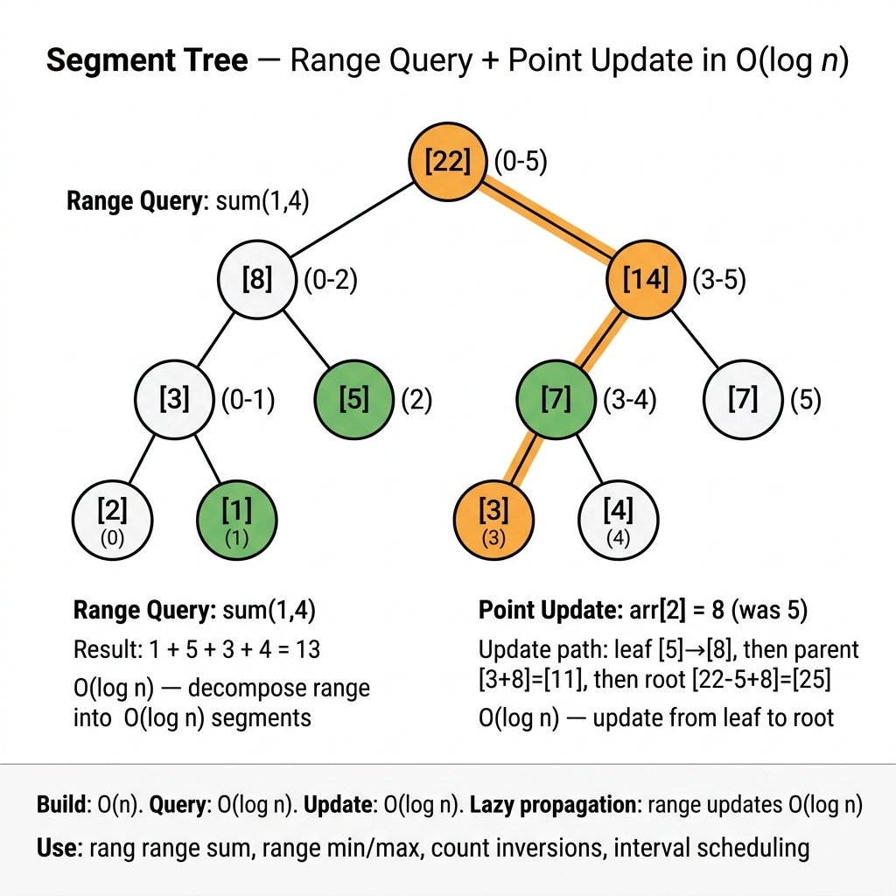

<!-- tags: dsa, algorithms, tree-graph -->
# 🌳 Segment Tree — Range Query Data Structure

> A tree-based data structure executing **range queries** and **point/range updates** in O(log n).

📅 Created: 2026-03-23 · 🔄 Updated: 2026-04-09 · ⏱️ 14 min read

| Aspect | Detail |
| ------ | ------ |
| **Build** | O(n) |
| **Query** | O(log n) |
| **Update** | O(log n) |
| **Space** | O(4n) |
| **Supports** | Sum, Min, Max, GCD, XOR, any associative op |

---

## 1. DEFINE

You debug an apparently correct solution that repeatedly hits time limits or fails edge cases. A Segment Tree becomes clear when you identify the invariant that actually stabilizes your approach.

### Comparing Range Query Structures

| Structure | Build | Query | Point Update | Range Update | Use when |
| --------- | ----- | ----- | ------------ | ------------ | -------- |
| **Array** | O(1) | O(n) | O(1) | O(n) | Few queries |
| **Prefix Sum** | O(n) | O(1) | O(n) rebuild | O(n) | Static, many queries |
| **Fenwick Tree** | O(n log n) | O(log n) | O(log n) | O(log n) | Point updates + prefix sums |
| **Segment Tree** | O(n) | O(log n) | O(log n) | O(log n) lazy | General range ops (min/max/gcd) |

### Concepts

- **Segment Tree**: A binary tree storing aggregates for ranges `[l, r]`.
- **Leaf nodes**: Single elements `a[i]`.
- **Internal nodes**: `merge(left_child, right_child)` — e.g., sum, min, max.
- **Lazy propagation**: Defer range updates to children, apply when visiting.
- **Node index**: Left child = `2*idx`, right child = `2*idx+1`.

### Invariants

- Root at index 1 covers `[0, n-1]`.
- Node covering `[l, r]`: left child covers `[l, mid]`, right covers `[mid+1, r]`.
- Array size = `4*n` safely stores all nodes.
- The `merge` operation must be **associative**.

---

| Variant | When to use | Key idea |
| ------- | ------- | ------- |
| Segment Tree — Range Sum + Point Update | When you need a manual baseline. | Grasp core invariants and stop conditions before optimizing. |
| Range Minimum Query | When the problem adds constraints. | Maintain the invariant while adding state or auxiliary structures. |
| Lazy Propagation (Range Update + Range Query) | When input is large. | Optimize the baseline via pruning or state compression. |

| Approach | Time | Space | When to choose |
| --- | --- | --- | --- |
| Segment Tree — Range Sum + Point Update | O(1) | Varies | Use this to understand the invariant before optimizing. |
| Range Minimum Query | O(n) | O(log n) | Use this when the problem adds moderate constraints. |
| Lazy Propagation (Range Update + Range Query) | Varies | Varies | Use this to scale better and avoid brute force. |

Core insight:
- A tree-based data structure executes **range queries** and **point/range updates** in O(log n).
- The essence involves preserving parent-child relationships and subtree invariants. Incorrect combination orders break the entire tree.

## 2. VISUAL

Trees create an illusion of natural correctness. This trace separates when each node is processed and what metadata is maintained.

### Level 1 — Core intuition

```text
  Array: [1, 3, 5, 7, 9, 11]  (n=6)

  Segment Tree (sum):

                    [0..5]=36
                 /              \
           [0..2]=9          [3..5]=27
           /     \            /     \
       [0..1]=4  [2]=5   [3..4]=16  [5]=11
       /    \              /    \
    [0]=1  [1]=3       [3]=7  [4]=9

  Query sum(1, 4):
    [0..5] → go to [0..2] and [3..5]
    [0..2] → [1..2] only needed → [1]=3 + [2]=5 = 8
    [3..5] → [3..4]=16 only needed
    Result: 8 + 16 = 24 ✓

  Update a[2] = 10 (was 5):
    Update leaf [2]=10
    Propagate up: [0..2] = 4+10=14, [0..5] = 14+27=41
```

---

*Caption*: 🌳 Segment Trees at Level 1 show core intuition. Level 2 details state updates from input to output.

### Level 2 — Decision trace

- Start from the root or a subtree. Define what each recursive call must return.
- Ensure left and right subtree invariants remain valid before combining results.
- For iterative traversals, the stack or queue must reflect unprocessed tree sections.
- When unwinding completes, the root return value becomes the entire tree answer.




## 3. CODE

Once the topology and invariants are clear, tree code simply maintains traversal order and updates metadata.

### Problem 1: Basic — Segment Tree — Range Sum + Point Update
> **Goal**: <!-- TODO: problem-specific goal -->
> **Approach**: Start with a small traceable tree. Move to variants with ordering, aggregation, or structural constraints.
> **Example**: A small tree reveals traversal order, state propagation, and balancing invariants.
> **Complexity**: <!-- TODO: specific complexity -->

```go
package segtree

// SegTree implements a segment tree for range sum queries and point updates.
// Time: O(n) build · O(log n) query/update · Space: O(4n)
type SegTree struct {
    tree []int
    n    int
}

func NewSegTree(a []int) *SegTree {
    n := len(a)
    tree := make([]int, 4*n)
    st := &SegTree{tree: tree, n: n}
    st.build(a, 1, 0, n-1)
    return st
}

func (st *SegTree) build(a []int, idx, l, r int) {
    if l == r {
        st.tree[idx] = a[l]
        return
    }
    mid := l + (r-l)/2
    st.build(a, 2*idx, l, mid)
    st.build(a, 2*idx+1, mid+1, r)
    st.tree[idx] = st.tree[2*idx] + st.tree[2*idx+1]
}

// Update sets a[pos] = val. O(log n).
func (st *SegTree) Update(pos, val int) {
    st.update(1, 0, st.n-1, pos, val)
}

func (st *SegTree) update(idx, l, r, pos, val int) {
    if l == r {
        st.tree[idx] = val
        return
    }
    mid := l + (r-l)/2
    if pos <= mid {
        st.update(2*idx, l, mid, pos, val)
    } else {
        st.update(2*idx+1, mid+1, r, pos, val)
    }
    st.tree[idx] = st.tree[2*idx] + st.tree[2*idx+1]
}

// Query returns sum of a[ql..qr] inclusive. O(log n).
func (st *SegTree) Query(ql, qr int) int {
    return st.query(1, 0, st.n-1, ql, qr)
}

func (st *SegTree) query(idx, l, r, ql, qr int) int {
    if ql <= l && r <= qr {
        return st.tree[idx] // fully within query range
    }
    if qr < l || r < ql {
        return 0 // completely outside
    }
    mid := l + (r-l)/2
    return st.query(2*idx, l, mid, ql, qr) +
        st.query(2*idx+1, mid+1, r, ql, qr)
}
```

```typescript
class SegTree {
    private tree: number[]; private n: number;
    constructor(a: number[]) { this.n=a.length; this.tree=Array(4*this.n).fill(0); this.build(a,1,0,this.n-1); }
    private build(a:number[],idx:number,l:number,r:number){if(l===r){this.tree[idx]=a[l];return;} const mid=l+Math.floor((r-l)/2);this.build(a,2*idx,l,mid);this.build(a,2*idx+1,mid+1,r);this.tree[idx]=this.tree[2*idx]+this.tree[2*idx+1];}
    update(pos:number,val:number){this._update(1,0,this.n-1,pos,val);}
    private _update(idx:number,l:number,r:number,pos:number,val:number){if(l===r){this.tree[idx]=val;return;}const mid=l+Math.floor((r-l)/2);pos<=mid?this._update(2*idx,l,mid,pos,val):this._update(2*idx+1,mid+1,r,pos,val);this.tree[idx]=this.tree[2*idx]+this.tree[2*idx+1];}
    query(ql:number,qr:number):number{return this._query(1,0,this.n-1,ql,qr);}
    private _query(idx:number,l:number,r:number,ql:number,qr:number):number{if(ql<=l&&r<=qr)return this.tree[idx];if(qr<l||r<ql)return 0;const mid=l+Math.floor((r-l)/2);return this._query(2*idx,l,mid,ql,qr)+this._query(2*idx+1,mid+1,r,ql,qr);}
}
```

```rust
struct SegTree {
    tree: Vec<i32>,
    n: usize,
}

impl SegTree {
    fn new(a: &[i32]) -> Self {
        let mut st = Self { tree: vec![0; 4 * a.len()], n: a.len() };
        st.build(a, 1, 0, a.len() - 1);
        st
    }

    fn build(&mut self, a: &[i32], idx: usize, l: usize, r: usize) {
        if l == r {
            self.tree[idx] = a[l];
            return;
        }
        let mid = l + (r - l) / 2;
        self.build(a, idx * 2, l, mid);
        self.build(a, idx * 2 + 1, mid + 1, r);
        self.tree[idx] = self.tree[idx * 2] + self.tree[idx * 2 + 1];
    }

    fn update(&mut self, pos: usize, val: i32) {
        self._update(1, 0, self.n - 1, pos, val);
    }

    fn _update(&mut self, idx: usize, l: usize, r: usize, pos: usize, val: i32) {
        if l == r {
            self.tree[idx] = val;
            return;
        }
        let mid = l + (r - l) / 2;
        if pos <= mid { self._update(idx * 2, l, mid, pos, val); }
        else { self._update(idx * 2 + 1, mid + 1, r, pos, val); }
        self.tree[idx] = self.tree[idx * 2] + self.tree[idx * 2 + 1];
    }

    fn query(&self, ql: usize, qr: usize) -> i32 {
        self._query(1, 0, self.n - 1, ql, qr)
    }

    fn _query(&self, idx: usize, l: usize, r: usize, ql: usize, qr: usize) -> i32 {
        if ql <= l && r <= qr { return self.tree[idx]; }
        if qr < l || r < ql { return 0; }
        let mid = l + (r - l) / 2;
        self._query(idx * 2, l, mid, ql, qr) + self._query(idx * 2 + 1, mid + 1, r, ql, qr)
    }
}
```

```cpp
class SegTree {
    std::vector<int> tree;
    int n;

    void build(const std::vector<int>& a, int idx, int l, int r) {
        if (l == r) { tree[idx] = a[l]; return; }
        int mid = l + (r - l) / 2;
        build(a, idx * 2, l, mid);
        build(a, idx * 2 + 1, mid + 1, r);
        tree[idx] = tree[idx * 2] + tree[idx * 2 + 1];
    }

    void update(int idx, int l, int r, int pos, int val) {
        if (l == r) { tree[idx] = val; return; }
        int mid = l + (r - l) / 2;
        if (pos <= mid) update(idx * 2, l, mid, pos, val);
        else update(idx * 2 + 1, mid + 1, r, pos, val);
        tree[idx] = tree[idx * 2] + tree[idx * 2 + 1];
    }

    int query(int idx, int l, int r, int ql, int qr) const {
        if (ql <= l && r <= qr) return tree[idx];
        if (qr < l || r < ql) return 0;
        int mid = l + (r - l) / 2;
        return query(idx * 2, l, mid, ql, qr) + query(idx * 2 + 1, mid + 1, r, ql, qr);
    }

public:
    explicit SegTree(const std::vector<int>& a) : tree(4 * a.size(), 0), n(static_cast<int>(a.size())) {
        build(a, 1, 0, n - 1);
    }

    void update(int pos, int val) { update(1, 0, n - 1, pos, val); }
    int query(int l, int r) const { return query(1, 0, n - 1, l, r); }
};
```

```python
class SegTree:
    def __init__(self, a):
        self.n=len(a); self.tree=[0]*(4*self.n); self._build(a,1,0,self.n-1)
    def _build(self,a,idx,l,r):
        if l==r: self.tree[idx]=a[l]; return
        mid=l+(r-l)//2; self._build(a,2*idx,l,mid); self._build(a,2*idx+1,mid+1,r)
        self.tree[idx]=self.tree[2*idx]+self.tree[2*idx+1]
    def update(self,pos,val): self._update(1,0,self.n-1,pos,val)
    def _update(self,idx,l,r,pos,val):
        if l==r: self.tree[idx]=val; return
        mid=l+(r-l)//2
        if pos<=mid: self._update(2*idx,l,mid,pos,val)
        else: self._update(2*idx+1,mid+1,r,pos,val)
        self.tree[idx]=self.tree[2*idx]+self.tree[2*idx+1]
    def query(self,ql,qr): return self._query(1,0,self.n-1,ql,qr)
    def _query(self,idx,l,r,ql,qr):
        if ql<=l and r<=qr: return self.tree[idx]
        if qr<l or r<ql: return 0
        mid=l+(r-l)//2
        return self._query(2*idx,l,mid,ql,qr)+self._query(2*idx+1,mid+1,r,ql,qr)
```

> **Why?** This approach works because each step relies on locked subtree or frontier information. Consistent visit orders and return values naturally yield the correct whole-tree result upon completion.

> **Conclusion**: <!-- TODO: Add unique conclusion with next-step guidance -->

### Problem 2: Intermediate — Range Minimum Query
> **Goal**: <!-- TODO: problem-specific goal -->
> **Approach**: <!-- TODO: problem-specific approach -->
> **Example**: A small tree reveals traversal order, state propagation, and balancing invariants.
> **Complexity**: <!-- TODO: specific complexity -->

```go
// MinSegTree implements range minimum query.
// Change merge function: min instead of sum.
type MinSegTree struct {
    tree []int
    n    int
}

func NewMinSegTree(a []int) *MinSegTree {
    n := len(a)
    tree := make([]int, 4*n)
    st := &MinSegTree{tree: tree, n: n}
    st.build(a, 1, 0, n-1)
    return st
}

func (st *MinSegTree) build(a []int, idx, l, r int) {
    if l == r {
        st.tree[idx] = a[l]
        return
    }
    mid := l + (r-l)/2
    st.build(a, 2*idx, l, mid)
    st.build(a, 2*idx+1, mid+1, r)
    st.tree[idx] = min(st.tree[2*idx], st.tree[2*idx+1]) // ← only change
}

func (st *MinSegTree) QueryMin(ql, qr int) int {
    return st.query(1, 0, st.n-1, ql, qr)
}

func (st *MinSegTree) query(idx, l, r, ql, qr int) int {
    if ql <= l && r <= qr {
        return st.tree[idx]
    }
    if qr < l || r < ql {
        return math.MaxInt
    }
    mid := l + (r-l)/2
    return min(
        st.query(2*idx, l, mid, ql, qr),
        st.query(2*idx+1, mid+1, r, ql, qr),
    )
}
```

```typescript
class MinSegTree {
    private tree: number[]; private n: number;
    constructor(a: number[]) { this.n=a.length; this.tree=Array(4*this.n).fill(Infinity); this.build(a,1,0,this.n-1); }
    private build(a:number[],idx:number,l:number,r:number){if(l===r){this.tree[idx]=a[l];return;}const mid=l+Math.floor((r-l)/2);this.build(a,2*idx,l,mid);this.build(a,2*idx+1,mid+1,r);this.tree[idx]=Math.min(this.tree[2*idx],this.tree[2*idx+1]);}
    queryMin(ql:number,qr:number):number{return this._query(1,0,this.n-1,ql,qr);}
    private _query(idx:number,l:number,r:number,ql:number,qr:number):number{if(ql<=l&&r<=qr)return this.tree[idx];if(qr<l||r<ql)return Infinity;const mid=l+Math.floor((r-l)/2);return Math.min(this._query(2*idx,l,mid,ql,qr),this._query(2*idx+1,mid+1,r,ql,qr));}
}
```

```rust
struct MinSegTree {
    tree: Vec<i32>,
    n: usize,
}

impl MinSegTree {
    fn new(a: &[i32]) -> Self {
        let mut st = Self { tree: vec![i32::MAX; 4 * a.len()], n: a.len() };
        st.build(a, 1, 0, a.len() - 1);
        st
    }

    fn build(&mut self, a: &[i32], idx: usize, l: usize, r: usize) {
        if l == r {
            self.tree[idx] = a[l];
            return;
        }
        let mid = l + (r - l) / 2;
        self.build(a, idx * 2, l, mid);
        self.build(a, idx * 2 + 1, mid + 1, r);
        self.tree[idx] = self.tree[idx * 2].min(self.tree[idx * 2 + 1]);
    }

    fn query_min(&self, ql: usize, qr: usize) -> i32 {
        self._query(1, 0, self.n - 1, ql, qr)
    }

    fn _query(&self, idx: usize, l: usize, r: usize, ql: usize, qr: usize) -> i32 {
        if ql <= l && r <= qr { return self.tree[idx]; }
        if qr < l || r < ql { return i32::MAX; }
        let mid = l + (r - l) / 2;
        self._query(idx * 2, l, mid, ql, qr).min(self._query(idx * 2 + 1, mid + 1, r, ql, qr))
    }
}
```

```cpp
class MinSegTree {
    std::vector<int> tree;
    int n;

    void build(const std::vector<int>& a, int idx, int l, int r) {
        if (l == r) { tree[idx] = a[l]; return; }
        int mid = l + (r - l) / 2;
        build(a, idx * 2, l, mid);
        build(a, idx * 2 + 1, mid + 1, r);
        tree[idx] = std::min(tree[idx * 2], tree[idx * 2 + 1]);
    }

    int query(int idx, int l, int r, int ql, int qr) const {
        if (ql <= l && r <= qr) return tree[idx];
        if (qr < l || r < ql) return INT_MAX;
        int mid = l + (r - l) / 2;
        return std::min(query(idx * 2, l, mid, ql, qr), query(idx * 2 + 1, mid + 1, r, ql, qr));
    }

public:
    explicit MinSegTree(const std::vector<int>& a) : tree(4 * a.size(), INT_MAX), n(static_cast<int>(a.size())) {
        build(a, 1, 0, n - 1);
    }

    int queryMin(int l, int r) const { return query(1, 0, n - 1, l, r); }
};
```

```python
class MinSegTree:
    def __init__(self, a):
        self.n=len(a); self.tree=[float('inf')]*(4*self.n); self._build(a,1,0,self.n-1)
    def _build(self,a,idx,l,r):
        if l==r: self.tree[idx]=a[l]; return
        mid=l+(r-l)//2; self._build(a,2*idx,l,mid); self._build(a,2*idx+1,mid+1,r)
        self.tree[idx]=min(self.tree[2*idx],self.tree[2*idx+1])
    def query_min(self,ql,qr): return self._query(1,0,self.n-1,ql,qr)
    def _query(self,idx,l,r,ql,qr):
        if ql<=l and r<=qr: return self.tree[idx]
        if qr<l or r<ql: return float('inf')
        mid=l+(r-l)//2
        return min(self._query(2*idx,l,mid,ql,qr),self._query(2*idx+1,mid+1,r,ql,qr))
```

> **Why?** This approach works because each step relies on locked subtree or frontier information. Consistent visit orders and return values naturally yield the correct whole-tree result upon completion.

> **Conclusion**: <!-- TODO: Add unique conclusion -->

### Problem 3: Advanced — Lazy Propagation (Range Update + Range Query)
> **Goal**: <!-- TODO: problem-specific goal -->
> **Approach**: <!-- TODO: problem-specific approach -->
> **Example**: A small tree reveals traversal order, state propagation, and balancing invariants.
> **Complexity**: <!-- TODO: specific complexity -->

```go
// LazySegTree supports range add updates and range sum queries.
// Time: O(log n) for both operations · Space: O(4n)
type LazySegTree struct {
    tree []int
    lazy []int
    n    int
}

func NewLazySegTree(a []int) *LazySegTree {
    n := len(a)
    st := &LazySegTree{
        tree: make([]int, 4*n),
        lazy: make([]int, 4*n),
        n:    n,
    }
    st.build(a, 1, 0, n-1)
    return st
}

func (st *LazySegTree) build(a []int, idx, l, r int) {
    if l == r {
        st.tree[idx] = a[l]
        return
    }
    mid := l + (r-l)/2
    st.build(a, 2*idx, l, mid)
    st.build(a, 2*idx+1, mid+1, r)
    st.tree[idx] = st.tree[2*idx] + st.tree[2*idx+1]
}

func (st *LazySegTree) pushDown(idx, l, r int) {
    if st.lazy[idx] != 0 {
        mid := l + (r-l)/2
        st.tree[2*idx] += st.lazy[idx] * (mid - l + 1)
        st.lazy[2*idx] += st.lazy[idx]
        st.tree[2*idx+1] += st.lazy[idx] * (r - mid)
        st.lazy[2*idx+1] += st.lazy[idx]
        st.lazy[idx] = 0
    }
}

// RangeAdd adds val to all elements in [ql, qr]. O(log n).
func (st *LazySegTree) RangeAdd(ql, qr, val int) {
    st.rangeAdd(1, 0, st.n-1, ql, qr, val)
}

func (st *LazySegTree) rangeAdd(idx, l, r, ql, qr, val int) {
    if ql <= l && r <= qr {
        st.tree[idx] += val * (r - l + 1)
        st.lazy[idx] += val
        return
    }
    if qr < l || r < ql {
        return
    }
    st.pushDown(idx, l, r)
    mid := l + (r-l)/2
    st.rangeAdd(2*idx, l, mid, ql, qr, val)
    st.rangeAdd(2*idx+1, mid+1, r, ql, qr, val)
    st.tree[idx] = st.tree[2*idx] + st.tree[2*idx+1]
}

// Query returns sum of a[ql..qr]. O(log n).
func (st *LazySegTree) Query(ql, qr int) int {
    return st.query(1, 0, st.n-1, ql, qr)
}

func (st *LazySegTree) query(idx, l, r, ql, qr int) int {
    if ql <= l && r <= qr {
        return st.tree[idx]
    }
    if qr < l || r < ql {
        return 0
    }
    st.pushDown(idx, l, r)
    mid := l + (r-l)/2
    return st.query(2*idx, l, mid, ql, qr) +
        st.query(2*idx+1, mid+1, r, ql, qr)
}
```

```typescript
class LazySegTree {
    private tree: number[]; private lazy: number[]; private n: number;
    constructor(a: number[]) { this.n=a.length; this.tree=Array(4*this.n).fill(0); this.lazy=Array(4*this.n).fill(0); this.build(a,1,0,this.n-1); }
    private build(a:number[],idx:number,l:number,r:number){if(l===r){this.tree[idx]=a[l];return;}const mid=l+Math.floor((r-l)/2);this.build(a,2*idx,l,mid);this.build(a,2*idx+1,mid+1,r);this.tree[idx]=this.tree[2*idx]+this.tree[2*idx+1];}
    private pushDown(idx:number,l:number,r:number){if(this.lazy[idx]!==0){const mid=l+Math.floor((r-l)/2);this.tree[2*idx]+=this.lazy[idx]*(mid-l+1);this.lazy[2*idx]+=this.lazy[idx];this.tree[2*idx+1]+=this.lazy[idx]*(r-mid);this.lazy[2*idx+1]+=this.lazy[idx];this.lazy[idx]=0;}}
    rangeAdd(ql:number,qr:number,val:number){this._rangeAdd(1,0,this.n-1,ql,qr,val);}
    private _rangeAdd(idx:number,l:number,r:number,ql:number,qr:number,val:number){if(ql<=l&&r<=qr){this.tree[idx]+=val*(r-l+1);this.lazy[idx]+=val;return;}if(qr<l||r<ql)return;this.pushDown(idx,l,r);const mid=l+Math.floor((r-l)/2);this._rangeAdd(2*idx,l,mid,ql,qr,val);this._rangeAdd(2*idx+1,mid+1,r,ql,qr,val);this.tree[idx]=this.tree[2*idx]+this.tree[2*idx+1];}
    query(ql:number,qr:number):number{return this._query(1,0,this.n-1,ql,qr);}
    private _query(idx:number,l:number,r:number,ql:number,qr:number):number{if(ql<=l&&r<=qr)return this.tree[idx];if(qr<l||r<ql)return 0;this.pushDown(idx,l,r);const mid=l+Math.floor((r-l)/2);return this._query(2*idx,l,mid,ql,qr)+this._query(2*idx+1,mid+1,r,ql,qr);}
}
```

```rust
struct LazySegTree {
    tree: Vec<i32>,
    lazy: Vec<i32>,
    n: usize,
}

impl LazySegTree {
    fn new(a: &[i32]) -> Self {
        let mut st = Self { tree: vec![0; 4 * a.len()], lazy: vec![0; 4 * a.len()], n: a.len() };
        st.build(a, 1, 0, a.len() - 1);
        st
    }

    fn build(&mut self, a: &[i32], idx: usize, l: usize, r: usize) {
        if l == r {
            self.tree[idx] = a[l];
            return;
        }
        let mid = l + (r - l) / 2;
        self.build(a, idx * 2, l, mid);
        self.build(a, idx * 2 + 1, mid + 1, r);
        self.tree[idx] = self.tree[idx * 2] + self.tree[idx * 2 + 1];
    }

    fn push_down(&mut self, idx: usize, l: usize, r: usize) {
        if self.lazy[idx] != 0 {
            let mid = l + (r - l) / 2;
            self.tree[idx * 2] += self.lazy[idx] * (mid - l + 1) as i32;
            self.lazy[idx * 2] += self.lazy[idx];
            self.tree[idx * 2 + 1] += self.lazy[idx] * (r - mid) as i32;
            self.lazy[idx * 2 + 1] += self.lazy[idx];
            self.lazy[idx] = 0;
        }
    }

    fn range_add(&mut self, ql: usize, qr: usize, val: i32) {
        self._range_add(1, 0, self.n - 1, ql, qr, val);
    }

    fn _range_add(&mut self, idx: usize, l: usize, r: usize, ql: usize, qr: usize, val: i32) {
        if ql <= l && r <= qr {
            self.tree[idx] += val * (r - l + 1) as i32;
            self.lazy[idx] += val;
            return;
        }
        if qr < l || r < ql { return; }
        self.push_down(idx, l, r);
        let mid = l + (r - l) / 2;
        self._range_add(idx * 2, l, mid, ql, qr, val);
        self._range_add(idx * 2 + 1, mid + 1, r, ql, qr, val);
        self.tree[idx] = self.tree[idx * 2] + self.tree[idx * 2 + 1];
    }

    fn query(&mut self, ql: usize, qr: usize) -> i32 {
        self._query(1, 0, self.n - 1, ql, qr)
    }

    fn _query(&mut self, idx: usize, l: usize, r: usize, ql: usize, qr: usize) -> i32 {
        if ql <= l && r <= qr { return self.tree[idx]; }
        if qr < l || r < ql { return 0; }
        self.push_down(idx, l, r);
        let mid = l + (r - l) / 2;
        self._query(idx * 2, l, mid, ql, qr) + self._query(idx * 2 + 1, mid + 1, r, ql, qr)
    }
}
```

```cpp
class LazySegTree {
    std::vector<int> tree, lazy;
    int n;

    void build(const std::vector<int>& a, int idx, int l, int r) {
        if (l == r) { tree[idx] = a[l]; return; }
        int mid = l + (r - l) / 2;
        build(a, idx * 2, l, mid);
        build(a, idx * 2 + 1, mid + 1, r);
        tree[idx] = tree[idx * 2] + tree[idx * 2 + 1];
    }

    void pushDown(int idx, int l, int r) {
        if (lazy[idx] != 0) {
            int mid = l + (r - l) / 2;
            tree[idx * 2] += lazy[idx] * (mid - l + 1);
            lazy[idx * 2] += lazy[idx];
            tree[idx * 2 + 1] += lazy[idx] * (r - mid);
            lazy[idx * 2 + 1] += lazy[idx];
            lazy[idx] = 0;
        }
    }

    void rangeAdd(int idx, int l, int r, int ql, int qr, int val) {
        if (ql <= l && r <= qr) {
            tree[idx] += val * (r - l + 1);
            lazy[idx] += val;
            return;
        }
        if (qr < l || r < ql) return;
        pushDown(idx, l, r);
        int mid = l + (r - l) / 2;
        rangeAdd(idx * 2, l, mid, ql, qr, val);
        rangeAdd(idx * 2 + 1, mid + 1, r, ql, qr, val);
        tree[idx] = tree[idx * 2] + tree[idx * 2 + 1];
    }

    int query(int idx, int l, int r, int ql, int qr) {
        if (ql <= l && r <= qr) return tree[idx];
        if (qr < l || r < ql) return 0;
        pushDown(idx, l, r);
        int mid = l + (r - l) / 2;
        return query(idx * 2, l, mid, ql, qr) + query(idx * 2 + 1, mid + 1, r, ql, qr);
    }

public:
    explicit LazySegTree(const std::vector<int>& a)
        : tree(4 * a.size(), 0), lazy(4 * a.size(), 0), n(static_cast<int>(a.size())) {
        build(a, 1, 0, n - 1);
    }

    void rangeAdd(int l, int r, int val) { rangeAdd(1, 0, n - 1, l, r, val); }
    int query(int l, int r) { return query(1, 0, n - 1, l, r); }
};
```

```python
class LazySegTree:
    def __init__(self, a):
        self.n=len(a); self.tree=[0]*(4*self.n); self.lazy=[0]*(4*self.n); self._build(a,1,0,self.n-1)
    def _build(self,a,idx,l,r):
        if l==r: self.tree[idx]=a[l]; return
        mid=l+(r-l)//2; self._build(a,2*idx,l,mid); self._build(a,2*idx+1,mid+1,r)
        self.tree[idx]=self.tree[2*idx]+self.tree[2*idx+1]
    def _push_down(self,idx,l,r):
        if self.lazy[idx]:
            mid=l+(r-l)//2
            self.tree[2*idx]+=self.lazy[idx]*(mid-l+1); self.lazy[2*idx]+=self.lazy[idx]
            self.tree[2*idx+1]+=self.lazy[idx]*(r-mid); self.lazy[2*idx+1]+=self.lazy[idx]
            self.lazy[idx]=0
    def range_add(self,ql,qr,val): self._range_add(1,0,self.n-1,ql,qr,val)
    def _range_add(self,idx,l,r,ql,qr,val):
        if ql<=l and r<=qr: self.tree[idx]+=val*(r-l+1); self.lazy[idx]+=val; return
        if qr<l or r<ql: return
        self._push_down(idx,l,r); mid=l+(r-l)//2
        self._range_add(2*idx,l,mid,ql,qr,val); self._range_add(2*idx+1,mid+1,r,ql,qr,val)
        self.tree[idx]=self.tree[2*idx]+self.tree[2*idx+1]
    def query(self,ql,qr): return self._query(1,0,self.n-1,ql,qr)
    def _query(self,idx,l,r,ql,qr):
        if ql<=l and r<=qr: return self.tree[idx]
        if qr<l or r<ql: return 0
        self._push_down(idx,l,r); mid=l+(r-l)//2
        return self._query(2*idx,l,mid,ql,qr)+self._query(2*idx+1,mid+1,r,ql,qr)
```

> **Why?** This approach works because each step relies on locked subtree or frontier information. Consistent visit orders and return values naturally yield the correct whole-tree result upon completion.

> **Conclusion**: <!-- TODO: Add unique conclusion -->

---

## 4. PITFALLS

Tree problems break when local updates ignore the broader subtree promise.

| # | Severity | Error | Consequence | Fix |
| --- | --- | --- | --- | --- |
| 1 | 🔴 Fatal | **Tree size = 2n instead of 4n.** | Index out of bounds. | Use `4*n` or `2 * nextPowerOf2(n)`. |
| 2 | 🟡 Common | **Forgetting pushDown before descending.** | Lazy operations remain unpropagated. | Always call `pushDown(idx, l, r)` before recursing. |
| 3 | 🟡 Common | **Returning 0 instead of MaxInt for min queries.** | Incorrect min results. | Return `math.MaxInt` for out-of-range min queries. |
| 4 | 🔵 Minor | **Incorrect left child index.** | Tree breaks entirely. | Left = `2*idx`, Right = `2*idx+1`. |
| 5 | 🔵 Minor | **Accumulating lazy tags for assignments.** | Causes double-counting. | For range assignments, reset lazy instead of adding. |

---

## 5. REF

| Resource | Link |
| -------- | ---- |
| CP-Algorithms Segment Tree | [cp-algorithms.com/data_structures/segment_tree.html](https://cp-algorithms.com/data_structures/segment_tree.html) |
| LeetCode — Range Sum Query Mutable | [leetcode.com/problems/range-sum-query-mutable](https://leetcode.com/problems/range-sum-query-mutable/) |
| USACO Guide | [usaco.guide/gold/seg-ext](https://usaco.guide/gold/seg-ext) |

---

## 6. RECOMMEND

Once a tree pattern is solid, learn how it connects to BSTs, heaps, segment trees, or graph reasoning.

| Scenario | Approach | Reason |
| ---------- | -------- | ----- |
| **Point update + range sum/min/max** | Segment Tree | O(log n) for both. |
| **Range update + range query** | Lazy Segment Tree | O(log n) with lazy propagation. |
| **Only prefix sums, no updates** | Prefix Sum Array | O(1) query, simpler. |
| **Point updates + prefix sums** | Fenwick Tree (BIT) | Simpler code, identical complexity. |
| **Range query with custom merge** | Segment Tree | Works for any associative operation. |

---

## 7. QUICK REF

| # | Pattern | Code |
|---|---------|------|
| 1 | Init tree | `tree := make([]int, 4*n)` |
| 2 | Node index | `left=2*idx; right=2*idx+1` |
| 3 | Build | `build(a, 1, 0, n-1)` — recursive, root at 1 |
| 4 | Merge (sum) | `tree[idx] = tree[2*idx] + tree[2*idx+1]` |
| 5 | Fully inside | `if ql<=l && r<=qr { return tree[idx] }` |
| 6 | Fully outside | `if qr<l \|\| r<ql { return 0 }` |
| 7 | Push lazy down | `tree[child] += lazy[idx]*(range_len); lazy[child] += lazy[idx]; lazy[idx]=0` |
| 8 | Complexity | `// Build O(n) · Query O(log n) · Update O(log n) · Space O(4n)` |
| 9 | When to use | `// Range sum/min/max with updates, lazy for range updates` |

**Links**: [← Heap](./03-heap.md) · [⚖️ Gin](../../gin/techniques/01-configuration.md)

---

Return to the opening question: why is a segment tree stronger than a prefix sum array? Prefix sums only handle static arrays and associative operations. Segment trees handle updates and custom merge functions. Lazy propagation allows batch updates while maintaining O(log n) performance.