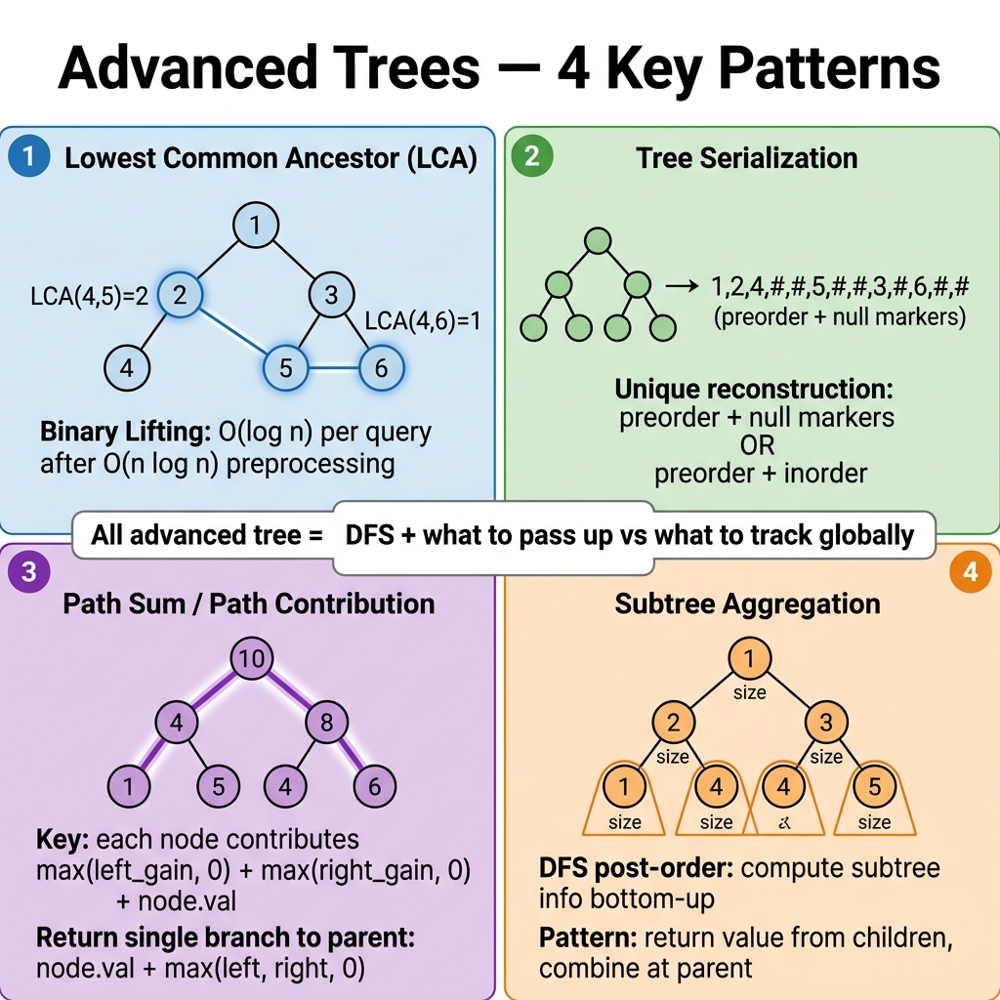

<!-- tags: dsa, algorithms -->
# 🌲 Advanced Tree Patterns

> After mastering traversals, BSTs, heaps, and segment trees, tree challenges escalate. Maintaining invariants through recursion requires handling ancestors, serialization orders, path aggregations, and subtree summaries.

📅 Created: 2026-04-01 · 🔄 Updated: 2026-04-09 · ⏱️ 18 min read

| Aspect | Detail |
| ------ | ------ |
| **Complexity focus** | Mostly O(n) traversals; extra states may need O(h) or O(n). |
| **Use case** | LCA, serialize/deserialize, path aggregation, structural validation. |
| **Related** | Tree Traversal, BST, Graph DFS, Dynamic Programming on Trees. |

---

## 1. DEFINE

<!-- [Beginner layer] -->

When trees carry metadata like height, balance factors, range aggregates, or lazy tags, operations change entirely. You no longer just visit nodes. `Advanced Tree Patterns` involve local updates that ripple across paths or subtrees.

You must identify whether a tree balances searches, aggregates ranges, resolves ancestors, or manages heavy decompositions. Choosing the wrong representation makes recovery nearly impossible.

Core insight: **Advanced trees only matter when node or segment metadata allows you to reuse structural answers after updates.**

| Pattern | When to use | Key idea |
| ------- | ------- | ------- |
| Lowest Common Ancestor | Find the nearest shared ancestor of two nodes. | Post-order: if both sides meet, the current node is the LCA. |
| Serialize / Deserialize | Snapshot a tree or send it over a network. | Preorder + null markers preserve the shape. |
| Max Path Sum | Find the best path that can bend through a node. | A node contributes `val + max(leftGain, rightGain)` to its parent. |
| Kth Smallest in BST | Need order statistics within a BST. | Inorder yields sorted order. |
| Vertical Traversal | View a tree by columns. | DFS/BFS + `(col,row)` bookkeeping. |

| Variant | When to use | Key idea |
| ------- | ------- | ------- |
| Lowest Common Ancestor in Binary Tree | When you need a manual baseline. | Grasp core invariants and stop conditions before optimizing. |
| Serialize / Deserialize Binary Tree | When the problem adds constraints. | Maintain the invariant while adding state or auxiliary structures. |
| Binary Tree Maximum Path Sum | When input is large. | Optimize the baseline via pruning or state compression. |

| Approach | Time | Space | When to choose |
| --- | --- | --- | --- |
| Lowest Common Ancestor in Binary Tree | O(n) | O(h) | Use this to understand the invariant before optimizing. |
| Serialize / Deserialize Binary Tree | O(n) | O(n) | Use this when the problem adds moderate constraints. |
| Binary Tree Maximum Path Sum | O(n) | O(h) | Use this to scale better and avoid brute force. |

### 1.1 Quick Recognition

- The problem requires range queries, ancestor queries, balancing, decomposition, or node metadata.
- Pure traversals fail. You need additional metadata and rules to update it.
- Correctness depends entirely on merging and splitting metadata properly.

### 1.2 Invariants & Failure Modes

- Each node must maintain correct metadata for its entire represented domain.
- After a local update, all related ancestors or segments must recompute sequentially.
- Common failure: memorizing API structures without understanding metadata representations, leading to empty reasoning.

## 2. VISUAL

Trees create an illusion of natural correctness. This trace separates when each node is processed and what metadata is maintained.

### Level 1 — Core intuition

```text
subtree question?
  -> local state at node
  -> summary returned to parent
  -> optional global answer updated on the side
```

*Caption*: 🌲 Advanced Tree Patterns at Level 1 show core intuition. Level 2 details state updates from input to output.

### Level 2 — Decision trace

- Start from the root or a subtree. Define what each recursive call must return.
- Ensure left and right subtree invariants remain valid before combining results.
- For iterative traversals, the stack or queue must reflect unprocessed tree sections.
- When unwinding completes, the root return value becomes the entire tree answer.




## 3. CODE

Once the topology and invariants are clear, tree code simply maintains traversal order and updates metadata.

### Problem 1: Basic — Lowest Common Ancestor in Binary Tree

> **Goal**: Find the LCA when the tree lacks parent pointers and BST ordering.
> **Approach**: Use post-order DFS. If a node finds `p` and `q` in different branches, it is the LCA.
> **Example**: `LCA(5,1) = 3`, `LCA(5,4) = 5`.
> **Complexity**: O(n) time, O(h) stack.

```go
// advanced_tree.go — LCA in Binary Tree: post-order recursion
package treealgorithms

type TreeNode struct {
    Val   int
    Left  *TreeNode
    Right *TreeNode
}

func LowestCommonAncestor(root, p, q *TreeNode) *TreeNode {
    if root == nil || root == p || root == q {
        return root
    }

    left := LowestCommonAncestor(root.Left, p, q)
    right := LowestCommonAncestor(root.Right, p, q)

    if left != nil && right != nil {
        return root // ✅ p and q split into two branches
    }
    if left != nil {
        return left
    }
    return right
}
```

```typescript
// advanced-tree.ts — LCA in Binary Tree: post-order recursion
export type TreeNode = {
  val: number;
  left: TreeNode | null;
  right: TreeNode | null;
};

export function lowestCommonAncestor(
  root: TreeNode | null,
  p: TreeNode | null,
  q: TreeNode | null,
): TreeNode | null {
  if (!root || root === p || root === q) return root;
  const left = lowestCommonAncestor(root.left, p, q);
  const right = lowestCommonAncestor(root.right, p, q);
  if (left && right) return root;
  return left ?? right;
}
```

```rust
// advanced_tree.rs — LCA in Binary Tree: pointer identity via Rc<RefCell<_>>
use std::cell::RefCell;
use std::rc::Rc;

type Node = Option<Rc<RefCell<TreeNode>>>;

#[derive(Debug)]
pub struct TreeNode {
    pub val: i32,
    pub left: Node,
    pub right: Node,
}

pub fn lowest_common_ancestor(root: Node, p: Node, q: Node) -> Node {
    fn dfs(root: &Node, p: &Node, q: &Node) -> Node {
        let Some(node) = root else { return None; };
        if Rc::ptr_eq(node, p.as_ref().unwrap()) || Rc::ptr_eq(node, q.as_ref().unwrap()) {
            return Some(node.clone());
        }
        let left = dfs(&node.borrow().left, p, q);
        let right = dfs(&node.borrow().right, p, q);
        match (left, right) {
            (Some(_), Some(_)) => Some(node.clone()),
            (Some(x), None) => Some(x),
            (None, Some(x)) => Some(x),
            _ => None,
        }
    }
    dfs(&root, &p, &q)
}
```

```cpp
// advanced_tree.cpp — LCA in Binary Tree: post-order recursion
struct TreeNode {
    int val;
    TreeNode* left;
    TreeNode* right;
};

TreeNode* lowestCommonAncestor(TreeNode* root, TreeNode* p, TreeNode* q) {
    if (!root || root == p || root == q) return root;
    TreeNode* left = lowestCommonAncestor(root->left, p, q);
    TreeNode* right = lowestCommonAncestor(root->right, p, q);
    if (left && right) return root;
    return left ? left : right;
}
```

```python
# advanced_tree.py — LCA in Binary Tree: post-order recursion
class TreeNode:
    def __init__(self, val: int, left: 'TreeNode | None' = None, right: 'TreeNode | None' = None):
        self.val = val
        self.left = left
        self.right = right

def lowest_common_ancestor(root: TreeNode | None, p: TreeNode | None, q: TreeNode | None) -> TreeNode | None:
    if root is None or root is p or root is q:
        return root
    left = lowest_common_ancestor(root.left, p, q)
    right = lowest_common_ancestor(root.right, p, q)
    if left and right:
        return root
    return left or right
```

```java
// AdvancedTree.java — LCA in Binary Tree: post-order recursion
public final class AdvancedTree {
    private AdvancedTree() {}

    static final class TreeNode {
        int val;
        TreeNode left;
        TreeNode right;
        TreeNode(int val) { this.val = val; }
    }

    public static TreeNode lowestCommonAncestor(TreeNode root, TreeNode p, TreeNode q) {
        if (root == null || root == p || root == q) return root;
        TreeNode left = lowestCommonAncestor(root.left, p, q);
        TreeNode right = lowestCommonAncestor(root.right, p, q);
        if (left != null && right != null) return root;
        return left != null ? left : right;
    }
}
```

> **Why?** This approach works because each step relies on locked subtree or frontier information. Consistent visit orders and return values naturally yield the correct whole-tree result upon completion.

> **Conclusion**: LCA is the perfect example of tree recursion. The function only returns meaningful states: finding `p` or `q`, finding the LCA, or finding nothing.

### Problem 2: Intermediate — Serialize / Deserialize Binary Tree

> **Goal**: Convert a tree into a stable string and rebuild its exact shape.
> **Approach**: Use preorder traversal with null markers. Deserialize by consuming tokens in the exact order generated.
> **Example**: `1,2,#,#,3,4,#,#,5,#,#`
> **Complexity**: O(n) time, O(n) space.

```go
// codec.go — Serialize / Deserialize: preorder with null markers
import (
    "strconv"
    "strings"
)

func Serialize(root *TreeNode) string {
    parts := make([]string, 0)
    var dfs func(*TreeNode)
    dfs = func(node *TreeNode) {
        if node == nil {
            parts = append(parts, "#")
            return
        }
        parts = append(parts, strconv.Itoa(node.Val))
        dfs(node.Left)
        dfs(node.Right)
    }
    dfs(root)
    return strings.Join(parts, ",")
}

func Deserialize(data string) *TreeNode {
    values := strings.Split(data, ",")
    idx := 0
    var build func() *TreeNode
    build = func() *TreeNode {
        token := values[idx]
        idx++
        if token == "#" {
            return nil
        }
        val, _ := strconv.Atoi(token)
        node := &TreeNode{Val: val}
        node.Left = build()
        node.Right = build()
        return node
    }
    return build()
}
```

```typescript
// codec.ts — Serialize / Deserialize: preorder with null markers
export function serialize(root: TreeNode | null): string {
  const parts: string[] = [];
  const dfs = (node: TreeNode | null): void => {
    if (!node) { parts.push('#'); return; }
    parts.push(String(node.val));
    dfs(node.left); dfs(node.right);
  };
  dfs(root);
  return parts.join(',');
}
export function deserialize(data: string): TreeNode | null {
  const values = data.split(',');
  let idx = 0;
  const build = (): TreeNode | null => {
    const token = values[idx++];
    if (token === '#') return null;
    return { val: Number(token), left: build(), right: build() };
  };
  return build();
}
```
```rust
// codec.rs — Serialize / Deserialize: preorder with null markers
pub fn serialize(root: &Node, out: &mut Vec<String>) {
    if let Some(node) = root {
        let node = node.borrow();
        out.push(node.val.to_string());
        serialize(&node.left, out);
        serialize(&node.right, out);
    } else {
        out.push("#".to_string());
    }
}
```
```cpp
// codec.cpp — Serialize / Deserialize: preorder with null markers
void serialize(TreeNode* root, std::vector<std::string>& out) {
    if (!root) { out.push_back("#"); return; }
    out.push_back(std::to_string(root->val));
    serialize(root->left, out);
    serialize(root->right, out);
}
```
```python
# codec.py — Serialize / Deserialize: preorder with null markers
def serialize(root: TreeNode | None) -> str:
    parts: list[str] = []
    def dfs(node: TreeNode | None) -> None:
        if node is None:
            parts.append('#')
            return
        parts.append(str(node.val))
        dfs(node.left)
        dfs(node.right)
    dfs(root)
    return ','.join(parts)

def deserialize(data: str) -> TreeNode | None:
    values = iter(data.split(','))
    def build() -> TreeNode | None:
        token = next(values)
        if token == '#':
            return None
        node = TreeNode(int(token))
        node.left = build()
        node.right = build()
        return node
    return build()
```
```java
// Codec.java — Serialize / Deserialize: preorder with null markers
public static String serialize(TreeNode root) {
    java.util.List<String> parts = new java.util.ArrayList<>();
    serializeDfs(root, parts);
    return String.join(",", parts);
}
private static void serializeDfs(TreeNode node, java.util.List<String> parts) {
    if (node == null) { parts.add("#"); return; }
    parts.add(String.valueOf(node.val));
    serializeDfs(node.left, parts);
    serializeDfs(node.right, parts);
}
```

> **Why?** This approach works because each step relies on locked subtree or frontier information. Consistent visit orders and return values naturally yield the correct whole-tree result upon completion.

> **Conclusion**: Serialization forces symmetry between write and read orders. A mismatched null marker or traversal order guarantees a distorted tree.

### Problem 3: Advanced — Binary Tree Maximum Path Sum

> **Goal**: Find the largest sum for any path. The path may bend through a node and does not have to reach the root.
> **Approach**: DFS returns the best single-branch gain to the parent. Update the global answer using `leftGain + node + rightGain`.
> **Example**: `[-10,9,20,null,null,15,7] -> 42`.
> **Complexity**: O(n) time, O(h) stack.

```go
// max_path_sum.go — Max Path Sum: local gain vs global answer
import "math"

func MaxPathSum(root *TreeNode) int {
    best := math.MinInt

    var dfs func(*TreeNode) int
    dfs = func(node *TreeNode) int {
        if node == nil {
            return 0
        }
        leftGain := max(0, dfs(node.Left))
        rightGain := max(0, dfs(node.Right))

        throughNode := node.Val + leftGain + rightGain
        if throughNode > best {
            best = throughNode
        }

        return node.Val + max(leftGain, rightGain)
    }

    dfs(root)
    return best
}

func max(a, b int) int {
    if a > b { return a }
    return b
}
```

```typescript
// max_path_sum.ts — Max Path Sum: local gain vs global answer
export function maxPathSum(root: TreeNode | null): number {
  let best = Number.NEGATIVE_INFINITY;
  const dfs = (node: TreeNode | null): number => {
    if (!node) return 0;
    const leftGain = Math.max(0, dfs(node.left));
    const rightGain = Math.max(0, dfs(node.right));
    best = Math.max(best, node.val + leftGain + rightGain);
    return node.val + Math.max(leftGain, rightGain);
  };
  dfs(root);
  return best;
}
```
```rust
// max_path_sum.rs — Max Path Sum: local gain vs global answer
pub fn max_path_sum(root: &Node) -> i32 {
    fn dfs(node: &Node, best: &mut i32) -> i32 {
        let Some(current) = node else { return 0; };
        let current = current.borrow();
        let left = dfs(&current.left, best).max(0);
        let right = dfs(&current.right, best).max(0);
        *best = (*best).max(current.val + left + right);
        current.val + left.max(right)
    }
    let mut best = i32::MIN;
    dfs(root, &mut best);
    best
}
```
```cpp
// max_path_sum.cpp — Max Path Sum: local gain vs global answer
int dfsMaxPath(TreeNode* node, int& best) {
    if (!node) return 0;
    int left = std::max(0, dfsMaxPath(node->left, best));
    int right = std::max(0, dfsMaxPath(node->right, best));
    best = std::max(best, node->val + left + right);
    return node->val + std::max(left, right);
}
```
```python
# max_path_sum.py — Max Path Sum: local gain vs global answer
def max_path_sum(root: TreeNode | None) -> int:
    best = float('-inf')
    def dfs(node: TreeNode | None) -> int:
        nonlocal best
        if node is None:
            return 0
        left = max(0, dfs(node.left))
        right = max(0, dfs(node.right))
        best = max(best, node.val + left + right)
        return node.val + max(left, right)
    dfs(root)
    return int(best)
```
```java
// MaxPathSum.java — Max Path Sum: local gain vs global answer
public static int maxPathSum(TreeNode root) {
    int[] best = {Integer.MIN_VALUE};
    maxPathGain(root, best);
    return best[0];
}
private static int maxPathGain(TreeNode node, int[] best) {
    if (node == null) return 0;
    int left = Math.max(0, maxPathGain(node.left, best));
    int right = Math.max(0, maxPathGain(node.right, best));
    best[0] = Math.max(best[0], node.val + left + right);
    return node.val + Math.max(left, right);
}
```

> **Why?** This approach works because each step relies on locked subtree or frontier information. Consistent visit orders and return values naturally yield the correct whole-tree result upon completion.

> **Conclusion**: This problem distinctly separates the local value returned to the parent from the global answer. If you return `left + node + right` to the parent, the path branches incorrectly.

## 4. PITFALLS

Tree problems break when local updates ignore the broader subtree promise.

| # | Severity | Error | Consequence | Fix |
| --- | --- | --- | --- | --- |
| 1 | 🔴 Fatal | Confusing parent return value with global answer. | Completely fails max path or diameter calculations. | Write out the DFS contract explicitly before coding. |
| 2 | 🟡 Common | Serializing without null markers. | Cannot rebuild the true shape. | You must encode `nil` explicitly. |
| 3 | 🟡 Common | Finding LCA using node values instead of identity. | Fails if the tree contains duplicates. | Compare pointers or references instead. |
| 4 | 🔵 Minor | Using inorder for serialization. | Loses shape or creates ambiguity. | Use preorder or postorder with null markers. |
| 5 | 🔵 Minor | Ignoring skewed trees. | Deep stacks cause crashes. | Test single chains, single nodes, and nil trees. |

## 5. REF

| Resource | Link |
| -------- | ---- |
| LeetCode 236 — LCA of Binary Tree | https://leetcode.com/problems/lowest-common-ancestor-of-a-binary-tree/ |
| LeetCode 297 — Serialize and Deserialize Binary Tree | https://leetcode.com/problems/serialize-and-deserialize-binary-tree/ |
| LeetCode 124 — Binary Tree Maximum Path Sum | https://leetcode.com/problems/binary-tree-maximum-path-sum/ |
| CP-Algorithms — LCA | https://cp-algorithms.com/graph/lca.html |

## 6. RECOMMEND

Once a tree pattern is solid, learn how it connects to BSTs, heaps, segment trees, or graph reasoning.

| Extension | When to use | Reason |
| ------- | ------- | ----- |
| Kth Smallest in BST | When you need order statistics in a BST. | Combines inorder traversal with the BST invariant. |
| Vertical Order Traversal | When you need a specific tree layout. | Practice `(row,col)` bookkeeping. |
| Symmetric Tree | When you want to practice mirror recursion. | Simple pattern but covers many edge cases. |
| Tree DP | When nodes hold state from child to parent. | Leads to complex problems like House Robber III. |

## 7. QUICK REFERENCE

| Problem | What does DFS return? | Global state required? |
| ------- | ----------- | -------------------------- |
| LCA | Found node in subtree. | No |
| Serialize | Nothing, appends to builder. | No |
| Deserialize | Root of the built subtree. | No |
| Max Path Sum | Best single-branch gain moving up. | Yes |
| Diameter | Height. | Yes |

---

**Links**: [← Previous](./04-segment-tree.md) · → Next

---

Return to the opening question: why are advanced tree problems always "DFS + something"? A tree is a recursive structure where every node answers two questions. It decides what to return to the parent and what to track globally. LCA, path sums, and serialization all exploit this pattern.