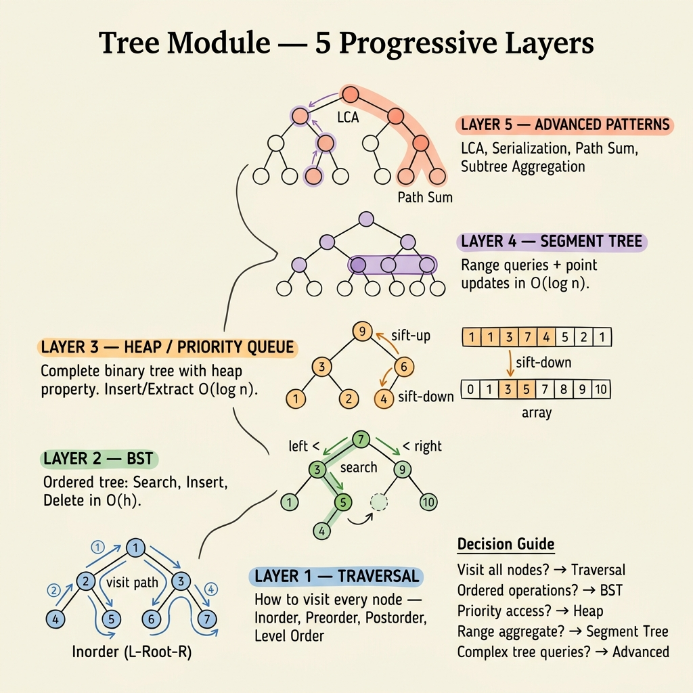

<!-- tags: dsa, algorithms, tree, overview -->
# Tree Algorithms — Hierarchy, Aggregation, and Order

> Trees appear lighter than graphs because they lack cycles. This parent-child hierarchy introduces powerful invariants: subtrees, traversal orders, heap properties, and range aggregations.

📅 Created: 2026-04-04 · 🔄 Updated: 2026-04-09 · ⏱️ 8 min read

| Aspect | Detail |
| ------ | ------ |
| **Focus** | Traversal, BST invariant, heap ordering, segment aggregation. |
| **Core state** | Subtree, depth, ancestor, interval represented by a node. |
| **Common mistake** | Treating trees like generic graphs misses strong structural invariants. |

---

## 1. DEFINE

You read a problem and your mind jumps to familiar patterns. The value of this module lies in locking the right pattern. You must understand why other approaches fail.

Generic graphs require caution against cycles and overlapping paths. Trees offer stronger guarantees. Each node has a clear subtree. Traversal order carries semantic meaning. Properties flow down from parents or aggregate up from children.

Traversals teach you how to navigate the structure. BSTs teach order invariants. Heaps teach partial orders for priorities. Segment trees teach how one node represents an entire interval. Advanced tree problems combine these ideas. They do not exist in a separate universe.

This hub treats the tree as a structural promise. Seeing the subtree or interval correctly makes the solution shorter and more robust.

### Module Problems
| Problem | Core Tension | Invariant | Link |
| --- | --- | --- | --- |
| Tree Traversals | Visiting nodes in a meaningful order. | Pre/in/post/level-order each carries a different promise. | [01-tree-traversal.md](./01-tree-traversal.md) |
| BST | Exploiting order in a tree. | All left nodes < root < all right nodes. | [02-bst.md](./02-bst.md) |
| Heap / Priority Queue | Always retrieving the highest or lowest priority element. | Parent is always better than children based on a comparator. | [03-heap.md](./03-heap.md) |
| Segment Tree | Fast range queries and updates. | Each node represents a range and aggregates correctly. | [04-segment-tree.md](./04-segment-tree.md) |
| Advanced Tree Patterns | Combining depth, ancestors, rerooting, and DP on trees. | Subtree state and path state remain distinct. | [05-advanced-tree.md](./05-advanced-tree.md) |

## 2. VISUAL

Tree problems look similar on the surface but differ in what each node represents. The image below classifies five layers by node semantics — from basic visit order to interval aggregation.



*Image: Five tree layers form a progressive stack. Traversals establish visit order. BSTs add total order. Heaps add partial order for priority. Segment Trees make each node represent a range aggregate. Advanced patterns combine subtree state with path state.*

```text
Tree problem
  |
  +-- need visit order?            -> Traversals
  +-- need to find/maintain order? -> BST
  +-- need top priority always?    -> Heap
  +-- need range query/update?     -> Segment Tree
  +-- need subtree/path state?     -> Advanced Tree Patterns
```
*Figure: Text fallback — a tree node is not just a point. It represents a subtree, a priority range, or a data interval.*

## 3. CODE

Read from basic traversals to stronger structures. All subsequent optimizations rely on understanding what the node represents.

| Order | File | Goal | Mastery Signal |
| --- | --- | --- | --- |
| 1 | [01-tree-traversal.md](./01-tree-traversal.md) | Lock pre/in/post/level-order as four different lenses. | You choose traversals by goal instead of habit. |
| 2 | [02-bst.md](./02-bst.md) and [03-heap.md](./03-heap.md) | Distinguish global order and partial order. | You no longer confuse heaps with sorted trees. |
| 3 | [04-segment-tree.md](./04-segment-tree.md) | See a node as an interval aggregate. | You can describe the merge operation of a node. |
| 4 | [05-advanced-tree.md](./05-advanced-tree.md) | Connect traversals, subtree states, and reroot intuition. | You understand why tree DP is not simplified graph DP. |

## 4. PITFALLS

Tree problems often break due to wrong processing orders or local updates that ignore the subtree promise.

| Pitfall | Signal | Why it fails | Fix | Severity |
| ------- | -------- | ---------- | -------- | -------- |
| Treating a heap like a BST | Wanting fast arbitrary value searches in a heap. | Heaps only promise order between parent and child. | Separate partial order from total order. | High |
| Habitual traversals | Always writing DFS preorder first. | Each traversal serves a different question type. | Specify if output needs root-before, root-between, or root-after. | Medium |
| Unclear node representation in segment trees | Build/query/update code becomes messy and hard to prove. | Segment trees survive on aggregate semantics. | Define the merge and neutral elements before coding. | High |
| Mixing subtree state with path state | Advanced tree solutions fail on edge cases. | Upward aggregations and downward propagations have different natures. | Separate downward and upward states clearly. | High |

## 5. REF

- Module files: [01-tree-traversal.md](./01-tree-traversal.md) to [05-advanced-tree.md](./05-advanced-tree.md).
- Graph handoff when tree assumptions disappear: [../graph/README.md](../graph/README.md).
- Binary search adjacency on ordered trees: [../searching/README.md](../searching/README.md).

## 6. RECOMMEND

After this module, you should see trees as structures with strong advantages. They are not just graphs with fewer edges.

- If a tree problem is actually array range aggregation, dig into [04-segment-tree.md](./04-segment-tree.md).
- If the structure loses tree properties, switch to [../graph/README.md](../graph/README.md).
- If the question involves substrings instead of subtrees, move to [../string-algorithms/README.md](../string-algorithms/README.md).

## 7. QUICK REF

- Traversals are lenses. BSTs are order. Heaps are priority. Segment Trees are interval aggregates.
- Do not apply BST invariants to heaps.
- In trees, a node represents more than itself.