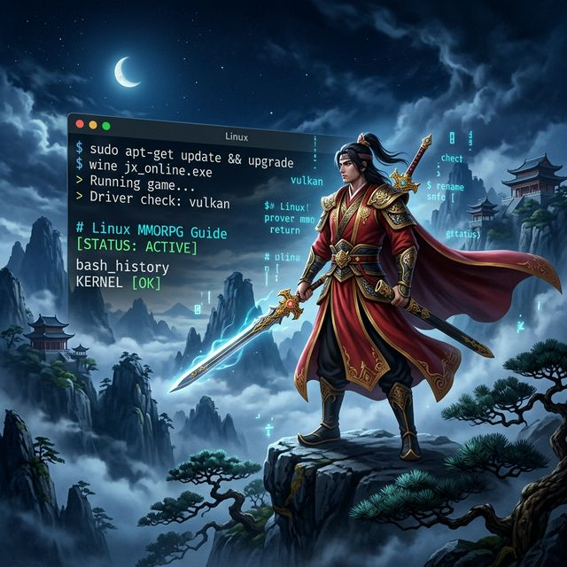
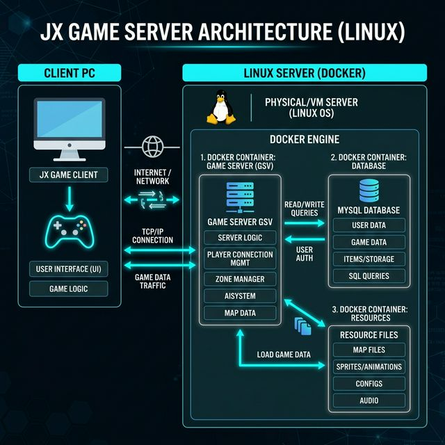
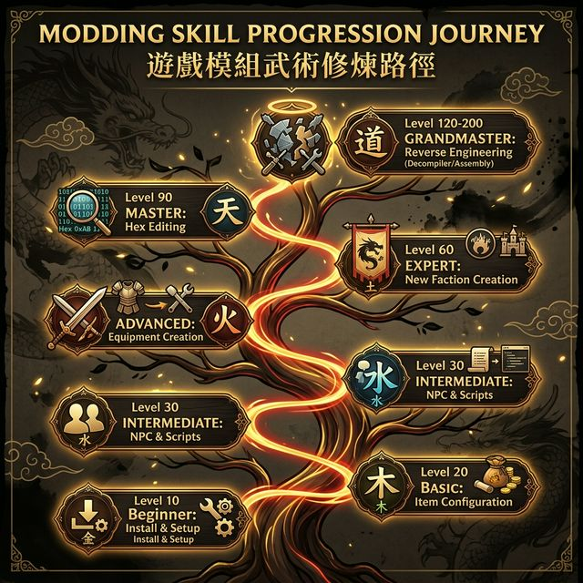

<!-- tags: game-dev, jx-online, linux, mmorpg -->
# 🎮 VLTK Offline trên Linux — Từ Tân Thủ Đến Cao Thủ

> Cẩm nang toàn diện hướng dẫn cài đặt, cấu hình và mod Võ Lâm Truyền Kỳ (JX) offline trên Linux — từ người mới bắt đầu đến chuyên gia reverse engineering

📅 Ngày tạo: 2026-03-22 · 🔄 Cập nhật: 2026-03-22 · ⏱️ 25 phút đọc

| Aspect              | Detail                               |
| ------------------- | ------------------------------------ |
| **Chủ đề**          | Game Server Administration & Modding |
| **Nền tảng**        | Linux (Docker-based)                 |
| **Ngôn ngữ**        | Lua, C++, SQL, Shell                 |
| **Phiên bản**       | JX 8.0 – Bát Mạch Chân Kinh          |
| **Nguồn tham khảo** | Thịnh Nguyễn – Magic Tips            |

---



---

## 1. DEFINE

### Định nghĩa

**JX Offline Linux** là phiên bản **Võ Lâm Truyền Kỳ** (VLTK / Jian Xia) được triển khai trên nền tảng Linux để chơi **phi tuyến** (offline/private server). Thay vì kết nối tới server chính thức đã đóng cửa, người chơi tự dựng server riêng trên máy tính cá nhân bằng Docker containers.

Đây không chỉ là "chơi game" — mà còn là một môi trường học tập thực hành xuất sắc về:

- **System Administration**: Quản trị Linux, Docker, MySQL
- **Lập trình**: Lua scripting, C++ (client/server), SQL queries
- **Reverse Engineering**: Hex editing, unpack binary, IDA Pro
- **UI/UX Design**: Thiết kế giao diện game bằng SPR files
- **Game Development**: Hiểu cách hoạt động của một MMORPG từ bên trong

### Phân biệt Linux vs Windows

| Khía cạnh              | JX Linux (Docker)           | JX Windows                     |
| ---------------------- | --------------------------- | ------------------------------ |
| **Cài đặt**            | Docker Compose, tự động hóa | Cài thủ công, nhiều bước       |
| **Ổn định**            | Rất ổn định, ít crash       | Hay gặp lỗi DLL, compatibility |
| **Performance**        | Nhẹ, chạy headless          | Nặng hơn, cần GUI              |
| **Quản lý**            | CLI + scripts, dễ backup    | GUI-based, khó automate        |
| **Phiên bản phổ biến** | 8.0, 8.1                    | 4.1, 6.0, 8.0                  |
| **Cộng đồng**          | Đang phát triển mạnh        | Lâu đời, nhiều tài liệu hơn    |
| **Modding**            | Lua + config files          | Lua + config + nhiều tools GUI |

### Actors & Components

| Component             | Vai trò                              | Công nghệ                         |
| --------------------- | ------------------------------------ | --------------------------------- |
| **Game Server (GSV)** | Xử lý logic game, chiến đấu, NPC AI  | C++ binary, chạy trong Docker     |
| **MySQL Database**    | Lưu nhân vật, items, quests, guilds  | MySQL 5.x container               |
| **Client (game.exe)** | Giao diện người chơi, render đồ họa  | Win32 app (chạy qua Wine nếu cần) |
| **Lua Scripts**       | Logic tính năng: NPC, quests, events | Lua 5.1, file `.lua` trong server |
| **Config Files**      | Settings: items, skills, drop rates  | `.txt`, `.ini`, `.tab` files      |
| **SPR Files**         | Sprites: nhân vật, vũ khí, hiệu ứng  | Binary sprite format (.spr)       |
| **Resource Files**    | Maps, âm thanh, textures             | Packed binary files               |

### Hệ thống cấp độ kỹ năng (Skill Levels)

Tài liệu gốc phân chia kỹ năng modding thành các cấp độ giống "võ công" trong game:

| Cấp độ       | Tên gọi          | Kỹ năng chính                          |
| ------------ | ---------------- | -------------------------------------- |
| **Nhập môn** | Sơ nhập giang hồ | Cài đặt, login, backup                 |
| **10**       | Tân thủ          | Lấy đồ, chỉnh rơi items, skills cơ bản |
| **20**       | Sơ cấp           | Nhận đồ tím, tùy chỉnh ngoại hình      |
| **30**       | Trung cấp        | Thêm NPC, viết Lua scripts             |
| **40**       | Cao cấp          | Tạo trang bị mới (ấn, phi phong)       |
| **50**       | Thượng cấp       | Thêm map, danh hiệu, kinh mạch         |
| **60**       | Chuyên gia       | Tạo phái mới, võ công mới              |
| **90**       | Cao thủ          | Hex editing, hiển thị môn phái mới     |
| **120**      | Đại cao thủ      | Khảm nạm Hoàng Kim, UI tùy chỉnh       |
| **150-200**  | Tông sư          | Unpack EXE, IDA, reverse engineering   |

### Failure Modes

| Lỗi                     | Hậu quả                                     | Giải pháp                               |
| ----------------------- | ------------------------------------------- | --------------------------------------- |
| Docker container crash  | Server dừng, mất dữ liệu chưa save          | Backup MySQL volume định kỳ             |
| Sai cấu hình MySQL      | Không login được, lỗi kết nối DB            | Kiểm tra port, password, charset        |
| Lua script syntax error | Server crash hoặc tính năng không hoạt động | Check log, test script trước khi deploy |
| SPR file bị hỏng        | Client crash khi load nhân vật/item         | Backup SPR gốc, dùng RPGViewer kiểm tra |
| Xung đột ID item/skill  | Items biến mất, skills không hoạt động      | Quản lý ID range cẩn thận, document lại |

---

## 2. VISUAL

### Kiến trúc tổng quan — JX Server trên Linux



### Kiến trúc chi tiết (ASCII)

```text
┌─────────────────────────────────────────────────────────────────────────────┐
│                           LINUX HOST (Ubuntu/CentOS)                        │
│                                                                             │
│  ┌─────────────────────────────────────────────────────────────────────┐   │
│  │                        DOCKER ENGINE                                │   │
│  │                                                                     │   │
│  │  ┌──────────────────┐  ┌──────────────────┐  ┌─────────────────┐  │   │
│  │  │  Container 1:    │  │  Container 2:    │  │  Container 3:   │  │   │
│  │  │  GAME SERVER     │  │  MySQL 5.x       │  │  RESOURCES      │  │   │
│  │  │  (GSV)           │  │                  │  │                 │  │   │
│  │  │  ┌────────────┐  │  │  ┌────────────┐  │  │  ┌───────────┐ │  │   │
│  │  │  │ C++ Engine │  │  │  │ jx_game DB │  │  │  │ maps/     │ │  │   │
│  │  │  │ Lua VM     │  │  │  │ jx_acc  DB │  │  │  │ npcres/   │ │  │   │
│  │  │  │ Network IO │  │  │  │ accounts   │  │  │  │ settings/ │ │  │   │
│  │  │  └────────────┘  │  │  │ characters │  │  │  │ scripts/  │ │  │   │
│  │  │                  │  │  │ items      │  │  │  │ spr/      │ │  │   │
│  │  │  Port: 5622      │  │  │ guilds     │  │  │  └───────────┘ │  │   │
│  │  │  (game traffic)  │  │  └────────────┘  │  │                 │  │   │
│  │  └──────────────────┘  │  Port: 3306      │  └─────────────────┘  │   │
│  │          ▲              └──────────────────┘          ▲             │   │
│  │          │                       ▲                    │             │   │
│  │          └───────── READ/WRITE ──┘                    │             │   │
│  │                                                       │             │   │
│  │          └──────── LOAD RESOURCES ────────────────────┘             │   │
│  └─────────────────────────────────────────────────────────────────────┘   │
│                                    ▲                                        │
│                                    │ TCP Port 5622                          │
└────────────────────────────────────┼────────────────────────────────────────┘
                                     │
                          ┌──────────┴──────────┐
                          │   CLIENT PC (Win)    │
                          │   game.exe / JX.exe  │
                          │   ┌──────────────┐   │
                          │   │ Render Engine │   │
                          │   │ UI System     │   │
                          │   │ Input Handler │   │
                          │   │ Network       │   │
                          │   └──────────────┘   │
                          └─────────────────────┘
```

### Lộ trình kỹ năng — Từ Tân Thủ đến Cao Thủ



### Luồng xử lý — Từ cài đặt đến modding

```text
Nhập môn              Tân thủ (10-20)           Trung cấp (30-40)
┌──────────┐         ┌──────────────┐          ┌──────────────────┐
│ Cài Docker│────────▶│ Cài JX 8.0   │────────▶│ Viết Lua Script  │
│ + MySQL   │         │ Login server │          │ Thêm NPC/Items   │
│ Backup    │         │ Chỉnh items  │          │ Tạo trang bị     │
└──────────┘         └──────────────┘          └────────┬─────────┘
                                                        │
                     Cao thủ (90-120)           Chuyên gia (50-60)
                    ┌──────────────────┐       ┌──────────────────┐
                    │ Hex editing      │◀──────│ Tạo phái mới     │
                    │ UI tùy chỉnh     │       │ Thêm map Vũ Hồn  │
                    │ Khảm nạm HK     │       │ Phi phong môn phái│
                    └────────┬─────────┘       └──────────────────┘
                             │
                    Tông sư (150-200+)
                    ┌──────────────────┐
                    │ Unpack EXE       │
                    │ IDA / Hex-Rays   │
                    │ Reverse Engineer │
                    │ Sáng tạo tự do   │
                    └──────────────────┘
```

---

## 3. CODE

### Example 1: Basic — Cài đặt JX Server trên Linux với Docker

Bước đầu tiên của mọi hành trình: cài đặt Docker và khởi chạy JX server. Đây là nền tảng cho tất cả các bước tiếp theo.

```bash
#!/bin/bash
# ============================================================
# JX 8.0 Linux Server — Cài đặt và khởi chạy
# Phiên bản: Bát Mạch Chân Kinh
# Yêu cầu: Ubuntu 20.04+ hoặc CentOS 7+
# ============================================================

# ① Cài đặt Docker và Docker Compose
# ⚠️ Bắt buộc phải có Docker để chạy JX server trên Linux
sudo apt-get update && sudo apt-get install -y \
    docker.io \
    docker-compose \
    mysql-client

# ② Kích hoạt Docker service
sudo systemctl enable docker
sudo systemctl start docker

# ✅ Kiểm tra Docker đã hoạt động
docker --version
docker-compose --version

# ③ Tạo thư mục project
mkdir -p ~/jx-server/{data,backup,scripts,logs}
cd ~/jx-server

# ④ Tạo docker-compose.yml cho JX Server
cat > docker-compose.yml << 'EOF'
version: '3.8'

services:
  # ── MySQL Database ──
  mysql:
    image: mysql:5.7
    container_name: jx-mysql
    environment:
      MYSQL_ROOT_PASSWORD: jx_root_2026
      MYSQL_DATABASE: jx_game
      MYSQL_USER: jx_user
      MYSQL_PASSWORD: jx_pass_secure
    ports:
      - "3306:3306"
    volumes:
      - ./data/mysql:/var/lib/mysql      # ✅ Persistent data
      - ./sql/init:/docker-entrypoint-initdb.d  # Auto import SQL
    command: >
      --character-set-server=utf8mb4
      --collation-server=utf8mb4_unicode_ci
      --max-connections=500
    restart: unless-stopped

  # ── Game Server (GSV) ──
  gameserver:
    image: jx-server:8.0
    container_name: jx-gsv
    depends_on:
      - mysql
    ports:
      - "5622:5622"    # Game traffic
      - "5632:5632"    # Login server
    volumes:
      - ./settings:/opt/jx/settings     # Config files
      - ./scripts:/opt/jx/scripts       # Lua scripts
      - ./npcres:/opt/jx/npcres         # NPC resources
    environment:
      DB_HOST: mysql
      DB_PORT: 3306
      DB_NAME: jx_game
      DB_USER: jx_user
      DB_PASS: jx_pass_secure
    restart: unless-stopped
EOF

# ⑤ Khởi chạy server
docker-compose up -d

# ✅ Kiểm tra trạng thái
docker-compose ps
echo "🎮 JX Server đã khởi chạy tại port 5622"
```

```bash
#!/bin/bash
# ============================================================
# Backup & Restore Script cho JX Server
# ⚠️ LUÔN backup trước khi chỉnh sửa bất kỳ thứ gì!
# ============================================================

BACKUP_DIR=~/jx-server/backup
DATE=$(date +%Y%m%d_%H%M%S)

# ── Backup Database ──
backup_db() {
    echo "📦 Backing up database..."
    docker exec jx-mysql mysqldump \
        -u root -pjx_root_2026 \
        --all-databases \
        --single-transaction \
        > "${BACKUP_DIR}/jx_db_${DATE}.sql"

    # ✅ Nén để tiết kiệm dung lượng
    gzip "${BACKUP_DIR}/jx_db_${DATE}.sql"
    echo "✅ Database backup: jx_db_${DATE}.sql.gz"
}

# ── Backup Settings & Scripts ──
backup_files() {
    echo "📦 Backing up config files..."
    tar -czf "${BACKUP_DIR}/jx_files_${DATE}.tar.gz" \
        ~/jx-server/settings \
        ~/jx-server/scripts \
        ~/jx-server/npcres
    echo "✅ Files backup: jx_files_${DATE}.tar.gz"
}

# ── Restore Database ──
restore_db() {
    local BACKUP_FILE=$1
    if [ -z "$BACKUP_FILE" ]; then
        echo "⚠️ Cần chỉ định file backup!"
        echo "Usage: restore_db backup_file.sql.gz"
        return 1
    fi

    echo "🔄 Restoring database from ${BACKUP_FILE}..."
    gunzip -c "$BACKUP_FILE" | docker exec -i jx-mysql \
        mysql -u root -pjx_root_2026
    echo "✅ Database restored!"
}

# ── Main ──
case "$1" in
    backup)  backup_db && backup_files ;;
    restore) restore_db "$2" ;;
    *)       echo "Usage: $0 {backup|restore <file>}" ;;
esac
```

**Kết luận**: Docker giúp triển khai JX server trên Linux cực kỳ nhanh và sạch — không cần lo libraries, dependencies. Backup script đảm bảo an toàn dữ liệu trước khi bắt đầu modding.

---

### Example 2: Intermediate — Lua Scripts: Thêm NPC và chức năng Admin

Sau khi cài đặt thành công, bước tiếp theo là viết Lua scripts để thêm NPC, tạo chức năng admin, và quản lý items. Đây là kỹ năng core của modding JX.

```lua
-- ============================================================
-- NPC Admin Panel — Lua Script cho JX 8.0
-- Chức năng: Nhận danh hiệu, vòng sáng, mở Thiên Trùng Lâu
-- Đặt tại: scripts/global/npc/admin_npc.lua
-- ============================================================

-- ⚠️ Mỗi NPC cần có NPC ID duy nhất, không trùng với NPC có sẵn
local ADMIN_NPC_ID = 99001
local ADMIN_NPC_NAME = "Quản Trị Viên"

-- ① Khi người chơi nói chuyện với NPC
function OnTalk(nPlayerIndex, nNpcIndex)
    -- ✅ Hiển thị menu chức năng admin
    Dialog:Say(nPlayerIndex,
        "Chào đại hiệp! Ta là " .. ADMIN_NPC_NAME .. ".\n"
        .. "Có gì ta giúp được không?\n"
    )
    Dialog:AddOption(nPlayerIndex, "Nhận danh hiệu đặc biệt", 1)
    Dialog:AddOption(nPlayerIndex, "Nhận vòng sáng hiệu ứng", 2)
    Dialog:AddOption(nPlayerIndex, "Mở Thiên Trùng Lâu", 3)
    Dialog:AddOption(nPlayerIndex, "Nhận Kim Mã Cẩm Nang", 4)
    Dialog:AddOption(nPlayerIndex, "Triệu hoán Boss", 5)
    Dialog:AddOption(nPlayerIndex, "Tạm biệt", 0)
    Dialog:Show(nPlayerIndex)
end

-- ② Xử lý khi người chơi chọn option
function OnCallScript(nPlayerIndex, nNpcIndex, nOptionIndex)
    if nOptionIndex == 1 then
        GrantTitle(nPlayerIndex)
    elseif nOptionIndex == 2 then
        GrantAura(nPlayerIndex)
    elseif nOptionIndex == 3 then
        OpenThienTrungLau(nPlayerIndex)
    elseif nOptionIndex == 4 then
        GiveKimMaBook(nPlayerIndex)
    elseif nOptionIndex == 5 then
        SummonBoss(nPlayerIndex)
    end
end

-- ── Chức năng 1: Nhận danh hiệu ──
function GrantTitle(nPlayerIndex)
    -- ✅ Danh hiệu ID tra trong settings/title.txt
    local titleID = 1001  -- "Thiên Hạ Vô Song"
    local duration = 30   -- 30 ngày

    Player:SetTitle(nPlayerIndex, titleID, duration)
    Dialog:Say(nPlayerIndex,
        "✅ Đã nhận danh hiệu [Thiên Hạ Vô Song]!\n"
        .. "Thời hạn: " .. duration .. " ngày.\n"
    )
    Dialog:Show(nPlayerIndex)
end

-- ── Chức năng 2: Nhận vòng sáng ──
function GrantAura(nPlayerIndex)
    -- ✅ Vòng sáng hiệu ứng rồng
    local auraID = 2001  -- Hiệu ứng rồng vàng
    Player:SetAura(nPlayerIndex, auraID)
    Dialog:Say(nPlayerIndex,
        "✅ Đã kích hoạt vòng sáng [Rồng Vàng]!\n"
        .. "Hiệu ứng sẽ hiển thị ngay lập tức.\n"
    )
    Dialog:Show(nPlayerIndex)
end

-- ── Chức năng 3: Mở Thiên Trùng Lâu ──
function OpenThienTrungLau(nPlayerIndex)
    -- ⚠️ Thiên Trùng Lâu = dungeon nhiều tầng, cần check level
    local playerLevel = Player:GetLevel(nPlayerIndex)
    if playerLevel < 90 then
        Dialog:Say(nPlayerIndex,
            "⚠️ Cần tối thiểu level 90 để vào Thiên Trùng Lâu!\n"
            .. "Level hiện tại: " .. playerLevel .. "\n"
        )
        Dialog:Show(nPlayerIndex)
        return
    end

    -- ✅ Dịch chuyển đến Thiên Trùng Lâu
    local mapID = 180     -- Map ID Thiên Trùng Lâu
    local posX = 100
    local posY = 100
    Player:MoveToMap(nPlayerIndex, mapID, posX, posY)
end

-- ── Chức năng 4: Nhận Kim Mã Cẩm Nang ──
function GiveKimMaBook(nPlayerIndex)
    -- ✅ Item ID tra trong settings/item.txt
    local itemID = 50001  -- Kim Mã Cẩm Nang
    local count = 1

    local success = Player:GiveItem(nPlayerIndex, itemID, count)
    if success then
        Dialog:Say(nPlayerIndex,
            "✅ Đã nhận [Kim Mã Cẩm Nang] x" .. count .. "!\n"
        )
    else
        Dialog:Say(nPlayerIndex,
            "⚠️ Hành trang đầy! Hãy dọn bớt rồi quay lại.\n"
        )
    end
    Dialog:Show(nPlayerIndex)
end

-- ── Chức năng 5: Triệu hoán Boss ──
function SummonBoss(nPlayerIndex)
    -- ⚠️ Triệu hoán boss tại vị trí hiện tại của người chơi
    local bossID = 3001  -- Boss Thiên Ma
    local mapID = Player:GetMapID(nPlayerIndex)
    local posX = Player:GetPosX(nPlayerIndex)
    local posY = Player:GetPosY(nPlayerIndex)

    NPC:Summon(bossID, mapID, posX + 5, posY + 5)
    Dialog:Say(nPlayerIndex,
        "⚔️ Boss [Thiên Ma] đã xuất hiện gần đây!\n"
        .. "Chuẩn bị chiến đấu!\n"
    )
    Dialog:Show(nPlayerIndex)
end
```

```lua
-- ============================================================
-- Magic Script: Chỉnh drop rate items
-- Đặt tại: scripts/global/drop/custom_drop.lua
-- Cấp độ: Tân thủ (10-20)
-- ============================================================

-- ① Cấu hình drop rate cho từng loại monster
-- ⚠️ Rate tính theo phần vạn (1/10000)
local DROP_CONFIG = {
    -- MonsterID → danh sách items có thể rơi
    [1001] = {  -- Sói hoang
        { itemID = 10001, rate = 5000, min = 1, max = 3 },  -- Đá thường (50%)
        { itemID = 10002, rate = 1000, min = 1, max = 1 },  -- Đá quý (10%)
        { itemID = 20001, rate = 100,  min = 1, max = 1 },  -- Vũ khí xanh (1%)
    },
    [1002] = {  -- Cường đạo
        { itemID = 10001, rate = 3000, min = 1, max = 5 },  -- Đá thường (30%)
        { itemID = 20002, rate = 500,  min = 1, max = 1 },  -- Áo giáp xanh (5%)
        { itemID = 30001, rate = 50,   min = 1, max = 1 },  -- Đồ tím (0.5%) ✅
    },
    [2001] = {  -- Boss Thiên Ma
        { itemID = 30001, rate = 3000, min = 1, max = 2 },  -- Đồ tím (30%)
        { itemID = 40001, rate = 500,  min = 1, max = 1 },  -- Hoàng Kim (5%)
        { itemID = 50001, rate = 100,  min = 1, max = 1 },  -- Thần khí (1%)
    },
}

-- ② Hàm xử lý khi monster chết
function OnMonsterDeath(nMonsterID, nKillerIndex)
    local drops = DROP_CONFIG[nMonsterID]
    if not drops then return end

    for _, item in ipairs(drops) do
        -- ✅ Random số từ 1-10000, nếu <= rate thì rơi đồ
        local roll = math.random(1, 10000)
        if roll <= item.rate then
            local count = math.random(item.min, item.max)

            -- Rơi đồ tại vị trí monster chết
            local mapID = Monster:GetMapID(nMonsterID)
            local posX = Monster:GetPosX(nMonsterID)
            local posY = Monster:GetPosY(nMonsterID)

            DropItem(item.itemID, count, mapID, posX, posY)

            -- ✅ Log để debug
            Log:Info(string.format(
                "Drop: item=%d x%d, monster=%d, killer=%d, roll=%d/%d",
                item.itemID, count, nMonsterID, nKillerIndex, roll, item.rate
            ))
        end
    end
end

-- ③ Hàm rơi đồ Hoàng Kim với thuộc tính random
function DropGoldEquip(nMonsterID, nKillerIndex)
    -- ⚠️ Đồ Hoàng Kim có random thuộc tính, cần config trong goldequipres
    local equipList = {
        { equipID = 40001, name = "Kiếm HK Thiếu Lâm" },
        { equipID = 40002, name = "Đao HK Cái Bang" },
        { equipID = 40003, name = "Thương HK Đường Môn" },
    }

    local selected = equipList[math.random(1, #equipList)]

    -- ✅ Tạo equipment với random stats
    local stats = {
        attack = math.random(100, 500),
        defense = math.random(50, 200),
        hp = math.random(200, 1000),
        critRate = math.random(1, 10),
    }

    Player:GiveEquipment(nKillerIndex, selected.equipID, stats)
    SystemMsg(string.format(
        "🎊 [%s] đã nhận được [%s] từ Boss!",
        Player:GetName(nKillerIndex), selected.name
    ))
end
```

**Kết luận**: Lua scripts là trái tim của mọi tùy biến trong JX. Ba cách sử dụng script phổ biến nhất: (1) thêm vào `magicscript` có sẵn, (2) tùy chỉnh theo NPC ID, (3) viết script mới hoàn toàn. Cần thành thục cả 3 cách này trước khi tiến lên cấp cao hơn.

---

### Example 3: Advanced — SQL: Tạo trang bị mới và quản lý phái

Ở cấp độ này, bạn cần hiểu cấu trúc database MySQL để tạo items, skills, và thậm chí phái mới hoàn chỉnh.

```sql
-- ============================================================
-- Tạo trang bị mới: Ấn, Trang sức, Phi phong
-- Cấp độ: 40-50 (Cao cấp)
-- ⚠️ LUÔN backup database trước khi chạy các query này!
-- ============================================================

-- ① Tạo Ấn (Seal) mới — Trang bị phụ kiện
-- Tra cứu: settings/item.txt để xác định ID range
INSERT INTO t_item (
    item_id, item_name, item_type, item_subtype,
    require_level, require_school,
    base_attack, base_defense, base_hp,
    description
) VALUES
-- ✅ Ấn Thiếu Lâm — Tím (Purple grade)
(60001, 'Thiếu Lâm Ngọc Ấn', 8, 1,
 80, 0,
 150, 80, 500,
 'Ngọc ấn cổ xưa của phái Thiếu Lâm, tăng nội lực đáng kể'),

-- ✅ Ấn Nga Mi — Tím
(60002, 'Nga Mi Linh Ấn', 8, 1,
 80, 1,
 120, 100, 600,
 'Linh ấn thượng cổ của phái Nga Mi, tăng phòng ngự và sinh lực'),

-- ✅ Ấn Võ Đang — Tím
(60003, 'Võ Đang Thái Cực Ấn', 8, 1,
 80, 2,
 130, 90, 550,
 'Thái cực ấn của Võ Đang, cân bằng công thủ');

-- ② Tạo Phi Phong (Cape) mới với ngoại hình
-- ⚠️ Phi phong cần config thêm trong npcres (sprite files)
INSERT INTO t_item (
    item_id, item_name, item_type, item_subtype,
    require_level, require_school,
    base_attack, base_defense, base_hp,
    spr_id, description
) VALUES
-- ✅ Phi phong Công Thành Chiến — Trắng (White grade)
(70001, 'Phi Phong Chiến Thần', 9, 1,
 60, -1,  -- -1 = Tất cả môn phái
 50, 150, 300,
 8001, 'Phi phong dành cho chiến trường Công Thành Chiến'),

-- ✅ Phi phong Công Thành Chiến — Tím (Purple grade)
(70002, 'Phi Phong Bá Vương', 9, 2,
 80, -1,
 100, 250, 500,
 8002, 'Phi phong huyền thoại cho người chiến thắng CTC');

-- ③ Cấu hình drop rate cho trang bị mới
-- Thêm vào bảng t_monster_drop
INSERT INTO t_monster_drop (monster_id, item_id, drop_rate, min_count, max_count)
VALUES
(2001, 60001, 200,  1, 1),  -- Boss Thiên Ma → Ấn TL (2%)
(2001, 60002, 200,  1, 1),  -- Boss Thiên Ma → Ấn NM (2%)
(2001, 60003, 200,  1, 1),  -- Boss Thiên Ma → Ấn VĐ (2%)
(2002, 70001, 100,  1, 1),  -- Boss CTC → Phi phong trắng (1%)
(2002, 70002, 30,   1, 1);  -- Boss CTC → Phi phong tím (0.3%)
```

```sql
-- ============================================================
-- Tạo phái mới: Tiêu Dao (cấp độ 60 - Chuyên gia)
-- ⚠️ Đây là thao tác phức tạp, cần nhiều bước config
-- ============================================================

-- ① Đăng ký phái mới trong bảng school
INSERT INTO t_school (
    school_id, school_name, school_desc,
    base_str, base_dex, base_vit, base_eng,
    weapon_type, armor_type
) VALUES (
    10,                      -- ✅ School ID mới (0-9 đã dùng)
    'Tiêu Dao',
    'Phái tự do, không bị ràng buộc bởi quy tắc.',
    25, 30, 20, 35,          -- Stats: DEX + Energy cao
    5, 3                     -- Vũ khí: Phiến (quạt), Giáp: Nhẹ
);

-- ② Tạo skill set cho Tiêu Dao
-- Nội công (Internal skill)
INSERT INTO t_skill (
    skill_id, skill_name, school_id, skill_type,
    max_level, base_damage, cooldown_ms,
    mp_cost, description, lua_script
) VALUES
(10001, 'Tiêu Dao Du Bộ', 10, 1,
 12, 0, 0,
 50, 'Thân pháp độc đáo, tăng tốc di chuyển',
 'skills/tieudao/tieu_dao_du_bo.lua'),

(10002, 'Bắc Minh Thần Công', 10, 2,
 12, 350, 3000,
 120, 'Hút nội lực đối thủ, hồi MP bản thân',
 'skills/tieudao/bac_minh_than_cong.lua'),

(10003, 'Lăng Ba Vi Bộ', 10, 3,
 12, 0, 15000,
 200, 'Né tránh mọi tấn công trong 5 giây',
 'skills/tieudao/lang_ba_vi_bo.lua'),

(10004, 'Thiên Sơn Lục Dương Chưởng', 10, 2,
 12, 500, 5000,
 180, 'Chưởng lực hàn băng, đóng băng đối thủ 2 giây',
 'skills/tieudao/thien_son_luc_duong.lua');

-- ③ Tạo trang bị Hoàng Kim cho Tiêu Dao
INSERT INTO t_gold_equip (
    equip_id, equip_name, school_id, equip_type,
    min_level, base_attack, base_defense,
    special_attr, spr_id
) VALUES
(90001, 'Tiêu Dao Kiếm', 10, 1,
 80, 450, 100,
 '{"crit_rate": 8, "dodge": 5, "mp_steal": 3}',
 9001),
(90002, 'Tiêu Dao Y', 10, 2,
 80, 50, 400,
 '{"dodge": 10, "mp_regen": 5, "speed": 8}',
 9002);
```

**Kết luận**: Tạo nội dung mới trong database đòi hỏi hiểu rõ cấu trúc bảng và quan hệ giữa items, skills, và schools. Mỗi phái mới cần config ở nhiều lớp: Database (SQL) → Skills (Lua scripts) → Ngoại hình (SPR files) → Settings (config files). Tham khảo series "Tiêu Dao phái" của Magic Tips để có hướng dẫn video chi tiết.

---

### Example 4: Expert — C++ và Hex Editing: Hiểu engine, mở rộng giới hạn

Ở cấp cao nhất, bạn cần hiểu cấu trúc binary của client/server để mở rộng giới hạn vượt ra ngoài khả năng của Lua scripts và configs.

```cpp
// ============================================================
// Ví dụ: Đọc và parse SPR file (Sprite Resource)
// SPR là định dạng sprite đặc trưng của JX, chứa animation frames
// Cấp độ: 120+ (Đại cao thủ)
// ============================================================

#include <cstdint>
#include <fstream>
#include <vector>
#include <iostream>
#include <string>

// ── Cấu trúc header của file SPR ──
// ⚠️ Cấu trúc này được reverse engineer từ binary
#pragma pack(push, 1)
struct SPRHeader {
    char     magic[4];        // "SPR\0" — Magic bytes
    uint16_t version;         // Phiên bản format
    uint16_t frameCount;      // Tổng số frames animation
    uint16_t width;           // Chiều rộng sprite
    uint16_t height;          // Chiều cao sprite
    uint16_t centerX;         // Tâm X (pivot point)
    uint16_t centerY;         // Tâm Y
    uint32_t paletteOffset;   // Offset đến bảng màu
    uint32_t frameDataOffset; // Offset đến dữ liệu frame
};

struct SPRFrame {
    uint16_t width;           // Chiều rộng frame
    uint16_t height;          // Chiều cao frame
    int16_t  offsetX;         // Offset X từ center
    int16_t  offsetY;         // Offset Y từ center
    uint32_t dataSize;        // Kích thước dữ liệu pixel
    uint32_t dataOffset;      // Offset trong file
};

struct RGBColor {
    uint8_t r, g, b;          // ✅ Palette 256 màu, mỗi màu 3 bytes
};
#pragma pack(pop)

// ── Class đọc SPR file ──
class SPRReader {
public:
    bool Load(const std::string& filepath) {
        std::ifstream file(filepath, std::ios::binary);
        if (!file.is_open()) {
            std::cerr << "⚠️ Không thể mở file: " << filepath << std::endl;
            return false;
        }

        // ① Đọc header
        file.read(reinterpret_cast<char*>(&m_header), sizeof(SPRHeader));

        // ✅ Kiểm tra magic bytes
        if (std::string(m_header.magic, 3) != "SPR") {
            std::cerr << "⚠️ Không phải file SPR hợp lệ!" << std::endl;
            return false;
        }

        std::cout << "✅ SPR loaded: "
                  << m_header.frameCount << " frames, "
                  << m_header.width << "x" << m_header.height
                  << std::endl;

        // ② Đọc palette (256 màu)
        file.seekg(m_header.paletteOffset);
        m_palette.resize(256);
        file.read(reinterpret_cast<char*>(m_palette.data()),
                  256 * sizeof(RGBColor));

        // ③ Đọc frame info
        file.seekg(m_header.frameDataOffset);
        m_frames.resize(m_header.frameCount);
        for (uint16_t i = 0; i < m_header.frameCount; ++i) {
            file.read(reinterpret_cast<char*>(&m_frames[i]),
                      sizeof(SPRFrame));
        }

        return true;
    }

    // ④ Xuất frame ra PNG (cần libpng)
    // ⚠️ Đây là cách tạo SPR trong suốt — thay đổi palette index 0
    void SetTransparentColor(uint8_t paletteIndex) {
        // Index 0 thường là màu transparent
        m_transparentIndex = paletteIndex;
        std::cout << "✅ Transparent color set to palette index "
                  << (int)paletteIndex << std::endl;
    }

    uint16_t GetFrameCount() const { return m_header.frameCount; }
    const SPRFrame& GetFrame(int idx) const { return m_frames[idx]; }
    const SPRHeader& GetHeader() const { return m_header; }

private:
    SPRHeader             m_header;
    std::vector<RGBColor> m_palette;
    std::vector<SPRFrame> m_frames;
    uint8_t               m_transparentIndex = 0;
};
```

```cpp
// ============================================================
// Hex Editing: Chỉnh sửa vị trí danh hiệu trong client binary
// Cấp độ: 90+ (Cao thủ)
// ⚠️ Backup file gốc trước khi hex edit!
// ============================================================

#include <fstream>
#include <iostream>
#include <cstdint>
#include <vector>

// ── Cấu trúc offset danh hiệu trong game.exe ──
// Các offset này được tìm bằng IDA Pro / Hex-Rays
struct TitleDisplayConfig {
    uint32_t offsetInBinary;  // Vị trí trong EXE
    int16_t  displayX;        // Tọa độ X hiển thị (relative to char)
    int16_t  displayY;        // Tọa độ Y hiển thị
    uint8_t  fontSize;        // Cỡ chữ
    uint8_t  colorR, colorG, colorB; // Màu RGB
};

// ✅ Các offset đã được cộng đồng tìm ra
// Tham khảo: Tiêu Quyền (Facebook group Hội quán Võ Lâm)
const std::vector<TitleDisplayConfig> KNOWN_OFFSETS = {
    // offset,       X,    Y, size,  R,   G,   B
    { 0x004A3210,  0,   -45,  12, 255, 215,   0 }, // Danh hiệu vàng
    { 0x004A3220,  0,   -60,  10, 148,   0, 211 }, // Danh hiệu tím
    { 0x004A3230,  0,   -75,  14, 255,  69,   0 }, // Danh hiệu đỏ
};

// ── Hàm hex edit file binary ──
bool PatchBinary(const std::string& filepath,
                 uint32_t offset,
                 const void* data,
                 size_t size) {
    std::fstream file(filepath,
                      std::ios::in | std::ios::out | std::ios::binary);
    if (!file.is_open()) {
        std::cerr << "⚠️ Cannot open: " << filepath << std::endl;
        return false;
    }

    // ✅ Seek đến offset và ghi dữ liệu mới
    file.seekp(offset);
    file.write(static_cast<const char*>(data), size);

    std::cout << "✅ Patched " << size << " bytes at offset 0x"
              << std::hex << offset << std::endl;
    return true;
}

// ── Ví dụ: Chỉnh vị trí hiển thị danh hiệu ──
void AdjustTitlePosition(const std::string& gameExePath,
                         int titleIndex,
                         int16_t newX, int16_t newY) {
    if (titleIndex < 0 || titleIndex >= (int)KNOWN_OFFSETS.size()) {
        std::cerr << "⚠️ Invalid title index!" << std::endl;
        return;
    }

    const auto& config = KNOWN_OFFSETS[titleIndex];

    // ⚠️ Ghi tọa độ mới vào binary
    // Offset + 0: X position (int16_t)
    // Offset + 2: Y position (int16_t)
    PatchBinary(gameExePath,
                config.offsetInBinary, &newX, sizeof(int16_t));
    PatchBinary(gameExePath,
                config.offsetInBinary + 2, &newY, sizeof(int16_t));

    std::cout << "✅ Title " << titleIndex
              << " position updated to (" << newX << ", " << newY << ")"
              << std::endl;
}
```

**Kết luận**: Ở cấp độ Expert, bạn cần hiểu cấu trúc binary và biết cách sử dụng IDA Pro, Hex-Rays để tìm offsets. Quy tắc vàng: **LUÔN backup** trước khi hex edit, và document lại mọi offset bạn tìm được để chia sẻ với cộng đồng.

---

## 4. PITFALLS

| #   | Lỗi                                     | Hậu quả                                            | Fix                                                         |
| --- | --------------------------------------- | -------------------------------------------------- | ----------------------------------------------------------- |
| 1   | Không backup trước khi chỉnh sửa        | Mất toàn bộ dữ liệu, phải cài lại từ đầu           | **LUÔN** chạy backup script trước mỗi thay đổi              |
| 2   | Sai charset MySQL (latin1 thay vì utf8) | Tên nhân vật/items tiếng Việt bị lỗi font          | `--character-set-server=utf8mb4` trong Docker config        |
| 3   | Trùng NPC ID / Item ID                  | NPC biến mất, items bị ghi đè, skills lỗi          | Duy trì spreadsheet quản lý ID ranges                       |
| 4   | Lua script thiếu `end` hoặc sai syntax  | Server crash ngay khi load, không báo lỗi rõ ràng  | Dùng `luac -p script.lua` để check syntax trước khi deploy  |
| 5   | Copy script từ nguồn khác mà không hiểu | Xung đột với scripts có sẵn, tính năng ghi đè nhau | **Đọc hiểu** script trước, tùy chỉnh ID/tham số cho phù hợp |
| 6   | Hex edit sai offset                     | Client crash, không mở được game                   | Backup game.exe gốc, test trên bản copy trước               |
| 7   | SPR file sai format/kích thước          | Client hiển thị lỗi hoặc crash khi render          | Dùng RPGViewer kiểm tra SPR trước khi thay thế              |
| 8   | Không kiểm tra log server               | Lỗi âm thầm xảy ra mà không biết                   | Check `docker logs jx-gsv` thường xuyên, setup log rotation |

### Anti-pattern: Copy script mà không hiểu

```lua
-- ❌ SAI — Copy nguyên script từ nguồn khác, không đổi ID
-- Script A (từ nguồn 1): NPC ID = 99001
function OnTalk_99001(nPlayerIndex, nNpcIndex)
    Player:GiveItem(nPlayerIndex, 50001, 1)
end

-- Script B (từ nguồn 2): CŨNG dùng NPC ID = 99001 ← XUNG ĐỘT!
function OnTalk_99001(nPlayerIndex, nNpcIndex)
    Player:SetTitle(nPlayerIndex, 1001, 30)
end
-- ⚠️ Script B sẽ ghi đè Script A → mất chức năng nhận item

-- ✅ ĐÚNG — Đổi ID và hiểu rõ chức năng
function OnTalk_99002(nPlayerIndex, nNpcIndex)  -- ID khác
    Player:SetTitle(nPlayerIndex, 1001, 30)
end
```

---

## 5. REF

### Video Tutorials

| Resource                | Link                                                                                                    | Tác giả    |
| ----------------------- | ------------------------------------------------------------------------------------------------------- | ---------- |
| Cài đặt JX 8.0 Linux    | [YouTube](https://youtu.be/KT3HzqYWV0I)                                                                 | Magic Tips |
| Cài đặt JX 8.1          | [YouTube](https://youtu.be/xrgB5tpAHNQ)                                                                 | BabyDuck   |
| Cài đặt JX 6.0          | [YouTube](https://youtu.be/C3-FXN5qdA8)                                                                 | Pgaming    |
| Chức năng Admin         | [YouTube](https://youtu.be/GGccxfkIRlI)                                                                 | Magic Tips |
| Danh hiệu, vòng sáng    | [YouTube](https://youtu.be/FEkI-dHrlEQ)                                                                 | Magic Tips |
| Thêm NPC                | [YouTube](https://youtu.be/ghcUax-gDBY)                                                                 | Magic Tips |
| Thêm ngựa JX            | [YouTube](https://youtu.be/tj_ULre6UFQ)                                                                 | Magic Tips |
| Thêm ngựa Kiếm Thế      | [YouTube](https://youtu.be/XygfuoIMG4I)                                                                 | Magic Tips |
| UI 1024                 | [YouTube](https://youtu.be/zZRIa-KM1Cw)                                                                 | Magic Tips |
| Ấn, trang sức trắng tím | [YouTube](https://youtu.be/Trj8ZVqZ5cI)                                                                 | Magic Tips |
| Phi phong môn phái      | [YouTube](https://youtu.be/cA_J4nVRGFQ)                                                                 | Magic Tips |
| Map Vũ Hồn              | [YouTube](https://youtu.be/xGJcpI84aec)                                                                 | Magic Tips |
| Tiêu Dao phái (series)  | [YouTube Playlist](https://www.youtube.com/watch?v=GLOKDdBe1NU&list=PL1_fzM20xIa7X58AGDaysliPtv2RVwsML) | Magic Tips |
| RPGViewer & Unpack      | [YouTube](https://youtu.be/FPagwIJxLJI)                                                                 | Magic Tips |
| Viết Lua script VLTK    | [YouTube](https://youtu.be/4_zQw2E20Lg)                                                                 | BabyDuck   |
| Tạo SPR đơn giản        | [YouTube](https://youtu.be/-tlwr87HgHc)                                                                 | Jackie     |
| Thêm NPC mới            | [YouTube](https://youtu.be/__-UKk4RM9w)                                                                 | Jackie     |
| Pack file & xem SPR     | [YouTube](https://youtu.be/STN_TU8wTsE)                                                                 | Jackie     |
| Unpack game.exe 8.0     | [YouTube](https://youtu.be/t5JjnKJx8iE)                                                                 | Hoàng Minh |

### Cộng đồng & Tài liệu

| Resource                         | Link                                                                        |
| -------------------------------- | --------------------------------------------------------------------------- |
| Hội quán Võ Lâm Offline          | [Facebook Group](https://www.facebook.com/groups/volamquan)                 |
| CLB GameSVN — Cẩm nang newbie    | [Forum](https://www.clbgamesvn.com/diendan/showthread.php?t=313068)         |
| Cách tạo SPR trong suốt          | [Forum](http://www.clbgamesvn.com/diendan/showthread.php?t=102745)          |
| JX-Dev Issues (tổng hợp)         | [GitHub](https://github.com/rinodung/jx-dev/issues)                         |
| Ebook JX 4.1 by SystemError      | [Facebook](https://www.facebook.com/groups/volamquan/posts/965976104111582) |
| PDF gốc — Từ Tân Thủ Đến Cao Thủ | Thịnh Nguyễn – Magic Tips (08/2022)                                         |

---

## 6. RECOMMEND

| Mở rộng                    | Khi nào                               | Lý do                                                 |
| -------------------------- | ------------------------------------- | ----------------------------------------------------- |
| **Docker Swarm / K8s**     | Khi muốn chạy multi-server hoặc scale | Quản lý nhiều game server instances, load balancing   |
| **Prometheus + Grafana**   | Khi server đạt 50+ players            | Monitor performance, detect lag, track resource usage |
| **Git version control**    | Ngay từ đầu                           | Track mọi thay đổi config/script, dễ rollback         |
| **Lua IDE (ZeroBrane)**    | Khi bắt đầu viết scripts              | Auto-complete, syntax highlight, debugger cho Lua     |
| **IDA Pro Free**           | Khi đạt cấp 90+                       | Reverse engineering client/server binary              |
| **Custom Web Admin**       | Khi quản lý nhiều accounts            | CRUD dashboard cho items, characters  |
| **CI/CD Pipeline**         | Khi có team dev                       | Auto-deploy scripts, auto-test, auto-backup           |
| **Wireshark**              | Khi debug network issues              | Capture và phân tích packets giữa client-server       |
| **LDUnpack / JxUnpack**    | Khi cần modify resources              | Giải nén packed files để chỉnh sửa maps, sprites      |
| **Event scripting system** | Khi muốn tạo events phức tạp          | Build event framework tái sử dụng, không hardcode     |

---

> 💡 **Lời khuyên cuối**: "Núi cao còn có núi cao hơn" — hãy khiêm tốn học hỏi, chia sẻ với cộng đồng, và luôn backup trước khi thử nghiệm. Thế giới phi tuyến đã quá cô độc, nếu làm ra một tính năng mà không ai biết thì rất uổng. KHOE cũng là một cách SHARE! Chúc các đồng đạo vui vẻ trên con đường bôn tẩu giang hồ. ⚔️

---

[← Về trang chủ Game Development](../README.md) · [→ Phong Lăng Độ & Boss System](./02-phong-lang-do-boss-system.md)
