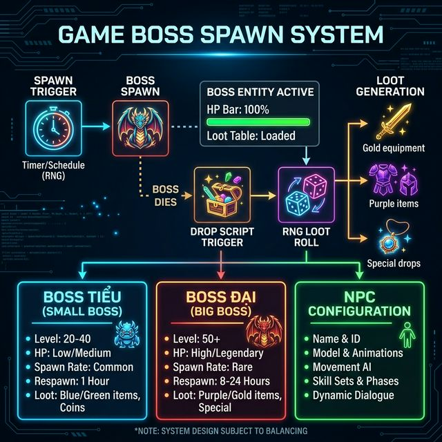

<!-- tags: game-dev, jx-online, boss-system, modding -->
# ⚔️ Phong Lăng Độ & Boss System — Thông Tin Tổng Hợp

> Hướng dẫn chi tiết về hoạt động Phong Lăng Độ (đi thuyền, diệt thủy tặc), cấu hình Boss spawn/drop, và kỹ thuật trích xuất thông tin NPC

📅 Ngày tạo: 2026-03-22 · 🔄 Cập nhật: 2026-03-22 · ⏱️ 18 phút đọc

| Aspect        | Detail                                  |
| ------------- | --------------------------------------- |
| **Chủ đề**    | Hoạt động Phong Lăng Độ & Hệ thống Boss |
| **Phiên bản** | JX 6.0 – 8.0                            |
| **Ngôn ngữ**  | Lua, INI config, Shell                  |
| **Cấp độ**    | Trung cấp → Cao cấp (20-50)             |
| **Nguồn**     | Jason Nguyen, Cộng đồng Hội quán Võ Lâm |

---


---

## 1. DEFINE

### Phong Lăng Độ (风陵渡) là gì?

**Phong Lăng Độ** là một hoạt động PvE đặc trưng trong Võ Lâm Truyền Kỳ, diễn ra trên bến đò Phong Lăng. Người chơi tham gia:

- **Đi thuyền** qua sông — bảo vệ thuyền khỏi thủy tặc
- **Diệt Boss thủy tặc** — Boss Tiểu và Boss Đại Hoàng Kim
- **Nhận thưởng** — trang bị, vật phẩm, kinh nghiệm

Đây là hoạt động có **lịch trình cố định** (spawn theo giờ hệ thống), yêu cầu người chơi phối hợp để tiêu diệt boss mạnh.

### Hệ thống Boss

JX chia boss thành 2 loại chính:

| Loại           | Tên gọi             | Boss ID          | Đặc điểm                                             |
| -------------- | ------------------- | ---------------- | ---------------------------------------------------- |
| **Small Gold** | Boss Tiểu Hoàng Kim | `bossdeath_tieu` | HP trung bình, spawn thường xuyên, drop đồ xanh/tím  |
| **Big Boss**   | Boss Đại Hoàng Kim  | `bigboss`        | HP cực cao, spawn hiếm, drop Hoàng Kim + đồ đặc biệt |

### Các file cấu hình quan trọng

| File path                                        | Vai trò                                            |
| ------------------------------------------------ | -------------------------------------------------- |
| `script/missions/fengling_ferry/bossdeath.lua`   | Script thưởng khi giết boss thủy tặc Phong Lăng Độ |
| `script/missions/boss/bossdeath_tieu.lua`        | Cấu hình rớt đồ Boss Tiểu Hoàng Kim                |
| `script/missions/boss/bigboss.lua`               | Cấu hình Boss Đại Hoàng Kim                        |
| `script/missions/boss/bossdeath.lua`             | Script xử lý chung khi boss chết                   |
| `gateway/s3relay/relaysetting/task/tasklist.ini` | Lịch trình gọi boss theo giờ                       |

### Actors & Roles

| Component           | Vai trò                              | Ghi chú                           |
| ------------------- | ------------------------------------ | --------------------------------- |
| **tasklist.ini**    | Scheduler — lên lịch spawn boss      | Cấu hình giờ, tần suất, map spawn |
| **bossdeath\*.lua** | Drop handler — xử lý phần thưởng     | Chạy khi boss HP = 0              |
| **bigboss.lua**     | Boss config — stats, skills, AI      | Định nghĩa boss Đại HK            |
| **fengling_ferry/** | Event scripts — logic Phong Lăng Độ  | Chuỗi nhiệm vụ hoàn chỉnh         |
| **NPC Info Script** | Debug tool — truy xuất thông tin NPC | Lấy ID, name, script, drop file   |

### Failure Modes

| Lỗi                                     | Hậu quả                          | Giải pháp                                                     |
| --------------------------------------- | -------------------------------- | ------------------------------------------------------------- |
| Sai đường dẫn script trong tasklist.ini | Boss không spawn                 | Kiểm tra path tuyệt đối, test bằng lệnh admin                 |
| Drop rate quá cao                       | Server economy bị phá            | Cân bằng rate theo công thức: `rate = base * (1/playerCount)` |
| Boss spawn nhưng không drop             | Script `bossdeath` bị lỗi syntax | Check log server, chạy `luac -p` trước khi deploy             |
| NPC info script crash                   | Server restart                   | Validate file path trước khi `openfile()`                     |

---

## 2. VISUAL

### Kiến trúc hệ thống Boss



### Luồng xử lý Boss Spawn → Death → Drop

```text
┌──────────────────────────────────────────────────────────────────────┐
│                    BOSS LIFECYCLE FLOW                                │
│                                                                      │
│  ┌─────────────┐     ┌──────────────┐     ┌────────────────┐       │
│  │ tasklist.ini │────▶│ BOSS SPAWN   │────▶│ BOSS ALIVE     │       │
│  │ (Scheduler)  │     │ on Map       │     │ HP = Max       │       │
│  │              │     │ bigboss.lua  │     │ AI Active      │       │
│  │ Cron:        │     └──────────────┘     └───────┬────────┘       │
│  │ 12:00, 20:00 │                                  │                 │
│  └─────────────┘                                   │ Players Attack  │
│                                                    ▼                 │
│                              ┌──────────────────────────────┐       │
│                              │        BOSS DEATH             │       │
│                              │        HP = 0                 │       │
│                              └──────────────┬───────────────┘       │
│                                             │                        │
│                    ┌────────────────────────┼──────────────────┐     │
│                    ▼                        ▼                  ▼     │
│  ┌─────────────────────┐  ┌──────────────────┐  ┌───────────────┐  │
│  │ bossdeath_tieu.lua  │  │ bossdeath.lua    │  │ fengling_     │  │
│  │ (Boss Tiểu HK)     │  │ (Boss chung)     │  │ ferry/        │  │
│  │                     │  │                  │  │ bossdeath.lua │  │
│  │ Drop: Đồ xanh/tím  │  │ Drop: Đồ HK     │  │               │  │
│  │ Rate: 5-15%         │  │ Rate: 1-5%       │  │ Drop: Đặc biệt│  │
│  └─────────────────────┘  └──────────────────┘  └───────────────┘  │
│                                                                      │
│  ┌──────────────────────────────────────────────────────────────┐   │
│  │                    DROP CALCULATION                           │   │
│  │                                                              │   │
│  │  for each item in drop_table:                                │   │
│  │    roll = random(1, 10000)                                   │   │
│  │    if roll <= item.rate then                                 │   │
│  │      give_item(killer, item.id, random(min, max))            │   │
│  │      broadcast("Player nhận được " .. item.name)             │   │
│  │    end                                                       │   │
│  └──────────────────────────────────────────────────────────────┘   │
└──────────────────────────────────────────────────────────────────────┘
```

### Cấu trúc thư mục Server

```text
/home/jxser/
├── server1/
│   └── script/
│       └── missions/
│           ├── fengling_ferry/          ← 🚢 Phong Lăng Độ
│           │   └── bossdeath.lua        ← Script thưởng thủy tặc
│           └── boss/                    ← ⚔️ Hệ thống Boss
│               ├── bigboss.lua          ← Boss Đại Hoàng Kim
│               ├── bossdeath.lua        ← Script drop chung
│               └── bossdeath_tieu.lua   ← Boss Tiểu Hoàng Kim
└── gateway/
    └── s3relay/
        └── relaysetting/
            └── task/
                └── tasklist.ini          ← ⏰ Lịch spawn boss
```

---

## 3. CODE

### Example 1: Basic — Cấu hình lịch spawn Boss trong tasklist.ini

Bước đầu tiên: hiểu cách hệ thống lên lịch spawn boss. File `tasklist.ini` là "đồng hồ" của server, quyết định khi nào boss xuất hiện.

```ini
; ============================================================
; tasklist.ini — Lịch trình gọi Boss
; Đường dẫn: gateway/s3relay/relaysetting/task/tasklist.ini
; ============================================================

; ── Boss Tiểu Hoàng Kim ──
; Spawn mỗi 2 giờ, bắt đầu từ 10:00
[BossTieu_01]
TaskType=BossSpawn
BossScript=script/missions/boss/bossdeath_tieu.lua
MapID=1                          ; ✅ Map Biện Kinh
PosX=250
PosY=300
SpawnHour=10,12,14,16,18,20,22   ; ⏰ Các giờ spawn
SpawnMinute=0
Duration=3600                    ; Boss tồn tại 1 giờ (3600 giây)
Announce=1                       ; Thông báo toàn server

; ── Boss Đại Hoàng Kim ──
; Spawn 2 lần/ngày, 12:00 và 20:00
[BossDai_01]
TaskType=BigBossSpawn
BossScript=script/missions/boss/bigboss.lua
DeathScript=script/missions/boss/bossdeath.lua
MapID=5                          ; ✅ Map Tương Dương
PosX=150
PosY=200
SpawnHour=12,20                  ; ⏰ Trưa và tối
SpawnMinute=0
Duration=7200                    ; Boss tồn tại 2 giờ
Announce=1
BroadcastMsg=Boss Đại Hoàng Kim đã xuất hiện tại Tương Dương!

; ── Phong Lăng Độ ──
; ⚠️ Event đặc biệt, spawn theo ngày trong tuần
[PhongLangDo]
TaskType=EventBoss
BossScript=script/missions/fengling_ferry/bossdeath.lua
MapID=22                         ; Map Phong Lăng Độ
PosX=100
PosY=100
SpawnDay=1,3,5                   ; Thứ 2, 4, 6
SpawnHour=19                     ; 7 giờ tối
SpawnMinute=30
Duration=5400                    ; 1.5 giờ
Announce=1
BroadcastMsg=Thủy tặc đã xuất hiện tại Phong Lăng Độ! Hãy bảo vệ thuyền!
```

**Kết luận**: `tasklist.ini` là bộ não điều phối toàn bộ boss spawn. Mỗi entry cần chỉ rõ: script xử lý, vị trí spawn (map + tọa độ), lịch trình (giờ/phút/ngày), và thời gian tồn tại. Sai một tham số = boss không spawn hoặc spawn sai chỗ.

---

### Example 2: Intermediate — Script rớt đồ Boss Tiểu & Đại Hoàng Kim

Khi boss chết, server gọi script `bossdeath` tương ứng. Đây là nơi cấu hình item nào drop, tỷ lệ bao nhiêu, số lượng tối thiểu/tối đa.

```lua
-- ============================================================
-- bossdeath_tieu.lua — Script rớt đồ Boss Tiểu Hoàng Kim
-- Đường dẫn: script/missions/boss/bossdeath_tieu.lua
-- Cấp độ: Trung cấp (20-30)
-- ============================================================

-- ① Bảng cấu hình drop items
-- ⚠️ Rate tính theo phần vạn (1/10000)
-- Format: { ItemID, Rate, MinCount, MaxCount, ItemName }
local TIEU_HK_DROP_TABLE = {
    -- ── Trang bị xanh (Green) — Drop rate cao ──
    { 20101, 3000, 1, 1, "Kiếm Thanh Long (Xanh)" },      -- 30%
    { 20201, 3000, 1, 1, "Giáp Huyền Thiết (Xanh)" },     -- 30%
    { 20301, 2500, 1, 1, "Mũ Linh Quang (Xanh)" },        -- 25%

    -- ── Trang bị tím (Purple) — Drop rate trung bình ──
    { 30101, 800,  1, 1, "Kiếm Tử Vân (Tím)" },           -- 8%
    { 30201, 800,  1, 1, "Giáp Bích Ngọc (Tím)" },        -- 8%
    { 30301, 500,  1, 1, "Nhẫn Phong Hỏa (Tím)" },       -- 5%

    -- ── Vật phẩm đặc biệt ──
    { 50010, 5000, 1, 5, "Bạc Khóa" },                     -- 50%
    { 50020, 2000, 1, 3, "Đá Cường Hóa" },                 -- 20%
    { 50030, 500,  1, 1, "Mảnh Bản Đồ Kho Báu" },         -- 5%
}

-- ② Hàm chính — gọi khi Boss Tiểu chết
function OnBossDeath(nBossIndex, nKillerIndex)
    -- ✅ Lấy thông tin killer
    local killerName = GetPlayerName(nKillerIndex)
    local killerLevel = GetPlayerLevel(nKillerIndex)

    -- Log event
    LogInfo(string.format(
        "[BOSS TIEU] Killed by: %s (Lv.%d)",
        killerName, killerLevel
    ))

    -- ③ Roll drop cho từng item trong bảng
    local droppedItems = {}
    for _, item in ipairs(TIEU_HK_DROP_TABLE) do
        local itemID    = item[1]
        local rate      = item[2]
        local minCount  = item[3]
        local maxCount  = item[4]
        local itemName  = item[5]

        local roll = math.random(1, 10000)
        if roll <= rate then
            local count = math.random(minCount, maxCount)

            -- ✅ Cho item vào hành trang killer
            GivePlayerItem(nKillerIndex, itemID, count)
            table.insert(droppedItems, itemName .. " x" .. count)

            LogInfo(string.format(
                "[DROP] %s nhận: %s x%d (roll=%d/%d)",
                killerName, itemName, count, roll, rate
            ))
        end
    end

    -- ④ Thông báo toàn server
    if #droppedItems > 0 then
        local dropStr = table.concat(droppedItems, ", ")
        -- ✅ Broadcast tin nhắn hệ thống
        BroadcastMsg(string.format(
            "<color=yellow>%s đã tiêu diệt Boss Tiểu HK và nhận: %s<color>",
            killerName, dropStr
        ))
    end

    -- ⑤ Respawn boss sau khoảng thời gian
    -- ⚠️ Thời gian respawn tính bằng giây
    local respawnTime = 7200  -- 2 giờ
    ScheduleBossRespawn("BossTieu", respawnTime)
end
```

```lua
-- ============================================================
-- bigboss.lua — Config & Drop Boss Đại Hoàng Kim
-- Đường dẫn: script/missions/boss/bigboss.lua
-- Cấp độ: Cao cấp (30-50)
-- ============================================================

-- ① Cấu hình Boss Đại — Stats mạnh hơn nhiều so với Tiểu
local BIG_BOSS_CONFIG = {
    name        = "Thiên Ma Đại Hoàng Kim",
    level       = 90,
    hp          = 5000000,           -- 5 triệu HP
    attack      = 8000,
    defense     = 5000,
    critRate    = 15,                -- 15% critical
    skills      = {                  -- Danh sách skills boss sử dụng
        { id = 9001, name = "Thiên Ma Chưởng", cooldown = 10 },
        { id = 9002, name = "Hắc Ám Phong Bạo", cooldown = 30 },
        { id = 9003, name = "Triệu Hồi Tiểu Quái", cooldown = 60 },
    },
    immunities  = { "stun", "freeze" },  -- ⚠️ Miễn nhiễm control
}

-- ② Drop table Boss Đại — Đồ Hoàng Kim + đặc biệt
local DAI_HK_DROP_TABLE = {
    -- ── Hoàng Kim (Gold equipment) — Ultra rare ──
    { 40101, 300,  1, 1, "Kiếm Hoàng Kim Thiếu Lâm" },    -- 3%
    { 40102, 300,  1, 1, "Đao Hoàng Kim Cái Bang" },       -- 3%
    { 40103, 300,  1, 1, "Thương Hoàng Kim Đường Môn" },   -- 3%
    { 40104, 300,  1, 1, "Phiến Hoàng Kim Nga Mi" },       -- 3%

    -- ── Trang bị tím (Purple) — Drop rate cao hơn Tiểu ──
    { 30101, 2000, 1, 1, "Kiếm Tử Vân (Tím)" },           -- 20%
    { 30201, 2000, 1, 1, "Giáp Bích Ngọc (Tím)" },        -- 20%
    { 30301, 1500, 1, 1, "Nhẫn Phong Hỏa (Tím)" },       -- 15%

    -- ── Vật phẩm hiếm ──
    { 60001, 1000, 1, 1, "Ấn Hoàng Kim" },                 -- 10%
    { 60002, 500,  1, 1, "Phi Phong Bá Vương" },           -- 5%
    { 60003, 100,  1, 1, "Ngọc Tủy (Cực Hiếm)" },         -- 1%

    -- ── Vật phẩm chung ──
    { 50010, 8000, 5, 20, "Bạc Khóa" },                    -- 80%
    { 50020, 5000, 3, 10, "Đá Cường Hóa" },                -- 50%
}

-- ③ Xử lý khi Boss Đại chết
function OnBigBossDeath(nBossIndex, nKillerIndex)
    local killerName = GetPlayerName(nKillerIndex)

    -- ✅ Thông báo toàn server — Boss Đại là sự kiện lớn!
    BroadcastMsg(string.format(
        "<color=red>⚔️ %s đã hạ gục %s! Cả giang hồ chấn động!<color>",
        killerName, BIG_BOSS_CONFIG.name
    ))

    -- ④ Roll drop — tương tự Tiểu nhưng items xịn hơn
    for _, item in ipairs(DAI_HK_DROP_TABLE) do
        local roll = math.random(1, 10000)
        if roll <= item[2] then
            local count = math.random(item[3], item[4])
            GivePlayerItem(nKillerIndex, item[1], count)

            -- ⚠️ Hoàng Kim items → thông báo riêng, toàn server thấy
            if item[2] <= 500 then  -- Items cực hiếm (rate <= 5%)
                BroadcastMsg(string.format(
                    "<color=gold>🎊 %s nhận được [%s] từ %s!<color>",
                    killerName, item[5], BIG_BOSS_CONFIG.name
                ))
            end
        end
    end

    -- ⑤ Ghi log chi tiết cho admin theo dõi
    LogBossEvent(BIG_BOSS_CONFIG.name, killerName, "KILLED")
end
```

**Kết luận**: Boss Tiểu và Boss Đại có cấu trúc script tương tự nhưng khác biệt ở: drop table (Đại có Hoàng Kim), stats (Đại mạnh gấp nhiều lần), và cách thông báo (Đại broadcast toàn server cho items hiếm). Khi customize, cần cân bằng rate để giữ economy server không bị phá.

---

### Example 3: Advanced — Script truy xuất thông tin NPC (Debug Tool)

Đây là công cụ cực kỳ hữu ích cho admin: nói chuyện với bất kỳ NPC nào, script sẽ xuất toàn bộ thông tin kỹ thuật (ID, script path, drop file, ngũ hành, HP...) ra file log. Áp dụng cho bản 6.0.

```lua
-- ============================================================
-- NPC Info Extractor — Công cụ debug siêu hữu ích
-- Áp dụng: Bản 6.0 (có thể chỉnh cho 8.0)
-- Chức năng: Xuất thông tin NPC vừa đối thoại ra file
-- ============================================================

-- ① Hàm chính — Gọi sau khi đối thoại với NPC
-- ✅ Lấy thông tin NPC cuối cùng mà player vừa nói chuyện
function LastNpcTalk()
    -- Lấy NPC index từ hội thoại gần nhất
    local nNpcIndex = GetLastDiagNpc()

    -- ② Thu thập tất cả thông tin kỹ thuật của NPC
    local Name     = GetNpcName(nNpcIndex)           -- Tên hiển thị
    local IdNpc    = GetNpcSettingIdx(nNpcIndex)      -- ID trong settings
    local nScript  = GetNpcScript(nNpcIndex)          -- Script đang chạy
    local DropFile = GetNpcDropRateFile(nNpcIndex)    -- File drop rate
    local NguHanh  = GetNpcSeries(nNpcIndex)          -- Ngũ hành (Kim/Mộc/...)
    local Life     = GetNpcLife(nNpcIndex)             -- HP hiện tại
    local NpcKind  = GetNpcKind(nNpcIndex)             -- Loại NPC

    -- ③ Ghi ra file log
    -- ⚠️ Mode "a+" = append, không ghi đè dữ liệu cũ
    local file = openfile("npcinfo.lua", "a+")
    write(file,
        strchar(34)  -- Dấu ngoặc kép mở
        .. "Name: "     .. Name
        .. " ID: "      .. IdNpc
        .. " Script: "  .. nScript
        .. " DropFile: " .. DropFile
        .. " Life: "    .. Life
        .. " NguHanh: " .. NguHanh
        .. " Kind: "    .. NpcKind
        .. strchar(34), -- Dấu ngoặc kép đóng
        '\n'
    )
    closefile(file)

    -- ④ Thông báo cho player
    Msg2Player(
        "<color=yellow>"
        .. "Thông tin đã được lưu tại file server1-npcinfo.lua"
        .. "<color>"
    )
end
```

```lua
-- ============================================================
-- NPC Info Extractor — Phiên bản nâng cao (Enhanced)
-- Bổ sung: Format đẹp hơn, thêm timestamp, phân loại NPC
-- ============================================================

-- ① Bảng mapping NPC Kind → tên dễ hiểu
local NPC_KIND_NAMES = {
    [0] = "NPC thường (đối thoại)",
    [1] = "Monster thường",
    [2] = "Boss Tiểu",
    [3] = "Boss Đại",
    [4] = "NPC nhiệm vụ",
    [5] = "NPC cửa hàng",
    [6] = "NPC kho đồ",
}

-- ② Bảng mapping Ngũ Hành
local NGU_HANH_NAMES = {
    [0] = "Kim (Metal)",
    [1] = "Mộc (Wood)",
    [2] = "Thủy (Water)",
    [3] = "Hỏa (Fire)",
    [4] = "Thổ (Earth)",
}

-- ③ Hàm nâng cao — Xuất thông tin chi tiết + format đẹp
function DetailedNpcInfo()
    local nNpcIndex = GetLastDiagNpc()

    -- Thu thập thông tin
    local info = {
        name     = GetNpcName(nNpcIndex),
        id       = GetNpcSettingIdx(nNpcIndex),
        script   = GetNpcScript(nNpcIndex),
        dropFile = GetNpcDropRateFile(nNpcIndex),
        nguHanh  = GetNpcSeries(nNpcIndex),
        life     = GetNpcLife(nNpcIndex),
        kind     = GetNpcKind(nNpcIndex),
        mapID    = GetNpcMapID(nNpcIndex),
        posX     = GetNpcPosX(nNpcIndex),
        posY     = GetNpcPosY(nNpcIndex),
    }

    -- ④ Format output đẹp
    local timestamp = os.date("%Y-%m-%d %H:%M:%S")
    local kindName = NPC_KIND_NAMES[info.kind] or "Unknown"
    local nguHanhName = NGU_HANH_NAMES[info.nguHanh] or "Unknown"

    local output = string.format([[
-- ========================================
-- NPC Info — %s
-- Thời gian: %s
-- ========================================
NPC = {
    Name     = "%s",
    ID       = %s,
    Kind     = %d,  -- %s
    Life     = %s,
    NguHanh  = %d,  -- %s
    MapID    = %s,
    PosX     = %s,
    PosY     = %s,
    Script   = "%s",
    DropFile = "%s",
}
]],
        info.name, timestamp,
        info.name, info.id,
        info.kind, kindName,
        info.life,
        info.nguHanh, nguHanhName,
        info.mapID, info.posX, info.posY,
        info.script, info.dropFile
    )

    -- ⑤ Ghi vào file
    local file = openfile("npcinfo_detailed.lua", "a+")
    write(file, output)
    closefile(file)

    -- ⑥ Hiển thị tóm tắt cho player
    Msg2Player(string.format(
        "<color=green>✅ [%s] ID=%s Kind=%s HP=%s NguHanh=%s<color>",
        info.name, info.id, kindName, info.life, nguHanhName
    ))
    Msg2Player(string.format(
        "<color=cyan>📁 Script: %s<color>",
        info.script
    ))
    Msg2Player(string.format(
        "<color=cyan>📁 Drop: %s<color>",
        info.dropFile
    ))
    Msg2Player(
        "<color=yellow>💾 Chi tiết đã lưu tại npcinfo_detailed.lua<color>"
    )
end
```

**Kết luận**: Script truy xuất NPC info là **công cụ debug số 1** cho mọi admin JX. Phiên bản gốc (bản 6.0) đơn giản nhưng hiệu quả — chỉ cần nói chuyện với NPC là có tất cả thông tin kỹ thuật. Phiên bản nâng cao thêm format đẹp, timestamp, và mapping tên cho các giá trị số, giúp dễ đọc hơn khi debug.

---

### Example 4: Expert — Shell script quản lý Boss spawn từ xa

Script để admin quản lý boss spawn, kiểm tra logs, và cân bằng drop rate từ terminal mà không cần vào game.

```bash
#!/bin/bash
# ============================================================
# JX Boss Manager — Admin CLI Tool
# Quản lý boss spawn, kiểm tra drop logs, restart scripts
# ============================================================

JX_BASE="/home/jxser"
SERVER_DIR="${JX_BASE}/server1"
SCRIPT_DIR="${SERVER_DIR}/script/missions"
LOG_DIR="${SERVER_DIR}/logs"
TASK_CONFIG="${JX_BASE}/gateway/s3relay/relaysetting/task/tasklist.ini"

# ── 1. Kiểm tra trạng thái boss ──
check_boss_status() {
    echo "===== BOSS STATUS ====="
    echo ""

    # ✅ Kiểm tra boss scripts tồn tại
    local scripts=(
        "${SCRIPT_DIR}/boss/bossdeath_tieu.lua"
        "${SCRIPT_DIR}/boss/bigboss.lua"
        "${SCRIPT_DIR}/boss/bossdeath.lua"
        "${SCRIPT_DIR}/fengling_ferry/bossdeath.lua"
    )

    for script in "${scripts[@]}"; do
        if [ -f "$script" ]; then
            local size=$(stat -c%s "$script" 2>/dev/null)
            local modified=$(stat -c%y "$script" 2>/dev/null | cut -d'.' -f1)
            echo "✅ $(basename $script) — ${size}B — Modified: ${modified}"
        else
            echo "❌ $(basename $script) — MISSING!"
        fi
    done

    echo ""
    echo "===== TASK CONFIG ====="

    # ✅ Hiển thị lịch spawn từ tasklist.ini
    if [ -f "$TASK_CONFIG" ]; then
        grep -E "^(SpawnHour|SpawnDay|BossScript)" "$TASK_CONFIG" | \
            while read line; do
                echo "  📅 $line"
            done
    fi
}

# ── 2. Xem drop log gần đây ──
view_drop_logs() {
    local lines=${1:-20}
    echo "===== RECENT DROPS (last $lines entries) ====="

    # ✅ Tìm và hiển thị drop events từ log
    grep -i "\[DROP\]\|nhận được\|BOSS.*KILLED" \
        "${LOG_DIR}/server.log" 2>/dev/null | \
        tail -n "$lines" | \
        while read line; do
            # Highlight Hoàng Kim drops
            if echo "$line" | grep -qi "hoàng kim\|gold"; then
                echo "🏆 $line"
            else
                echo "   $line"
            fi
        done
}

# ── 3. Validate Lua scripts ──
validate_scripts() {
    echo "===== VALIDATING LUA SCRIPTS ====="
    local errors=0

    # ✅ Check syntax tất cả Lua scripts trong boss/
    find "${SCRIPT_DIR}/boss" -name "*.lua" | while read script; do
        if luac -p "$script" 2>/dev/null; then
            echo "✅ $(basename $script) — OK"
        else
            echo "❌ $(basename $script) — SYNTAX ERROR!"
            luac -p "$script" 2>&1 | head -5
            errors=$((errors + 1))
        fi
    done

    # Check fengling_ferry scripts
    find "${SCRIPT_DIR}/fengling_ferry" -name "*.lua" | while read script; do
        if luac -p "$script" 2>/dev/null; then
            echo "✅ $(basename $script) — OK"
        else
            echo "❌ $(basename $script) — SYNTAX ERROR!"
            errors=$((errors + 1))
        fi
    done

    if [ $errors -eq 0 ]; then
        echo ""
        echo "🎉 Tất cả scripts hợp lệ!"
    fi
}

# ── 4. Backup boss scripts ──
backup_scripts() {
    local backup_dir="${JX_BASE}/backup/boss_$(date +%Y%m%d_%H%M%S)"
    mkdir -p "$backup_dir"

    cp -r "${SCRIPT_DIR}/boss/"* "$backup_dir/"
    cp -r "${SCRIPT_DIR}/fengling_ferry/"* "$backup_dir/"
    cp "$TASK_CONFIG" "$backup_dir/"

    echo "✅ Backup saved to: $backup_dir"
    ls -la "$backup_dir"
}

# ── Main Menu ──
case "$1" in
    status)    check_boss_status ;;
    drops)     view_drop_logs "$2" ;;
    validate)  validate_scripts ;;
    backup)    backup_scripts ;;
    *)
        echo "🎮 JX Boss Manager"
        echo ""
        echo "Usage: $0 {command}"
        echo ""
        echo "Commands:"
        echo "  status              Kiểm tra trạng thái boss scripts"
        echo "  drops [N]           Xem N drop logs gần nhất (default: 20)"
        echo "  validate            Kiểm tra syntax Lua scripts"
        echo "  backup              Backup toàn bộ boss scripts"
        ;;
esac
```

**Kết luận**: Quản lý boss system không chỉ là viết scripts — còn cần công cụ admin để giám sát, validate, và backup. Script này cho phép admin kiểm tra nhanh mà không cần login vào game, đặc biệt hữu ích khi server có nhiều người chơi.

---

## 4. PITFALLS

| #   | Lỗi                                    | Hậu quả                                    | Fix                                                    |
| --- | -------------------------------------- | ------------------------------------------ | ------------------------------------------------------ |
| 1   | Drop rate quá cao cho Hoàng Kim        | Economy phá sản, đồ mất giá trị            | Giữ rate HK ≤ 3% (300/10000), test với ít người trước  |
| 2   | Boss spawn cùng lúc nhiều con          | Server lag, crash                          | Stagger spawn time, mỗi boss cách nhau ≥ 30 phút       |
| 3   | Không validate Lua syntax trước deploy | Server crash ngay khi load script          | Luôn chạy `luac -p file.lua` trước khi copy vào server |
| 4   | `openfile()` không check nil           | Crash nếu không tạo được file (permission) | Wrap trong pcall() hoặc check quyền ghi trước          |
| 5   | Sai path trong `tasklist.ini`          | Boss không spawn, không có lỗi rõ ràng     | Dùng đường dẫn tuyệt đối, check bằng `ls -la`          |
| 6   | Quên gọi `closefile()`                 | File bị lock, data không flush             | Luôn đặt `closefile()` trong finally block             |
| 7   | NPC info script chạy trên bản 8.0      | Một số API khác với 6.0                    | Check docs API từng bản, test từng hàm riêng           |

### Anti-pattern: Drop rate "vô tội vạ"

```lua
-- ❌ SAI — Drop rate 100% cho Hoàng Kim
local DROP_TABLE = {
    { 40101, 10000, 1, 3, "Kiếm HK" },  -- 100%! Ai kill cũng nhận
    { 40102, 10000, 1, 3, "Đao HK" },   -- 100%! Server economy sụp
}
-- ⚠️ Trong 1 tuần mọi người full Hoàng Kim → game mất ý nghĩa

-- ✅ ĐÚNG — Rate cân bằng, tạo cảm giác hiếm có
local DROP_TABLE = {
    { 40101, 300, 1, 1, "Kiếm HK" },    -- 3% — Hiếm, có giá trị
    { 40102, 300, 1, 1, "Đao HK" },     -- 3% — Phải farm nhiều lần
}
-- ✅ Player cần ~33 lần kill boss để có 1 món HK → hứng thú lâu dài
```

---

## 5. REF

| Resource                   | Link                                                                | Tác giả      |
| -------------------------- | ------------------------------------------------------------------- | ------------ |
| Phong Lăng Độ chi tiết     | [Facebook](https://www.facebook.com/share/p/1aH6FkSR86/)            | Jason Nguyen |
| Hội quán Võ Lâm Offline    | [Facebook Group](https://www.facebook.com/groups/volamquan)         | Cộng đồng    |
| JX-Dev Issues              | [GitHub](https://github.com/rinodung/jx-dev/issues)                 | rinodung     |
| Boss system & events       | [YouTube](https://youtu.be/e_SOGOSdok0)                             | Magic Tips   |
| Kì Trân Các, Gọi Boss      | [YouTube](https://youtu.be/e_SOGOSdok0)                             | Magic Tips   |
| Viết Lua script VLTK       | [YouTube](https://youtu.be/4_zQw2E20Lg)                             | BabyDuck     |
| CLB GameSVN — Newbie guide | [Forum](https://www.clbgamesvn.com/diendan/showthread.php?t=313068) | Cộng đồng    |

---

## 6. RECOMMEND

| Mở rộng                    | Khi nào                   | Lý do                                                            |
| -------------------------- | ------------------------- | ---------------------------------------------------------------- |
| **Auto-balance drop rate** | Khi server > 20 players   | Tự động giảm rate khi nhiều người, tăng khi ít — giữ economy ổn  |
| **Boss ranking system**    | Khi muốn tạo cạnh tranh   | Bảng xếp hạng damage dealer, thưởng thêm cho top players         |
| **Timed boss events**      | Khi muốn sự kiện đặc biệt | Boss spawn đặc biệt cuối tuần, x2 drop rate, limited time        |
| **Drop log dashboard**     | Khi cần giám sát economy  | Web dashboard hiển thị thống kê drop, player wealth distribution |
| **NPC info web viewer**    | Khi debug thường xuyên    | Parse file `npcinfo.lua` ra web page, filter/search dễ dàng      |
| **Multi-boss raids**       | Khi player đã mạnh        | Spawn nhiều boss cùng lúc, cần party phối hợp, cơ chế aggro      |

---

[← Bài trước: Từ Tân Thủ Đến Cao Thủ](./01-jx-linux-guide.md) · [→ Chỉnh Sửa Trang Bị & Drop Rate](./03-chinh-sua-trang-bi-drop-rate.md)
