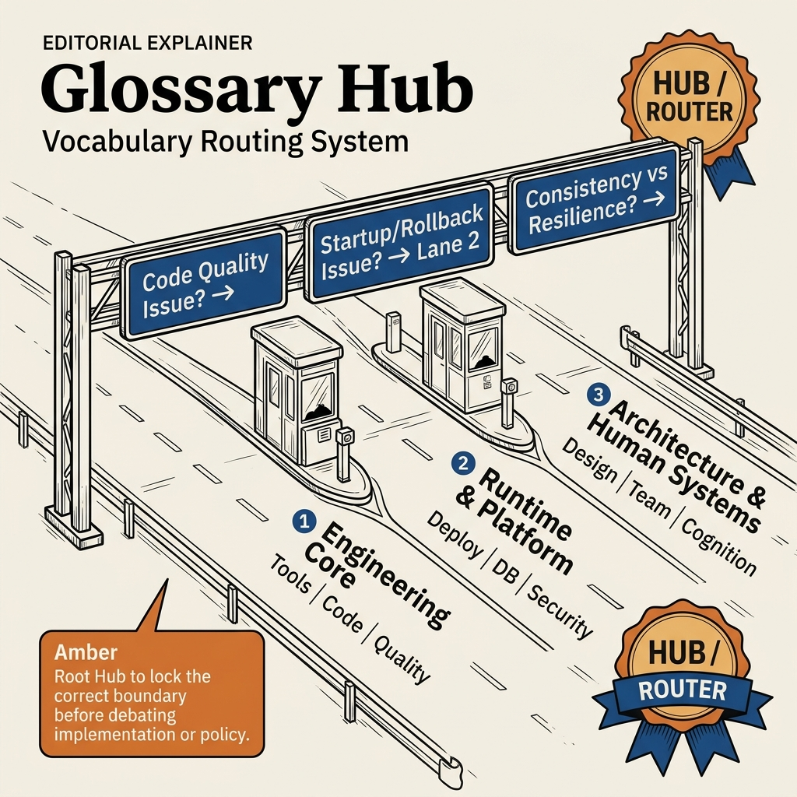

<!-- tags: glossary, reference, overview -->
# Glossaries

> Glossary hub dùng để định tuyến vocabulary cho toàn bộ repo, từ quality engineering, runtime, architecture đến human factors trong team kỹ thuật.

| Aspect | Detail |
| --- | --- |
| **Concept** | Glossary hub dùng để định tuyến vocabulary cho toàn bộ repo, từ quality engineering, runtime, architecture đến human factors trong team kỹ thuật. |
| **Audience** | Backend engineer, reviewer, tech lead, người đang cần khóa đúng vocabulary trước khi tranh luận sâu hơn |
| **Primary style** | Glossary hub router |
| **Entry point** | Mở ở đây khi bạn mới chỉ biết symptom hoặc câu hỏi, chưa chắc topic nào mới là nơi cần đào sâu |

📅 Ngày tạo: 2026-03-23 · 🔄 Cập nhật: 2026-04-11 · ⏱️ 10 phút đọc

---

## 1. DEFINE

Bạn đang ở giữa design review, incident note và onboarding guide. Cùng một hiện tượng nhưng mỗi người lại gọi bằng một từ khác nhau: người nói technical debt, người nói code smell, người lại bảo đây là vấn đề system design. Nếu route sai vocabulary ngay từ đầu, mọi quyết định tiếp theo sẽ trôi sang sai lớp vấn đề. Root glossary hub tồn tại để chặn điều đó.

**Glossaries** là glossary hub dùng để định tuyến vocabulary cho toàn bộ repo, từ quality engineering, runtime, architecture đến human factors trong team kỹ thuật.

| Variant | Mô tả |
| --- | --- |
| Engineering core | Những term khóa boundary chất lượng code, design hygiene và vận hành cơ bản. |
| Runtime & platform | Những term giúp phân loại deploy, observability, caching, database và security. |
| Architecture & human systems | Những term về distributed systems, kiến trúc và cách con người suy nghĩ, hợp tác và học hệ thống. |

| Approach | Time | Space | Khi chọn |
| --- | --- | --- | --- |
| Route theo symptom | O(1) route | O(1) | Khi mới chỉ biết hiện tượng và cần tìm đúng topic trước khi đọc term lẻ |
| Học theo cụm | O(1) route | O(1) | Khi muốn xây mental model theo nhóm concept thay vì tra từ điển từng mục |
| Dùng làm governance vocabulary | O(1) route | O(1) | Khi muốn review, ADR và incident postmortem dùng cùng một language |

Core insight:

> Root hub chỉ có giá trị khi nó giúp đội team chốt đúng lớp vocabulary trước khi tranh luận implementation, ownership hay policy.

### 1.1 Signals & Boundaries

- Nếu câu hỏi đang xoay quanh code quality, architecture hygiene và operability cơ bản, route sang engineering core trước.
- Nếu symptom liên quan đến deploy, cache, database, security hay telemetry, route sang nhóm runtime/platform.
- Nếu team đang tranh luận về distributed trade-off hoặc human factor, route sang architecture hoặc developer cognition.

### Coverage Map

| Entry | Vai trò | Ghi chú |
| --- | --- | --- |
| [API Design](api-design/README.md) | Subtopic hub | 8 docs trong nhánh này |
| [Architecture & Design](architecture-design/README.md) | Subtopic hub | 6 docs trong nhánh này |
| [Concurrency & Async](concurrency-async/README.md) | Subtopic hub | 8 docs trong nhánh này |
| [Data & Database](data-database/README.md) | Subtopic hub | 10 docs trong nhánh này |
| [Deployment & Runtime](deployment-runtime/README.md) | Subtopic hub | 11 docs trong nhánh này |
| [Developer Cognition & Team Dynamics](developer-cognition-team-dynamics/README.md) | Subtopic hub | 52 docs trong nhánh này |
| [Observability & Operations](observability-operations/README.md) | Subtopic hub | 14 docs trong nhánh này |
| [Performance & Caching](performance-caching/README.md) | Subtopic hub | 9 docs trong nhánh này |
| [Process & Delivery](process-delivery/README.md) | Subtopic hub | 6 docs trong nhánh này |
| [Requirements & Product](requirements-product/README.md) | Subtopic hub | 9 docs trong nhánh này |
| [Security & Access Control](security-access-control/README.md) | Subtopic hub | 8 docs trong nhánh này |
| [Software Engineering Fundamentals](software-engineering-fundamentals/README.md) | Subtopic hub | 16 docs trong nhánh này |
| [System Design & Architecture](system-design-architecture/README.md) | Subtopic hub | 17 docs trong nhánh này |
| [Testing & Quality](testing-quality/README.md) | Subtopic hub | 21 docs trong nhánh này |
| [Agentic AI & LLM Engineering](agentic-ai-llm-engineering/README.md) | Subtopic hub | 128 docs trong nhánh này |

---

## 2. VISUAL




*Hình: Router map chia glossary root thành ba mặt trận chính: engineering core, runtime/platform, và architecture/human systems. Mục tiêu là route đúng lane trước khi người đọc đi sâu vào từng term.*

Hub này chỉ có giá trị khi nó route đúng lớp vocabulary. Visual mới kéo taxonomy và learning path về cùng một mặt phẳng, để người đọc biết mình đang thiếu định nghĩa, thiếu cluster hay thiếu adjacent concept.

### Level 1

```text
Engineering core
Runtime & platform
Architecture & human systems
```

*Hình: Level 1 chia hub này thành các lane quyết định chính để người đọc không phải mò từ một danh sách thuật ngữ phẳng.*

### Level 2

```text
Nếu hiện tượng là...                          Mở file nào trước
-------------------------------------------   ------------------------------------------
Đang review code quality, refactor, operability cơ bản  Software Engineering Fundamentals
Cần gọi tên đúng concept trong API và integration       API Design
Deploy vừa gặp vấn đề startup, rollout hoặc rollback    Deployment & Runtime
Đang tranh luận consistency, resilience, event flow     System Design & Architecture
```

*Hình: Level 2 biến hub thành symptom router: bắt đầu từ câu hỏi thật, rồi mới rẽ sang term cụ thể.*

---

## 3. CODE

Diagram vừa tách glossary thành các mặt trận chính của repo. Từ đây, hãy route theo loại quyết định bạn đang mắc kẹt, không theo từ khóa nghe quen.

### Problem 1: Basic — Route đúng symptom vào đúng glossary entry

> **Mục tiêu**: Không để mọi câu hỏi về **Glossaries** bị ném vào cùng một rổ.
> **Approach**: Bắt đầu từ symptom hoặc câu hỏi của người đọc, rồi mở entry đầu tiên phù hợp nhất.
> **Ví dụ**: Đầu vào là một câu hỏi review/design; đầu ra là file nên mở đầu tiên như `./software-engineering-fundamentals/README.md`.
> **Độ phức tạp**: Basic

```yaml
router:
  - symptom: Đang review code quality, refactor, operability cơ bản
    open_first: ./software-engineering-fundamentals/README.md
  - symptom: Cần gọi tên đúng concept trong API và integration
    open_first: ./api-design/README.md
  - symptom: Deploy vừa gặp vấn đề startup, rollout hoặc rollback
    open_first: ./deployment-runtime/README.md
  - symptom: Đang tranh luận consistency, resilience, event flow
    open_first: ./system-design-architecture/README.md
```

**Tại sao?** Ở root hub, sai entry point là lỗi đắt nhất: mở nhầm cụm thì toàn bộ so sánh phía sau đều lệch lớp. Router này buộc người đọc khóa đúng mặt trận trước.

**Kết luận**: Giá trị đầu tiên của root hub là giảm chi phí định hướng, để người đọc vào đúng cluster trước khi đào sâu vào term.

### Problem 2: Intermediate — Dùng hub như learning path có chủ đích

> **Mục tiêu**: Đọc **Glossaries** theo cụm có logic thay vì nhảy file rời rạc.
> **Approach**: Đi theo lane từ nền tảng đến biến thể nặng hơn, rồi quay lại so sánh adjacent concepts khi cần.
> **Ví dụ**: Một reader muốn xây mental model bền hơn thay vì chỉ tra một định nghĩa đơn lẻ.
> **Độ phức tạp**: Intermediate

```yaml
learning_path:
  engineering_core:
    - Software Engineering Fundamentals
    - Testing & Quality
    - Process & Delivery
  runtime_platform:
    - Deployment & Runtime
    - Observability & Operations
    - Data & Database
    - Security & Access Control
  architecture_human_factors:
    - System Design & Architecture
    - Architecture & Design
    - Developer Cognition & Team Dynamics
```

**Tại sao?** Taxonomy chỉ thực sự hữu ích khi nó gợi được đường đi tiếp. Learning path ở root hub biến danh sách folder thành hành trình học có nhịp và có lý do.

**Kết luận**: Ở mức intermediate, root hub giúp người đọc đi tiếp theo đúng cluster trước khi taxonomy biến thành một mê cung toàn thuật ngữ quen tai.

### Problem 3: Advanced — Dùng hub như governance map cho shared vocabulary

> **Mục tiêu**: Giữ review, ADR, runbook hoặc postmortem dùng đúng cùng một language trong **Glossaries**.
> **Approach**: Gom các term theo lane quyết định, rồi dùng lane đó như glossary contract cho team.
> **Ví dụ**: Khi hai người đang nói cùng một từ nhưng thật ra đang tranh luận ở hai lớp khác nhau của hệ thống.
> **Độ phức tạp**: Advanced

```yaml
governance_map:
  engineering_core:
    - Software Engineering Fundamentals
    - Testing & Quality
    - Process & Delivery
  runtime_platform:
    - Deployment & Runtime
    - Observability & Operations
    - Data & Database
  architecture_human_systems:
    - System Design & Architecture
    - Architecture & Design
    - Developer Cognition & Team Dynamics
```

**Tại sao?** Khi glossary vận hành như một language contract của cả repo, nó ảnh hưởng trực tiếp đến review, ADR và runbook. Governance map ở đây giữ cho các lane không chồng lấn nhau.

**Kết luận**: Ở mức advanced, root hub là control panel cho shared vocabulary của toàn bộ tài liệu, không chỉ là trang mục lục.

---

## 4. PITFALLS

Đến đây, cụm chủ đề đã hiện ra khá rõ. Phần hay làm người đọc trượt nhất là áp dụng đúng tên gọi nhưng sai độ sâu hoặc sai boundary.

| # | Severity | Lỗi | Hậu quả | Fix |
| --- | --- | --- | --- | --- |
| 1 | 🔴 Fatal | Trộn nhiều lớp khái niệm trong cùng một cuộc thảo luận | Team fix sai lớp vấn đề, tranh luận lệch hướng | Route lại theo đúng lane trong README trước khi mở term cụ thể |
| 2 | 🟡 Common | Chọn term theo tên quen tai thay vì theo symptom | Deep-link đúng file nhưng sai boundary | Đặt câu hỏi symptom trước, rồi mới chọn entry point |
| 3 | 🟡 Common | Đọc term lẻ mà bỏ qua learning path | Hiểu rời rạc, thiếu adjacent concept để so sánh | Đi theo cụm đọc đã gợi ý ở CODE/RECOMMEND |
| 4 | 🔵 Minor | Không link ngược về hub cha hoặc root hub | Người đọc khó quay lại taxonomy khi bị lạc | Giữ hub như router, không biến file thành island |

---

## 5. REF

| Resource | Loại | Link | Ghi chú |
| --- | --- | --- | --- |
| Domain-Driven Design — Ubiquitous Language | Book | https://www.domainlanguage.com/ddd/ | Nền tảng để chốt language chung trong team |
| Information Architecture | Reference | https://en.wikipedia.org/wiki/Information_architecture | Hữu ích khi tổ chức hub, route và taxonomy |
| Team Topologies | Book | https://teamtopologies.com/ | Giải thích vì sao vocabulary và boundary ảnh hưởng trực tiếp đến collaboration |

---

## 6. RECOMMEND

Bạn đã xác định đúng mặt trận. Giờ hãy đi tiếp theo cluster gần nhất với quyết định đang cần chốt, để glossary tiếp tục đẩy bạn về đúng boundary.

| Mở rộng | Khi nào | Lý do | File/Link |
| --- | --- | --- | --- |
| Engineering core trước | Khi cần một baseline cho code quality và design hygiene | Đây là nhóm cần mở trước để tránh dùng thuật ngữ quá sớm ở lớp production | [Software Engineering Fundamentals](./software-engineering-fundamentals/README.md) |
| Runtime/platform tiếp theo | Khi symptom đã rõ là deploy, cache, telemetry hoặc security | Những term này giúp đổi symptom sang quyết định vận hành | [Deployment & Runtime](./deployment-runtime/README.md) |
| Human factors sau cùng | Khi vấn đề không nằm ở code mà nằm ở cách team đọc, học và phối hợp | Cụm này giúp gọi tên debt ở cấp độ nhận thức và tổ chức | [Developer Cognition & Team Dynamics](./developer-cognition-team-dynamics/README.md) |

---

## 7. QUICK REF

| Nếu gặp | Mở đâu |
| --- | --- |
| Đang review code quality, refactor, operability cơ bản | [Software Engineering Fundamentals](./software-engineering-fundamentals/README.md) |
| Cần gọi tên đúng concept trong API và integration | [API Design](./api-design/README.md) |
| Deploy vừa gặp vấn đề startup, rollout hoặc rollback | [Deployment & Runtime](./deployment-runtime/README.md) |
| Đang tranh luận consistency, resilience, event flow | [System Design & Architecture](./system-design-architecture/README.md) |
