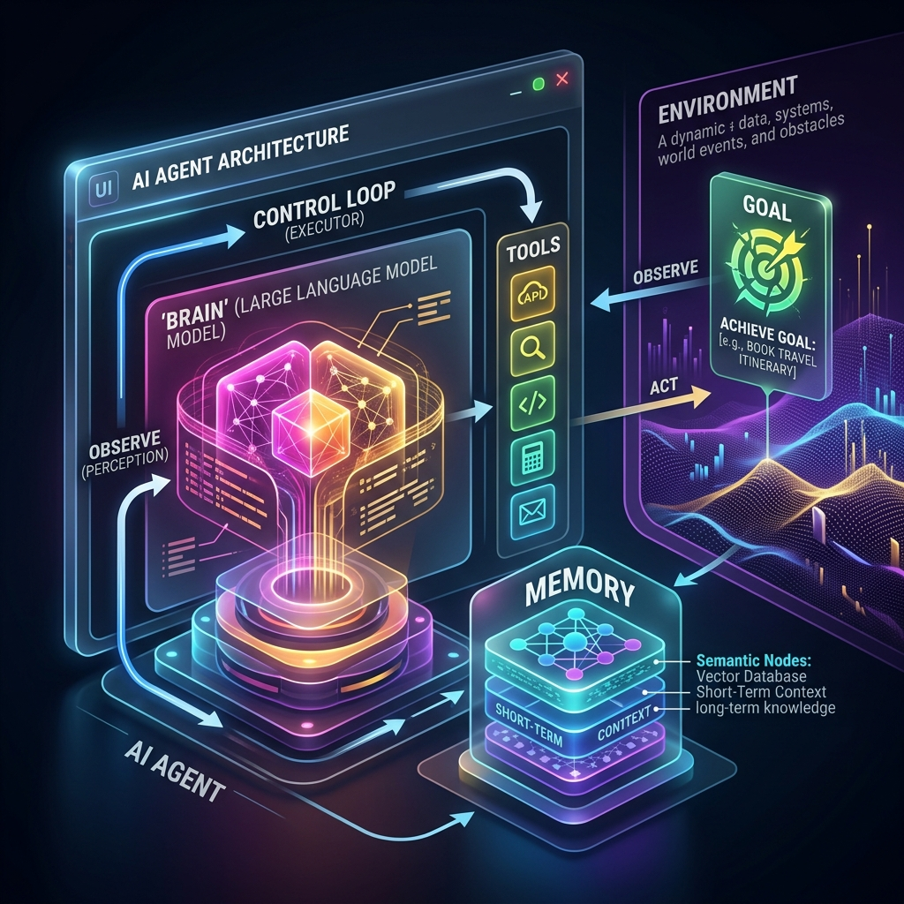

<!-- tags: glossary, agentic-ai, agentic-core, ai-agent -->
# AI Agent

> An autonomous system where an LLM acts as the "brain," equipped with memory, tool access, and a control loop to achieve multi-step goals with minimal human intervention.

| Aspect | Detail |
| --- | --- |
| **Domain** | Agentic Core |
| **Used by** | AI engineer, architect, product manager |
| **Related** | Agentic Loop, LLM, Tools, Memory |

📅 Created: 2026-04-28 · 🔄 Updated: 2026-05-06 · ⏱️ 5 min read

---

## 1. DEFINE

A developer interacts with an LLM by asking it to write a Python script. The developer then copies the script, runs it, reads the error, and pastes the error back to the LLM. The developer is the agent driving the loop. If the LLM were an **AI Agent**, it would write the code, run it in a sandbox, read the error, correct itself, and finally return a working script.

An **AI Agent** is not just a language model. It is an architectural pattern that combines a foundation model (the reasoning engine) with external components: Memory (to retain context across steps), Tools (to interact with the environment via APIs, databases, or code execution), and a Control Loop (to orchestrate the observe-think-act cycle).

The boundary defining an agent is autonomy and statefulness over time. A simple script calling an API is an automation; an LLM deciding *which* API to call based on a dynamic goal is an agent.

---

## 2. CONTEXT

**Who uses it**: AI engineers designing autonomous systems, tech leads deciding between static pipelines and dynamic agents.

**When**: Whenever a task is too complex, dynamic, or non-linear for a hardcoded script or a single LLM prompt. 

**In this ecosystem**:
- An agent uses an [LLM](../core-llm-concepts/01-llm.md) as its brain.
- It operates using an [Agentic Loop](./35-agentic-loop.md).
- It interacts with the world via [Tools](../tools-capabilities/README.md).
- It retains state via [Memory Systems](../memory-systems/README.md).

---

## 3. EXAMPLES

*Figure: An AI Agent architecture showing the LLM "Brain" connected to Memory and Tools, driven autonomously by a Control Loop toward a Goal.*

### Example 1: The AI Software Engineer
An agent like Devin is given a goal: "Fix issue #123 in the repo." The agent clones the repo (Tool), reads the codebase, decides to search for the specific error (Reasoning), runs tests (Tool), observes the failure, and iterates until the tests pass. 

→ The agent is defined by its ability to navigate a multi-step workflow without human hand-holding.

### Example 2: Static Pipeline vs. Agent
A data pipeline that runs every night, queries a database, formats it into a prompt, calls an LLM to summarize, and emails the result is *not* an agent. It is an AI-enhanced pipeline. An agent would be given the goal: "Keep stakeholders informed of critical database anomalies," and would dynamically decide when to query, what to summarize, and who to email based on its own ongoing evaluation.

---

## 4. COMPARE

| | AI Agent | LLM | Traditional Software Script |
|--|---|---|---|
| **Core Engine** | LLM + Loop + Tools | Transformer network | Hardcoded logic |
| **Execution** | Autonomous, dynamic | Stateless, single-turn | Deterministic, linear |
| **Failure Mode** | Hallucinated plans, infinite loops | Inaccurate text generation | Crashes on unhandled exceptions |
| **Best For** | Open-ended, complex workflows | Text generation/reasoning tasks | Predictable, repeatable tasks |

---

## 5. REF

| Resource | Type | Link | Note |
| --- | --- | --- | --- |
| Building Effective Agents | Guide | https://www.anthropic.com/engineering/building-effective-agents | Anthropic's guide to production agents |
| LLM Powered Autonomous Agents | Blog | https://lilianweng.github.io/posts/2023-06-23-agent/ | Lilian Weng's foundational overview |

---

## 6. RECOMMEND

| Explore next | When | Why | File/Link |
| --- | --- | --- | --- |
| Agentic Loop | You want to understand how an agent actually runs | The loop is the engine of agency | [Agentic Loop](./35-agentic-loop.md) |
| Tool Registry | You want to give your agent capabilities | Agents need tools to affect the real world | [Tool Registry](../tools-capabilities/48-tool-registry.md) |
| Autonomy Level | You need to restrict or expand what the agent can do | Defines the guardrails of the agent | [Autonomy Level](./37-autonomy-level.md) |

**Links**: [← Previous](./README.md) · [→ Next](./35-agentic-loop.md)
