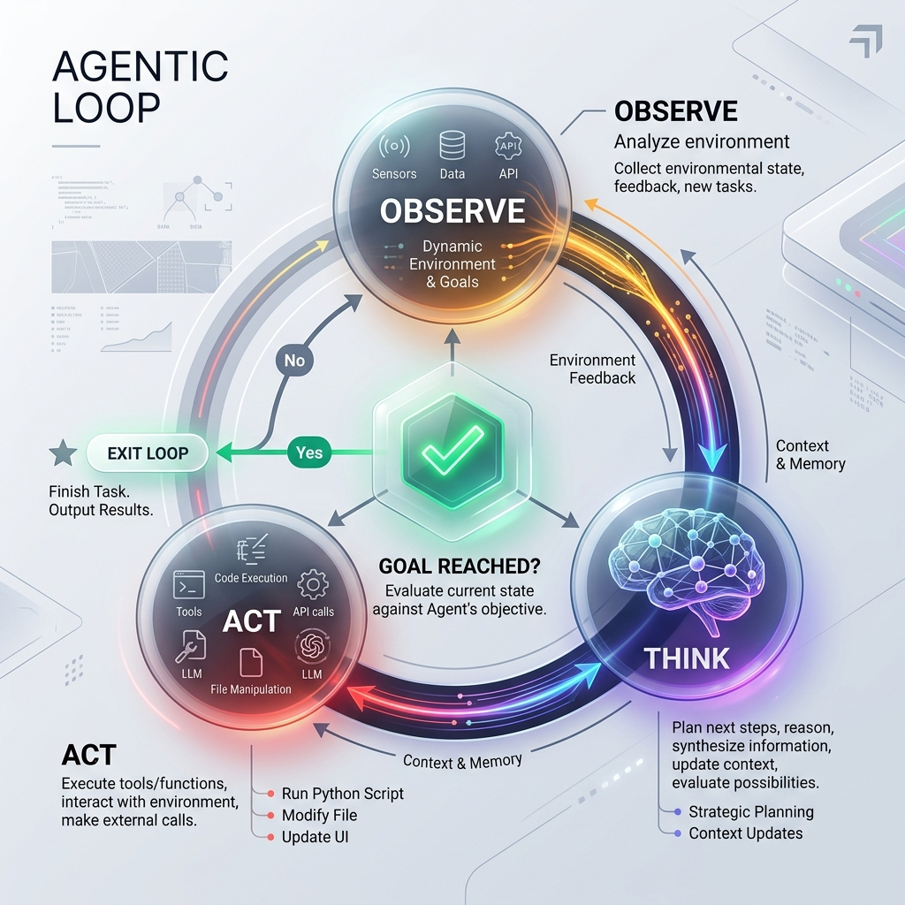

<!-- tags: glossary, agentic-ai, agentic-core, loop -->
# Agentic Loop

> The continuous execution cycle (Observe → Think → Act) that enables an AI agent to iteratively interact with its environment until a goal is achieved.

| Aspect | Detail |
| --- | --- |
| **Domain** | Agentic Core |
| **Used by** | AI engineer, backend developer |
| **Related** | ReAct Loop, Planning, AI Agent |

📅 Created: 2026-04-28 · 🔄 Updated: 2026-05-06 · ⏱️ 5 min read

---

## 1. DEFINE

If you give a human a complex task, they don't plan every single micro-action perfectly from the start. They take a step, look at the result, think about what to do next, and take another step. This iterative process is what gives humans their adaptability. 

The **Agentic Loop** (often summarized as Observe → Think → Act) is the control flow architecture that allows an agent to run continuously. 
1. **Observe**: The agent reads the current state of the environment or the result of its last action.
2. **Think**: The LLM processes the observation against its overarching goal to decide the next best action.
3. **Act**: The agent executes a tool or function to change the environment state.
4. **Repeat**: The cycle continues until the agent determines the goal is met or it encounters a terminal error.

Without an agentic loop, an LLM is a static text generator. The loop provides the heartbeat of autonomy.

---

## 2. CONTEXT

**Who uses it**: AI engineers designing the orchestrator component of an agentic system.

**When**: Whenever a system needs to handle tasks where the path to the solution is not known in advance and depends on intermediate results.

**In this ecosystem**:
- The loop powers the [AI Agent](./34-ai-agent.md).
- [ReAct Loop](./36-react-loop.md) is a specific prompting implementation of this concept.
- Poor loop design leads to [Infinite Loops](../evaluation-observability/README.md).

---

## 3. EXAMPLES

*Figure: The Agentic Loop shows a continuous, dynamic cycle where an AI observes its environment, reasons about its next step, and uses tools to act, checking against a goal condition to exit.*

### Example 1: Web Research Loop
An agent is tasked with finding the latest funding round for a startup. 
*   **Act**: It searches Google for the company name.
*   **Observe**: The search results mention a recent TechCrunch article.
*   **Think**: "I should read this article to find the exact funding amount."
*   **Act**: It uses a web scraper tool to read the article.
*   **Observe**: The article states the company raised $50M Series B.
*   **Think**: "I have the answer. I can stop now."

### Example 2: The Infinite Loop Failure
A poorly constructed loop encounters an error: an API returns `404 Not Found`. 
*   **Observe**: Error 404.
*   **Think**: "I need to call the API to get the data."
*   **Act**: Calls the exact same API again.
This happens when the agent's reasoning fails to update its strategy based on the observation, trapping it in an infinite cycle.

---

## 4. COMPARE

| | Agentic Loop | Directed Acyclic Graph (DAG) | State Machine |
|--|---|---|---|
| **Path** | Dynamic, determined at runtime by LLM | Static, predefined paths | Predefined states and transitions |
| **Flexibility** | High (can handle unknown situations) | Low (only handles programmed paths) | Medium (handles anticipated states) |
| **Failure Mode** | Infinite loops, hallucinated plans | Pipeline breakage | Unhandled state transitions |
| **Best For** | Open-ended reasoning and research | ETL pipelines, deterministic data flows | UI flows, strict business logic |

---

## 5. REF

| Resource | Type | Link | Note |
| --- | --- | --- | --- |
| AutoGPT Architecture | Repo | https://github.com/Significant-Gravitas/AutoGPT | One of the earliest open-source implementations of a continuous agentic loop |
| Cognitive Architectures | Paper | https://arxiv.org/abs/2307.05300 | Academic overview of agentic looping structures |

---

## 6. RECOMMEND

| Explore next | When | Why | File/Link |
| --- | --- | --- | --- |
| ReAct Loop | You want to implement a concrete, prompt-based loop | ReAct is the most common way to realize the agentic loop | [ReAct Loop](./36-react-loop.md) |
| Task Decomposition | Your agent gets confused in its loop | Breaking tasks down makes loops more reliable | [Task Decomposition](./40-task-decomposition.md) |
| Interrupt / Escalation | You need to prevent infinite loops | Handing control back to humans is a critical safety valve | [Interrupt / Escalation](./45-interrupt-escalation.md) |

**Links**: [← Previous](./34-ai-agent.md) · [→ Next](./36-react-loop.md)
