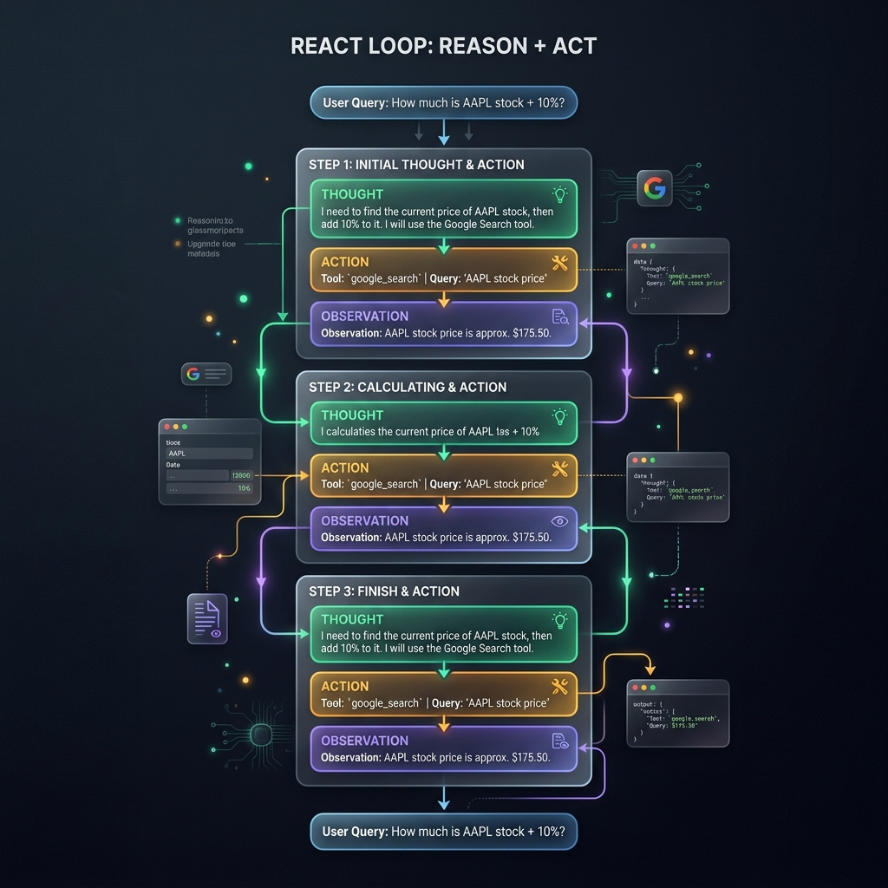

<!-- tags: glossary, agentic-ai, agentic-core, react -->
# ReAct Loop

> A specific prompting framework that interleaves reasoning (Thought) and acting (Action/Observation) to improve an LLM's reliability in tool use and multi-step problem solving.

| Aspect | Detail |
| --- | --- |
| **Domain** | Agentic Core |
| **Used by** | Prompt engineer, AI engineer |
| **Related** | Agentic Loop, Prompt Engineering, Tools |

📅 Created: 2026-04-28 · 🔄 Updated: 2026-05-06 · ⏱️ 5 min read

---

## 1. DEFINE

If you force an LLM to take an action without explaining *why*, it often hallucinates or uses the wrong tool parameters. If you ask an LLM to just reason without taking action, it gets stuck in its own assumptions.

**ReAct (Reason + Act)** solves this by forcing the LLM to output a structured internal monologue before every action. In a ReAct loop, the interaction follows a strict text pattern:
1.  **Thought**: The model explicitly writes out its reasoning.
2.  **Action**: The model outputs a specific tool call (e.g., `Search("Apple stock price")`).
3.  **Observation**: The system executes the tool and injects the raw result back into the prompt.
4.  The model loops back to **Thought** to evaluate the observation.

By materializing its "Thought" into the context window, the model creates a scratchpad for itself, drastically reducing the likelihood of action errors and making the agent's logic perfectly transparent to the developer.

---

## 2. CONTEXT

**Who uses it**: AI engineers building single-agent orchestrators or debugging agent logic.

**When**: As the default orchestrator pattern for text-based agents, especially when using older or smaller models that struggle with implicit tool calling.

**In this ecosystem**:
- It is a specific implementation of the broader [Agentic Loop](./35-agentic-loop.md).
- Native tool-calling APIs (like OpenAI's function calling) often hide the ReAct loop under the hood, but ReAct remains conceptually foundational.

---

## 3. EXAMPLES

*Figure: The ReAct Loop shows a vertical execution trace interleaving 'Thought' (internal reasoning), 'Action' (calling an external tool), and 'Observation' (result from the tool).*

### Example 1: The ReAct Trace
User: "How old is the president of the US?"

*   **Thought**: I need to find out who the current US president is, and then find their age.
*   **Action**: `Search("Current US President")`
*   **Observation**: "Joe Biden is the 46th U.S. President."
*   **Thought**: The current president is Joe Biden. Now I need to find his age.
*   **Action**: `Search("Joe Biden age")`
*   **Observation**: "81 years"
*   **Thought**: I have the answer.
*   **Final Answer**: The president is Joe Biden and he is 81 years old.

### Example 2: Debugging via Thought
An agent fails to book a flight. The developer looks at the logs and sees:
*   **Thought**: "I need to book a flight for tomorrow. I will assume tomorrow is Tuesday."
*   **Action**: `BookFlight(date="Tuesday")`
The developer instantly realizes the agent needs access to a "GetCurrentDate" tool, because its "Thought" revealed a flawed assumption.

---

## 4. COMPARE

| | ReAct Loop | Direct Tool Calling | Chain of Thought (CoT) |
|--|---|---|---|
| **Mechanism** | Interleaved reasoning and actions | Model directly outputs a JSON payload | Pure reasoning, no actions |
| **Transparency** | High (Thought is logged before Action) | Low (Reasoning happens implicitly) | High |
| **Latency/Cost** | High (generates many intermediate tokens) | Low (direct output) | Medium |
| **Best For** | Complex agentic tasks requiring self-correction | Simple, deterministic API interactions | Mathematical or logic puzzles |

---

## 5. REF

| Resource | Type | Link | Note |
| --- | --- | --- | --- |
| ReAct: Synergizing Reasoning and Acting in Language Models | Paper | https://arxiv.org/abs/2210.03629 | The foundational paper by Yao et al. (2022) |
| LangChain ReAct Agent | Docs | https://python.langchain.com/docs/modules/agents/agent_types/react | Standard implementation in LangChain |

---

## 6. RECOMMEND

| Explore next | When | Why | File/Link |
| --- | --- | --- | --- |
| Agentic Loop | You want the conceptual architecture above ReAct | ReAct is an implementation; Agentic Loop is the pattern | [Agentic Loop](./35-agentic-loop.md) |
| Self-Reflection | Your ReAct loop keeps failing without noticing | Self-reflection allows the agent to critique its own 'Thought' | [Self-Reflection](./42-self-reflection.md) |
| Tool Registry | You need to provide the 'Actions' for ReAct | The agent needs a well-defined schema of tools | [Tool Registry](../tools-capabilities/48-tool-registry.md) |

**Links**: [← Previous](./35-agentic-loop.md) · [→ Next](./37-autonomy-level.md)
