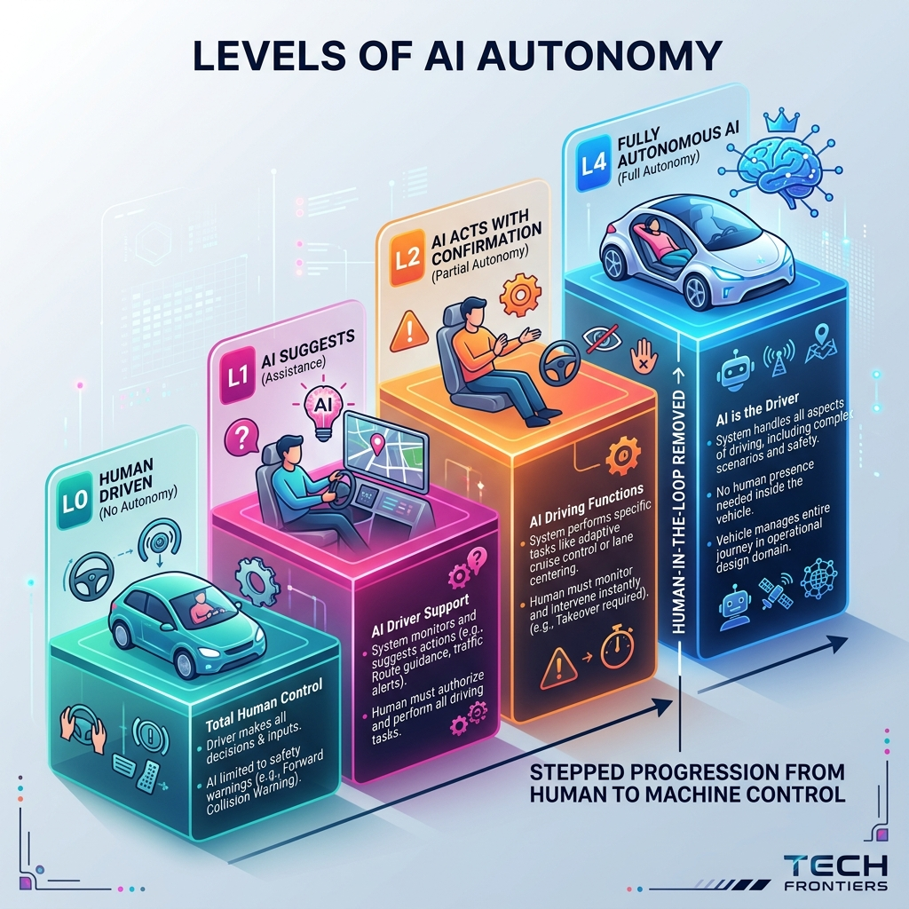

<!-- tags: glossary, agentic-ai, agentic-core, autonomy -->
# Autonomy Level

> The degree of independent action an AI system is permitted to take, ranging from merely suggesting actions (L1) to executing workflows with full independence (L4).

| Aspect | Detail |
| --- | --- |
| **Domain** | Agentic Core |
| **Used by** | AI architect, product manager, risk compliance |
| **Related** | Human-in-the-Loop, Agency, AI Agent |

📅 Created: 2026-04-28 · 🔄 Updated: 2026-05-06 · ⏱️ 5 min read

---

## 1. DEFINE

When deploying an AI agent, the critical question is not just "what can it do?" but "what is it *allowed* to do without asking?" The answer defines its Autonomy Level.

**Autonomy Level** categorizes an AI system based on its independence from human oversight:
*   **L0 (No Autonomy)**: The system executes hardcoded scripts. No AI decision-making.
*   **L1 (Assistance/Suggest)**: The AI generates suggestions (e.g., code completion, email drafting), but the human must actively accept and execute them.
*   **L2 (Action with Confirmation)**: The AI queues up a sequence of actions (e.g., a pull request, a refund), but pauses to require explicit human approval before execution.
*   **L3 (Conditional Autonomy)**: The AI executes actions autonomously within strict, pre-defined guardrails (e.g., auto-refunding amounts under $50). It escalates to a human if conditions are violated.
*   **L4 (Full Autonomy)**: The AI operates entirely independently, handling edge cases and making unconstrained decisions to achieve a high-level goal.

Managing autonomy levels is how teams balance the efficiency of AI with the risk of catastrophic failure.

---

## 2. CONTEXT

**Who uses it**: AI architects designing system boundaries, product managers defining UX for AI features, and risk teams evaluating deployment safety.

**When**: During the architectural design phase to decide where the [Human-in-the-Loop](./44-human-in-the-loop.md) sits.

**In this ecosystem**:
- Determines how much [Agency](./38-agency.md) is granted to an [AI Agent](./34-ai-agent.md).
- Relies heavily on [Interrupt / Escalation](./45-interrupt-escalation.md) mechanisms when transitioning between levels.

---

## 3. EXAMPLES

*Figure: The Levels of AI Autonomy show a stepped progression from Human-Driven (L0) to Fully Autonomous AI (L4), clearly marking where the human is removed from the loop.*

### Example 1: Escalating Autonomy over time
A customer service AI starts at L1: it drafts replies for human agents. After 6 months of high accuracy, it is upgraded to L2: it automatically prepares refunds but waits for a human click. Eventually, it reaches L3: it automatically refunds any request under $20 that matches the return policy, but flags anything else for review.

### Example 2: The danger of mismatched autonomy
A team deploys an L4 autonomous database tuning agent. It decides to drop a "redundant" index during peak hours, causing an outage. The system had L4 autonomy but the team only had L2 confidence in its reasoning.
→ Autonomy levels must scale linearly with evaluation confidence.

---

## 4. COMPARE

| | L1 (Suggest) | L2 (Confirm) | L3/L4 (Autonomous) |
|--|---|---|---|
| **Human Role** | Executor | Approver | Supervisor / Absent |
| **System Speed** | Bottlenecked by human | Paused by human | Instantaneous |
| **Risk Level** | Very Low | Low | High |
| **UX Pattern** | Auto-complete, Chat | "Approve Action" button | Background worker |

---

## 5. REF

| Resource | Type | Link | Note |
| --- | --- | --- | --- |
| SAE J3016 Levels of Driving Automation | Standard | https://www.sae.org/blog/sae-j3016-update | The conceptual inspiration for AI autonomy levels |
| LangGraph Human-in-the-Loop | Docs | https://langchain-ai.github.io/langgraph/concepts/human_in_the_loop/ | Implementing L2 autonomy in code |

---

## 6. RECOMMEND

| Explore next | When | Why | File/Link |
| --- | --- | --- | --- |
| Human-in-the-Loop | You need to implement L1 or L2 autonomy | Defines how humans interact with the agent | [Human-in-the-Loop](./44-human-in-the-loop.md) |
| Agency | You want to understand the engine driving L3/L4 | Agency is the capability that enables autonomy | [Agency](./38-agency.md) |
| Interrupt / Escalation | Your L3 agent encounters an edge case | The mechanism for falling back to L2 | [Interrupt / Escalation](./45-interrupt-escalation.md) |

**Links**: [← Previous](./36-react-loop.md) · [→ Next](./38-agency.md)
