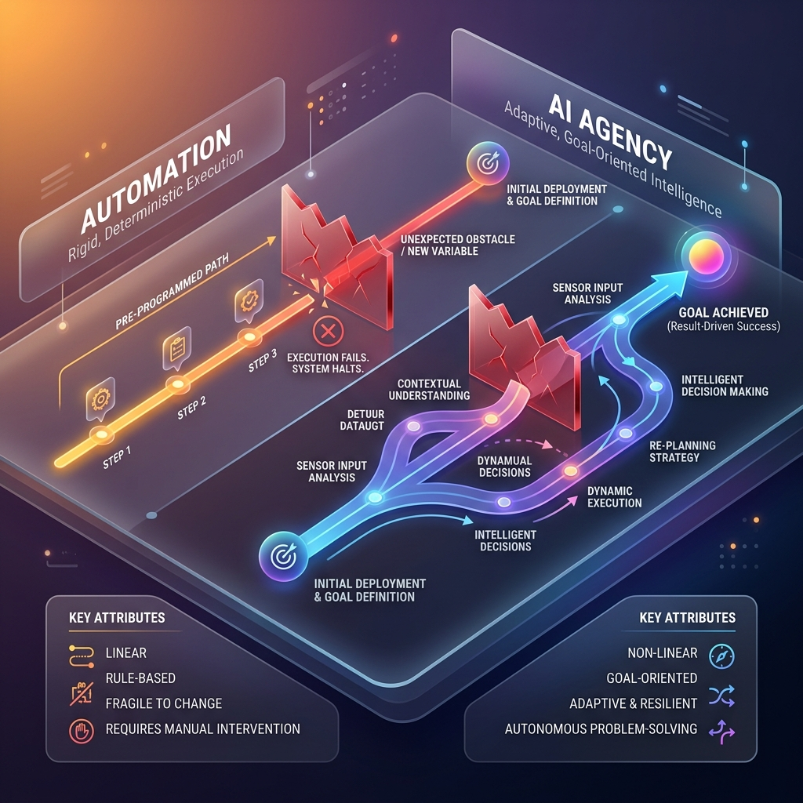

<!-- tags: glossary, agentic-ai, agentic-core, agency -->
# Agency

> The capacity of an AI system to make independent decisions, formulate dynamic plans, and navigate unexpected obstacles to achieve a goal.

| Aspect | Detail |
| --- | --- |
| **Domain** | Agentic Core |
| **Used by** | AI architect, product manager, AI engineer |
| **Related** | Autonomy Level, Goal-Directed Behavior, Planning |

📅 Created: 2026-04-28 · 🔄 Updated: 2026-05-06 · ⏱️ 5 min read

---

## 1. DEFINE

A standard software script is brittle. If a website changes its HTML structure, a web-scraping script will crash. It has no agency; it only knows how to follow a rigid, pre-programmed path. 

**Agency** is the degree to which an AI system can dynamically adapt its path to achieve a goal. An AI with high agency encountering that same changed website will read the error, look at the new HTML structure, rewrite its extraction logic on the fly, and successfully pull the data. 

Agency requires three components:
1. **Perception**: The ability to understand the current state of the environment.
2. **Reasoning**: The ability to formulate and adjust plans based on that perception.
3. **Actuation**: The ability to use tools to change the environment.

The higher the agency, the less explicit step-by-step instruction the system requires from the user.

---

## 2. CONTEXT

**Who uses it**: AI architects defining system capabilities, product managers marketing AI features.

**When**: When deciding if a feature should be built as a deterministic pipeline or an open-ended agentic workflow.

**In this ecosystem**:
- Agency is what separates an [AI Agent](./34-ai-agent.md) from an LLM.
- It is driven by [Goal-Directed Behavior](./39-goal-directed-behavior.md).
- It is constrained by the system's [Autonomy Level](./37-autonomy-level.md).

---

## 3. EXAMPLES

*Figure: The visual contrasts a rigid, deterministic 'Automation' path that halts at an obstacle against a dynamic 'Agency' path where the AI intelligently navigates around the obstacle to reach the goal.*

### Example 1: Low vs High Agency in Data Analysis
*   **Low Agency**: "Run this SQL query, format the results as a CSV, and email it to me."
*   **High Agency**: "Find out why Q3 revenue dropped and send me a report." The agent independently decides to query the database, notices a drop in European sales, queries the marketing spend in Europe, correlates the two, generates a chart, and emails the findings.

### Example 2: The illusion of Agency
A chatbot that writes a poem about cats appears intelligent, but lacks agency. It is simply mapping a prompt to a text completion. It does not evaluate its progress or interact with an environment.

---

## 4. COMPARE

| | Agency | Automation | Generative AI |
|--|---|---|---|
| **Path to Goal** | Dynamic, self-corrected | Fixed, deterministic | None (single output) |
| **Handling Obstacles** | Adapts and retries | Crashes and alerts | N/A |
| **Input Required** | High-level goal | Step-by-step script | Specific prompt |
| **Example** | Autonomous DevOps agent | GitHub Actions CI/CD | ChatGPT writing code |

---

## 5. REF

| Resource | Type | Link | Note |
| --- | --- | --- | --- |
| The Landscape of Agentic AI | Article | https://www.oreilly.com/radar/the-landscape-of-agentic-ai/ | Overview of agency in modern AI |
| Anthropic — Building Effective Agents | Guide | https://www.anthropic.com/engineering/building-effective-agents | Discussion on when agency is appropriate |

---

## 6. RECOMMEND

| Explore next | When | Why | File/Link |
| --- | --- | --- | --- |
| Goal-Directed Behavior | You want to understand what drives agency | Agency is meaningless without a goal | [Goal-Directed Behavior](./39-goal-directed-behavior.md) |
| Autonomy Level | You need to restrict an agent's agency | Autonomy limits how agency is expressed | [Autonomy Level](./37-autonomy-level.md) |
| Planning | You want to know how agents exercise agency | Planning is the mechanism of high agency | [Planning](./41-planning.md) |

**Links**: [← Previous](./37-autonomy-level.md) · [→ Next](./39-goal-directed-behavior.md)
