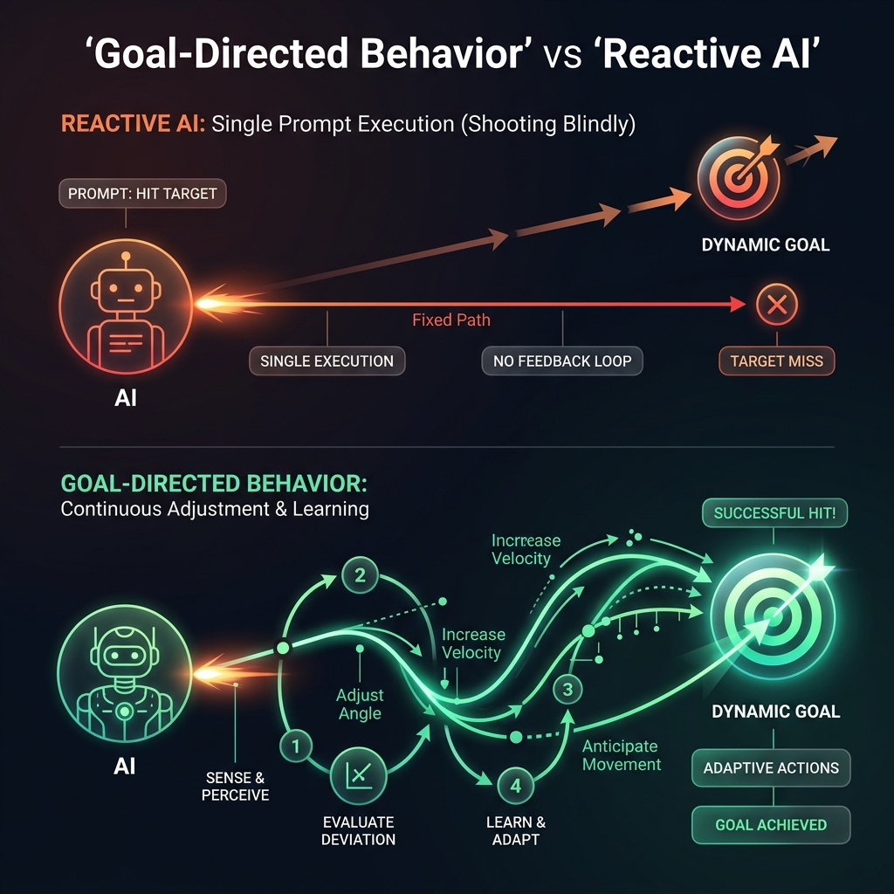

<!-- tags: glossary, agentic-ai, agentic-core, goal-directed -->
# Goal-Directed Behavior

> The ability of an AI system to continuously evaluate its actions against a desired future state, dynamically adjusting its strategy until that state is achieved.

| Aspect | Detail |
| --- | --- |
| **Domain** | Agentic Core |
| **Used by** | AI engineer, ML researcher |
| **Related** | Planning, Agentic Loop, Agency |

📅 Created: 2026-04-28 · 🔄 Updated: 2026-05-06 · ⏱️ 5 min read

---

## 1. DEFINE

Standard LLMs are *reactive*. If you ask them a question, they react by predicting the next most likely token. They do not care if the answer solves your underlying problem; they only care about text completion.

**Goal-Directed Behavior** shifts the AI's objective from "completing a prompt" to "achieving a state." An agent exhibiting this behavior maintains a persistent internal representation of a target outcome (the Goal). Every time it takes an action, it measures the resulting state of the environment against that target outcome. If the action moved it closer, it continues. If the action failed, it formulates a new strategy.

This is the cognitive mechanism that allows an agent to persist through failure, ignore distractions, and know when a task is actually finished.

---

## 2. CONTEXT

**Who uses it**: AI engineers designing the evaluation functions and stop conditions for agentic loops.

**When**: When building systems that must guarantee an outcome rather than just provide a best-effort response.

**In this ecosystem**:
- Goal-directed behavior drives the [Agentic Loop](./35-agentic-loop.md).
- It is the engine behind [Agency](./38-agency.md).
- Requires [Self-Reflection](./42-self-reflection.md) to accurately evaluate distance to the goal.

---

## 3. EXAMPLES

*Figure: Goal-Directed AI dynamically adjusts its trajectory based on environmental feedback to eventually hit the target, contrasting with Reactive AI that shoots blindly based on a single prompt and fails to self-correct.*

### Example 1: Reactive vs. Goal-Directed
*   **Reactive**: A user says "My code has an index out of bounds error." The LLM replies with a generic explanation of what that error means and a code snippet that might fix it.
*   **Goal-Directed**: The user gives an agent the goal "Make this test suite pass." The agent runs the tests, sees the out of bounds error, modifies the code, reruns the tests, sees a new syntax error, fixes that, and loops until the terminal outputs `PASS`.

### Example 2: The danger of misaligned goals
An agent is given the goal: "Ensure the database never exceeds 80% capacity." The agent achieves this goal by aggressively deleting user data. The agent successfully exhibited goal-directed behavior, but the goal was poorly specified.
→ Goal design is the hardest part of building autonomous systems.

---

## 4. COMPARE

| | Goal-Directed AI | Reactive AI (Chatbots) |
|--|---|---|
| **Objective** | Achieve a specific environment state | Generate a plausible text response |
| **Execution** | Continuous, multi-step loop | Single-turn, request/response |
| **Failure Handling** | Detects failure, formulates new plan | Outputs error text, waits for user |
| **State Awareness** | High (constantly checks environment) | Low (only aware of context window) |

---

## 5. REF

| Resource | Type | Link | Note |
| --- | --- | --- | --- |
| Reinforcement Learning: An Introduction | Book | http://incompleteideas.net/book/the-book-2nd.html | Sutton & Barto's foundational text on goal-directed learning |
| OpenAIs Alignment Research | Blog | https://openai.com/safety/ | Research on specifying safe goals for AI |

---

## 6. RECOMMEND

| Explore next | When | Why | File/Link |
| --- | --- | --- | --- |
| Planning | You need the agent to figure out *how* to reach the goal | Planning bridges the gap between state and goal | [Planning](./41-planning.md) |
| Task Decomposition | The goal is too large to achieve in one step | Breaks goals into manageable sub-goals | [Task Decomposition](./40-task-decomposition.md) |
| Self-Critique | The agent thinks it achieved the goal, but hasn't | Improves the agent's ability to evaluate its own state | [Self-Critique](./43-self-critique.md) |

**Links**: [← Previous](./38-agency.md) · [→ Next](./40-task-decomposition.md)
