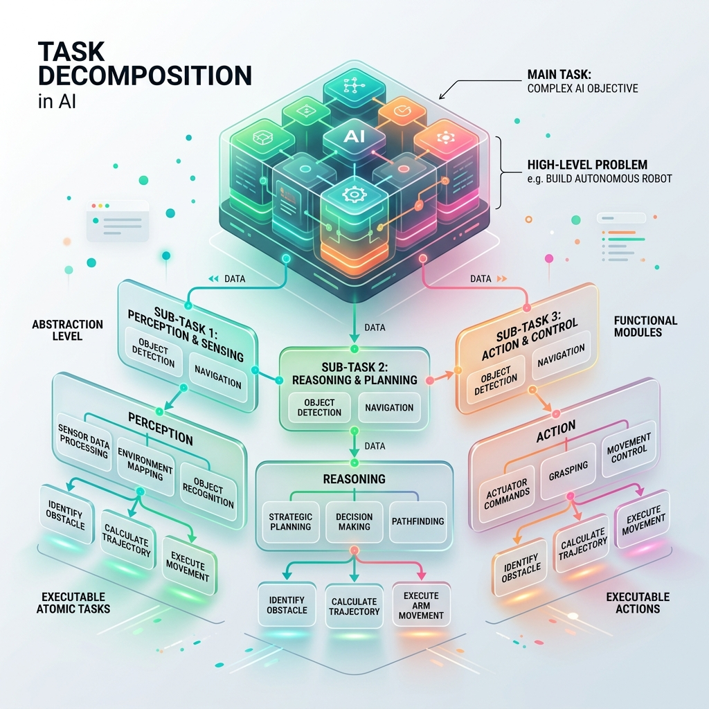

<!-- tags: glossary, agentic-ai, agentic-core, task-decomposition -->
# Task Decomposition

> The cognitive process by which an AI agent breaks down a complex, high-level goal into a hierarchical tree of smaller, executable sub-tasks.

| Aspect | Detail |
| --- | --- |
| **Domain** | Agentic Core |
| **Used by** | AI engineer, prompt engineer |
| **Related** | Planning, Agentic Loop, Prompt Chaining |

📅 Created: 2026-04-28 · 🔄 Updated: 2026-05-06 · ⏱️ 5 min read

---

## 1. DEFINE

LLMs are notoriously bad at solving massive problems in a single pass. If you ask a model to "build an entire web application," it will generate a jumbled, incomplete mess. 

**Task Decomposition** is the architectural solution to this limitation. It is the process of taking a high-level goal and recursively splitting it into smaller boundaries until each piece is small enough to be solved by a single prompt or a single tool call. 

By decomposing a task, an agent creates a dependency graph. It understands that to achieve C, it must first achieve A, and then B. This dramatically increases the reliability, debuggability, and success rate of agentic systems.

---

## 2. CONTEXT

**Who uses it**: AI engineers designing orchestration frameworks and orchestrator prompts.

**When**: As the very first step in a [Planning](./41-planning.md) phase before an agent begins executing any tool calls.

**In this ecosystem**:
- Task Decomposition is a prerequisite for effective [Planning](./41-planning.md).
- It prevents the [Agentic Loop](./35-agentic-loop.md) from getting overwhelmed by too much context.
- Can be implemented via explicit LLM prompting (e.g., "Break this down into 3 steps") or programmatically via [Prompt Chaining](../hooks-middleware/README.md).

---

## 3. EXAMPLES

*Figure: Task Decomposition involves taking a large, complex block labeled 'Main Task' and systematically breaking it down into a hierarchical tree of smaller, manageable, executable sub-tasks.*

### Example 1: Decomposing a Research Task
*   **Goal**: Write a report on the impact of quantum computing on cryptography.
*   **Decomposition**:
    1.  Sub-task 1: Search the web for current quantum encryption standards.
    2.  Sub-task 2: Search the web for RSA vulnerabilities to Shor's algorithm.
    3.  Sub-task 3: Summarize findings from sub-task 1 and 2.
    4.  Sub-task 4: Format the summary into a markdown report.
The agent executes these sequentially. If sub-task 2 fails, it only retries sub-task 2, rather than restarting the whole report.

### Example 2: Implicit vs Explicit Decomposition
A developer hardcodes a Python script that scrapes a page, then summarizes it. That is *developer-driven* decomposition. *Agentic* task decomposition occurs when the LLM itself is prompted to generate the list of sub-tasks dynamically based on an unseen user request.

---

## 4. COMPARE

| | Task Decomposition | Planning | Routing |
|--|---|---|---|
| **Focus** | Breaking *what* needs to be done into pieces | Determining *how* and *when* to execute those pieces | Sending a task to the right specialist |
| **Output** | A list or tree of sub-tasks | A sequence of actions over time | A single destination |
| **Human Analogy** | Creating a Work Breakdown Structure (WBS) | Creating a Gantt chart | Delegating to a team member |

---

## 5. REF

| Resource | Type | Link | Note |
| --- | --- | --- | --- |
| Chain-of-Thought Prompting | Paper | https://arxiv.org/abs/2201.11903 | The foundational mechanism that enables decomposition |
| Plan-and-Solve Prompting | Paper | https://arxiv.org/abs/2305.04091 | Explicit techniques for forcing models to decompose before solving |

---

## 6. RECOMMEND

| Explore next | When | Why | File/Link |
| --- | --- | --- | --- |
| Planning | You have broken down the tasks and need to execute them | Planning orders the decomposed tasks | [Planning](./41-planning.md) |
| Prompt Chaining | The tasks are static and known in advance | You can hardcode the decomposition in middleware | [Prompt Chaining](../hooks-middleware/70-prompt-chaining.md) |
| Agentic Loop | The agent needs to execute the tasks | The loop iterates through the decomposed list | [Agentic Loop](./35-agentic-loop.md) |

**Links**: [← Previous](./39-goal-directed-behavior.md) · [→ Next](./41-planning.md)
