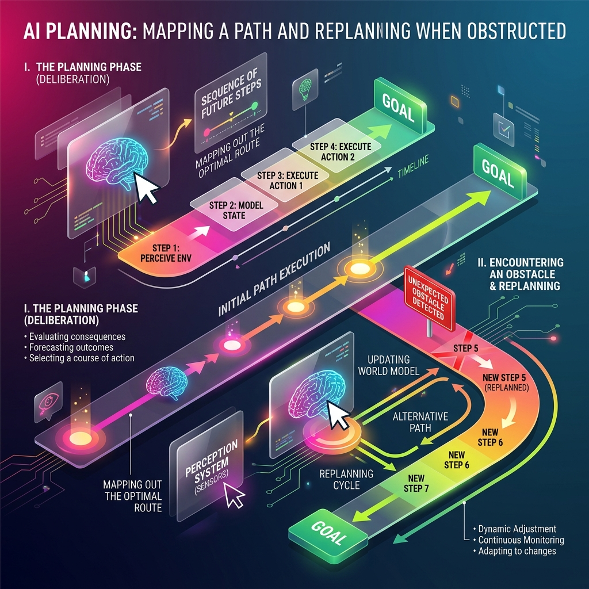

<!-- tags: glossary, agentic-ai, agentic-core, planning -->
# Planning

> The capability of an agent to formulate a sequence of future actions to achieve a goal, and critically, the ability to replan dynamically when the environment changes or an action fails.

| Aspect | Detail |
| --- | --- |
| **Domain** | Agentic Core |
| **Used by** | AI architect, AI engineer |
| **Related** | Task Decomposition, Agentic Loop, ReAct Loop |

📅 Created: 2026-04-28 · 🔄 Updated: 2026-05-06 · ⏱️ 5 min read

---

## 1. DEFINE

If [Task Decomposition](./40-task-decomposition.md) is identifying *what* needs to be done, **Planning** is deciding *how* and *in what order* to do it. 

Planning in agentic AI involves generating a sequence of steps that transition the environment from its current state to the goal state. Because the real world is messy—APIs timeout, web pages change, assumed files don't exist—a rigid plan will inevitably fail. Therefore, true agentic planning requires **replanning**: the ability to detect that an execution step failed, update the internal state, and generate a new sequence of steps to route around the obstacle.

---

## 2. CONTEXT

**Who uses it**: AI engineers building high-autonomy orchestrators.

**When**: Crucial for tasks that require long horizons (many steps) where early mistakes compound into massive failures if not caught and replanned.

**In this ecosystem**:
- Planning often sits "above" the standard [Agentic Loop](./35-agentic-loop.md) (e.g., in a Plan-and-Execute architecture, the Planner creates the steps, and the Loop executes them).
- It utilizes [Task Decomposition](./40-task-decomposition.md).
- It relies on [Self-Reflection](./42-self-reflection.md) to know when to replan.

---

## 3. EXAMPLES

*Figure: AI Planning involves mapping out a sequence of future steps before executing them. Crucially, it includes a visual replanning cycle when an unexpected obstacle is detected on the initial path.*

### Example 1: The Plan-and-Execute Architecture
Instead of using a simple ReAct loop where the agent decides what to do one step at a time, a developer uses a two-agent setup:
1.  **The Planner Agent**: Looks at the user request and generates a JSON array of 5 sequential steps.
2.  **The Executor Agent**: Takes Step 1, executes it, and returns the result. 
If Step 2 fails, the Executor reports back to the Planner, which then generates a revised JSON array for the remaining steps.

### Example 2: Replanning around a broken tool
An agent plans to scrape a URL to get pricing data. During execution, the scraper returns a `403 Forbidden`. The agent *replans*: "Since scraping failed, my new plan is to use the Google Search tool to look for public pricing mentions of this product."

---

## 4. COMPARE

| | Planning (Agentic) | ReAct Loop | Traditional Code |
|--|---|---|---|
| **Horizon** | Multi-step foresight | One step at a time | Entirely predefined |
| **Adaptability** | High (replans on failure) | High (reacts immediately) | Low (crashes on unhandled exceptions) |
| **Compute Cost** | Very High (requires large context for the whole plan) | Medium (evaluates per step) | Near zero |
| **Best For** | Long, complex tasks with dependencies | Short, unpredictable tasks | Deterministic workflows |

---

## 5. REF

| Resource | Type | Link | Note |
| --- | --- | --- | --- |
| HuggingGPT | Paper | https://arxiv.org/abs/2303.13746 | Excellent example of task planning using LLMs as controllers |
| LLM-Compiler | Paper | https://arxiv.org/abs/2312.04511 | Optimizing LLM planning by executing independent tasks in parallel |

---

## 6. RECOMMEND

| Explore next | When | Why | File/Link |
| --- | --- | --- | --- |
| Task Decomposition | You want to understand how a plan is formed | Tasks must be decomposed before they are ordered | [Task Decomposition](./40-task-decomposition.md) |
| Self-Reflection | The agent needs to know *when* to replan | Reflection evaluates if the current plan is working | [Self-Reflection](./42-self-reflection.md) |
| Agentic Loop | You want to execute the plan | The loop is the executor of the plan | [Agentic Loop](./35-agentic-loop.md) |

**Links**: [← Previous](./40-task-decomposition.md) · [→ Next](./42-self-reflection.md)
