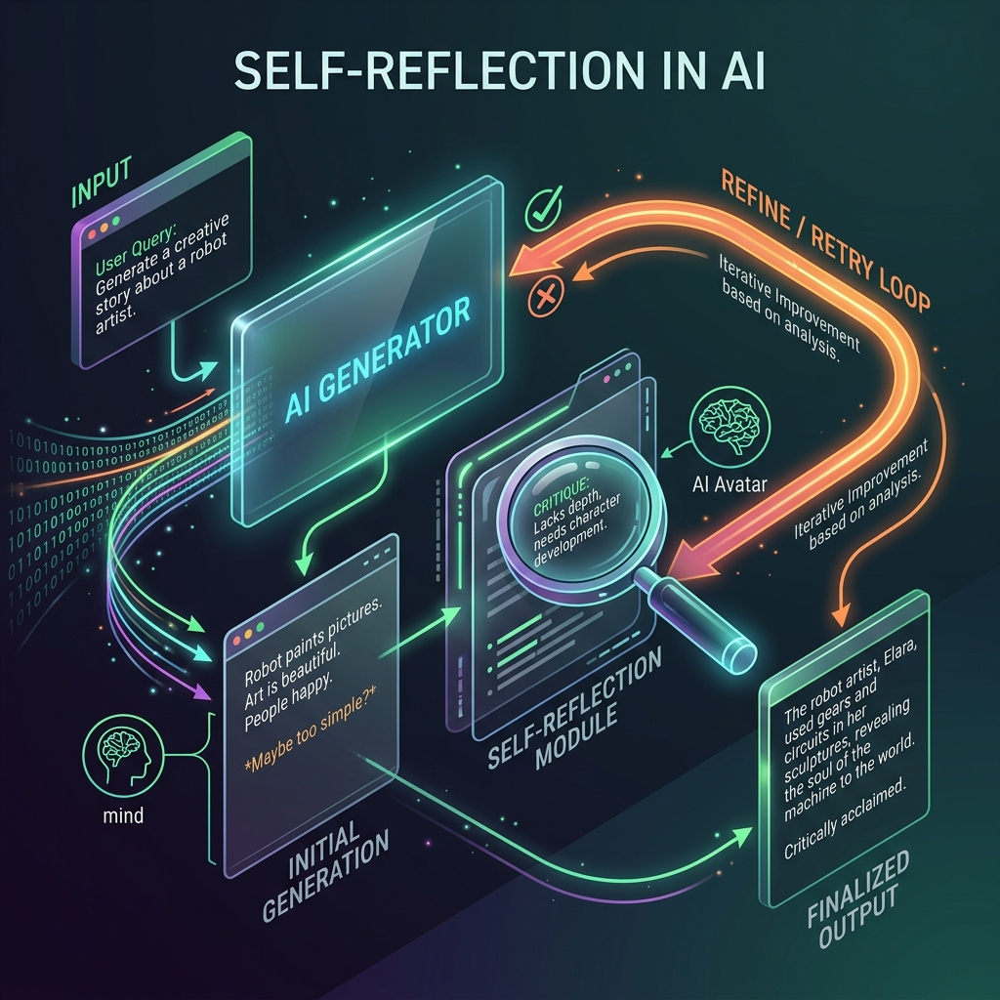

<!-- tags: glossary, agentic-ai, agentic-core, reflection -->
# Self-Reflection

> An agentic pattern where the AI evaluates its own output or intermediate state and decides whether to retry, refine, or proceed, rather than immediately returning the first draft.

| Aspect | Detail |
| --- | --- |
| **Domain** | Agentic Core |
| **Used by** | Prompt engineer, AI engineer |
| **Related** | Self-Critique, Agentic Loop, Goal-Directed Behavior |

📅 Created: 2026-04-28 · 🔄 Updated: 2026-05-06 · ⏱️ 5 min read

---

## 1. DEFINE

LLMs are prone to generating plausible but flawed outputs on the first try. **Self-Reflection** is the practice of systematically asking the model to review its own work before presenting it as final.

In an agentic context, Self-Reflection is a dedicated node or prompt step in the execution loop. After an agent generates a piece of code, text, or a plan, the system passes that output *back* into the LLM (often with a different persona, like "Expert Reviewer") with instructions to find flaws, verify constraints, and suggest improvements. If flaws are found, the agent enters a "Refine/Retry" loop.

Reflection turns a single-shot generation process into an iterative, self-improving cycle, significantly boosting the quality and accuracy of the final output.

---

## 2. CONTEXT

**Who uses it**: Prompt engineers and AI engineers aiming to boost output quality without training new models.

**When**: Used when accuracy, tone, or constraint-adherence is more important than low latency. Reflection effectively trades compute time for quality.

**In this ecosystem**:
- It is the mechanism that enables [Goal-Directed Behavior](./39-goal-directed-behavior.md) by evaluating if the goal was actually met.
- It often pairs with [Self-Critique](./43-self-critique.md) (the actual feedback generated during reflection).
- It is a core part of the [Agentic Loop](./35-agentic-loop.md).

---

## 3. EXAMPLES

*Figure: Self-Reflection shows an AI generating an output, examining it through a magnifying glass to evaluate its quality, and sending it back through a 'Refine/Retry' loop to improve it before finalizing.*

### Example 1: The Coding Agent
1.  **Generate**: Agent writes a React component.
2.  **Reflect**: A reflection prompt asks: "Does this code handle null states? Are there accessibility issues?"
3.  **Critique**: "It fails to check if `user.profile` is null before rendering."
4.  **Refine**: The agent rewrites the code with optional chaining.
5.  **Finalize**: The improved code is returned to the user.

### Example 2: The Latency Trade-off
A team adds a self-reflection loop to their customer support bot to prevent hallucinations. The bot's accuracy jumps from 85% to 98%, but the response time increases from 2 seconds to 8 seconds because the LLM is now being called three times per user message instead of once.

---

## 4. COMPARE

| | Self-Reflection | Single-Shot Generation | Human Review (L2 Autonomy) |
|--|---|---|---|
| **Reviewer** | The AI itself (or a secondary LLM) | None | A human operator |
| **Latency** | High (multiple LLM calls) | Low (one call) | Very High (human speed) |
| **Quality** | High | Variable / Prompt-dependent | Very High |
| **Best For** | Complex reasoning, coding, writing | Simple summarization, classification | High-risk, irreversible actions |

---

## 5. REF

| Resource | Type | Link | Note |
| --- | --- | --- | --- |
| Reflexion: Language Agents with Verbal Reinforcement Learning | Paper | https://arxiv.org/abs/2303.11366 | Seminal paper on using linguistic feedback for self-correction |
| LangGraph Reflection Workflow | Docs | https://langchain-ai.github.io/langgraph/tutorials/reflection/reflection/ | Implementing reflection in Python |

---

## 6. RECOMMEND

| Explore next | When | Why | File/Link |
| --- | --- | --- | --- |
| Self-Critique | You want to define *how* the agent reflects | Critique is the specific feedback generated during reflection | [Self-Critique](./43-self-critique.md) |
| Agentic Loop | You want to implement a retry mechanism | Reflection sits inside the loop to control exit conditions | [Agentic Loop](./35-agentic-loop.md) |
| Goal-Directed Behavior | You need to know what the agent is reflecting *against* | Reflection measures distance to the goal | [Goal-Directed Behavior](./39-goal-directed-behavior.md) |

**Links**: [← Previous](./41-planning.md) · [→ Next](./43-self-critique.md)
