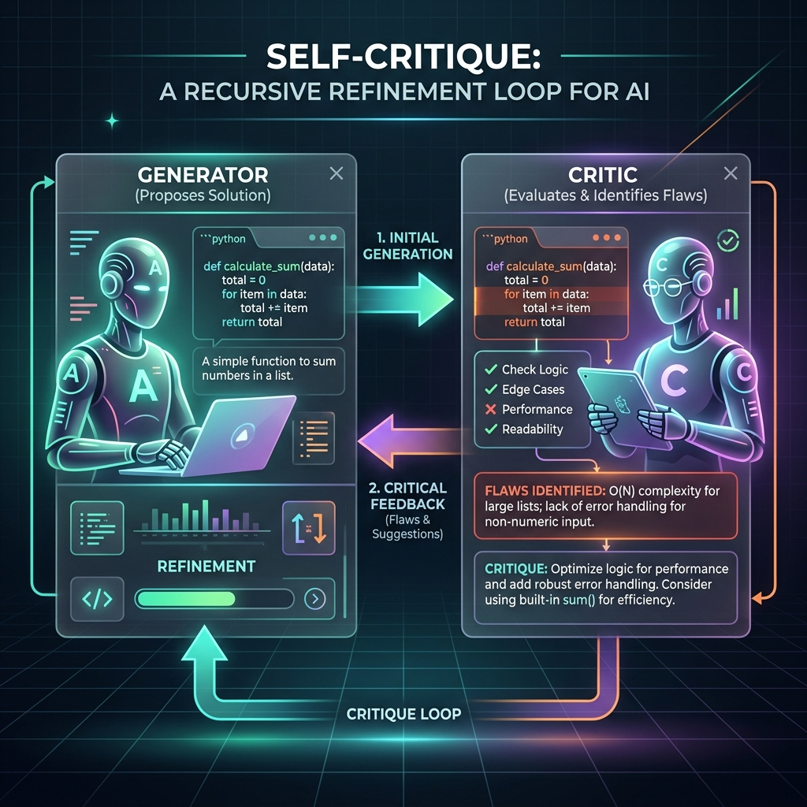

<!-- tags: glossary, agentic-ai, agentic-core, reflection -->
# Self-Critique

> The explicit feedback generated by an AI model when evaluating its own (or another model's) output, acting as the error signal that drives the self-reflection loop.

| Aspect | Detail |
| --- | --- |
| **Domain** | Agentic Core |
| **Used by** | Prompt engineer, AI engineer |
| **Related** | Self-Reflection, RLHF, Persona |

📅 Created: 2026-04-28 · 🔄 Updated: 2026-05-06 · ⏱️ 5 min read

---

## 1. DEFINE

If [Self-Reflection](./42-self-reflection.md) is the *process* of an agent looking in the mirror, **Self-Critique** is what the agent *says* when it does.

It is the tangible output of an evaluation step—a list of flaws, bugs, tonal inconsistencies, or constraint violations identified in a piece of generated content. In robust agentic systems, the critique is often generated by a completely separate LLM call using a "Critic Persona" (e.g., a Senior Security Engineer) equipped with a specific rubric. 

The quality of the self-critique directly determines the quality of the final output. If the critique is vague ("This code could be better"), the refinement will be poor. If the critique is precise ("Line 42 has an O(N^2) complexity, use a hash map"), the refinement will be excellent.

---

## 2. CONTEXT

**Who uses it**: AI engineers optimizing the accuracy and reliability of high-stakes AI pipelines.

**When**: During the evaluation phase of a generation loop, before presenting output to the user.

**In this ecosystem**:
- It is the payload that drives [Self-Reflection](./42-self-reflection.md).
- Often used to generate synthetic data for [Fine-Tuning](../core-llm-concepts/11-fine-tuning.md) (Constitutional AI).
- Helps maintain [Goal-Directed Behavior](./39-goal-directed-behavior.md) by objectively measuring if a goal was met.

---

## 3. EXAMPLES

*Figure: Self-Critique involves one AI persona (the Generator) producing an initial output, while a second AI persona (the Critic, holding a checklist) evaluates it, identifies specific flaws, and feeds that critique back into the refinement loop.*

### Example 1: The "Yes-Man" Failure
A developer asks an agent to write a sorting algorithm, and then prompts the *same agent* in the same context window to critique it. The agent replies: "This looks perfect and highly optimized!" This is a failure of critique. 
*Fix*: The developer instantiates a new context window, loads a "Harsh Critic" persona, and provides a rubric. The new critique catches three edge cases.

### Example 2: Constitutional AI
An agent generates a marketing email. Before sending it, a Critique Agent evaluates it against a "Constitution" (a list of rules: no exaggerations, no discriminatory language, must include an opt-out link). The critique notes that the opt-out link is missing, forcing a rewrite.

---

## 4. COMPARE

| | Self-Critique | Human Feedback | RLHF |
|--|---|---|---|
| **Source** | AI Model | Human User | Human preferences encoded in a reward model |
| **Speed** | Instantaneous | Very Slow | Instantaneous (during training) |
| **Scalability** | Infinite | Highly constrained | Highly scalable once trained |
| **Use Case** | Runtime error correction | UX refinement, critical safety | Base model alignment |

---

## 5. REF

| Resource | Type | Link | Note |
| --- | --- | --- | --- |
| Constitutional AI | Paper | https://arxiv.org/abs/2212.08073 | Anthropic's method for training AI to critique itself based on a set of rules |
| Prompt Engineering: Critique | Guide | https://www.promptingguide.ai/techniques/critique | Practical prompting techniques for self-critique |

---

## 6. RECOMMEND

| Explore next | When | Why | File/Link |
| --- | --- | --- | --- |
| Self-Reflection | You have the critique and need to apply it | Reflection is the loop that uses the critique | [Self-Reflection](./42-self-reflection.md) |
| Persona | You want to improve the quality of the critique | A specific persona makes critiques sharper | [Persona](../hooks-middleware/README.md) |
| Fine-Tuning | You want to bake the critique into the model | AI-generated critiques can be used for training | [Fine-Tuning](../core-llm-concepts/11-fine-tuning.md) |

**Links**: [← Previous](./42-self-reflection.md) · [→ Next](./44-human-in-the-loop.md)
