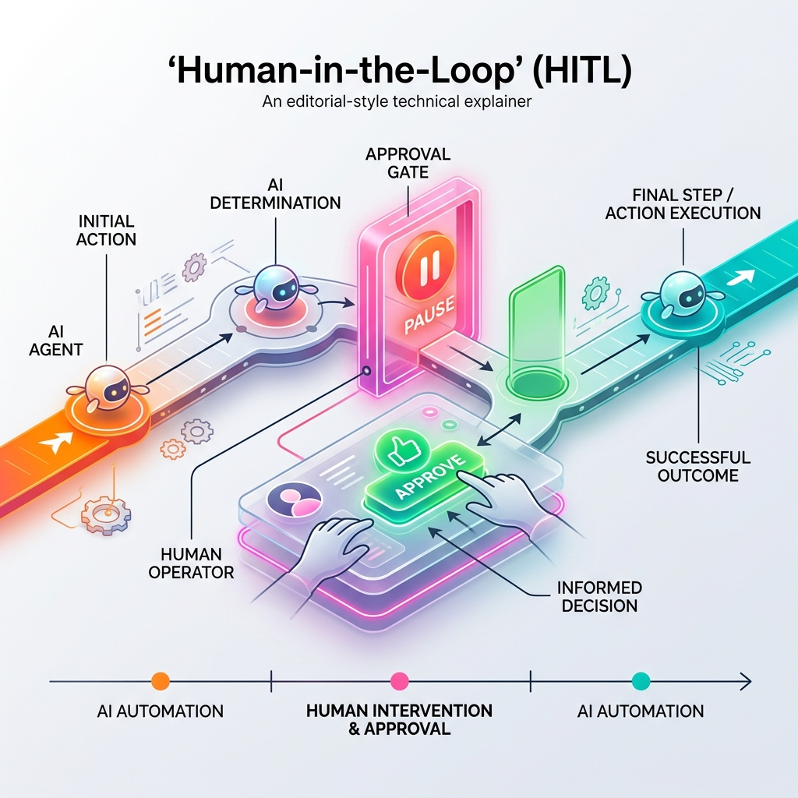

<!-- tags: glossary, agentic-ai, agentic-core, hitl -->
# Human-in-the-Loop (HITL)

> An architectural pattern where human intervention is explicitly required at specific checkpoints in an agentic workflow, acting as a mandatory safety net before irreversible actions are taken.

| Aspect | Detail |
| --- | --- |
| **Domain** | Agentic Core |
| **Used by** | AI architect, product manager, risk compliance |
| **Related** | Autonomy Level, Interrupt / Escalation |

📅 Created: 2026-04-28 · 🔄 Updated: 2026-05-06 · ⏱️ 5 min read

---

## 1. DEFINE

No matter how intelligent an AI agent becomes, there are certain actions where the cost of a hallucination is catastrophic (e.g., executing a stock trade, dropping a database table, sending a mass email). 

**Human-in-the-Loop (HITL)** is a design pattern that enforces a pause in the agent's execution. When the agent reaches a designated checkpoint, it halts and surfaces its intended action to a human operator. The human must explicitly click "Approve," "Reject," or "Modify." Only upon approval does the agent resume execution.

HITL transforms an unpredictable autonomous system into a highly leveraged human-supervised workflow.

---

## 2. CONTEXT

**Who uses it**: Product managers designing the UX for AI products, and architects defining system boundaries for safety and compliance.

**When**: Mandatory for any system interacting with money, sensitive data, or external communications.

**In this ecosystem**:
- HITL is the defining characteristic of an L2 [Autonomy Level](./37-autonomy-level.md).
- It differs from [Interrupt / Escalation](./45-interrupt-escalation.md), which is when the *agent* decides it needs help. HITL is when the *system architecture* demands approval.

---

## 3. EXAMPLES

*Figure: Human-in-the-Loop (HITL) architecture shows an AI agent moving along a process flow, hitting a mandatory 'Approval Gate', where a human operator must explicitly 'Approve' to allow the action to proceed.*

### Example 1: The AI DevOps Assistant
An agent is tasked with fixing a server configuration. It reads the logs, finds the error, writes a bash script to fix it, and then **stops**. It presents the bash script in the UI. The Senior DevOps Engineer reads the script, clicks "Approve," and the agent executes it on the server. 
→ The agent did 99% of the work; the human provided the 1% safety guarantee.

### Example 2: Medical Triage
An AI reviews patient symptoms and drafts a diagnosis and prescription. It cannot send this to the pharmacy. It queues the draft for a licensed physician. The physician modifies the dosage (Human Intervention) and signs it. 

---

## 4. COMPARE

| | Human-in-the-Loop (HITL) | Human-on-the-Loop (HOTL) | Fully Autonomous |
|--|---|---|---|
| **Human Role** | Mandatory Gatekeeper | Supervisor / Auditor | Absent |
| **Execution Flow** | Pauses waiting for input | Continuous, human can intervene | Continuous |
| **Autonomy Level** | L2 (Action with Confirmation) | L3 (Conditional Autonomy) | L4 (Full Autonomy) |
| **Safety** | Maximum | High | Dependent on system constraints |

---

## 5. REF

| Resource | Type | Link | Note |
| --- | --- | --- | --- |
| LangGraph HITL Patterns | Docs | https://langchain-ai.github.io/langgraph/concepts/human_in_the_loop/ | How to code state-pauses in Python orchestrators |
| Guidelines for Human-AI Interaction | Research | https://www.microsoft.com/en-us/research/project/guidelines-for-human-ai-interaction/ | Microsoft's UX research on AI supervision |

---

## 6. RECOMMEND

| Explore next | When | Why | File/Link |
| --- | --- | --- | --- |
| Autonomy Level | You are deciding if you need HITL | HITL is the definition of L2 autonomy | [Autonomy Level](./37-autonomy-level.md) |
| Interrupt / Escalation | The agent needs to ask for help dynamically | Covers scenarios where HITL isn't hardcoded | [Interrupt / Escalation](./45-interrupt-escalation.md) |
| AI Agent | You want to understand what is being paused | The agent is the entity doing the work | [AI Agent](./34-ai-agent.md) |

**Links**: [← Previous](./43-self-critique.md) · [→ Next](./45-interrupt-escalation.md)
