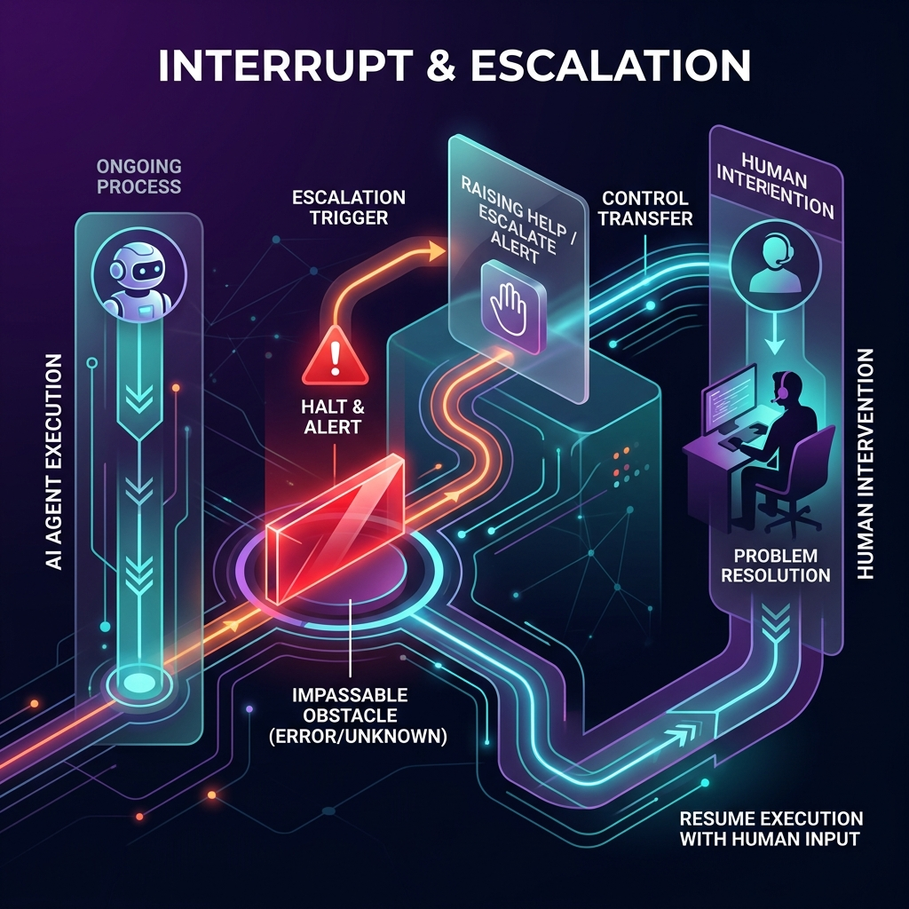

<!-- tags: glossary, agentic-ai, agentic-core, interrupt -->
# Interrupt / Escalation

> The mechanism by which an autonomous agent detects it cannot complete a task and proactively halts execution to hand control back to a human operator.

| Aspect | Detail |
| --- | --- |
| **Domain** | Agentic Core |
| **Used by** | AI engineer, backend developer |
| **Related** | Human-in-the-Loop, Autonomy Level, Agentic Loop |

📅 Created: 2026-04-28 · 🔄 Updated: 2026-05-06 · ⏱️ 5 min read

---

## 1. DEFINE

Autonomous systems are only as reliable as their failure modes. If an agent encounters an unexpected obstacle—a missing API key, a password prompt, or a concept it doesn't understand—it will often hallucinate a way forward or get trapped in an infinite loop of retries.

**Interrupt / Escalation** is the architectural safeguard against this. It requires giving the agent the explicit capability (often via a specific tool like `EscalateToHuman(reason)`) to raise a flag, suspend its state, and ask a human for help or clarification. 

Once the human provides the missing context or resolves the blocker, the agent resumes its execution from the exact point it paused.

---

## 2. CONTEXT

**Who uses it**: AI engineers designing the state machines and tool registries for autonomous agents.

**When**: Essential for any system operating at L3 or L4 [Autonomy Level](./37-autonomy-level.md) to prevent catastrophic failure or runaway compute costs.

**In this ecosystem**:
- Unlike [Human-in-the-Loop](./44-human-in-the-loop.md) (which is a hardcoded, structural pause), Escalation is dynamic; the agent decides when it needs it.
- Prevents infinite cycling within the [Agentic Loop](./35-agentic-loop.md).

---

## 3. EXAMPLES

*Figure: Interrupt and Escalation shows an AI agent encountering an impassable obstacle, halting execution, raising a 'Help' alert, and dynamically transferring control to a human operator to resolve the block before resuming.*

### Example 1: The Missing Context Escalation
An agent is tasked with booking a flight for a user. It navigates to the airline site, but realizes it doesn't know whether the user prefers a window or aisle seat. 
*   **Without Escalation**: The agent guesses "window" and books a non-refundable ticket. 
*   **With Escalation**: The agent calls `AskUser(question="Window or Aisle?")`, pauses execution, sends an SMS to the user, waits for the reply, and then completes the booking.

### Example 2: The Infinite Loop Breaker
An agent is trying to scrape a site, but gets blocked by a CAPTCHA. It tries 5 times and fails. The orchestrator's middleware catches the 5th failure, triggers a hard interrupt, pauses the agent, and sends an alert to the developer: "Agent blocked on task ID 492. Manual intervention required."

---

## 4. COMPARE

| | Interrupt / Escalation | Human-in-the-Loop (HITL) | Exception Handling |
|--|---|---|---|
| **Trigger** | Dynamic (agent decides or loop limits hit) | Static (hardcoded at checkpoints) | Code-level (try/catch) |
| **Purpose** | Resolve ambiguity, recover from failure | Ensure safety, approve irreversible actions | Prevent software crashes |
| **State** | Suspended, waiting for human | Suspended, waiting for human | Fails, returns error |

---

## 5. REF

| Resource | Type | Link | Note |
| --- | --- | --- | --- |
| Building Effective Agents (Anthropic) | Guide | https://www.anthropic.com/engineering/building-effective-agents | Discusses when to give agents the ability to ask questions |
| LangGraph Breakpoints | Docs | https://langchain-ai.github.io/langgraph/how-tos/breakpoints/ | Technical implementation of interrupts |

---

## 6. RECOMMEND

| Explore next | When | Why | File/Link |
| --- | --- | --- | --- |
| Human-in-the-Loop | You want to force a pause, regardless of the agent | HITL is structural safety; Escalation is dynamic recovery | [Human-in-the-Loop](./44-human-in-the-loop.md) |
| Autonomy Level | You are defining how much an agent can do | Escalation is how L3 agents drop down to L2 safely | [Autonomy Level](./37-autonomy-level.md) |
| Agentic Loop | You are implementing the pause mechanism | The loop must be able to suspend and resume state | [Agentic Loop](./35-agentic-loop.md) |

**Links**: [← Previous](./44-human-in-the-loop.md) · [→ Next](../evaluation-observability/README.md)
